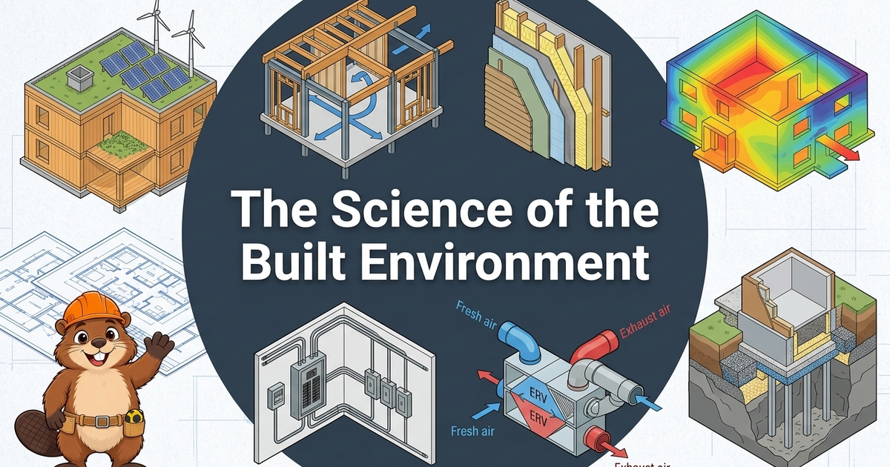

# The Science of the Built Environment

[](https://www.mkdocs.org/)
[](https://squidfunk.github.io/mkdocs-material/)
[](https://dmccreary.github.io/science-of-the-built-envrionment/)
[](https://claude.ai/code)
[](https://github.com/dmccreary/ibook-skills)
[](https://chatgpt.com/)
[](https://p5js.org/)
[](https://creativecommons.org/licenses/by-nc-sa/4.0/)

<p align="center">
  <a href="https://dmccreary.github.io/science-of-the-built-envrionment/">
    
  </a>
</p>

## View the Live Site

Visit the interactive textbook at: **[https://dmccreary.github.io/science-of-the-built-envrionment/](https://dmccreary.github.io/science-of-the-built-envrionment/)**

## Overview

**The Science of the Built Environment** is an interactive intelligent textbook exploring how
building materials, structural physics, enclosure assemblies, mechanical, electrical, and
plumbing (MEP) systems, building codes, and sustainability practices combine to create safe,
durable, and energy-efficient buildings.

Designed primarily for undergraduate students in construction, architecture, and building
systems programs (including future electrical designers) at Dunwoody College of Technology in
Minneapolis, Minnesota, this book grounds theoretical physics in real-world construction practice.
Special emphasis is placed on cold-climate building science: frost-protected foundations,
continuous exterior insulation, air barrier continuity, vapor diffusion control, ice-dam
prevention, and compliance with the Minnesota State Building Code and Minnesota Energy Code.

The textbook is structured around the 2001 revision of Bloom's Taxonomy, moving intentionally from
fundamental terminology and recall to rigorous structural analysis, performance evaluation, and
forensic troubleshooting. Prerequisites and concepts are sequenced using a formal learning
dependency graph so that essential concepts are mastered before complex assemblies are introduced.

### Learning Mascot: Beau the Beaver

To assist students along their learning journey, the book features **Beau the Beaver**, a friendly
pedagogical guide wearing a safety-orange hard hat and tool belt. Beavers are nature's premier
hydraulic and structural engineers, making Beau the ideal mentor for exploring materials, water
management, and durable building design. Beau provides tips, common pitfall warnings, concept
check-ins, and encouragement throughout the chapters with the motto: *"Let's build it right!"*

## Course Structure and Chapters

The curriculum spans 21 core chapters covering 380 concepts. Nine appendices on fast-changing topics
add 68 more, for 448 concepts in total, which the learning graph sorts into 13 taxonomy categories.
The chapters are:

1. **Introduction to the Built Environment and Construction Terminology** — Core industry
   vocabulary, drawings, specifications, and project scales.

2. **The Design and Construction Process** — Project phases, delivery methods, and professional
   team roles from owner to electrical designer.

3. **Forces, Heat, and the Physics of Buildings** — Stress, strain, heat transfer (conduction,
   convection, radiation), and moisture dynamics.

4. **Moisture, Air Movement, and Thermal Comfort** — Psychrometrics, vapor migration, stack effect,
   and occupant comfort metrics.

5. **Properties of Building Materials** — Strength, stiffness, durability, fire behavior, and
   testing standards.

6. **Structural Loads and Load Paths** — Dead, live, snow, wind, and seismic loads traced through
   framing to footings.

7. **Wood and Steel Framing** — Light wood framing, heavy timber, mass timber (CLT), structural
   steel, and cold-formed metal framing.

8. **Concrete and Masonry** — Cast-in-place concrete, precast systems, reinforcement, mortar, and
   concrete masonry units (CMU).

9. **Site Work, Soils, and Groundwater** — Soil mechanics, bearing capacity, drainage, excavation,
   and frost depth.

10. **Foundation Systems** — Shallow footings, frost-protected slabs, grade beams, and deep
    foundations (piles and caissons).

11. **Enclosure Control Layers and Insulation** — Water, air, vapor, and thermal control layer
    continuity and sequencing.

12. **Cladding, Windows, Doors, and Air Sealing** — Rainscreens, flashing, glazing thermal
    performance, and whole-building airtightness.

13. **Roof Assemblies** — Low-slope and steep-slope assemblies, membrane types, venting,
    insulation, and ice-dam mitigation.

14. **HVAC, Plumbing, and Fire Protection Systems** — Heating, cooling, ERV/HRV ventilation,
    potable water distribution, and life safety suppression.

15. **Electrical Fundamentals and Building Service** — Voltage, current, utility service
    entrances, transformers, and grounding.

16. **Electrical Distribution, Lighting, and Design Team Coordination** — Branch circuits, panels,
    architectural lighting, and interdisciplinary coordination.

17. **Building Codes, Permits, and Enforcement** — IBC, IRC, Minnesota State Building Code,
    occupancy types, and inspections.

18. **Fire Protection and Life Safety Requirements** — Fire-resistance ratings, egress paths,
    compartmentalization, and smoke control.

19. **Energy Efficiency and High-Performance Buildings** — Whole-building energy modeling,
    ASHRAE 90.1, net-zero design, and commissioning.

20. **Sustainable Building Materials** — Embodied carbon, life-cycle assessments (LCA), recycled
    content, and green certifications.

21. **Durability, Maintenance, and Building Failure** — Building forensics, moisture degradation,
    structural movement, and preventative maintenance.

## Interactive MicroSims, Posters, and Learning Graph

- **Interactive MicroSims**: 92 hands-on browser simulations built with p5.js and interactive web
  components allowing students to explore physical behaviors, parameter adjustments, and system
  dynamics.

- **Infographic Posters**: 20 one-page visual summaries of the big ideas in the book, such as the
  load path, the four control layers, the Swiss cheese model of building failure, and the six
  shearing layers. Browse them in the [Poster Gallery](https://dmccreary.github.io/science-of-the-built-envrionment/posters/).

- **Learning Graph Viewer**: A vis-network interactive concept visualization tool enabling students
  and instructors to explore concept dependencies, prerequisites, and learning paths.

## Site Status and Metrics

Counts come from `docs/learning-graph/book-metrics.json` (generated October 5, 2026), except the
poster count, which is the number of poster directories under `docs/posters/`.

| Metric | Count |
|--------|-------|
| Concepts in Learning Graph | 448 (380 in chapters, 68 in appendices) |
| Chapters | 21 |
| Appendices | 9 |
| MicroSims | 92 |
| **Infographic Posters** | **20** |
| Stories | 12 |
| Glossary Terms | 380 |
| FAQ Questions | 100 |
| Quiz Questions | 380 (21 chapter quizzes) |
| Annotated References | 210 (21 chapter reference lists) |
| Diagrams | 89 |
| Mascot Images | 7 |
| Images (all image files in `docs/`) | 242 |
| Total Words | 445,712 |
| Links | 2,385 |
| Equivalent Printed Pages | 1,851 |

**Completion Status:** The chapters, quizzes, references, FAQ, and glossary are complete. The
appendices and their MicroSims are newly added and still under review.

## Getting Started

### Prerequisites

- Python 3.9 or higher
- Git

### Installation

Clone the repository and install required dependencies:

```bash
git clone https://github.com/dmccreary/science-of-the-built-envrionment.git
cd science-of-the-built-envrionment
pip install mkdocs mkdocs-material
```

### Building the Documentation

To build the static site with strict link and navigation checking:

```bash
mkdocs build --strict
```

The compiled output will be generated in the `site/` directory.

### Local Development and Usage

To preview the book locally with live reload during authoring:

```bash
mkdocs serve
```

Once the server starts, open your web browser to:

```text
http://localhost:8000
```

### Deployment to GitHub Pages

Deploy the compiled book to GitHub Pages with:

```bash
mkdocs gh-deploy
```

## Repository Structure

```text
science-of-the-built-envrionment/
├── docs/                                # Documentation source files
│   ├── chapters/                        # 21 textbook chapters
│   │   ├── 01-intro-terminology/
│   │   ├── 02-design-construction-process/
│   │   └── ...
│   ├── css/                             # Custom stylesheets
│   │   ├── extra.css                    # Layout and status dot styling
│   │   └── mascot.css                   # Mascot admonition styles
│   ├── img/                             # Images and visual assets
│   │   ├── cover.png                    # Book cover image (1200x630 px)
│   │   ├── cover-image-prompt.md        # Prompt specification for cover art
│   │   └── mascot/                      # Beau the Beaver pose library
│   ├── learning-graph/                  # Concept DAG and taxonomy models
│   │   ├── concept-list.md              # Enumerated concepts
│   │   ├── concept-taxonomy.md          # 12 taxonomy categories
│   │   ├── learning-graph.csv           # Concept dependency edges
│   │   └── learning-graph.json          # Graph viewer network payload
│   ├── appendices/                      # 9 appendices on fast-changing topics
│   ├── posters/                         # 20 infographic posters
│   │   └── the-load-path/               # main.html, index.md, image-prompt.md
│   ├── sims/                            # 92 interactive MicroSim applications
│   │   └── graph-viewer/                # Interactive concept graph explorer
│   ├── stories/                         # 12 stories of builders and engineers
│   ├── about.md                         # Book background and pedagogy
│   ├── contact.md                       # Author contact details
│   ├── course-description.md            # Foundational course syllabus and outcomes
│   ├── index.md                         # Site landing page
│   └── license.md                       # Creative Commons license text
├── plugins/                             # MkDocs build hooks
│   └── social_override.py               # Cairo-free Open Graph metadata injector
├── mkdocs.yml                           # MkDocs configuration and navigation
├── AGENTS.md                            # Agent instructions and style constraints
├── CONTENT-GENERATION-GUIDE.md          # Writing standards, word targets, and voice
└── README.md                            # Repository documentation
```

## Contributing

Contributions, feedback, and corrections are warmly welcomed! To contribute:

1. Fork the repository on GitHub.

2. Create a feature branch (`git checkout -b feature/suggested-improvement`).

3. Commit your changes with clear messages (`git commit -m 'Clarify heat flux in Chapter 3'`).

4. Push to the branch (`git push origin feature/suggested-improvement`).

5. Open a Pull Request for review.

## Reporting Issues

If you find a typo, broken link, technical inaccuracies, or have suggestions for new MicroSims,
please report them using GitHub Issues:

[GitHub Issues](https://github.com/dmccreary/science-of-the-built-envrionment/issues)

When filing an issue, please include:

- The relevant chapter or page title
- A clear description of the issue or suggested enhancement
- Screenshots or browser environment details if reporting a MicroSim bug

## License

This work is licensed under the
[Creative Commons Attribution-NonCommercial-ShareAlike 4.0 International License (CC BY-NC-SA 4.0)](https://creativecommons.org/licenses/by-nc-sa/4.0/).

You are free to:

- **Share** — Copy and redistribute the material in any medium or format.
- **Adapt** — Remix, transform, and build upon the material.

Under the following terms:

- **Attribution** — You must give appropriate credit, provide a link to the license, and indicate if changes were made.
- **NonCommercial** — You may not use the material for commercial purposes.
- **ShareAlike** — If you remix or adapt, you must distribute contributions under the same license.

See [`docs/license.md`](./docs/license.md) for full terms.

## Acknowledgements

- **[MkDocs](https://www.mkdocs.org/)** — Fast static documentation generator.
- **[Material for MkDocs](https://squidfunk.github.io/mkdocs-material/)** — Comprehensive, responsive documentation theme.
- **[Dunwoody College of Technology](https://dunwoody.edu/)** — Technical education in construction sciences.
- **[vis-network](https://visjs.org/)** — Interactive graph visualization library powering the Learning Graph Viewer.
- **[p5.js](https://p5js.org/)** — Accessible creative computing framework supporting educational MicroSims.
- **[OpenAI ChatGPT](https://chatgpt.com/)** — Image generation (GPT 5.6 Sol) for the Beau the Beaver mascot images, the infographic posters, and the graphic-novel story images.

## Contact

**Dan McCreary**

- LinkedIn: [https://www.linkedin.com/in/danmccreary/](https://www.linkedin.com/in/danmccreary/)
- GitHub: [@dmccreary](https://github.com/dmccreary)
- Repository: [https://github.com/dmccreary/science-of-the-built-envrionment](https://github.com/dmccreary/science-of-the-built-envrionment)

## How to Cite

If you reference or adopt this textbook in your coursework or research, please cite:

```text
McCreary, D. (2026). The Science of the Built Environment: An Interactive Intelligent Textbook.
https://dmccreary.github.io/science-of-the-built-envrionment/
```

BibTeX:

```bibtex
@book{mccreary2026builtenvironment,
  title     = {The Science of the Built Environment: An Interactive Intelligent Textbook},
  author    = {McCreary, Dan},
  year      = {2026},
  publisher = {GitHub Pages},
  url       = {https://dmccreary.github.io/science-of-the-built-envrionment/}
}
```
