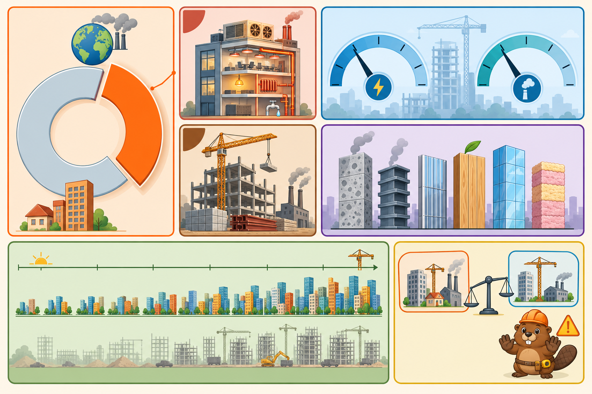

<iframe src="./main.html" height="1000px" width="100%" scrolling="no"></iframe>

[Open the interactive poster full screen](./main.html){ .md-button .md-button--primary }

Use **Explore** mode to hover over or click a region and read what it counts and which source it comes from. Use **Quiz** mode to read a clue and click the region it describes.

The poster keeps two accountings in separate regions. The three warm-toned regions on the left are Architecture 2030's numbers. The blue region on the upper right is UNEP and GlobalABC's numbers. The seven regions are:

1. **Built Environment Share (Architecture 2030)** — About 42% of annual global CO2 emissions, pulled out of the whole.
2. **Operational Carbon (Architecture 2030)** — About 27% from running buildings.
3. **Embodied Carbon (Architecture 2030)** — About 15% more from materials and construction.
4. **UNEP GlobalABC Accounting** — 32% of global energy and 34% of global CO2, on a different boundary.
5. **Materials Behind Embodied Carbon** — Cement, steel, aluminum, timber, glass, and insulation.
6. **New Floor Area, 2020 to 2060** — About 2.6 trillion square feet (241 billion square meters) still to be built.
7. **Different Boundaries, Different Numbers** — Why two sources can both be right.

## Static Poster

{ loading=lazy }

The full-size poster above is a static copy of the interactive version, handy for printing, sharing, or viewing without JavaScript.

## Why This Matters

Two respected sources give two different shares for the built world's carbon footprint. Architecture 2030 reports about 42% of annual global CO2 emissions (about 27% operations plus about 15% embodied carbon). The UNEP and GlobalABC 2024/2025 report gives 32% of global energy and 34% of global CO2. The numbers differ because the sources count different things with different methods, so this poster never mixes them in one number. When you quote a share, name the source and what it includes.

The lesson holds under either accounting: buildings are a leading climate lever, and as operating energy falls, materials account for a growing share of the total. Percentages here are as published at the time of writing and are updated by their sources; check the current pages before citing them.

## Connects to

- [Chapter 19: Energy Efficiency and High-Performance Buildings](../../chapters/19-energy-efficiency/index.md)
- [Chapter 20: Sustainable Building Materials](../../chapters/20-sustainable-materials/index.md)

## Sources

- Architecture 2030. [Why the Built Environment](https://www.architecture2030.org/why-the-built-environment/). Source of the 42%, 27%, and 15% shares, the 2.6 trillion square feet (241 billion square meters) projection for 2020 to 2060, and the three-quarters-of-2050 statement.
- UNEP and GlobalABC. [Global Status Report for Buildings and Construction 2024/2025](https://www.unep.org/resources/report/global-status-report-buildings-and-construction-20242025), and the [GlobalABC publication page](https://globalabc.org/resources/publications/global-status-report-buildings-and-construction-20242025-not-just-another). Source of the 32% energy and 34% CO2 figures.
- RICS. [Whole life carbon assessment for the built environment](https://www.rics.org/content/dam/ricsglobal/documents/standards/Whole_life_carbon_assessment_PS_Sept23.pdf). Source of the cited UNEP estimate of about 28% operational and 12% embodied for 2021.

Teachers and editors can open [calibration mode](./main.html?edit=true) to adjust zone positions after the artwork is generated. Copy only the `x1`, `y1`, `x2`, and `y2` numbers back into `data.json`, because the calibration export omits `showLabels` and `palette`.
