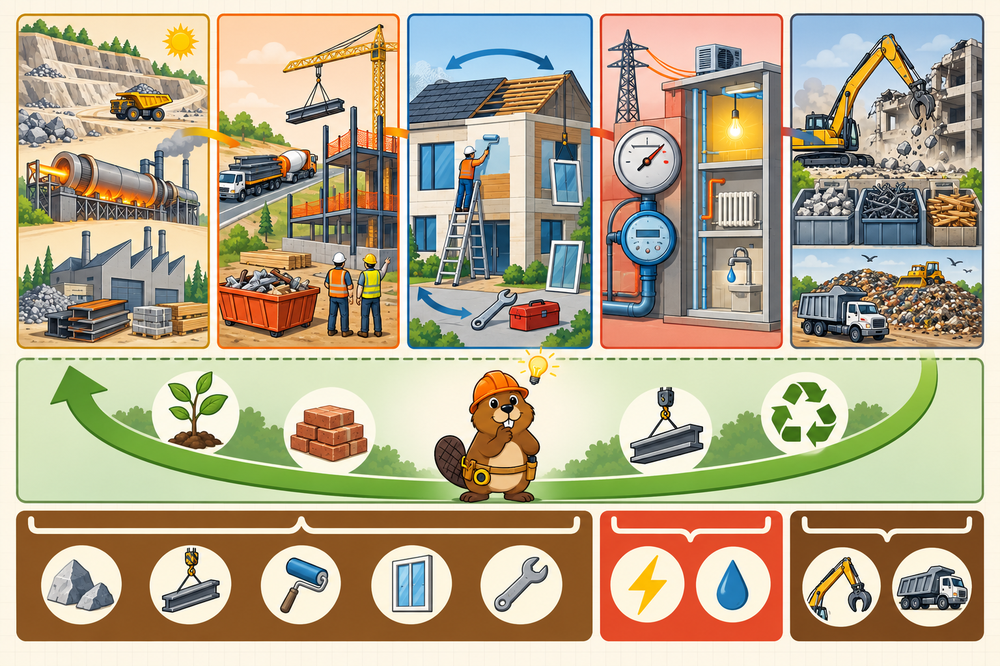

<iframe src="./main.html" height="1000px" width="100%" scrolling="no"></iframe>

[Open the interactive poster full screen](./main.html){ .md-button .md-button--primary }

Use **Explore** mode to hover over or click a region and read what each life-cycle module covers. Use **Quiz** mode to read a clue and click the region it describes.

The nine regions, from the building's start to its end and then the carbon brackets:

1. **Product Stage (A1 to A3)** — Extracting, hauling, and manufacturing the materials.
2. **Transport and Construction (A4 to A5)** — Delivery to the site and the building process.
3. **Use Stage: Upkeep and Replacement (B1 to B5)** — Repairs, replacements, and refurbishment.
4. **Use Stage: Energy and Water (B6 to B7)** — The energy and water the building uses.
5. **End of Life (C1 to C4)** — Demolition, waste handling, and disposal.
6. **Module D: Beyond the Boundary** — The potential benefit of reuse and recycling.
7. **Embodied Carbon: Making, Building, and Upkeep** — The material-related modules through the use stage.
8. **Operational Carbon: Energy and Water** — Only the energy and water modules.
9. **Embodied Carbon: End of Life** — The end-of-life modules, which are also embodied.

## Static Poster

{ loading=lazy }

The full-size poster above is a static copy of the interactive version, handy for printing, sharing, or viewing without JavaScript.

## Why This Matters

Building life-cycle assessment sorts a building's impacts into labeled modules, following the European standard EN 15978: A for the product and construction stages, B for the use stage, C for end of life, and D for benefits beyond the boundary. Chapter 20 introduces the same labels. RICS's whole life carbon standard classes modules A through C, except B6 and B7, as embodied carbon, and B6 and B7 as operational carbon.

The poster uses the common module set. RICS's 2023 edition adds a pre-construction module A0 (assumed to be zero for buildings) and a user-carbon module B8, which are left out here. Module D is reported separately and is only a potential benefit.

## Connects to

- [Chapter 20: Sustainable Building Materials](../../chapters/20-sustainable-materials/index.md)

## Sources

- RICS. [Whole life carbon assessment for the built environment](https://www.rics.org/content/dam/ricsglobal/documents/standards/Whole_life_carbon_assessment_PS_Sept23.pdf). Definitions of the modules, embodied carbon, operational carbon, upfront carbon, and Module D.
- CEN. EN 15978, Sustainability of construction works: assessment of environmental performance of buildings. The module structure, as described in the RICS standard and in Chapter 20.

Teachers and editors can open [calibration mode](./main.html?edit=true) to adjust zone positions after the artwork is generated. Copy only the `x1`, `y1`, `x2`, and `y2` numbers back into `data.json`, because the calibration export omits `showLabels` and `palette`.
