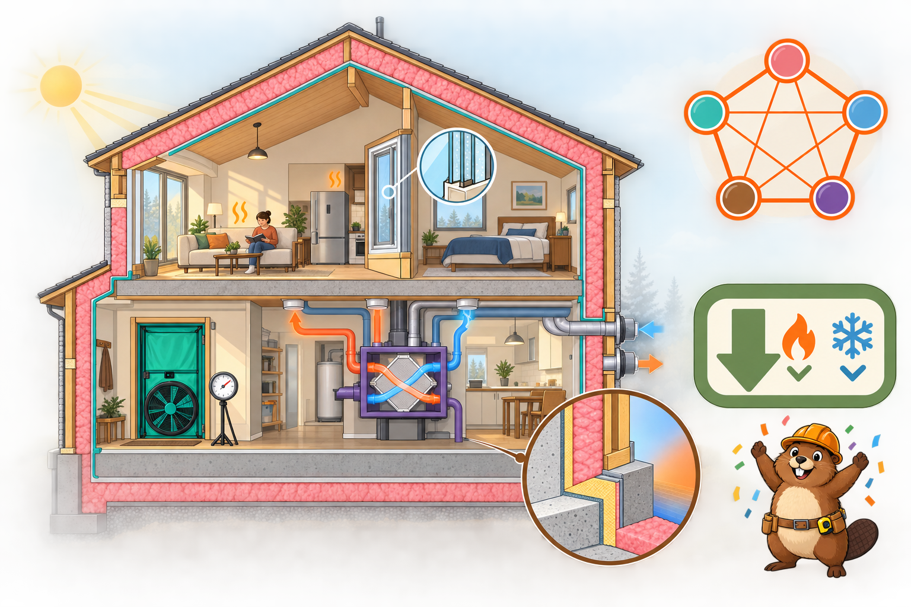

<iframe src="./main.html" height="1000px" width="100%" scrolling="no"></iframe>

[Open the interactive poster full screen](./main.html){ .md-button .md-button--primary }

Use **Explore** mode to hover over a numbered marker or its label and read what that feature of the house does. Use **Quiz** mode to read the name in the prompt, then click the marker that matches. The marker numbers are hidden, so you must find the matching marker.

The eight callouts are:

1. Free Heat: Sun, People, and Appliances
2. Continuous Super-Insulation
3. High-Performance Windows and Doors
4. The Interdependence Star
5. Airtight Construction
6. Balanced Ventilation with Heat Recovery
7. Thermal-Bridge-Free Design
8. The Result: Energy Savings

## Static Poster

{ loading=lazy }

The full-size poster above is a static copy of the interactive version, handy for printing, sharing, or viewing without JavaScript.

## Why This Matters

Passive House is a voluntary, performance-based building standard from the Passive House Institute. It rests on five principles: very good thermal insulation, highly efficient windows, controlled ventilation with heat recovery, no thermal bridges, and airtightness. Chapter 19 treats it as one of the demanding targets that go beyond the code minimum.

The poster draws the five principles in one cutaway house so students can see why they belong together. The star diagram is a teaching device and not part of the standard. The energy-savings figure is the Institute's own claim. It is stated against typical existing building stock, so it is not a promise for any single project. The exact criteria, such as heating demand and airtightness targets, are set by the standard and the climate, so check them with a certified designer.

## Connects to

- [Chapter 19: Energy Efficiency and High-Performance Buildings](../../chapters/19-energy-efficiency/index.md)

## Sources

- Passive House Institute. [What is a Passive House?](https://passivehouse.com/en/ipha/passive-house/) International Passive House Association.
- Passive House Institute. [Passive House Requirements](https://passivehouse.com/02_informations/02_passive-house-requirements/02_passive-house-requirements.htm).
- Passipedia. [What is a Passive House?](https://passipedia.org/basics/what_is_a_passive_house) Passive House Institute knowledge base (source of the up to 90% and over 75% comparison).
- Passive House Accelerator. [How to Design a Passive House: The 5 Core Principles](https://passivehouseaccelerator.com/articles/five-principles-of-passive-house-design-and-construction).

Teachers and editors can open [calibration mode](./main.html?edit=true) to drag the markers and copy updated coordinates.
