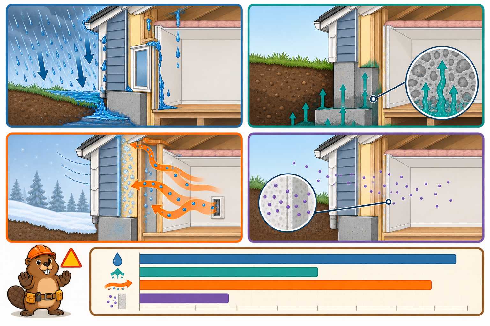

<iframe src="./main.html" height="1000px" width="100%" scrolling="no"></iframe>

[Open the interactive poster full screen](./main.html){ .md-button .md-button--primary }

Use **Explore** mode to hover over or click a panel and read what drives that pathway and how to control it. Use **Quiz** mode to read a clue and click the panel it describes.

The five regions are:

1. **Bulk Water** — Liquid water from rain, snowmelt, groundwater, or a leak, driven by gravity and wind pressure.
2. **Capillary Action** — Water drawn through tiny pores by surface tension, even upward.
3. **Air-Transported Moisture** — Vapor carried by air leaking through gaps wherever there is a pressure difference.
4. **Vapor Diffusion** — Vapor moving through solid materials from the humid side to the dry side.
5. **Damage Potential Ranking** — A schematic comparison of how much harm each pathway can do.

## Static Poster

{ loading=lazy }

The full-size poster above is a static copy of the interactive version, handy for printing, sharing, or viewing without JavaScript.

## Why This Matters

Building scientists separate moisture into four transport mechanisms because each one needs a different control: flashing and drainage for bulk water, capillary breaks for wicking, an air barrier for air-carried vapor, and drying capacity for diffusion. A designer who controls only one leaves the other three working. The Pacific Northwest National Laboratory's Building America materials call bulk moisture the most damaging mechanism, and Building America research finds that airflow typically carries an order of magnitude or more water vapor than diffusion does.

The ranking bars are schematic. The sources agree on the two ends of the ranking, but none publishes a single numeric scale for all four mechanisms, so the poster shows order and not measured quantities.

## Connects to

- [Chapter 4: Moisture, Air Movement, and Thermal Comfort](../../chapters/04-moisture-air-comfort/index.md)
- [Chapter 11: Enclosure Control Layers and Insulation](../../chapters/11-enclosure-insulation/index.md)
- [Chapter 21: Durability, Maintenance, and Building Failure](../../chapters/21-durability-failure/index.md)

## Sources

- Pacific Northwest National Laboratory, Building America Solution Center. [Building Science Introduction: Moisture Flow](https://basc.pnnl.gov/information/building-science-introduction-moisture-flow). Lists the four mechanisms and identifies bulk moisture as the most damaging.
- Cummings, J., Withers, C., Martin, E., and Moyer, N. [Managing the Drivers of Air Flow and Water Vapor Transport in Existing Single-Family Homes](https://www1.eere.energy.gov/buildings/publications/pdfs/building_america/airflow_watervapor_transport.pdf). Building America Partnership for Improved Residential Construction, revised October 2012. Source for airflow carrying one or more orders of magnitude more water vapor than diffusion.
- Building Science Corporation. [BSD-106: Understanding Vapor Barriers](https://www.buildingscience.com/documents/digests/bsd-106-understanding-vapor-barriers). Background on air-carried vapor.

Teachers and editors can open [calibration mode](./main.html?edit=true) to adjust zone positions after the artwork is generated. Copy only the `x1`, `y1`, `x2`, and `y2` numbers back into `data.json`, because the calibration export omits `showLabels` and `palette`.
