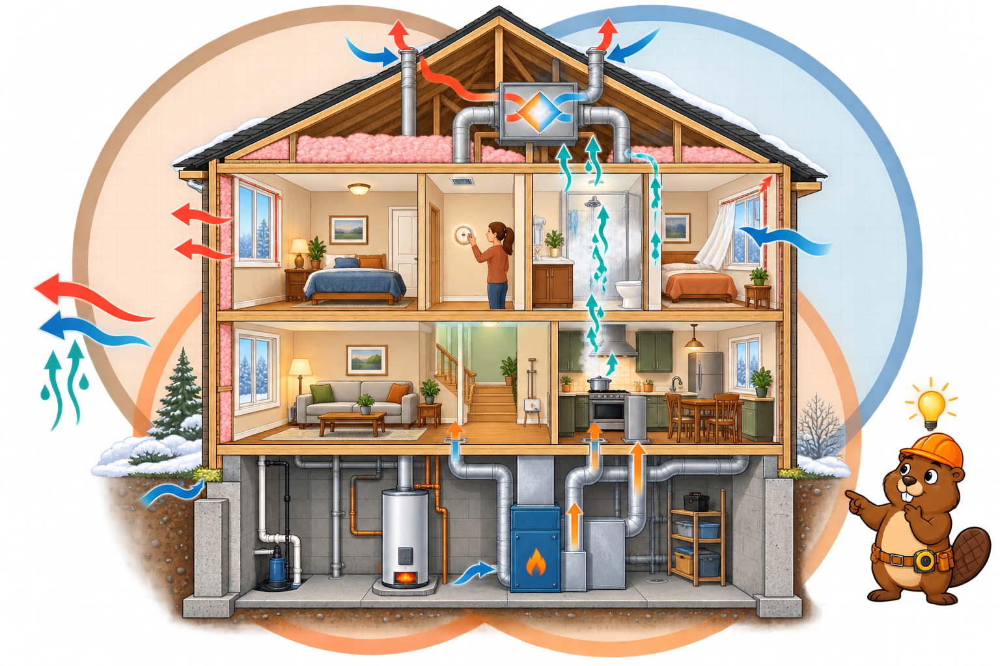

<iframe src="./main.html" height="1000px" width="100%" scrolling="no"></iframe>

[Open the interactive poster full screen](./main.html){ .md-button .md-button--primary }

Use **Explore** mode to hover over a numbered marker or its label and read how that part of the house affects heat, air, and moisture. Use **Quiz** mode to read the name in the prompt, then click the marker that matches. The marker numbers are hidden, so you must find the matching marker on the house.

The eleven callouts are:

1. Windows
2. Insulation
3. Thermostat Setting
4. Ventilation
5. Showers and Cooking
6. Windows Opened
7. Heat, Air, and Moisture Flows
8. Air Sealing
9. Water Heater
10. Building Performance
11. Furnace

## Static Poster

{ loading=lazy }

The full-size poster above is a static copy of the interactive version, handy for printing, sharing, or viewing without JavaScript.

## Why This Matters

The U.S. Department of Energy's Building America program states the idea this way: the total performance of a house depends on a balance of the envelope, the mechanical systems, and the occupants, and all three affect the flow of heat, air, and moisture into and out of the house. The poster turns that statement into a picture. Each marker belongs to one of the three actors, and each acts on the same three flows.

The scene is a teaching illustration, not a product diagram. Real houses differ by climate, age, and equipment, and the details shown, such as a heat-recovery ventilator in the attic, are examples rather than requirements. The point is the interaction: change one part, and the others respond.

## Connects to

- [Chapter 3: Forces, Heat, and the Physics of Buildings](../../chapters/03-forces-heat-physics/index.md)
- [Chapter 4: Moisture, Air Movement, and Thermal Comfort](../../chapters/04-moisture-air-comfort/index.md)
- [Chapter 19: Energy Efficiency and High-Performance Buildings](../../chapters/19-energy-efficiency/index.md)

## Sources

- U.S. Department of Energy. [Building America](https://www.energy.gov/eere/buildings/building-america). The "house as a system" framing of envelope, mechanical systems, and occupants.
- Alaska Housing Finance Corporation. [Building Science Basics (Chapter 2 of the building manual)](https://www.ahfc.us/iceimages/manuals/building_manual_ch_02.pdf). Reproduces the Building America "house as a system" statement and figure.
- Cummings, J., Withers, C., Martin, E., and Moyer, N. [Managing the Drivers of Air Flow and Water Vapor Transport in Existing Single-Family Homes](https://www1.eere.energy.gov/buildings/publications/pdfs/building_america/airflow_watervapor_transport.pdf). Building America Partnership for Improved Residential Construction, revised October 2012. Source for the natural and mechanical pressure comparison.

Teachers and editors can open [calibration mode](./main.html?edit=true) to drag the markers and copy updated coordinates.
