# Interactive Infographic Posters

These posters turn the book's biggest systems ideas into visual, classroom-ready learning experiences. Open a poster, hover over or click a region to read what it shows, then switch to **Quiz** mode to test yourself.

The original concepts and their sources are in [Infographic Poster Ideas](./infographic-poster-ideas.md).

-   [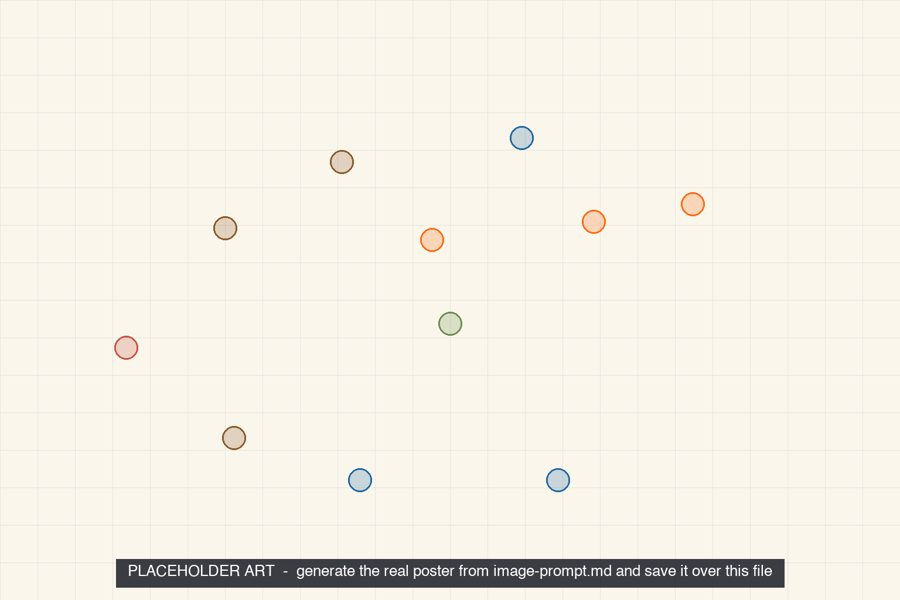](./house-as-a-system/index.md)

    **[The House as a System](./house-as-a-system/index.md)**

    A house performs as one system in which the envelope, the mechanical systems, and the occupants together steer the flow of heat, air, and moisture. *Callout overlay, 11 markers.*

-   [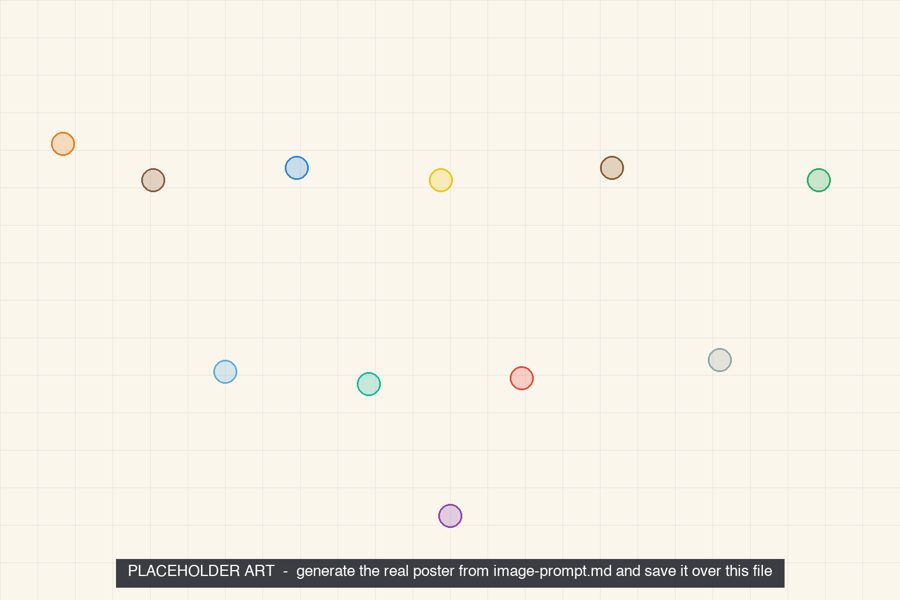](./the-perfect-wall/index.md)

    **[The Perfect Wall: Four Control Layers](./the-perfect-wall/index.md)**

    A wall must control rain, air, vapor, and heat, in that order of importance, and Lstiburek's Perfect Wall puts all four layers outside the structure. *Callout overlay, 11 markers.*

-   [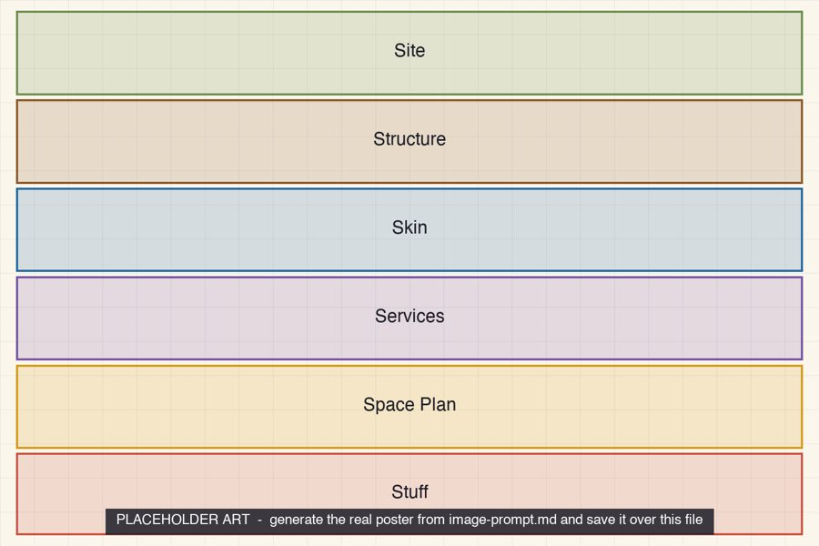](./six-s-shearing-layers/index.md)

    **[The Six S's of Shearing Layers](./six-s-shearing-layers/index.md)**

    A building is a stack of six layers that change at very different speeds, and good design lets the fast layers slip past the slow ones. *Grid overlay, 6 regions.*

-   [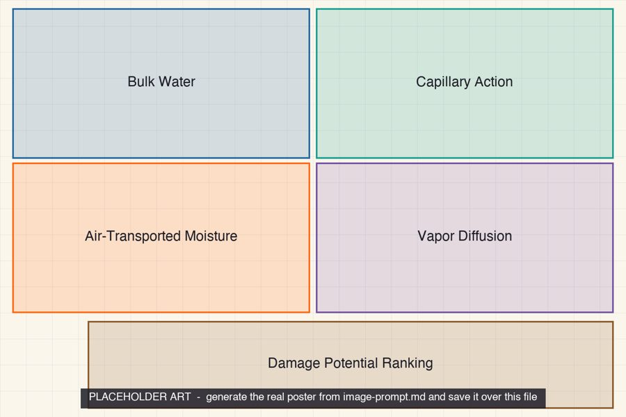](./four-ways-moisture-moves/index.md)

    **[Four Ways Moisture Moves](./four-ways-moisture-moves/index.md)**

    Moisture reaches a building as bulk water, capillary action, air-carried vapor, and vapor diffusion, and air leakage and liquid water do far more damage than diffusion. *Grid overlay, 5 regions.*

-   [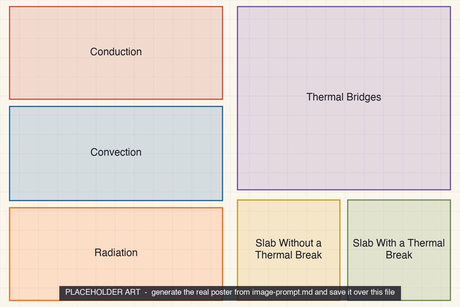](./heat-on-the-move/index.md)

    **[Heat on the Move](./heat-on-the-move/index.md)**

    Heat moves by conduction, convection, and radiation, and thermal bridges let it bypass insulation, so insulation only works if heat cannot go around it. *Grid overlay, 6 regions.*

-   [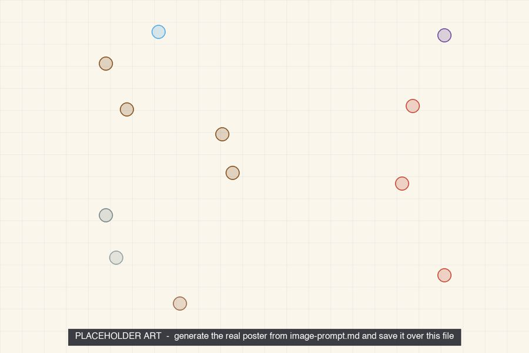](./the-load-path/index.md)

    **[The Load Path](./the-load-path/index.md)**

    Every load on a building needs a continuous, unbroken route to the ground, and a broken link anywhere along it lets something move. *Callout overlay, 12 markers.*

-   

    **[The Whole Building Design Wheel](./whole-building-design-wheel/index.md)**

    A good building balances eight design objectives, and an integrated approach and team process keep the balance around a high-performance building. *Callout overlay, 12 markers.*

-   [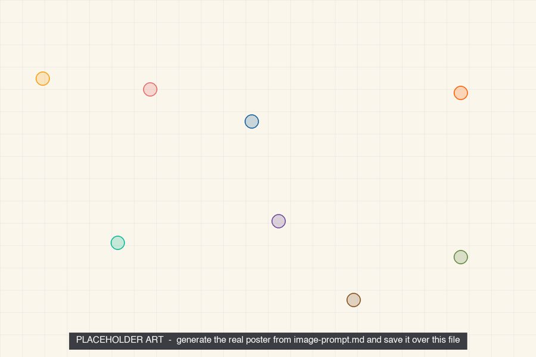](./five-principles-of-passive-house/index.md)

    **[The Five Principles of Passive House](./five-principles-of-passive-house/index.md)**

    Passive House reaches very low energy use with five linked measures that work as a system, and skipping one weakens the rest. *Callout overlay, 8 markers.*

-   [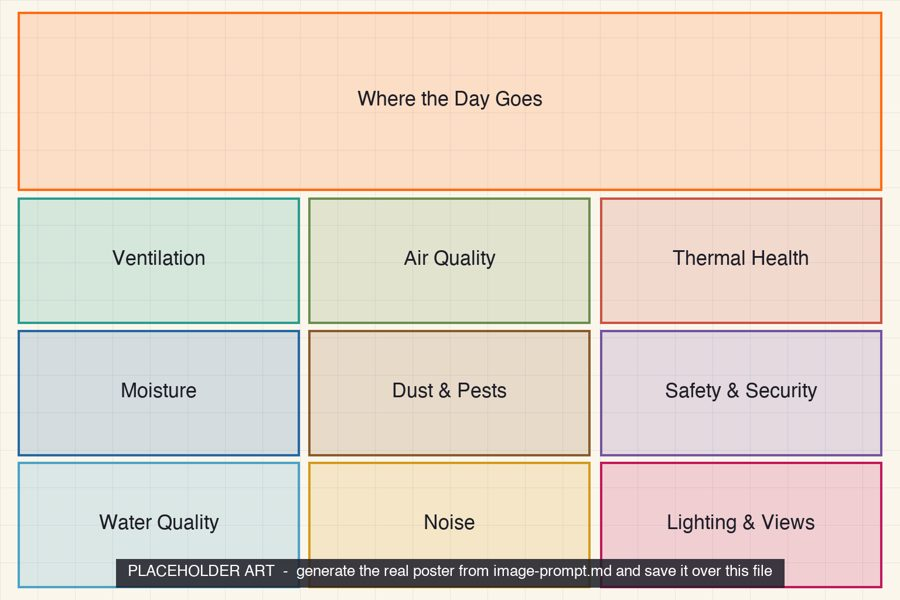](./the-indoor-species/index.md)

    **[The Indoor Species](./the-indoor-species/index.md)**

    People spend most of their lives inside buildings, so Harvard's nine foundations of a healthy building treat the building as a habitat. *Grid overlay, 10 regions.*

-   [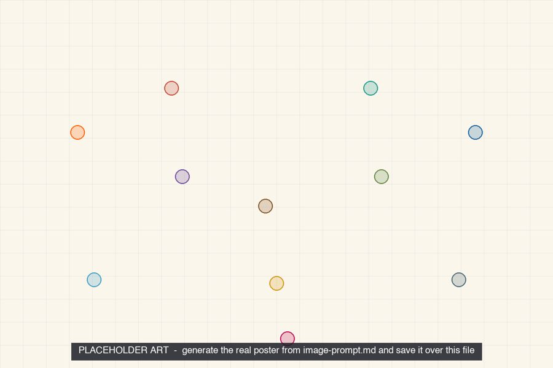](./thermal-comfort-six-variables/index.md)

    **[Thermal Comfort Is Six Variables](./thermal-comfort-six-variables/index.md)**

    Thermal comfort depends on four environmental and two personal variables, and the outdoor climate also shifts what people accept. *Callout overlay, 11 markers.*

-   [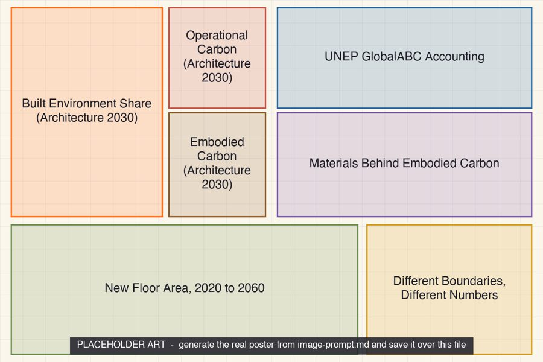](./carbon-footprint-of-the-built-world/index.md)

    **[The Carbon Footprint of the Built World](./carbon-footprint-of-the-built-world/index.md)**

    Buildings are a leading climate lever, and the carbon in materials matters as much as the energy used to run them, but every share depends on where its source draws the boundary. *Grid overlay, 7 regions.*

-   [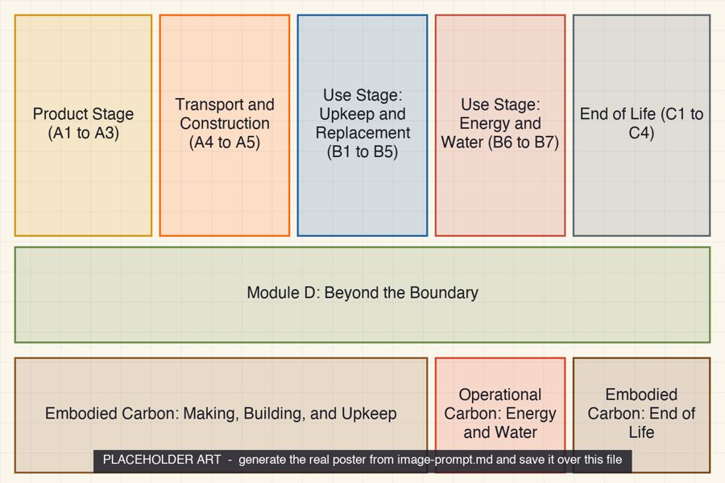](./cradle-to-grave-to-cradle/index.md)

    **[Cradle to Grave to Cradle](./cradle-to-grave-to-cradle/index.md)**

    A building's carbon impact starts at the quarry and continues past demolition, and the life-cycle modules show which emissions are embodied and which are operational. *Grid overlay, 9 regions.*

-   [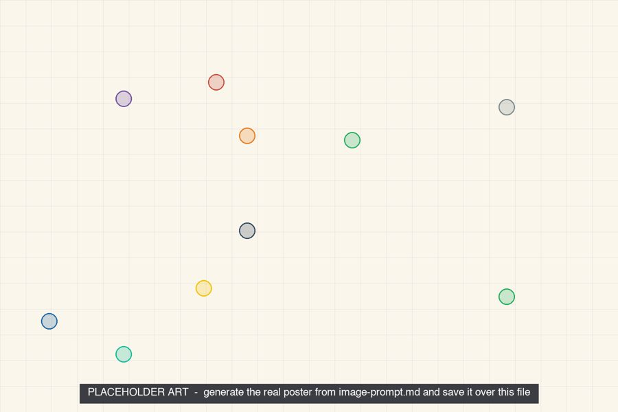](./the-building-as-a-chimney/index.md)

    **[The Building as a Chimney](./the-building-as-a-chimney/index.md)**

    In winter every tall building is a chimney, and the same stack-effect physics that wastes heat and causes drafts can also carry smoke between floors. *Callout overlay, 10 markers.*

-   [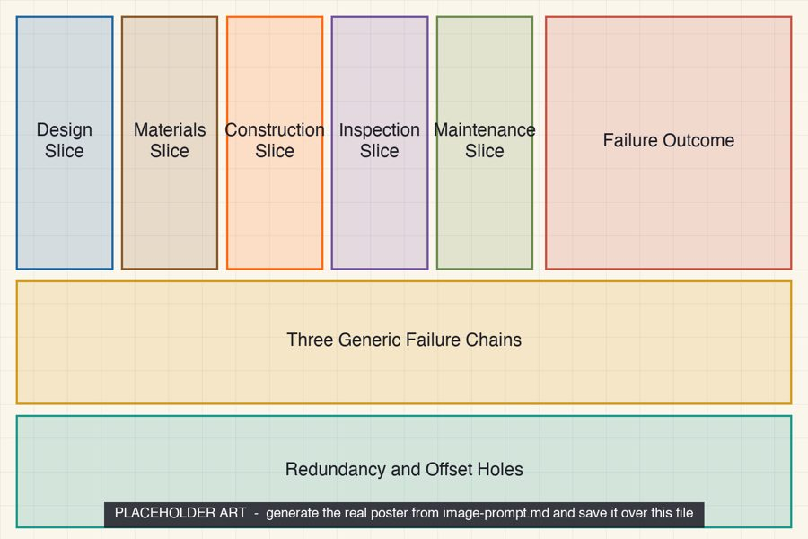](./swiss-cheese-model-of-building-failure/index.md)

    **[The Swiss Cheese Model of Building Failure](./swiss-cheese-model-of-building-failure/index.md)**

    Buildings rarely fail from a single cause; failure happens when holes in several layers of defense line up, and redundancy keeps them from aligning. *Grid overlay, 8 regions.*

-   [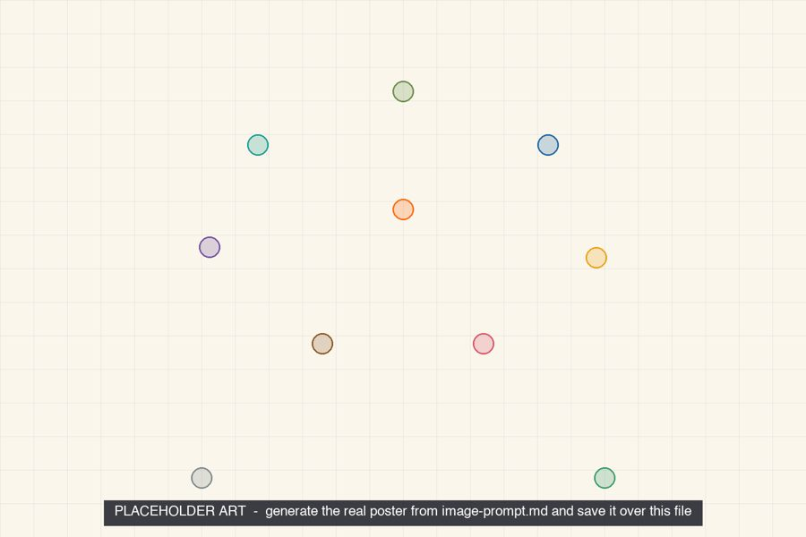](./living-building-petals/index.md)

    **[The Living Building Petals](./living-building-petals/index.md)**

    The Living Building Challenge describes a regenerative building as seven connected performance areas, called petals, and asks it to give back more than it takes. *Callout overlay, 10 markers.*

-   [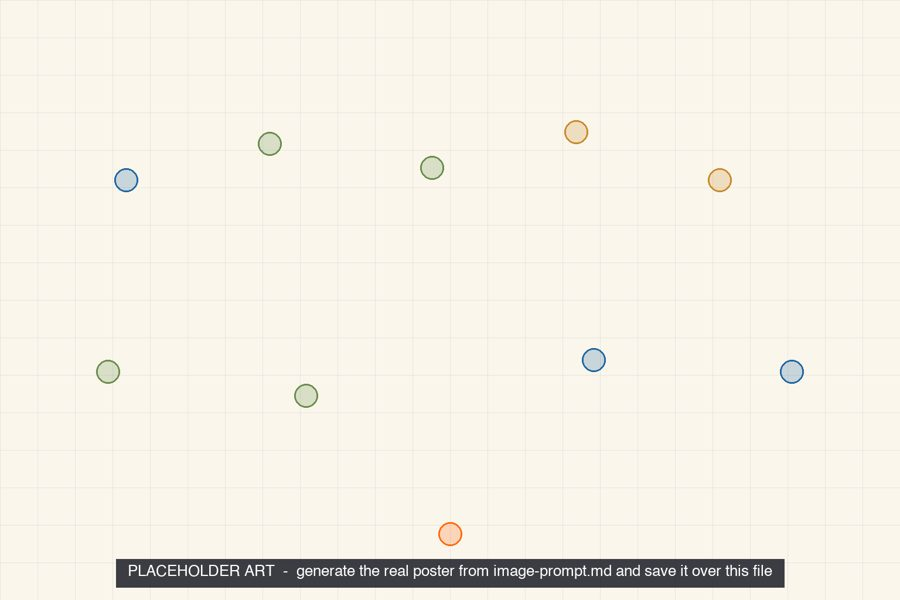](./nature-in-the-room/index.md)

    **[Nature in the Room](./nature-in-the-room/index.md)**

    Terrapin Bright Green's patterns of biophilic design treat daylight, views, and natural materials as inputs to occupant well-being, not decoration. *Callout overlay, 10 markers.*

-   [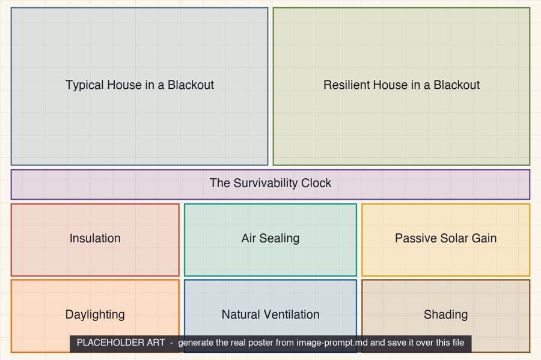](./when-the-power-goes-out/index.md)

    **[When the Power Goes Out](./when-the-power-goes-out/index.md)**

    Passive survivability asks a building to keep its occupants safe when the grid and the furnace fail, and six passive strategies do most of the work. *Grid overlay, 9 regions.*

-   [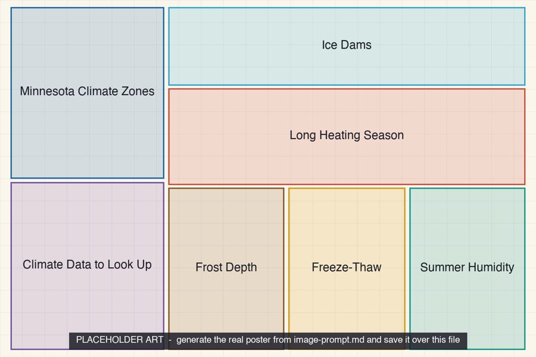](./minnesota-asks-hard-questions/index.md)

    **[Minnesota Asks Hard Questions](./minnesota-asks-hard-questions/index.md)**

    Climate is the first design input, and each hard question a Minnesota winter and summer ask of a building has a matching cold-climate design answer. *Grid overlay, 7 regions.*

-   [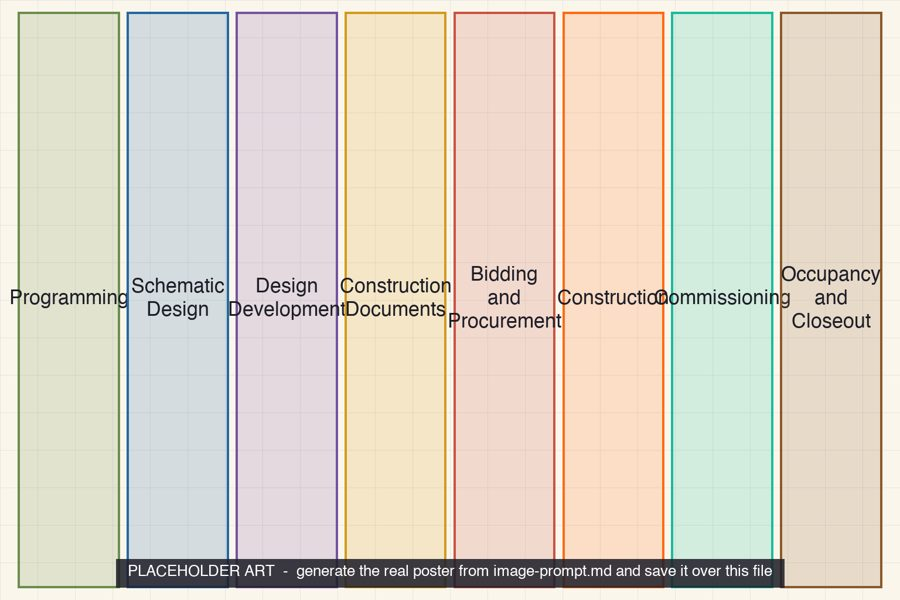](./idea-to-occupancy/index.md)

    **[Idea to Occupancy](./idea-to-occupancy/index.md)**

    A building is made by a sequence of phases, and the earlier a decision is made, the cheaper it is to get right. *Grid overlay, 8 regions.*

-   [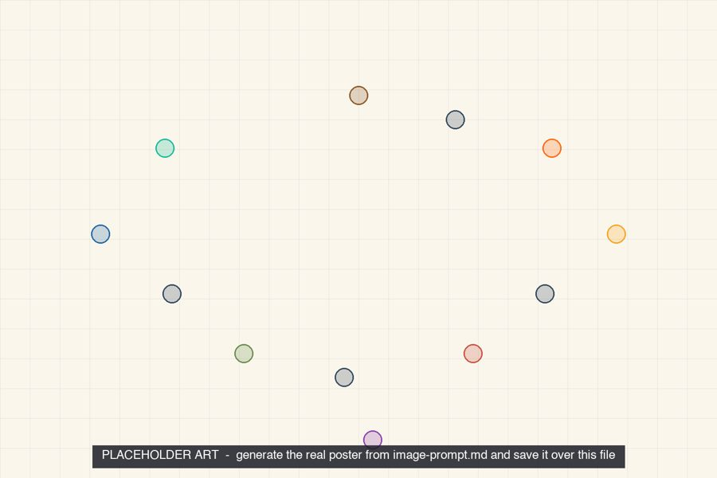](./the-building-systems-map/index.md)

    **[The Building Systems Map](./the-building-systems-map/index.md)**

    Every building system depends on every other, so a change to one must be followed through all the others. *Callout overlay, 12 markers.*

