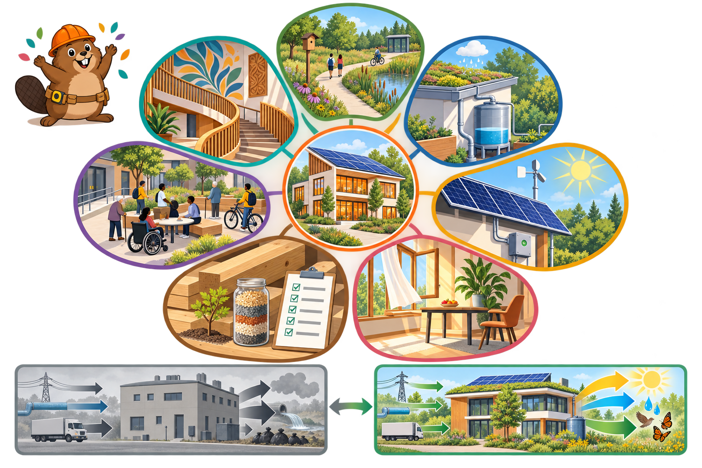

<iframe src="./main.html" height="1000px" width="100%" scrolling="no"></iframe>

[Open the interactive poster full screen](./main.html){ .md-button .md-button--primary }

Use **Explore** mode to hover over a numbered marker or its label and read what that petal asks of a building. Use **Quiz** mode to read the name in the prompt, then click the marker that matches. The marker numbers are hidden, so you must find the matching marker on the flower.

The ten callouts are:

1. Equity
2. Beauty
3. Place
4. Living Building
5. Water
6. Less Bad Building
7. Materials
8. Health and Happiness
9. Energy
10. Net Positive Building

## Static Poster

{ loading=lazy }

The full-size poster above is a static copy of the interactive version, handy for printing, sharing, or viewing without JavaScript.

## Why This Matters

The International Living Future Institute (ILFI) built its Living Building Challenge around seven performance areas, called petals: Place, Water, Energy, Health and Happiness, Materials, Equity, and Beauty. The program has 20 imperatives, ten core and ten that push performance further, and it judges a project on measured results after 12 months of occupancy rather than on design intent. Its central idea is regeneration: a building should give back, not only take less.

Most of this book teaches how to reduce harm, which is the "less bad" side of the contrast strip. The petals show where that work is heading. Each petal here is a simplified summary in general terms, so read ILFI's current standard before claiming that any project meets a specific requirement.

## Connects to

- [Chapter 20: Sustainable Building Materials](../../chapters/20-sustainable-materials/index.md)
- [Chapter 19: Energy Efficiency and High-Performance Buildings](../../chapters/19-energy-efficiency/index.md)

## Sources

- International Living Future Institute. [The Living Building Challenge](https://living-future.org/lbc/) (petals and the regenerative framing).
- International Living Future Institute. [Living Building Challenge Basics](https://living-future.org/lbc/basics/) (seven petals and 20 imperatives).

Teachers and editors can open [calibration mode](./main.html?edit=true) to drag the markers and copy updated coordinates.
