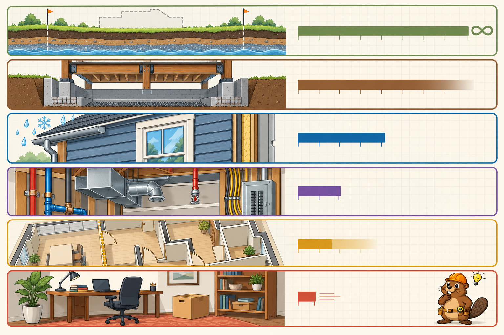

<iframe src="./main.html" height="1000px" width="100%" scrolling="no"></iframe>

[Open the interactive poster full screen](./main.html){ .md-button .md-button--primary }

Use **Explore** mode to hover over or click a layer and read how long it lasts and what it contains. Use **Quiz** mode to read a clue and click the layer it describes.

The six layers, from slowest to fastest:

1. **Site** — The land, soil, climate, and legal lot, effectively eternal.
2. **Structure** — The foundation and load-bearing frame, roughly 30 to 300 years.
3. **Skin** — The exterior surfaces, roughly 20 years.
4. **Services** — Wiring, plumbing, ducts, and sprinklers, roughly 7 to 15 years.
5. **Space Plan** — Interior partitions and layout, roughly 3 to 30 years.
6. **Stuff** — Furniture and belongings, changing daily.

## Static Poster

{ loading=lazy }

The full-size poster above is a static copy of the interactive version, handy for printing, sharing, or viewing without JavaScript.

## Why This Matters

The lifespans come from Stewart Brand's *How Buildings Learn* (1994), which expanded Frank Duffy's earlier layered model into six layers. Brand's point is that a building is always being pulled apart by components that age at different rates. A building that lets those layers slip past one another can adapt; one that locks them together has to be torn down.

Lifespans are Brand's rules of thumb, not code requirements. Real buildings vary with climate, use, and maintenance.

## Connects to

- [Chapter 1: Introduction to the Built Environment and Construction Terminology](../../chapters/01-intro-terminology/index.md)
- [Chapter 21: Durability, Maintenance, and Building Failure](../../chapters/21-durability-failure/index.md)

## Source

Brand, Stewart. *How Buildings Learn: What Happens After They're Built*. Viking, 1994. See also [Shearing layers](https://en.wikipedia.org/wiki/Shearing_layers).

Teachers and editors can open [calibration mode](./main.html?edit=true) to adjust zone positions after the artwork is generated. Copy only the `x1`, `y1`, `x2`, and `y2` numbers back into `data.json`, because the calibration export omits `showLabels` and `palette`.
