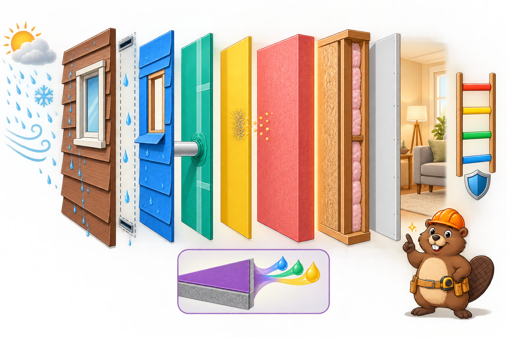

<iframe src="./main.html" height="1000px" width="100%" scrolling="no"></iframe>

[Open the interactive poster full screen](./main.html){ .md-button .md-button--primary }

Use **Explore** mode to hover over a numbered marker or its label and read what that layer does. Use **Quiz** mode to read the name in the prompt, then click the marker that matches. The marker numbers are hidden, so you must find the matching part of the wall.

The eleven callouts are:

1. Outdoors: Rain, Wind, and Sun
2. Cladding
3. Water Control Layer
4. Vapor Control Layer
5. Structure
6. Priority Ladder
7. Drainage Space
8. Air Control Layer
9. Layers That Combine
10. Thermal Control Layer
11. Interior Finish

## Static Poster

{ loading=lazy }

The full-size poster above is a static copy of the interactive version, handy for printing, sharing, or viewing without JavaScript.

## Why This Matters

In Building Science Corporation's BSI-001, Joseph Lstiburek describes a wall that controls rain, air, vapor, and heat, with all four control layers placed outside the structure. From the outside in the order is cladding, drainage space, water control, air control, vapor control, thermal insulation, structure, and interior finish. The priority is rain, then air, then vapor, then thermal, and each lower priority is wasted if the one above it fails.

The poster draws the layers separately so they are easy to count. Real walls often combine layers in one material. Real walls also vary by climate, so check the adopted code and an enclosure designer before copying any assembly.

## Connects to

- [Chapter 11: Enclosure Control Layers and Insulation](../../chapters/11-enclosure-insulation/index.md)
- [Chapter 12: Cladding, Windows, Doors, and Air Sealing](../../chapters/12-cladding-windows-air-sealing/index.md)

## Source

Lstiburek, Joseph. [BSI-001: The Perfect Wall](https://www.buildingscience.com/documents/insights/bsi-001-the-perfect-wall). Building Science Corporation.

Teachers and editors can open [calibration mode](./main.html?edit=true) to drag the markers and copy updated coordinates.
