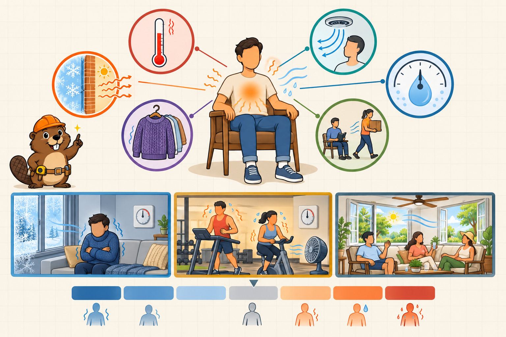

<iframe src="./main.html" height="1000px" width="100%" scrolling="no"></iframe>

[Open the interactive poster full screen](./main.html){ .md-button .md-button--primary }

Use **Explore** mode to hover over a numbered marker or its label and read how that variable or scene affects comfort. Use **Quiz** mode to read the name in the prompt, then click the marker that matches. The marker numbers are hidden, so you must find the matching marker.

The eleven callouts are:

1. Mean Radiant Temperature
2. Air Temperature
3. Clothing Insulation
4. Air Speed
5. Metabolic Rate
6. Relative Humidity
7. Cold Window, Normal Thermostat
8. The Occupant: A Heat Balance
9. Hot Gym, Same Thermostat Setting
10. The Seven-Point Sensation Scale
11. Open Windows in Summer

## Static Poster

{ loading=lazy }

The full-size poster above is a static copy of the interactive version, handy for printing, sharing, or viewing without JavaScript.

## Why This Matters

P. O. Fanger's Predicted Mean Vote (PMV) model, the standard method in ASHRAE Standard 55, predicts how a large group will vote on a seven-point sensation scale from six variables: air temperature, mean radiant temperature, air speed, and humidity (environmental), plus clothing insulation and metabolic rate (personal). Brager and de Dear's adaptive model adds that, in occupant-controlled spaces without mechanical cooling, acceptable indoor temperatures also move with the outdoor climate.

The three case scenes are teaching examples, not measurements. Chapter 4 gives a rough winter comfort range, but no numeric range is stated here because ranges depend on the standard's edition, humidity, and the occupants. Check the current edition of ASHRAE 55 before design.

## Connects to

- [Chapter 4: Moisture, Air Movement, and Thermal Comfort](../../chapters/04-moisture-air-comfort/index.md)

## Sources

- ASHRAE. [Standard 55 fact sheet: Thermal Environmental Conditions for Human Occupancy](https://www.ashrae.org/file%20library/about/government%20affairs/advocacy%20toolkit/virtual%20packet/standard-55-fact-sheet.pdf).
- Fanger, P. O. (1970). *Thermal Comfort: Analysis and Applications in Environmental Engineering*. Danish Technical Press.
- de Dear, R., and Brager, G. [Climate, Comfort and Natural Ventilation: A New Adaptive Comfort Standard for ASHRAE Standard 55](https://www.researchgate.net/publication/269097286_Climate_Comfort_and_Natural_Ventilation_A_New_Adaptive_Comfort_Standard_for_ASHRAE_Standard_55).
- Wikipedia. [Thermal comfort](https://en.wikipedia.org/wiki/Thermal_comfort) (summary of PMV, the sensation scale, and the adaptive model).

Teachers and editors can open [calibration mode](./main.html?edit=true) to drag the markers and copy updated coordinates.
