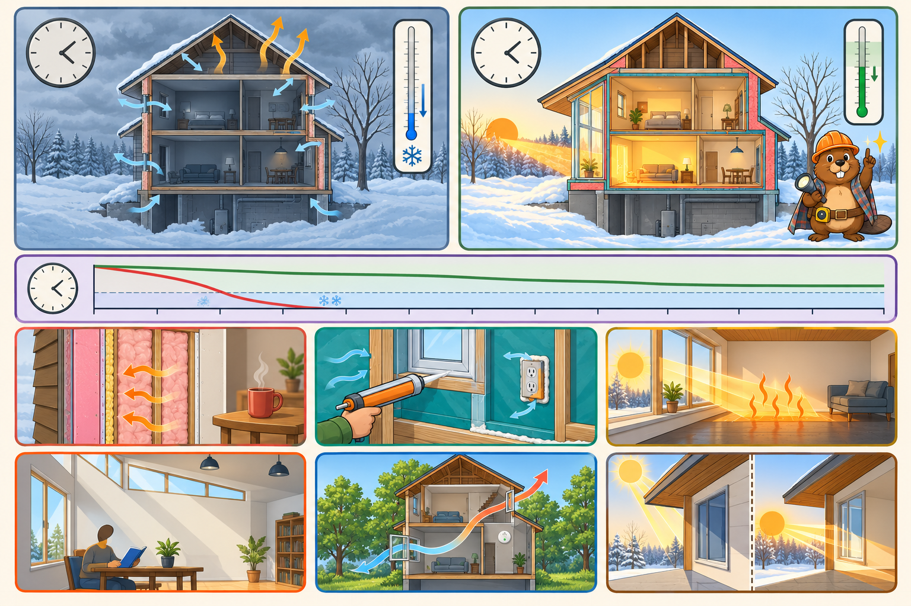

<iframe src="./main.html" height="1000px" width="100%" scrolling="no"></iframe>

[Open the interactive poster full screen](./main.html){ .md-button .md-button--primary }

Use **Explore** mode to hover over or click a region and read how the building behaves in a blackout. Use **Quiz** mode to read a clue and click the region it describes.

The nine regions are:

1. **Typical House in a Blackout** — Thin, leaky, and dark, it loses heat fast once the furnace stops.
2. **Resilient House in a Blackout** — The same house with a tight, insulated envelope and south-facing glass cools slowly.
3. **The Survivability Clock** — How long conditions stay livable depends on the building.
4. **Insulation** — A thick, continuous layer slows heat flow.
5. **Air Sealing** — A continuous air barrier stops leaks.
6. **Passive Solar Gain** — South-facing windows collect low winter sun.
7. **Daylighting** — Windows and clerestories light rooms without electricity.
8. **Natural Ventilation** — Openings low and high move air with no fans.
9. **Shading** — An overhang blocks summer sun and admits winter sun.

## Static Poster

{ loading=lazy }

The full-size poster above is a static copy of the interactive version, handy for printing, sharing, or viewing without JavaScript.

## Why This Matters

Alex Wilson coined *passive survivability* in 2005, after Hurricane Katrina, for a building's ability to maintain life-support conditions through an extended loss of power, heating fuel, or water. The Resilient Design Institute argues that it should be a baseline for residential codes. In a Minnesota January the idea is concrete: a well-insulated, airtight house gives occupants more time than a leaky one.

The poster deliberately shows no hours-until-unsafe number. That time depends on the construction, the weather, the wind, and the people in the house, so it must be estimated for each building. The two house panels are teaching illustrations of the same house with and without the strategies, not measured results. Passive solar gain helps only when the sun is out, and fuel-burning heaters and generators must never be used indoors.

## Connects to

- [Chapter 19: Energy Efficiency and High-Performance Buildings](../../chapters/19-energy-efficiency/index.md)
- [Chapter 21: Durability, Maintenance, and Building Failure](../../chapters/21-durability-failure/index.md)

## Sources

- Wikipedia. [Passive survivability](https://en.wikipedia.org/wiki/Passive_survivability) (term coined by Alex Wilson in 2005 after Hurricane Katrina; definition).
- Resilient Design Institute. [Resilient Design Institute](https://www.resilientdesign.org/) (passive survivability as a proposed residential baseline).
- Centers for Disease Control and Prevention. [Carbon Monoxide Poisoning Basics](https://www.cdc.gov/carbon-monoxide/about/index.html) (never run a generator, grill, or camp stove indoors).
- This book: Chapter 19 (passive solar design, daylighting, sun angles at 45 degrees N) and Chapter 21 (building resilience).

Teachers and editors can open [calibration mode](./main.html?edit=true) to adjust zone positions after the artwork is generated. Copy only the `x1`, `y1`, `x2`, and `y2` numbers back into `data.json`, because the calibration export omits `showLabels` and `palette`.
