# List of MicroSims for The Science of the Built Environment

MicroSims are small interactive simulations, each focused on a single concept. Each card below links to the MicroSim's lesson page, which has instructions, a short lesson plan, and an embeddable `main.html`. Every chapter also embeds the MicroSims that illustrate its concepts.

The colored dot beside a MicroSim in the left navigation shows how finished it is: **red** means a specification with no implementation yet, **orange** means built and awaiting author review, and **green** means the author tested it and approved it for learners.

The [Learning Graph Viewer](graph-viewer/index.md) is a separate tool for exploring how the book's 448 concepts depend on each other.

-   **[AC Waveform and Transmission Loss Explorer](./ac-waveform-transmission-loss-explorer/index.md)**

    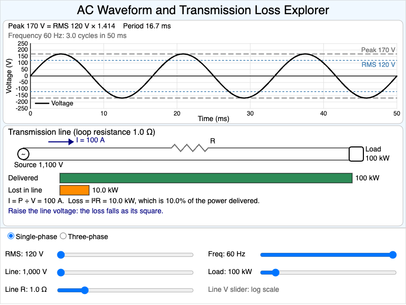

    Students read peak, RMS, frequency, and phase from an AC waveform in single-phase and three-phase modes, then raise the transmission voltage to see line loss I squared R fall.

-   **[AI Claim Audit Drill](./ai-claim-audit-drill/index.md)**

    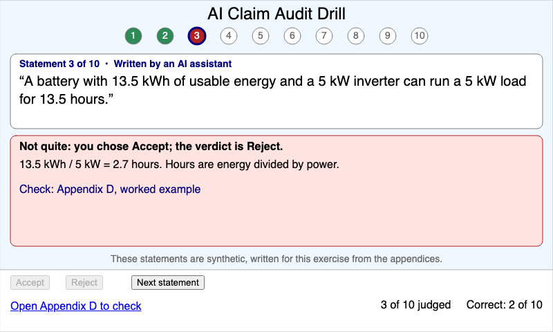

    Students judge ten technical statements written by an AI assistant as correct or incorrect against the physics and facts in Appendices A through H, see the reason and the appendix to check after each, and review the statements they got wrong.

-   **[Air Sealing and Blower Door Explorer](./air-sealing-blower-door-explorer/index.md)**

    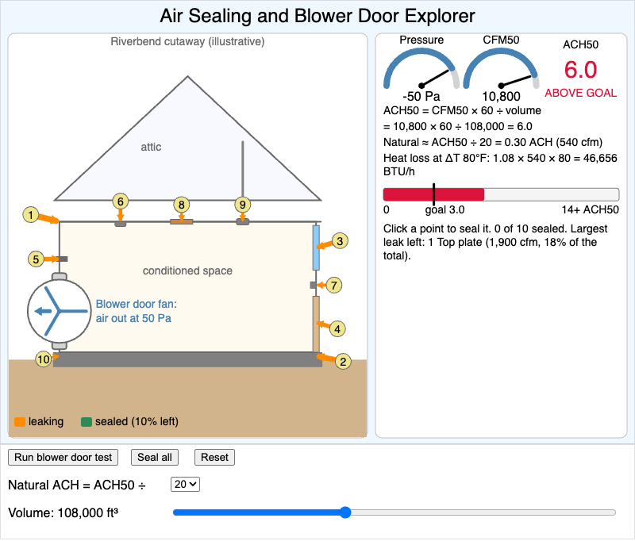

    Students seal the ten leakage points of a Riverbend cutaway one at a time, read CFM50 and ACH50 from a simulated blower door test, and convert the result to natural air changes and design-day heat loss to decide which leaks to seal first.

-   **[Basement Wall Soil Pressure Explorer](./foundation-wall-lateral-pressure-explorer/index.md)**

    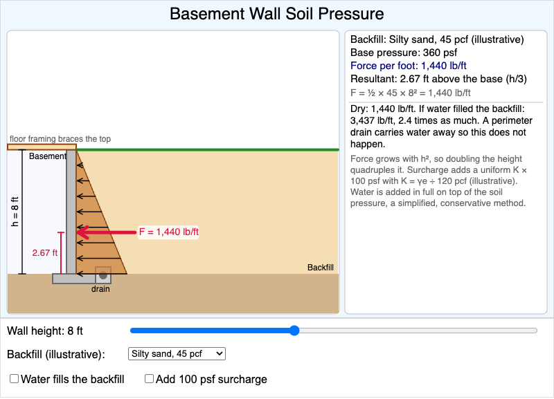

    Students vary wall height, backfill, water, and a parking-lot surcharge and watch the triangular soil pressure diagram, the force per foot of wall, and the height of the resultant change.

-   **[Battery Backup Run-Time Explorer](./battery-backup-runtime-explorer/index.md)**

    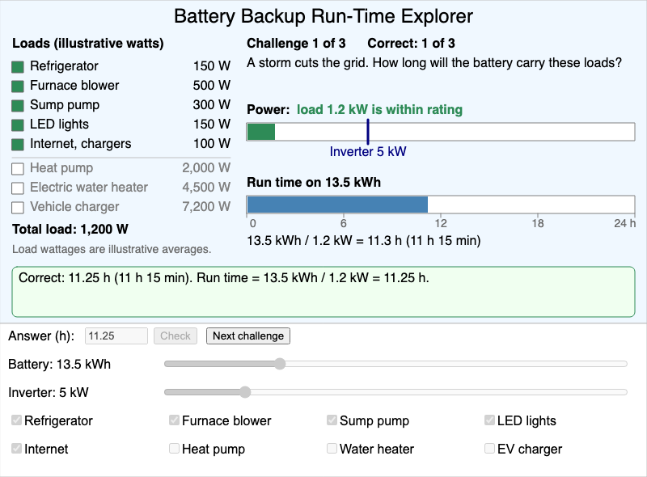

    Students calculate how long a 13.5 kWh home battery carries a chosen set of loads, discover that a load above the inverter rating trips the system however much energy remains, and then explore battery size, inverter size, and large loads such as a vehicle charger.

-   **[Beam Reactions and Equilibrium Explorer](./beam-reactions-equilibrium-explorer/index.md)**

    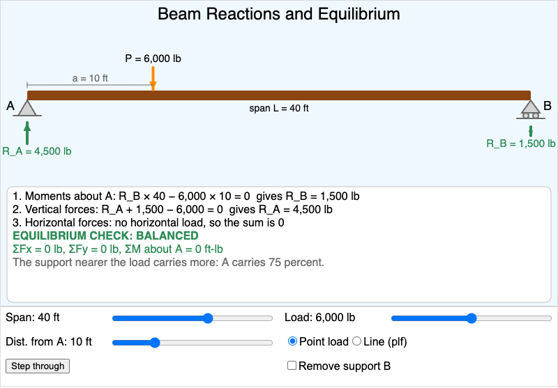

    Students load a simply supported beam with a point load or a uniform line load and watch the support reactions change length as the load moves. A panel substitutes the current numbers into the three equilibrium equations and checks that all three sums are zero.

-   **[Bearing Capacity and Footing Size Explorer](./soil-bearing-footing-area-explorer/index.md)**

    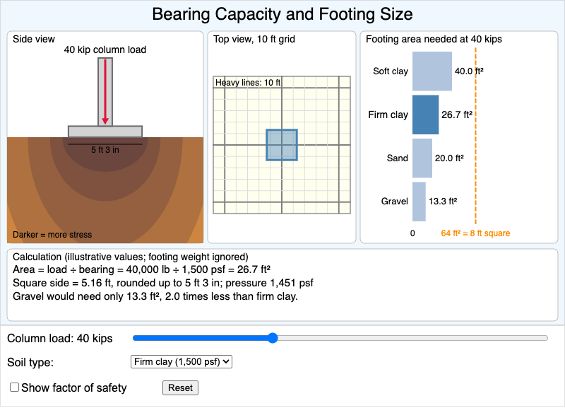

    Students set a column load and pick a soil, then watch the required footing area, the footing size, the pressure bulb under it, and a four-soil bar chart update, including a flag when the footing grows past 8 ft square.

-   **[Building Material Property Comparison Chart](./building-material-property-comparison-chart/index.md)**

    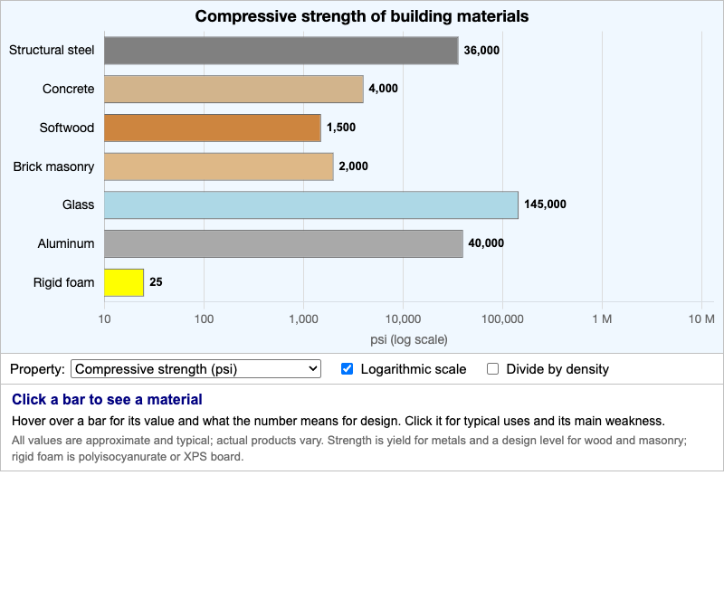

    Students compare density, strength, stiffness, thermal expansion, and thermal conductivity across seven common building materials on one horizontal bar chart, with a logarithmic scale for values that span many orders of magnitude and a Divide by density option that shows each property per pound of material.

-   **[Building Pressure and Air Leakage Explorer](./building-pressure-air-leakage-explorer/index.md)**

    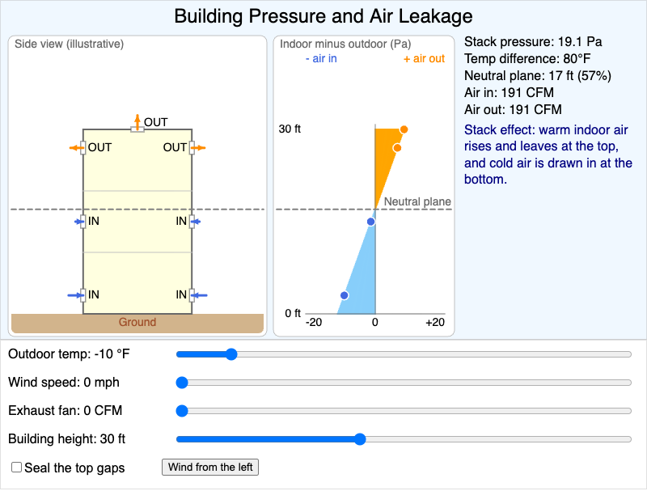

    Students vary outdoor temperature, wind, an exhaust fan, and building height and watch the indoor-minus-outdoor pressure change at every height of a building with gaps in its walls and roof. Arrows show where air enters and leaves, and a dashed line marks the neutral pressure plane.

-   **[Building Systems Cutaway](./building-systems-cutaway/index.md)**

    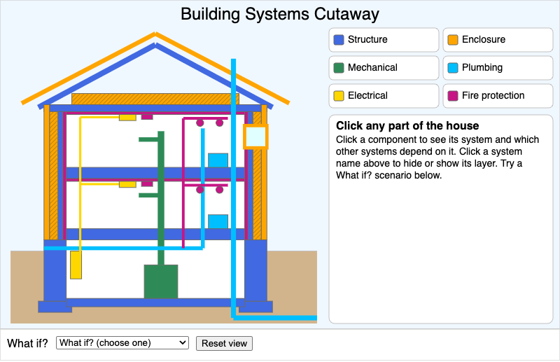

    Students explore a section through a two-story house drawn in six system colors, toggle each system layer, click components to see which other systems depend on them, and run What if? scenarios that show how one change ripples through the building.

-   **[Ceiling Coordination Clash Explorer](./ceiling-coordination-clash-explorer/index.md)**

    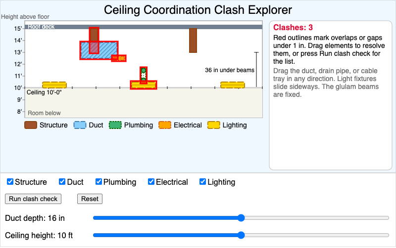

    Students analyze a cross-section of the space above a ceiling, drag a supply duct, sloped drain pipe, cable tray, and light fixtures between two glued-laminated beams, and watch a live clash counter. A clash check lists the conflicts and states the priority order for resolving them.

-   **[Circuit Breaker and Continuous Load Explorer](./circuit-breaker-continuous-load-explorer/index.md)**

    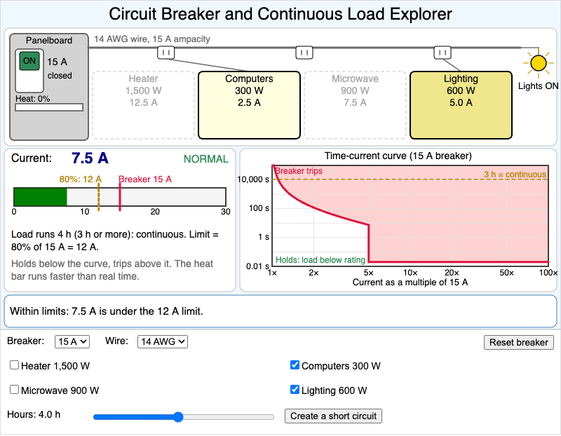

    Students plug devices into a 120 V branch circuit, choose the breaker rating, wire gauge, and hours of operation, and apply the 80 percent rule for continuous loads while a time-current curve shows how a breaker trips on overload and on short circuit.

-   **[Cladding Rainscreen Water Path Explorer](./cladding-rainscreen-water-path-explorer/index.md)**

    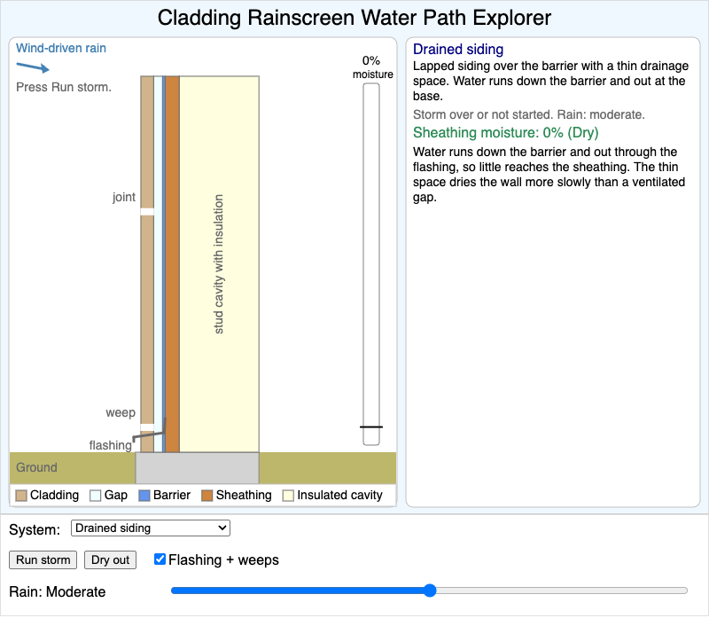

    Students run a storm against four cladding systems, watch where the water that gets past the joint goes, and compare how the sheathing moisture gauge rises and how long each wall takes to dry.

-   **[Classroom CO2 Ventilation Balance Explorer](./co2-ventilation-balance-explorer/index.md)**

    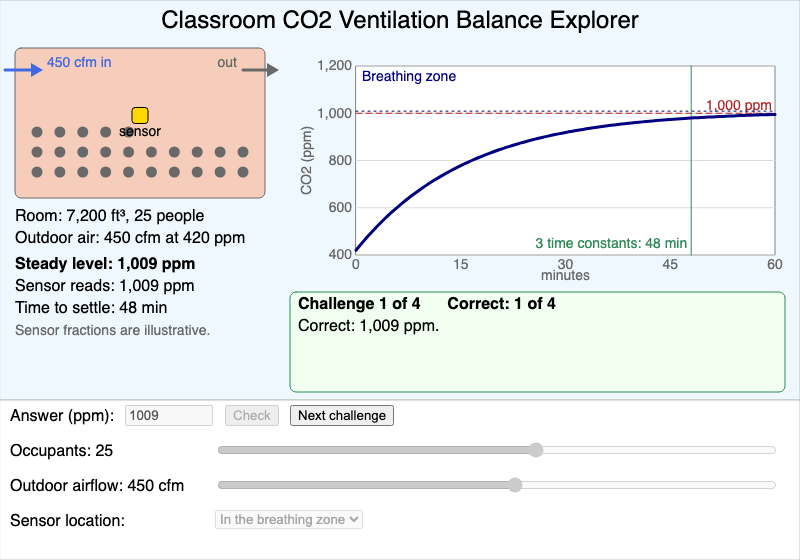

    Students calculate the steady-state carbon dioxide level in a classroom from the number of occupants and the outdoor airflow, find the airflow that holds a target, and see why a sensor next to a supply grille can hide a problem.

-   **[CLT Warm Roof Assembly Explorer](./clt-warm-roof-assembly-explorer/index.md)**

    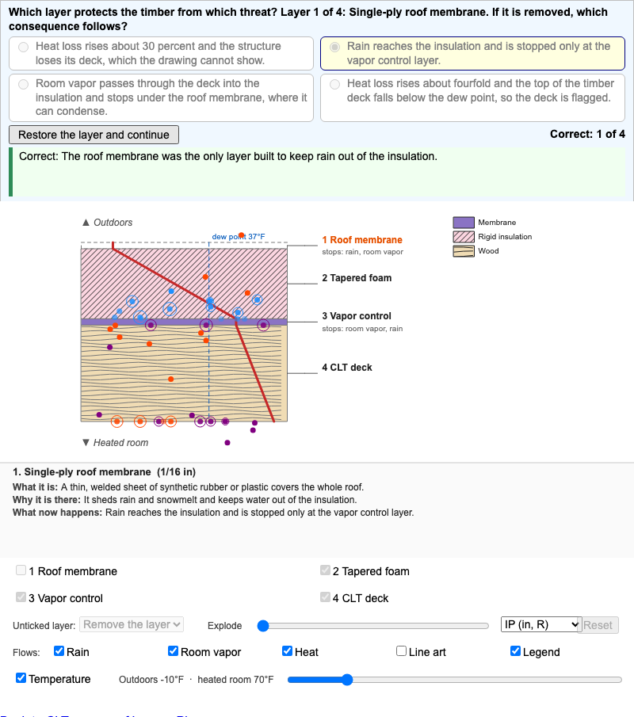

    Students predict what follows when each of the four layers of a cross-laminated timber warm roof is removed, then drag the outdoor temperature to see how the foam keeps the timber deck above the dew point.

-   **[Code Adoption and Authority Chain](./code-adoption-authority-chain/index.md)**

    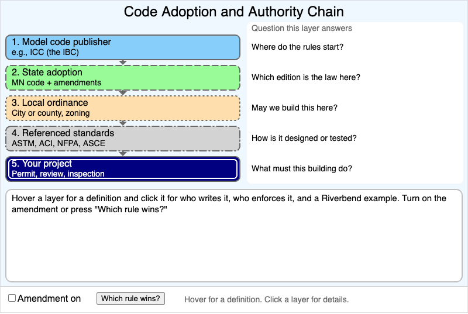

    Students follow a model code through state adoption, local ordinance, and referenced standards down to a permitted project, then test their understanding by deciding which layer controls in a series of rule conflicts.

-   **[Code Editions and Building Life Explorer](./code-editions-building-life-explorer/index.md)**

    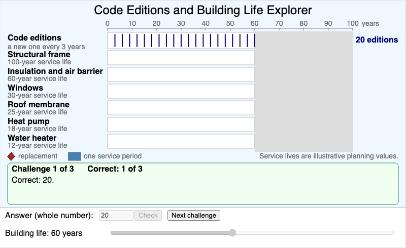

    Students calculate how many code editions are published during a building's life and how many times a roof membrane and a heat pump are replaced, then change the building life to see which parts stay for the whole life.

-   **[Concrete Composition and Strength Gain Explorer](./concrete-composition-strength-gain-explorer/index.md)**

    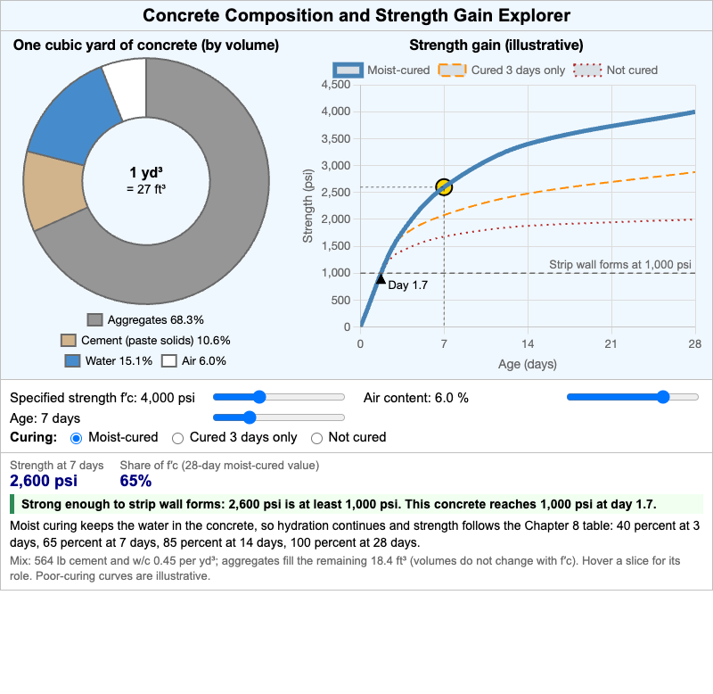

    Students see how one cubic yard of concrete divides among aggregates, cement, water, and air, and compare strength-gain curves for moist-cured, briefly cured, and uncured concrete. A marker reads the strength and the percentage of f'c at any age and shows when wall forms can be stripped.

-   **[Conduction Through a Layer](./conduction-layer-heat-flow-explorer/index.md)**

    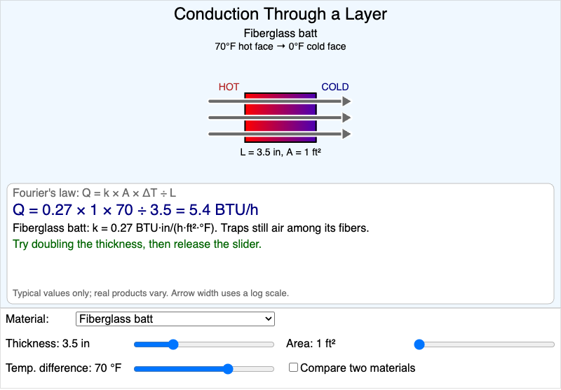

    Students apply Fourier's law to a single flat layer: a slab shaded from hot to cold, with arrows that grow with the computed heat flow. Sliders and a material menu change conductivity, thickness, area, and temperature difference, and a compare mode puts two materials side by side.

-   **[Control Layer Wall Section Explorer](./control-layer-wall-section-explorer/index.md)**

    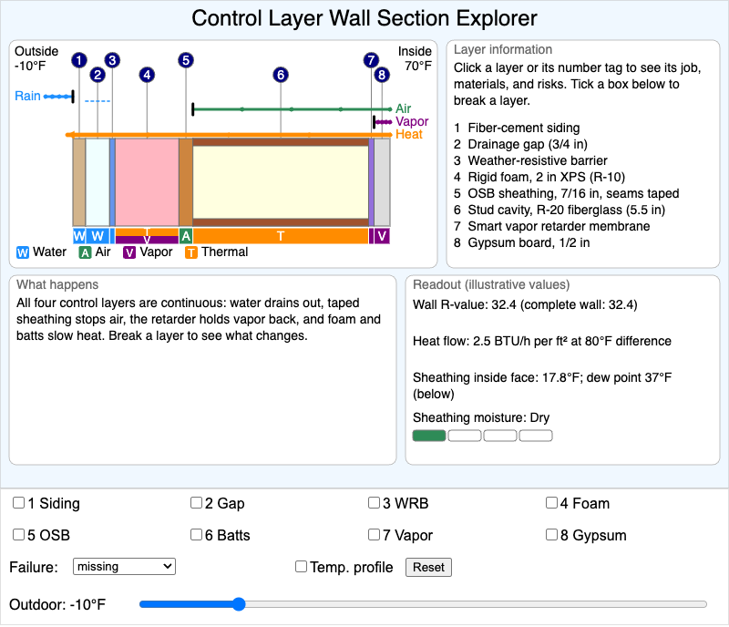

    Students identify the eight layers of the Riverbend cold-climate wall, see which control layer each serves (water, air, vapor, or thermal), and break layers to predict what happens to rain, air, vapor, heat, and the temperature of the sheathing.

-   **[Critical Path Explorer](./critical-path-explorer/index.md)**

    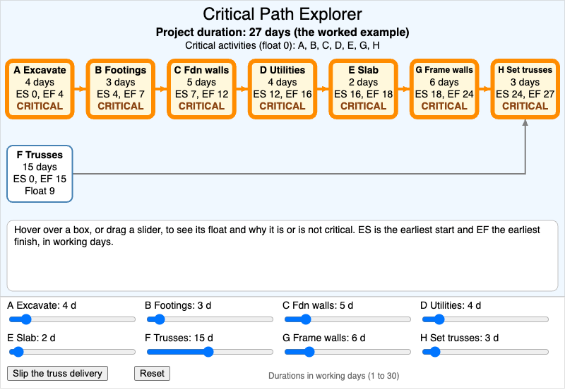

    Students work with the eight Riverbend structure activities as a left-to-right network. They change durations with sliders, watch the earliest start, earliest finish, float, and critical path recalculate, and slip the truss delivery by 10 days to see the critical path change.

-   **[Delivery Method Explorer](./delivery-method-explorer/index.md)**

    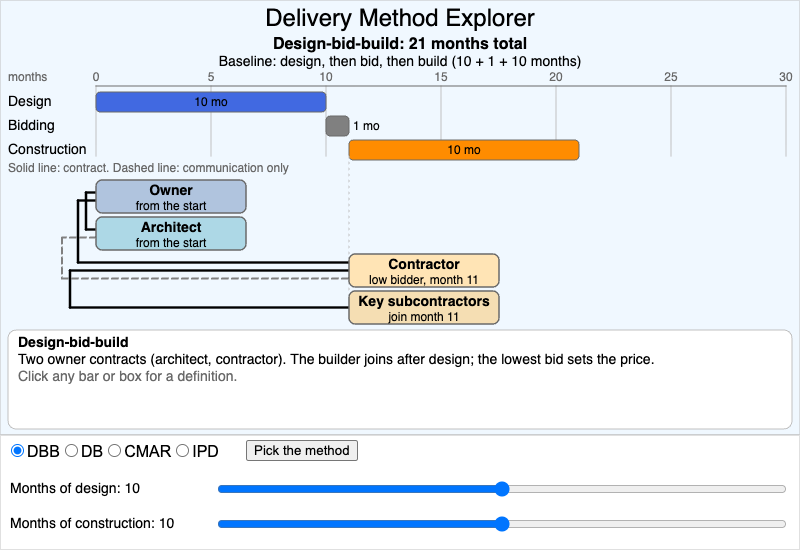

    Students compare design-bid-build, design-build, construction manager at risk, and integrated project delivery on a timeline of design, bidding, and construction bars and on a diagram of who holds contracts with whom. A quiz mode describes a project and asks which method fits best.

-   **[Drawing Scale Calculator](./drawing-scale-calculator/index.md)**

    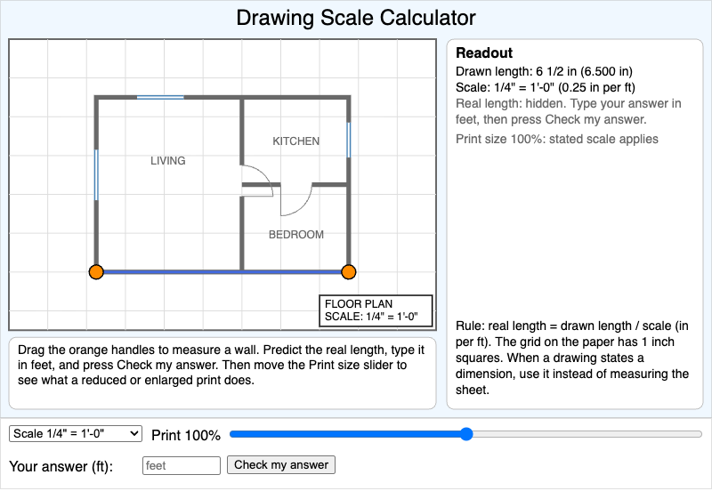

    Students measure a wall on a floor plan with a draggable line, predict the real length from the stated drawing scale, and check the answer. A print size slider shows why enlarging or reducing a printout breaks the scale and why written dimensions govern.

-   **[Drawing Types Explorer](./drawing-types-explorer/index.md)**

    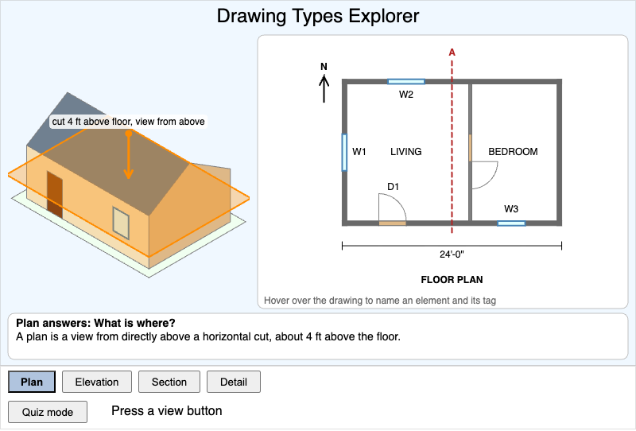

    Students compare plan, elevation, section, and detail views of the same small building. Each button shows a cutting plane or viewing arrow on an isometric house and the 2D drawing it produces, and a quiz mode asks which view answers a given question.

-   **[Egress Time Margin Explorer](./egress-time-margin-explorer/index.md)**

    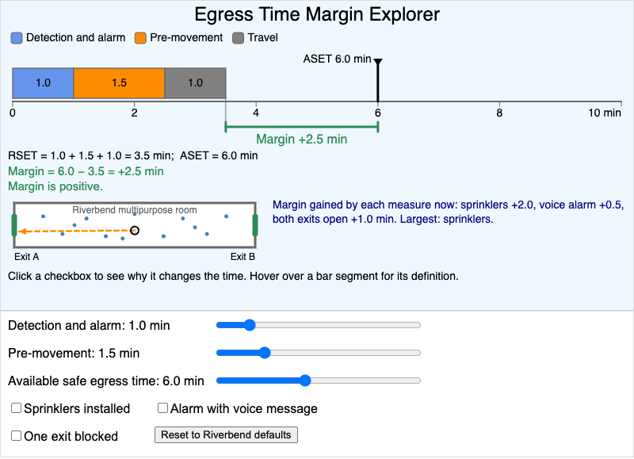

    Students calculate the margin between available and required safe egress time for the Riverbend multipurpose room, then add sprinklers, a voice alarm, or a blocked exit to judge which protective measure improves the margin most.

-   **[Electric Circuit and Water Analogy Explorer](./electrical-circuit-water-analogy-explorer/index.md)**

    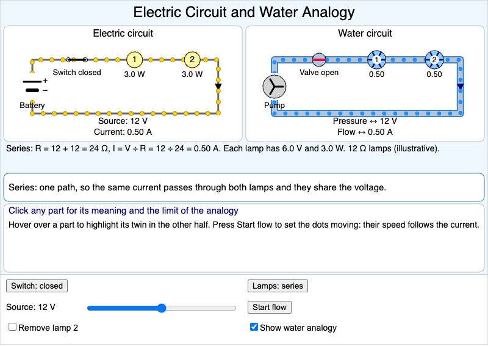

    Students compare an electrical circuit with its water-pipe twin, then open the switch, change the source voltage, remove a lamp, and wire two lamps in series or parallel to predict and see how the flow responds.

-   **[Electrical Design Phase Timeline](./electrical-design-phase-responsibility-timeline/index.md)**

    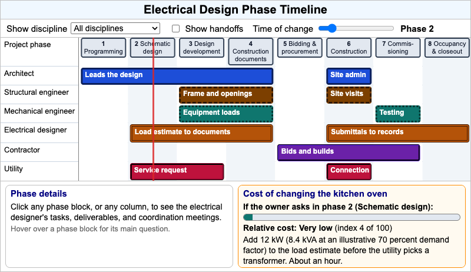

    A timeline of the eight project phases with one row for each discipline shows when the architect, structural engineer, mechanical engineer, electrical designer, contractor, and utility are most active. Clicking a phase lists the electrical designer's tasks, deliverables, and meetings, and a Time of change marker shows how the cost of changing the kitchen oven rises from schematic design to construction.

-   **[Electrical Service Path Explorer](./electrical-service-path-explorer/index.md)**

    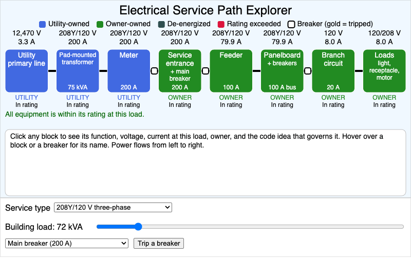

    Students follow electricity from the utility primary line through the transformer, meter, service entrance, feeder, panelboard, and branch circuit to the loads, reading the voltage, current, owner, and protection at each stage. A load slider shows when equipment is overloaded, and a trip button shows what goes dark downstream of a breaker.

-   **[Embodied Carbon Beam Comparison](./embodied-carbon-beam-comparison/index.md)**

    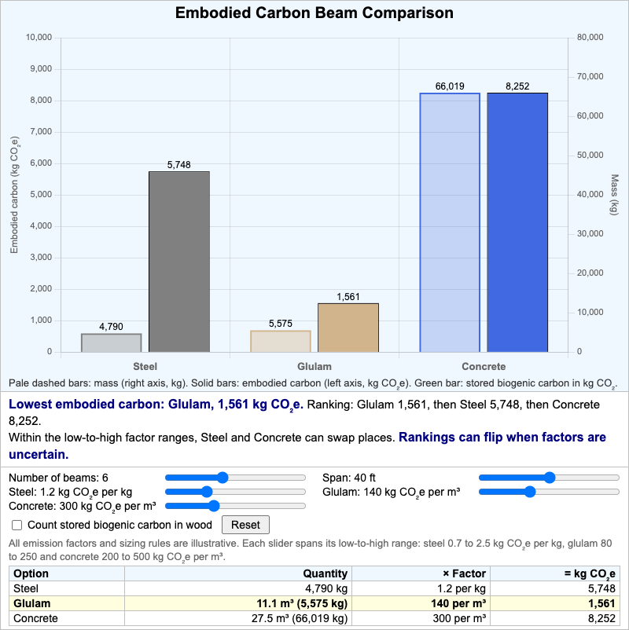

    Compare the product-stage embodied carbon of steel, glued-laminated, and reinforced concrete beams for the same span by multiplying each member's quantity by an emission factor. Sliders sweep the factors across a low-to-high range to show when the ranking can flip, and a checkbox shows the stored biogenic carbon in wood.

-   **[Enclosure Heat Loss Component Explorer](./enclosure-heat-loss-component-explorer/index.md)**

    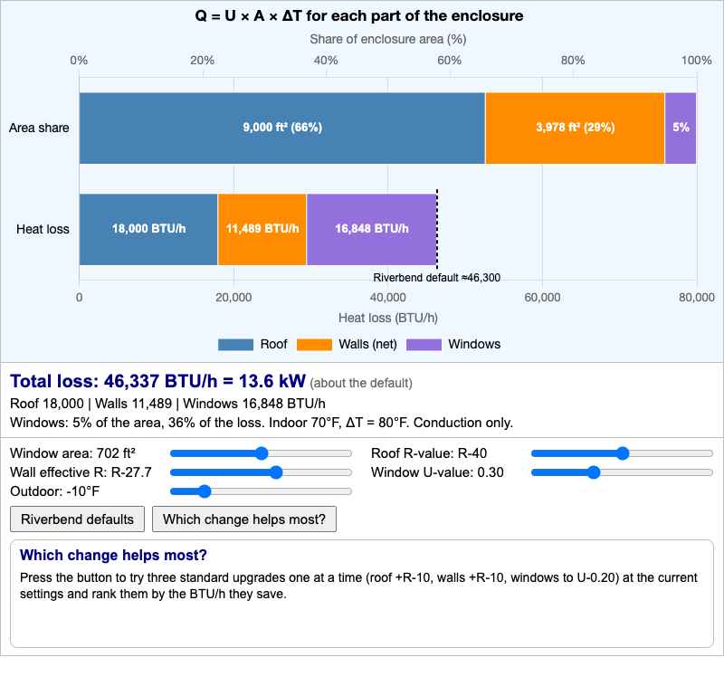

    Students change window area, roof and wall R-values, window U-value, and outdoor temperature to see how area and U-value combine into the conductive heat loss of the Riverbend enclosure, then rank three standard upgrades by the BTU/h each one saves.

-   **[Failure Chain Explorer](./failure-chain-explorer/index.md)**

    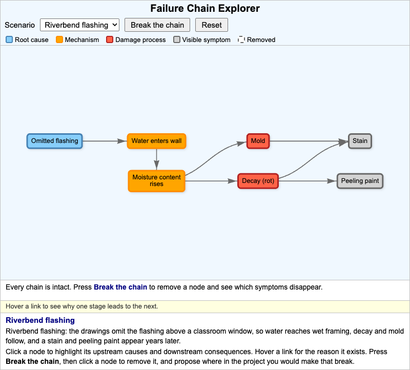

    Trace how a design, construction, or maintenance error becomes a visible building failure through a chain of mechanisms and damage processes. Remove a link with Break the chain to see which symptoms disappear and which remain.

-   **[Fire Protection Layers Building Explorer](./fire-protection-layers-building-explorer/index.md)**

    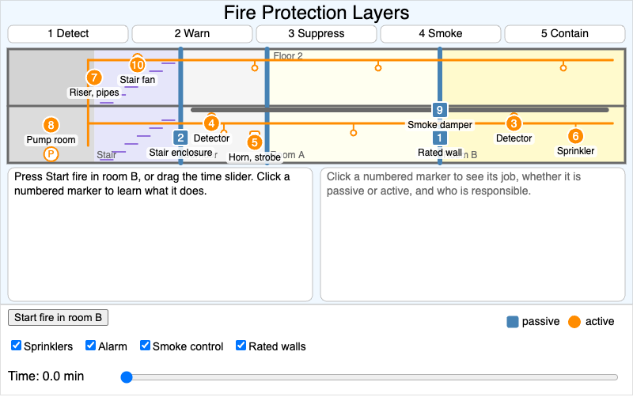

    Students explore a two-story cutaway with ten numbered fire protection features, classify each as passive (blue square) or active (orange circle), and match it to one of the five jobs: detect, warn, suppress, control smoke, and contain. They start a fire in room B and switch layers off to see the consequence.

-   **[Force Vector Resolver](./force-vector-resolver/index.md)**

    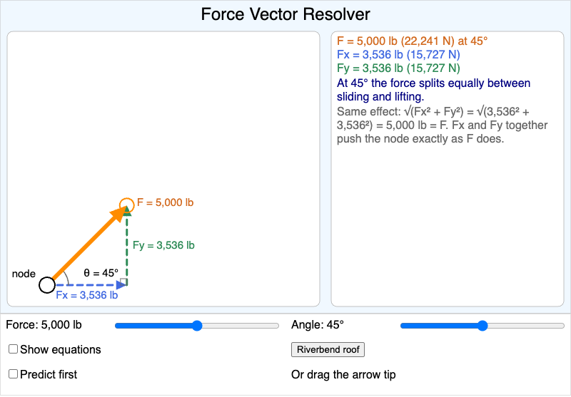

    Students resolve an inclined force into horizontal and vertical components by setting a force and angle or dragging the arrow tip. A readout gives the components in pounds and newtons, and a predict-first mode asks the student to type the horizontal component before it is revealed.

-   **[Forensic Leak Investigation Simulator](./forensic-leak-investigation-simulator/index.md)**

    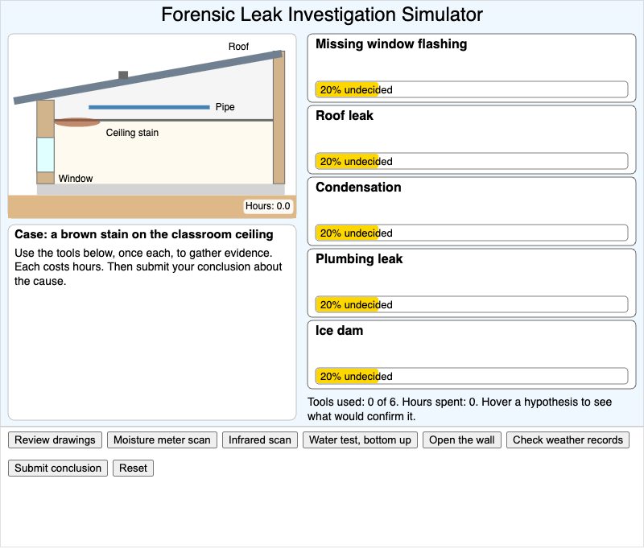

    Investigate a ceiling stain in the Riverbend classroom by choosing diagnostic tools, reading the evidence each one returns, and judging which of five competing hypotheses it supports or eliminates. Submit a conclusion and compare your investigation with an efficient sequence.

-   **[Foundation Cross-Section Explorer](./foundation-cross-section-explorer/index.md)**

    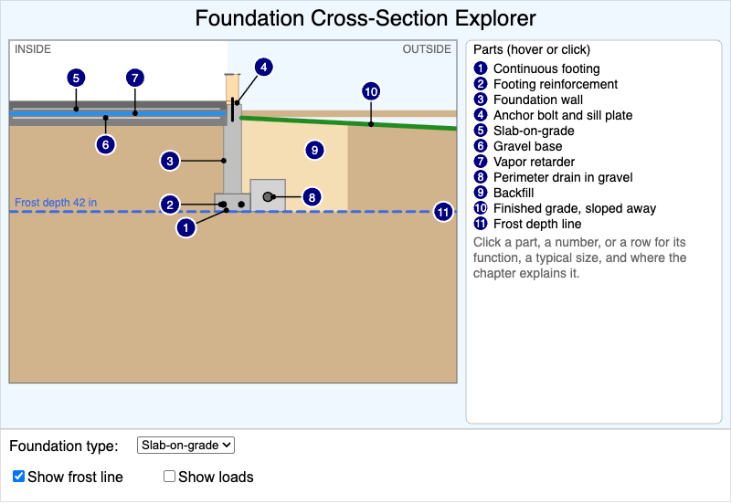

    A to-scale cross-section of a Riverbend exterior wall with numbered parts that students hover over and click to learn each part's job, a typical size, and where Chapter 10 explains it. A menu switches between slab-on-grade, crawl space, and basement.

-   **[Foundation Type Selector](./foundation-type-selector/index.md)**

    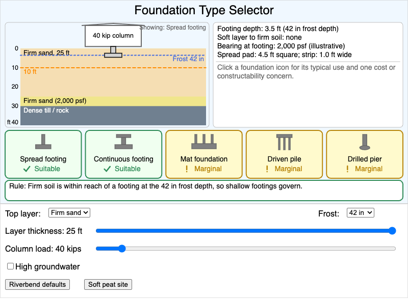

    Students set a ground profile, column load, groundwater, and frost depth, then judge which of five foundation types is suitable, marginal, or unsuitable and read the rule that governs the choice.

-   **[Frost Heave Three-Condition Explorer](./frost-heave-three-conditions/index.md)**

    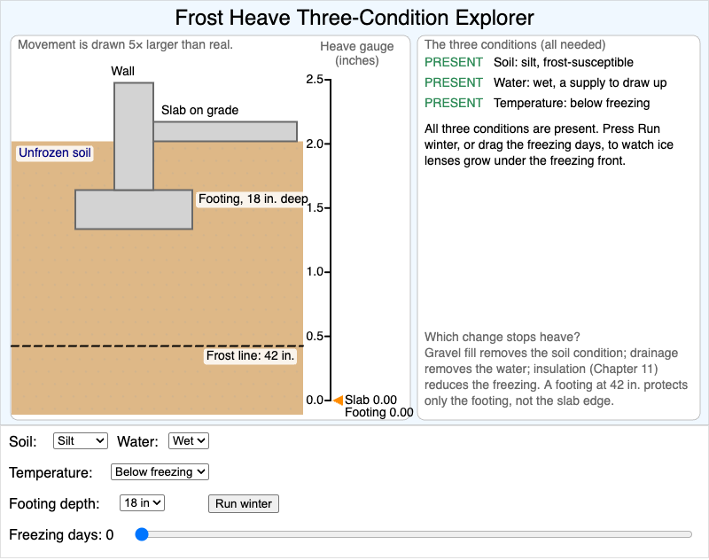

    Students run a Minnesota winter on a cross-section of ground with a wall footing and a slab edge, and watch ice lenses grow only when frost-susceptible soil, water, and freezing temperatures are all present. Turning any one condition off stops the heave, and a footing depth choice shows what a 42 in. footing does and does not protect.

-   **[Glulam Char Section Explorer](./glulam-char-section-explorer/index.md)**

    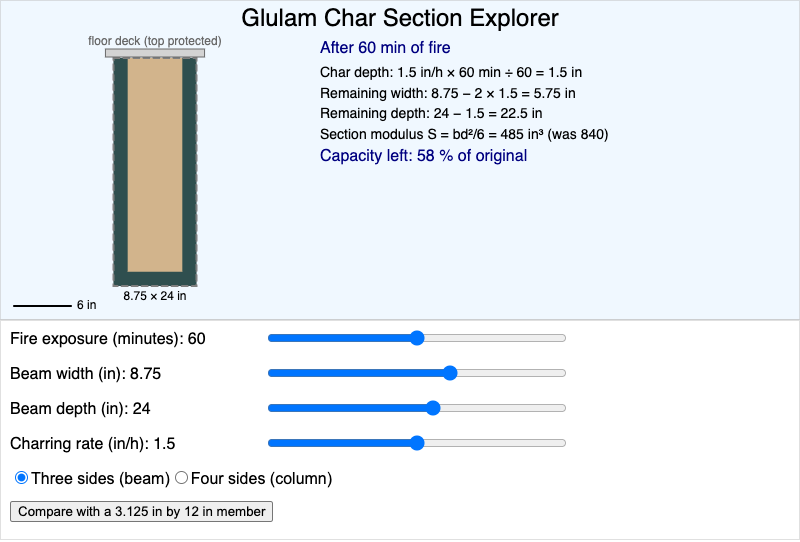

    Students expose a glued-laminated beam cross-section to fire, watch a char layer grow inward at a chosen rate, and calculate the remaining width, depth, and section modulus, then compare with a small member to see why large timbers resist fire better.

-   **[Ground Temperature versus Depth Explorer](./ground-temperature-depth-explorer/index.md)**

    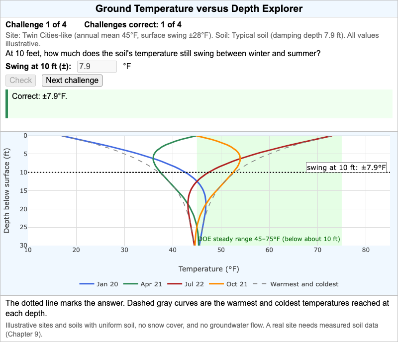

    Students use the damped seasonal temperature model to find the swing at 10 feet, the depth where the swing falls to 2 F in two soils, and the date of the coldest soil at 10 feet, then compare soils and sites with four seasonal curves and a depth marker.

-   **[Ground-Source ROI Estimator](./ground-source-roi-estimator/index.md)**

    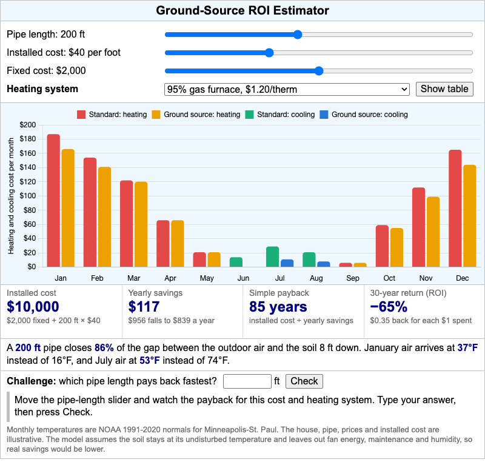

    Students compare the monthly heating and cooling cost of a typical Minnesota home with a standard air intake against the same home with a buried earth-tube intake, then judge the installed cost, simple payback, and 30-year return on investment as the pipe length changes.

-   **[Heat Pump COP and Lift Explorer](./heat-pump-cop-lift-explorer/index.md)**

    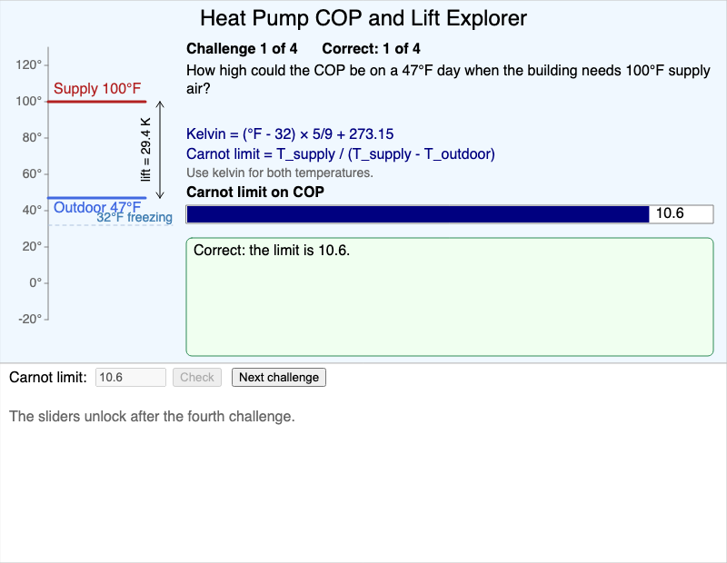

    Students calculate the Carnot limit on a heat pump's COP from the outdoor and supply temperatures in kelvin, then explore how lift, the fraction of the limit achieved, and fuel prices change the cost of delivering 100,000 Btu with a heat pump, a gas furnace, and electric resistance.

-   **[Heat Pump Cycle Explorer](./heat-pump-cycle-explorer/index.md)**

    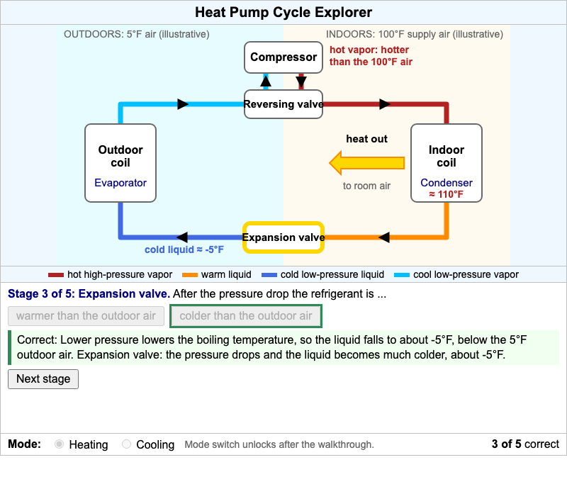

    Students walk through the five parts of a heat pump, predict what happens to the refrigerant and which way heat flows at each, and then switch between heating and cooling mode to watch the indoor and outdoor coils trade roles.

-   **[Heat Transfer Modes in a Winter Wall](./heat-transfer-modes-wall-explorer/index.md)**

    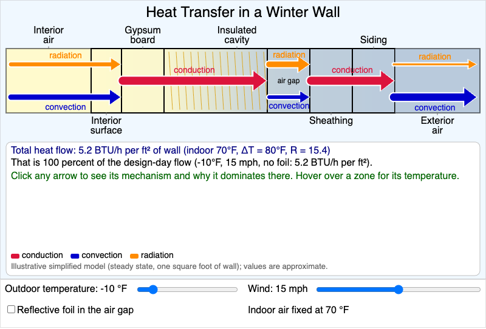

    A cross-section of a winter wall shows the warm room on the left and the cold outdoors on the right, with arrows labeled conduction, convection, and radiation along the heat path. Students vary outdoor temperature, wind, and a reflective foil in the air gap and see how the heat flow and each mechanism change.

-   **[Heating Load and Ventilation Explorer](./hvac-heating-load-ventilation-explorer/index.md)**

    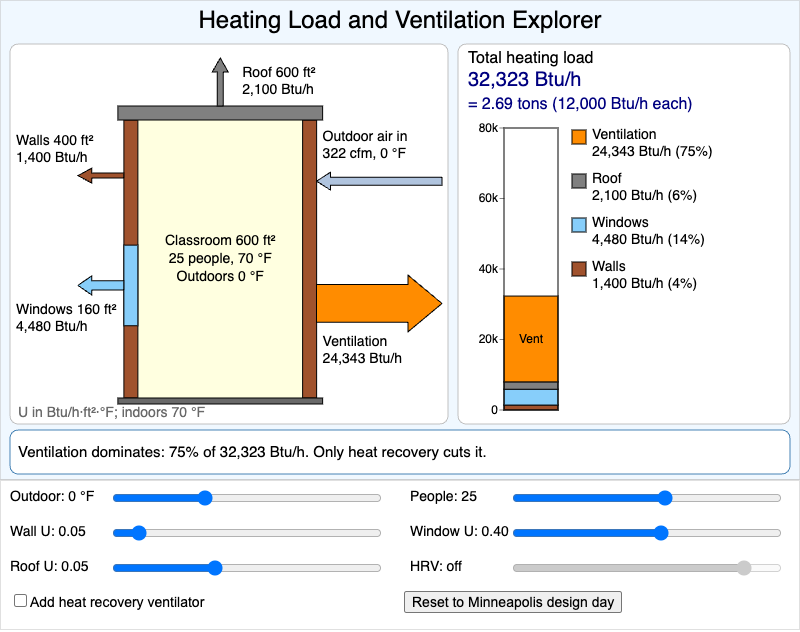

    Students set the outdoor temperature, U-factors, occupancy, and heat recovery for a 600 ft2 Riverbend classroom and watch conduction and ventilation heat loss add up in a stacked bar, in Btu/h and in tons.

-   **[Heating System Energy Comparison](./heating-system-energy-comparison/index.md)**

    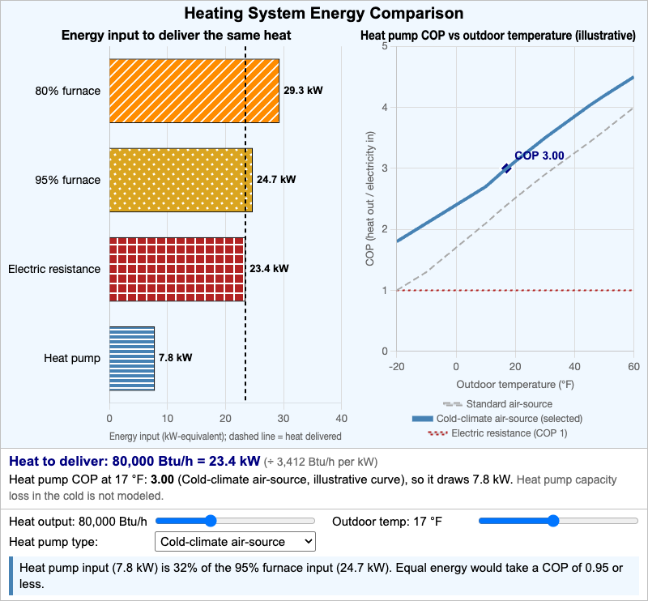

    Students compare the energy input an 80 percent furnace, a 95 percent furnace, electric resistance, and a heat pump need to deliver the same heat, and watch the heat pump COP change along an illustrative curve as the outdoor temperature changes.

-   **[HRV Effectiveness and Frost Explorer](./hrv-effectiveness-frost-explorer/index.md)**

    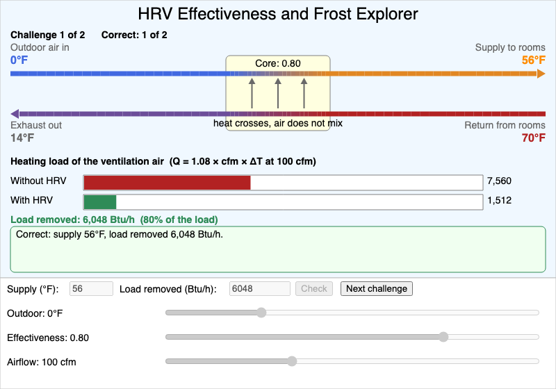

    Students calculate the supply-air temperature and the ventilation heating load removed by a balanced heat recovery ventilator from its effectiveness, airflow, and the outdoor temperature, then find the outdoor temperatures at which the core would frost.

-   **[IBC Question Router](./ibc-question-router/index.md)**

    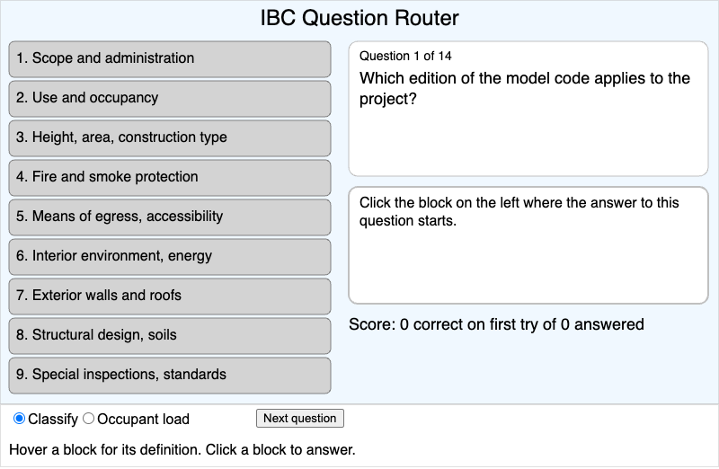

    Students route a Riverbend design question to the group of International Building Code provisions where its answer starts, then switch to an occupant-load mode that follows the chain from room area to occupant load to likely number of exits.

-   **[Ice Dam Formation Explorer](./ice-dam-formation-explorer/index.md)**

    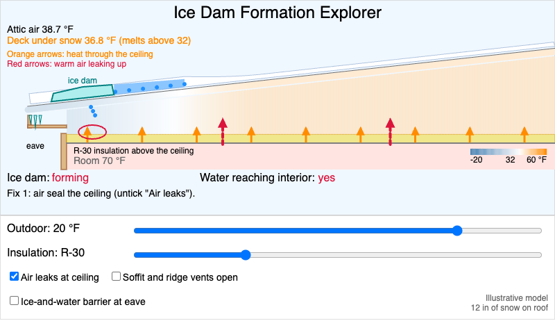

    Students change outdoor temperature, insulation, ceiling air leaks, attic ventilation, and an ice-and-water barrier on a roof section and watch the deck temperature, the snow melt, and the ice at the eave respond. The status line always points to air sealing first.

-   **[Insulation Diminishing Returns Explorer](./insulation-diminishing-returns-explorer/index.md)**

    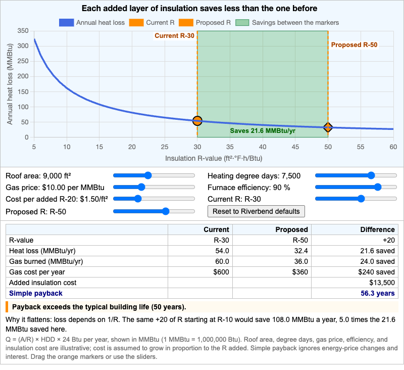

    Students move two markers along a curve of annual roof heat loss against R-value, read the energy saved, gas cost, and simple payback for the added insulation, and see why each added layer saves less than the one before.

-   **[Insulation R-Value and Thickness Comparison](./insulation-r-per-inch-thickness-chart/index.md)**

    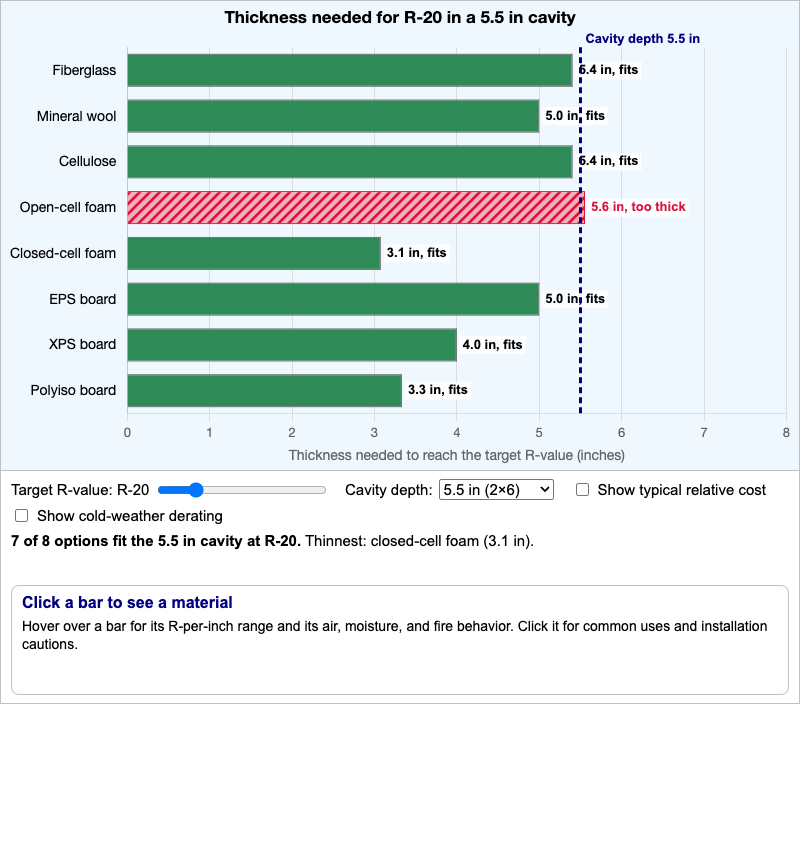

    Students compare eight insulation materials by the thickness each needs to reach a target R-value, test them against a stud-cavity depth, and weigh cost and cold-weather performance to justify a choice.

-   **[Life-Cycle Stage and Boundary Explorer](./lca-stage-boundary-explorer/index.md)**

    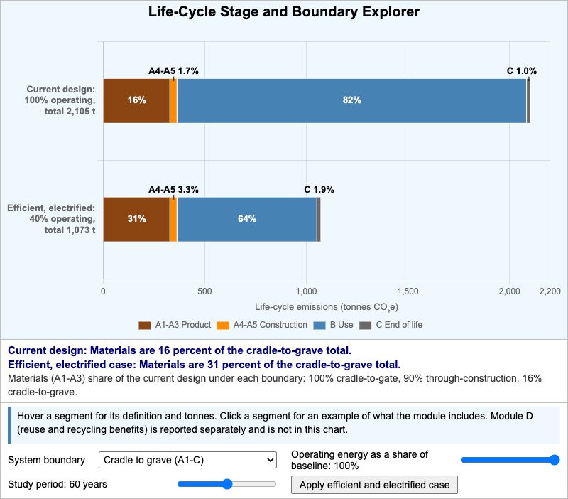

    Explore the Riverbend 60-year life-cycle ledger by module (A1-A3 product, A4-A5 construction, B use, C end of life) and see how the system boundary, the operating energy, and the study period change the share of emissions that comes from materials.

-   **[Lighting Lumen Method Calculator](./lighting-lumen-method-calculator/index.md)**

    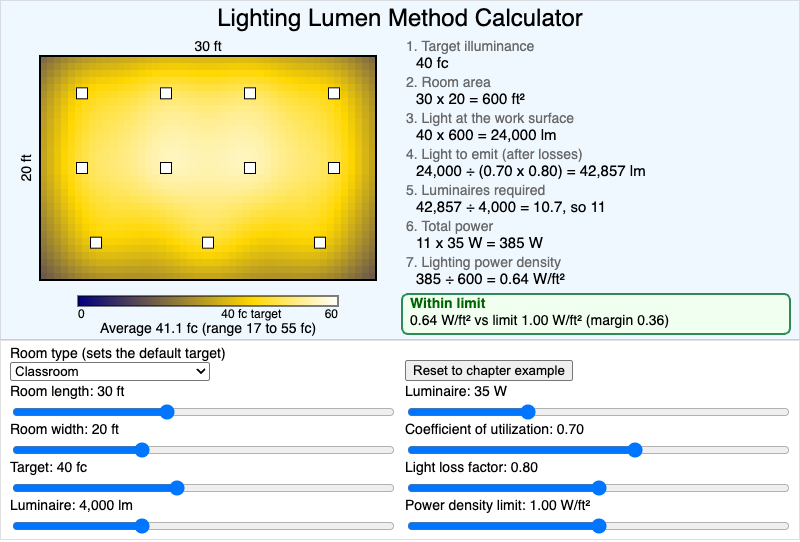

    Students apply the lumen method to a room: they set the room size, target footcandles, luminaire output and wattage, coefficient of utilization, and light loss factor, and watch the number of luminaires, the layout, an illuminance overlay, and the lighting power density update. A message compares the density to an adjustable energy-code limit.

-   **[Masonry Wall Assembly Explorer](./masonry-wall-assembly-explorer/index.md)**

    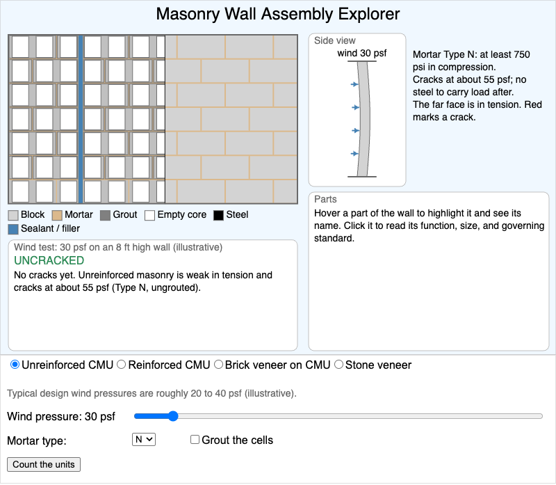

    Students explore an elevation and cutaway of a concrete block wall, with brick and stone veneer options, to name its parts, then raise a wind pressure to compare how an unreinforced and a reinforced wall crack. A counter turns a chosen wall size into the number of blocks or bricks.

-   **[Moisture Pathways in a Wall](./moisture-transport-pathways-explorer/index.md)**

    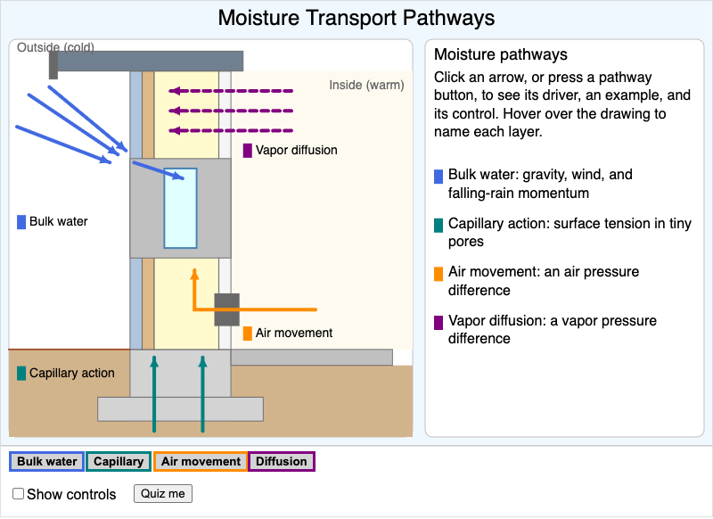

    Students explore a section drawing of a Minnesota wall on a concrete foundation and classify each way moisture reaches it as bulk water, capillary action, air movement, or vapor diffusion. Each pathway has a driver, an example, and a matching control, and a quiz mode tests the match.

-   **[Net-Zero PV Balance Explorer](./net-zero-pv-balance-explorer/index.md)**

    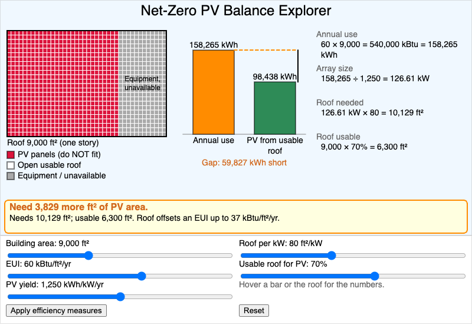

    Set the building area, energy use intensity, PV yield, and roof assumptions to see how large a photovoltaic array must be to offset a building's annual energy use and whether it fits on the roof. Applying efficiency measures shows why cutting the load first decides whether net zero is possible.

-   **[One-Line Diagram Symbol Explorer](./one-line-diagram-symbol-explorer/index.md)**

    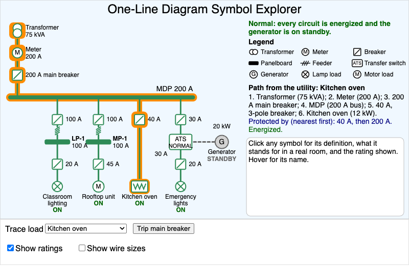

    Students read the one-line diagram of the Riverbend Youth Center, identify each symbol and its rating, trace the path from the utility transformer to a chosen load, and trip the main breaker to see what goes dark and which emergency lights stay on through the automatic transfer switch.

-   **[Permit-to-Occupancy Flow](./permit-to-occupancy-flow/index.md)**

    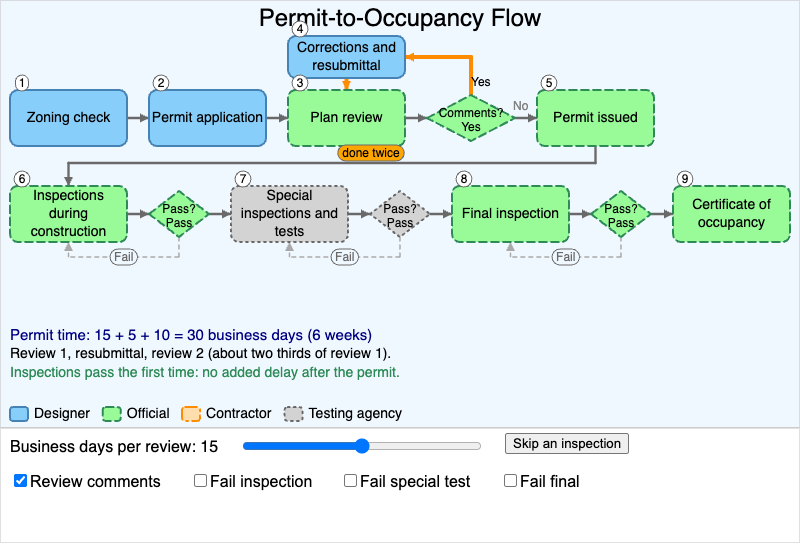

    Students follow a project from zoning check through permit, plan review, inspections, and final inspection to the certificate of occupancy, force failures at each decision to see the return loops, and watch the permit-time total change with review days.

-   **[Platform Framing Assembly Explorer](./platform-framing-assembly-explorer/index.md)**

    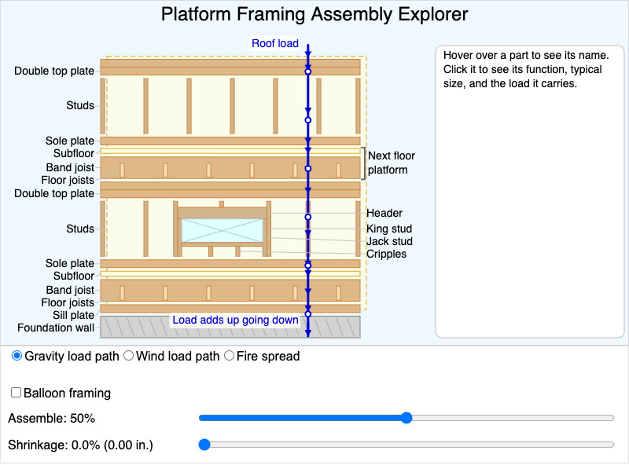

    Students explore an exploded elevation of a two-story platform-framed wall, name each component, and read its function, typical size, and load. Overlays follow the gravity load path, the wind load path, and fire spread, and a balloon-framing toggle and a shrinkage slider show why the platform stops fire but stacks shrinkage.

-   **[Plumbing Supply and DWV Explorer](./plumbing-supply-dwv-explorer/index.md)**

    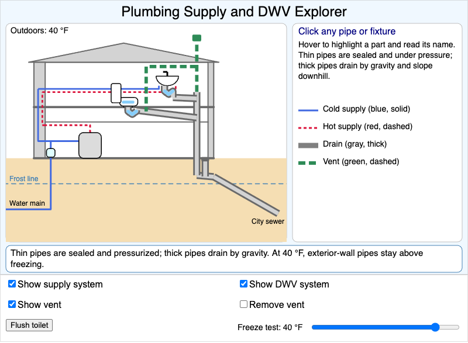

    Students explore a cross-section of a two-story building to tell thin, sealed, pressurized supply pipes from thick, sloped, gravity-driven drain-waste-vent pipes, then flush a toilet, remove the vent, and run a freeze test.

-   **[Project Phases and the Cost of Change](./project-phases-cost-of-change/index.md)**

    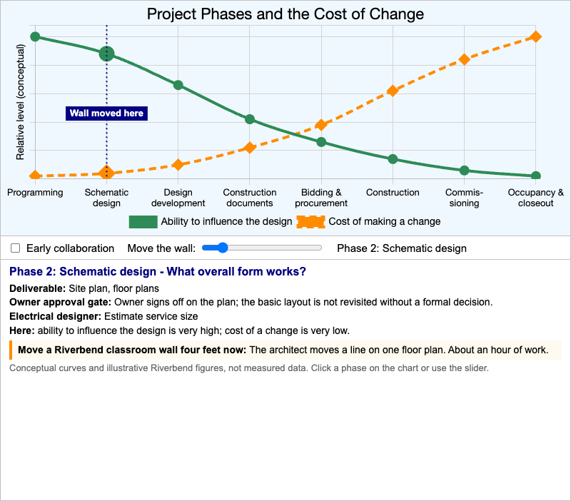

    A conceptual line chart of the eight project phases shows the ability to influence the design falling while the cost of making a change rises. Students click a phase for its deliverable, approval gate, and electrical designer contribution, and slide a Riverbend wall change through the phases.

-   **[Project Team Contracts and Communication Map](./project-team-communication-map/index.md)**

    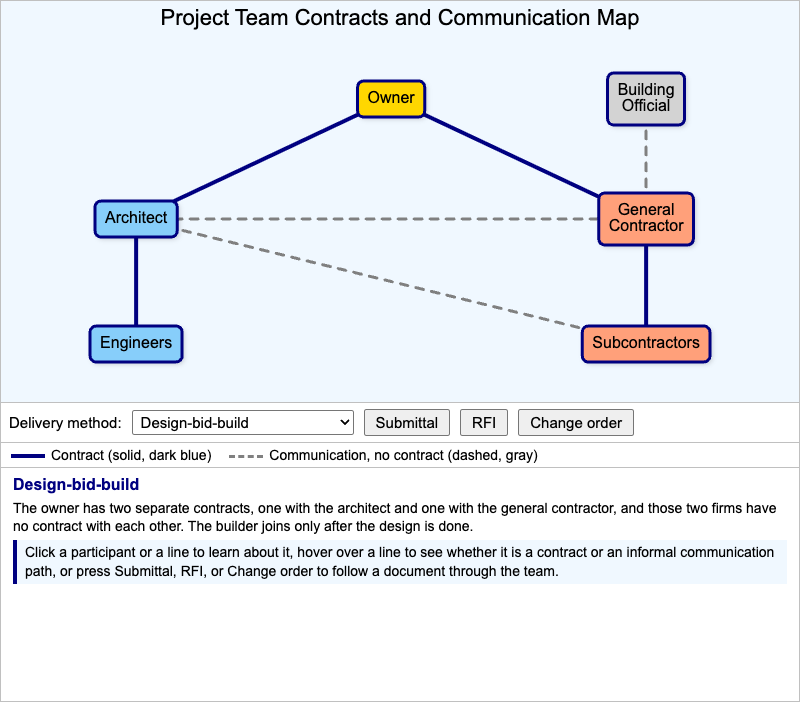

    A network diagram of the project team shows who has a contract with whom (solid lines) and who communicates without a contract (dashed lines) for three delivery methods. Students follow a submittal, an RFI, or a change order as an animated token and read the numbered steps.

-   **[Psychrometric Chart Explorer](./psychrometric-chart-explorer/index.md)**

    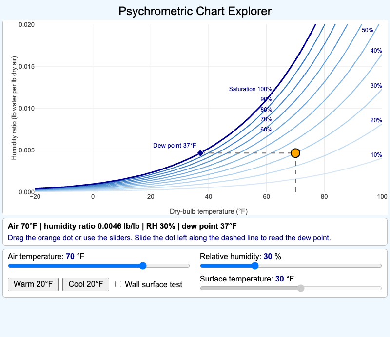

    Students move a state point on a simplified psychrometric chart to read the temperature, humidity ratio, relative humidity, and dew point of air, then warm or cool the air to see RH change while the dew point stays fixed. A wall surface test shows whether a surface is cold enough for condensation.

-   **[Reinforced Concrete Beam Behavior Explorer](./reinforced-concrete-beam-behavior-explorer/index.md)**

    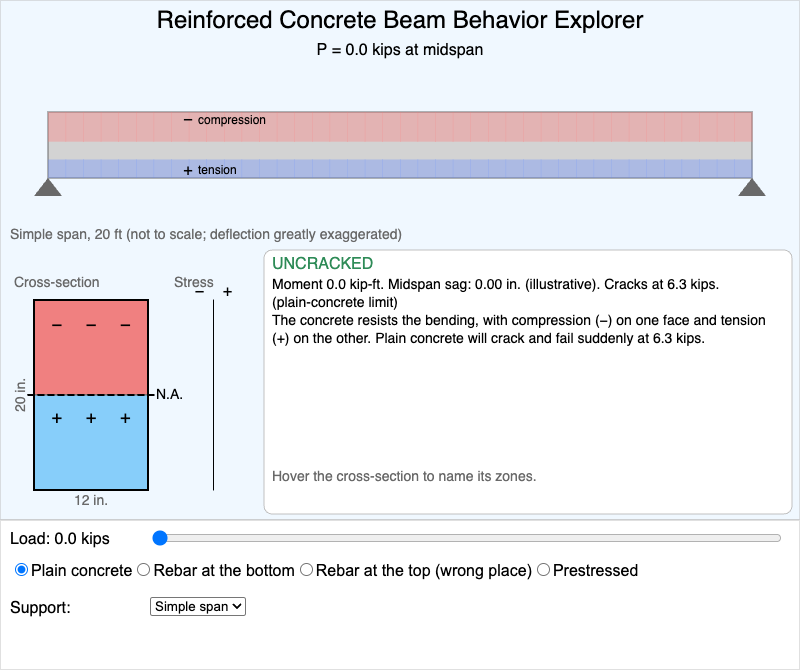

    Students load a 12 in. by 20 in. concrete beam from zero to failure and watch where cracks form, how the compression zone, tension zone, and steel share the bending, and why plain, wrongly reinforced, reinforced, and prestressed beams behave so differently. A switch to a cantilever moves the tension face to the top.

-   **[Riverbend Load Path Tracer](./riverbend-load-path-tracer/index.md)**

    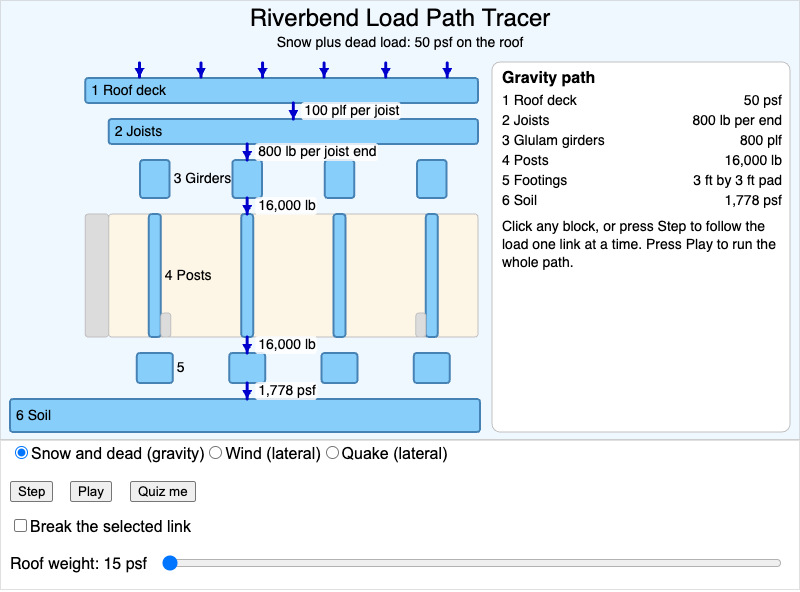

    Students trace the snow-and-dead (gravity), wind, and quake load paths of the Riverbend multipurpose room link by link from the roof to the soil, read the force each link carries, and break one link to see which requirement (strength, stiffness, or stability) is lost.

-   **[Riverbend Structural System Explorer](./riverbend-structural-system-explorer/index.md)**

    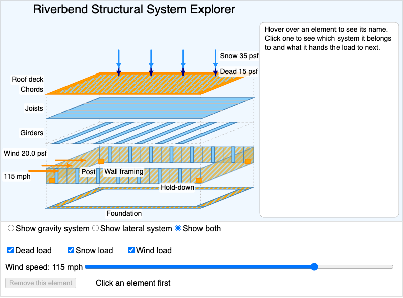

    Students explore an exploded view of the idealized Riverbend building (120 ft by 75 ft) and classify each element as part of the gravity system, the lateral system, or both. Load arrows scale with dead, snow, and wind pressure, and removing an element shows which requirement (strength, stiffness, or stability) is put at risk.

-   **[Roof Assembly Layer Explorer](./roof-assembly-layer-explorer/index.md)**

    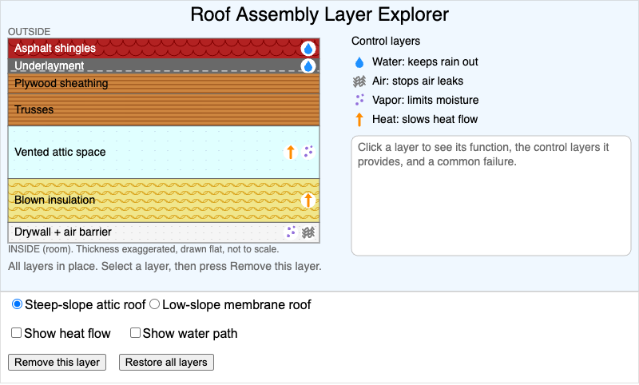

    Students identify each layer of a steep-slope attic roof and a low-slope membrane roof, see which of the four control layers (water, air, vapor, heat) each one provides, and remove a layer to see what it protects against.

-   **[Roof Drainage and Ponding Calculator](./roof-drainage-ponding-calculator/index.md)**

    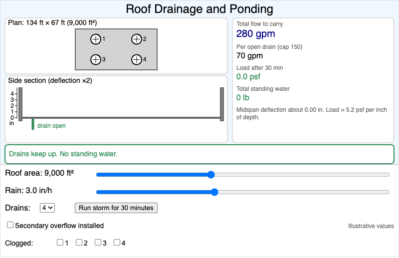

    Students calculate the flow a roof's drains must carry from roof area and rainfall intensity, then clog drains and run a 30-minute storm to see standing water build up, add load, and deflect the roof. A secondary overflow scupper stops the rise.

-   **[Rooftop PV Monthly Production Explorer](./pv-monthly-production-explorer/index.md)**

    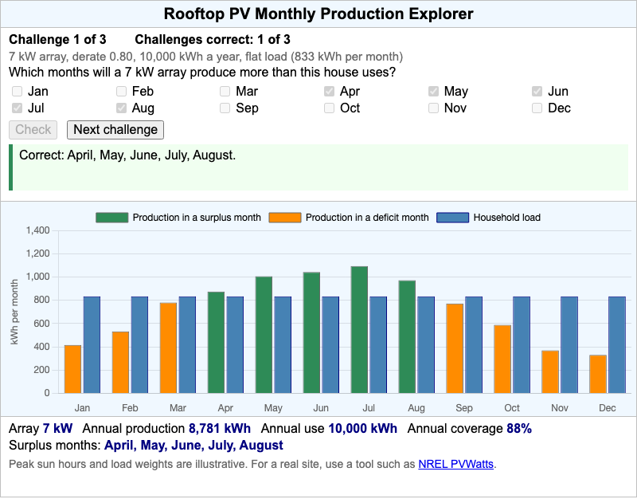

    Students predict which months a 7 kW rooftop array makes more electricity than a house uses, see monthly production beside monthly load, find the smallest array that covers the annual load, and then explore array size, derate, annual use, and a winter-heavy load.

-   **[Scales of the Built Environment](./built-environment-scales/index.md)**

    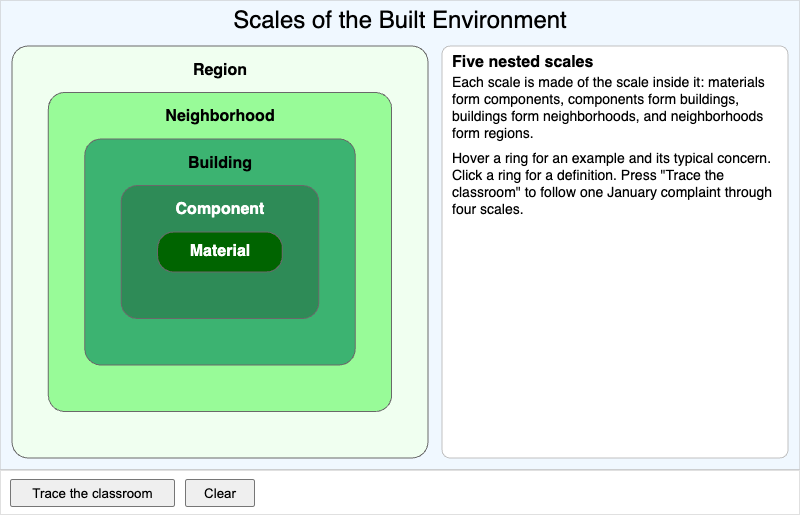

    Five nested rounded rectangles show the scales of the built environment from material to region. Students hover for examples, click for definitions and failure consequences, and step through the January classroom example to see one complaint traced across four scales.

-   **[Sealant Joint Movement Calculator](./sealant-joint-movement-calculator/index.md)**

    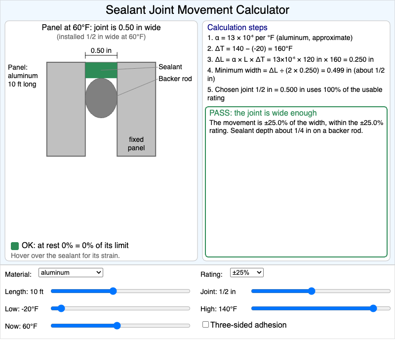

    Students calculate the thermal movement of a panel from its material, length, and temperature range, find the minimum sealant joint width for a sealant rating, and watch a to-scale joint open, close, and tear as the temperature changes.

-   **[Sensor-to-Action Map](./sensor-to-action-map/index.md)**

    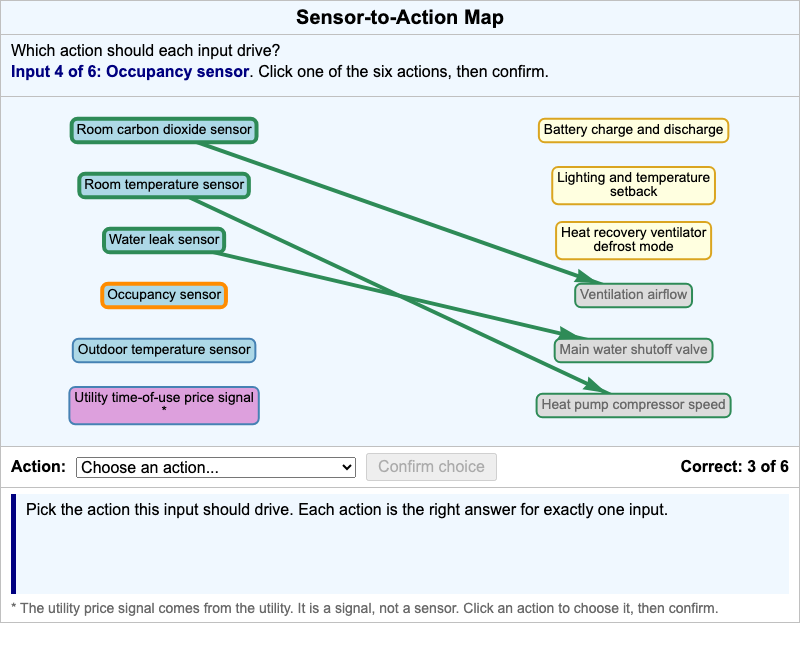

    Students match six building inputs, five sensors and one utility price signal, to the control action each should drive, see each link marked correct or incorrect with the reason, and then open any node to read what it measures and what its action does.

-   **[Service Headroom for Solar and EV Loads](./service-headroom-ev-pv-explorer/index.md)**

    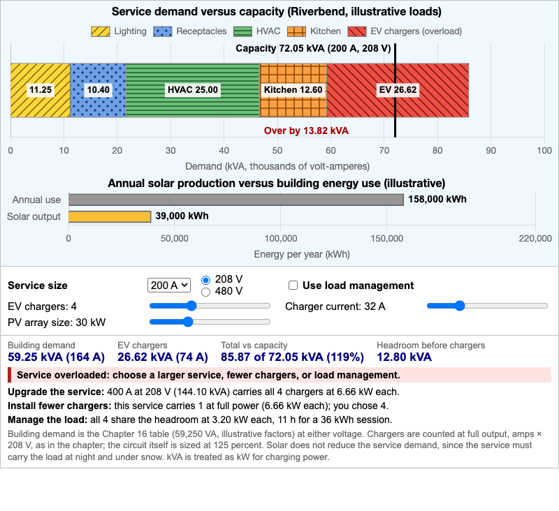

    Students load the Riverbend demand onto a 100 to 600 A service, add Level 2 EV chargers and a rooftop array, and compare three ways to fix an overloaded service: a larger service, fewer chargers, or load management.

-   **[Service Life Factor Calculator](./service-life-factor-calculator/index.md)**

    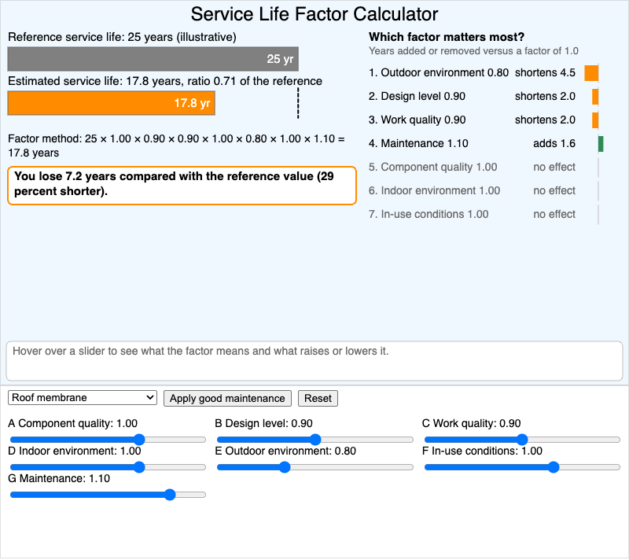

    Estimate the service life of a building component with the ISO 15686 factor method by multiplying a reference service life by seven factors. A ranked list shows which factor shortens or lengthens the estimate the most, so students can see which decisions move the number.

-   **[Site Analysis Layer Explorer](./site-analysis-layer-explorer/index.md)**

    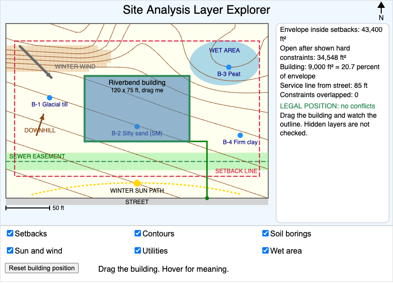

    Students switch six layers of site information on and off over the imagined 300 ft by 200 ft Riverbend lot and drag the 120 ft by 75 ft building to see which setbacks, easements, wet areas, and slopes it overlaps.

-   **[Steel Shape Comparison Explorer](./steel-shape-comparison-explorer/index.md)**

    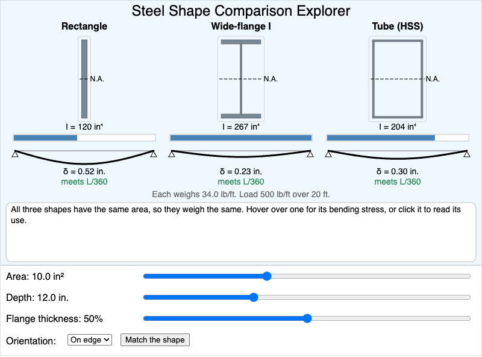

    Students compare a solid rectangle, a wide-flange I, and a hollow tube of equal area under the same beam load, reading the moment of inertia, weight, and deflection of each. Hovering shows the bending stress, and a quiz asks them to match each shape to a use.

-   **[Stress, Force, and Area Explorer](./stress-area-load-explorer/index.md)**

    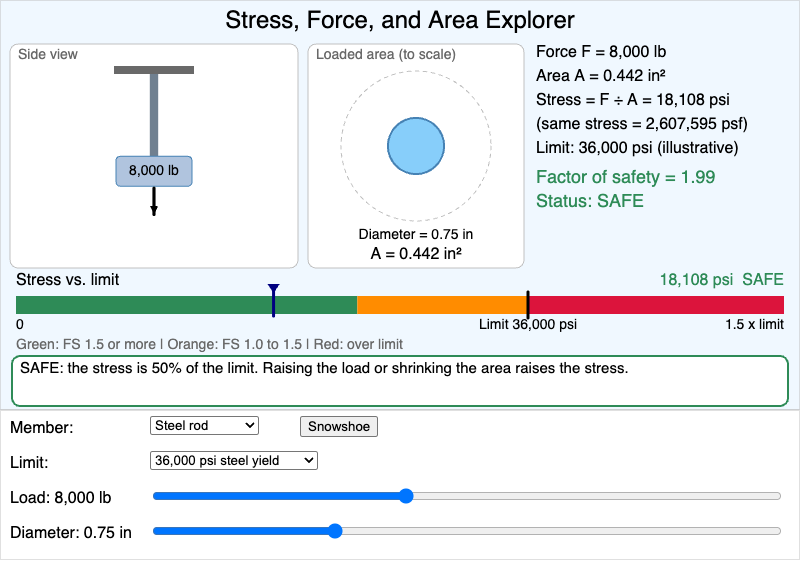

    Students choose a steel rod, a wood post, or a footing on soil, set the load and the size, and watch the stress (force divided by area), the factor of safety, and a gauge that compares the stress with an illustrative limit. A Snowshoe button shows the same load producing less stress as the area grows.

-   **[Stress-Strain Curve Explorer](./stress-strain-curve-explorer/index.md)**

    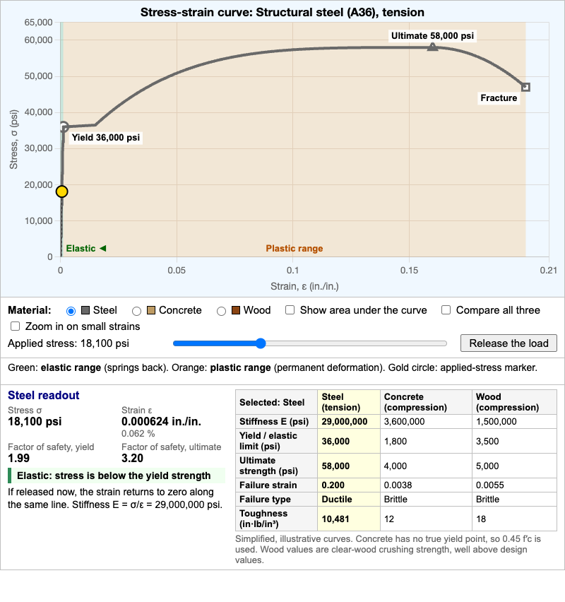

    Students read simplified stress-strain curves for steel in tension and for concrete and softwood in compression, moving a stress marker along each curve to see strain, factor of safety, and whether the behavior is elastic or plastic. Releasing the marker shows the strain returning to zero or a permanent offset, and a toughness shading and compare mode contrast ductile and brittle behavior.

-   **[Sustainability Trade-Off Explorer](./sustainability-trade-off-explorer/index.md)**

    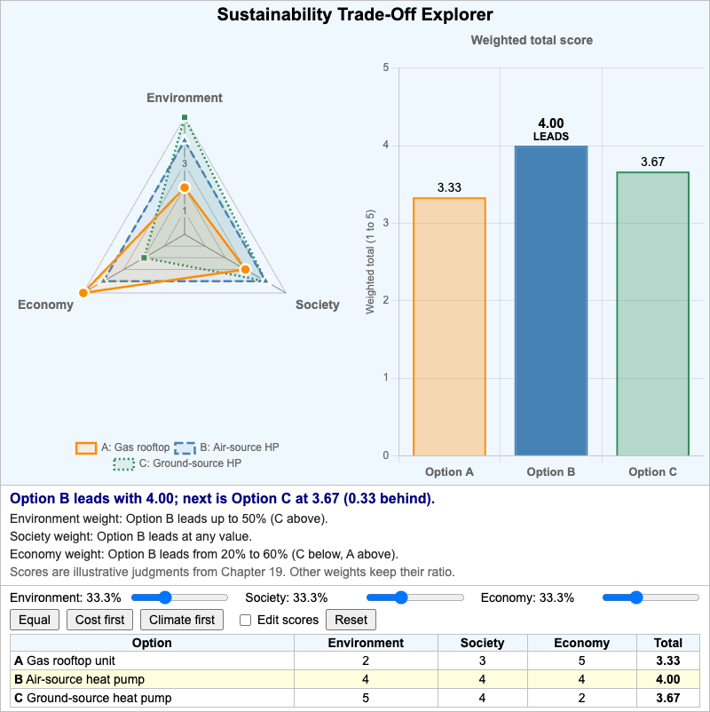

    Weigh three Riverbend heating options against environment, society, and economy criteria on a radar chart and a weighted-total bar chart. Moving the owner's priorities shows how the same scores can produce three different winners.

-   **[Tributary Area and Load Takedown Calculator](./tributary-area-roof-takedown-calculator/index.md)**

    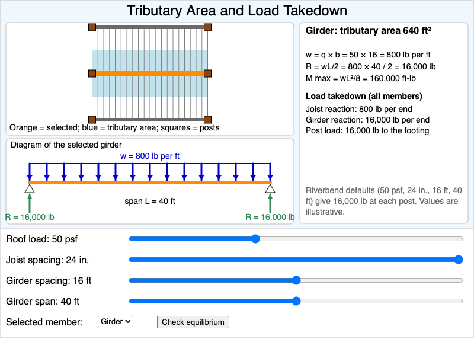

    Students set the roof load, joist spacing, girder spacing, and girder span, and watch the shaded tributary area, line load, reaction, and maximum moment of a joist, girder, or post update in the Riverbend roof plan. An equilibrium check confirms that the post reactions equal the load on the bay.

-   **[USCS Soil Classifier](./uscs-soil-classifier/index.md)**

    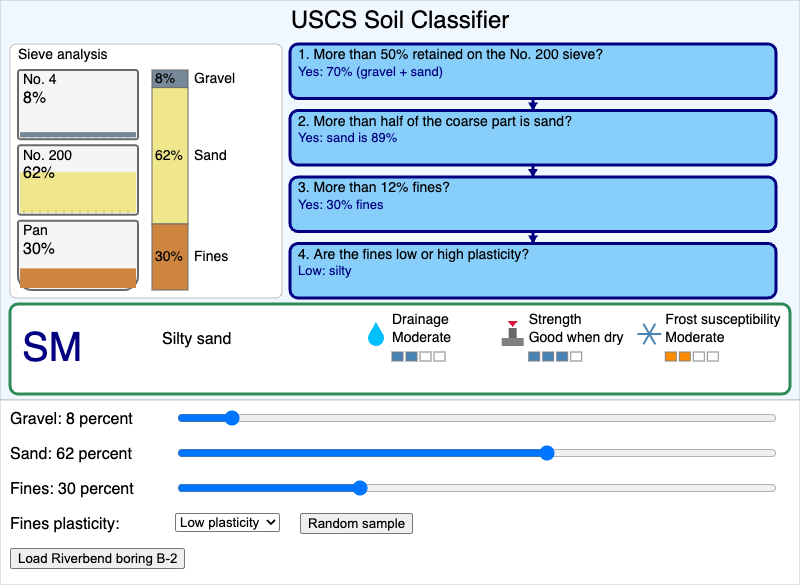

    Students enter the percent gravel, sand, and fines from a sieve analysis, choose the plasticity of the fines, and follow the highlighted decision path to a simplified USCS symbol with drainage, strength, and frost ratings.

-   **[Voltage, Current, and Resistance Explorer](./ohms-law-power-wire-explorer/index.md)**

    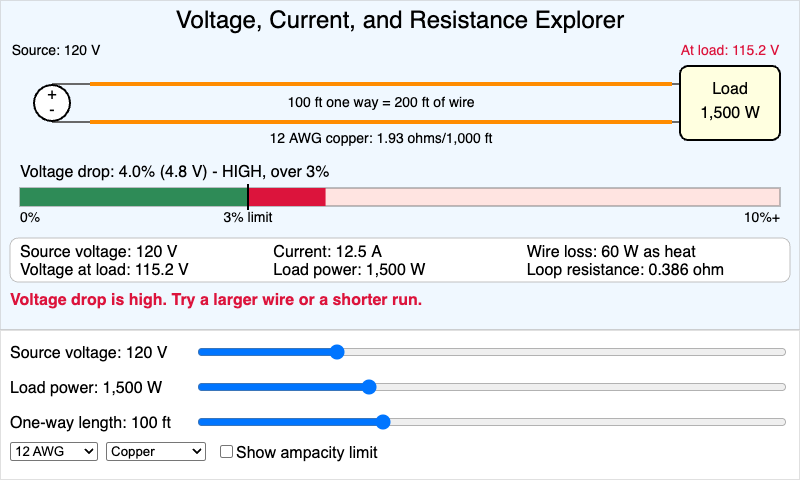

    Students set the source voltage, load power, wire gauge, material, and run length and watch the current, voltage at the load, voltage drop, and heat lost in the wire update. A drop bar with a 3 percent limit and an optional ampacity marker show when a wire is too small or too long.

-   **[Wall Assembly R-Value and Thermal Bridging Calculator](./wall-assembly-r-value-bridging-calculator/index.md)**

    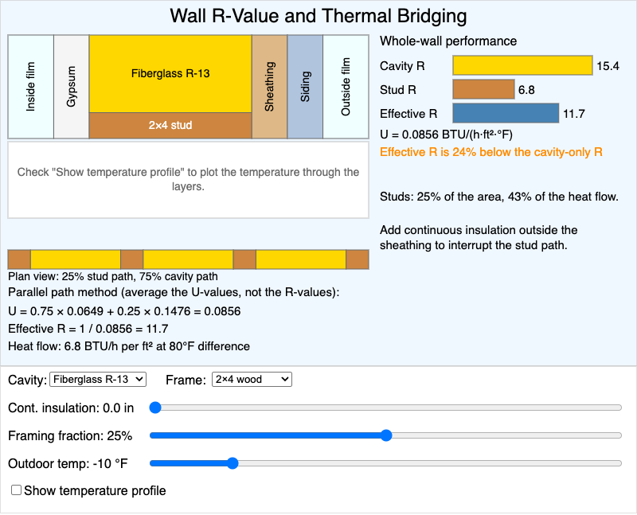

    Students build a framed wall from a cavity insulation, a framing type, and optional continuous XPS, then see the cavity path R, the stud path R, and the effective R from the parallel path method. An optional temperature profile shows where the wall falls below freezing.

-   **[Water-Cement Ratio Explorer](./water-cement-ratio-explorer/index.md)**

    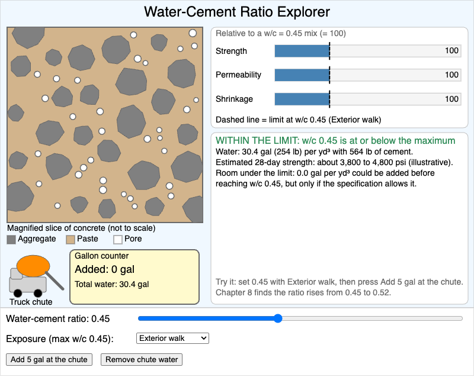

    Students change the water-cement ratio of a six-sack mix and watch pores grow in a magnified slice of concrete while bars show relative strength, permeability, and shrinkage against the limit for an exposure. An Add 5 gal at the chute button shows how a few gallons of extra water push a mix over its specified maximum.

-   **[Window Flashing Sequence Explorer](./window-flashing-sequence-explorer/index.md)**

    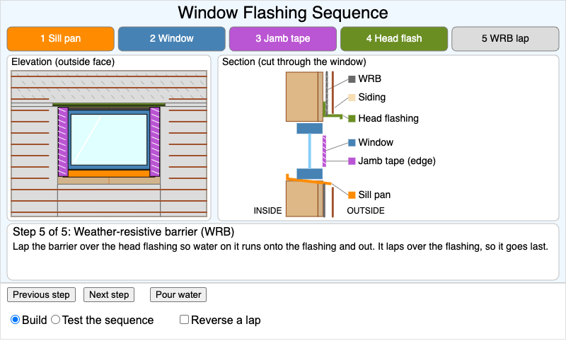

    Students build the five flashing steps around a Riverbend window in order, test their sequencing by dragging the layers into place, and then pour water to see where it goes. A reversed lap sends the water into the opening.

-   **[Window Performance Explorer](./window-glazing-surface-temperature-explorer/index.md)**

    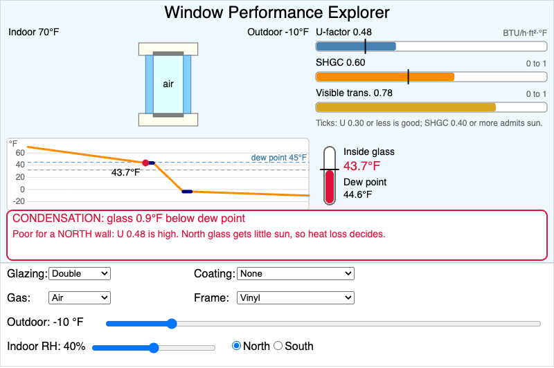

    Students choose glazing, low-E coating, gas fill, and frame for a window and watch the whole-window U-factor, SHGC, visible transmittance, and inside glass temperature respond. A summary line judges whether the window suits a north or a south wall in Minneapolis.

-   **[Wood Moisture and Shrinkage Calculator](./wood-moisture-shrinkage-calculator/index.md)**

    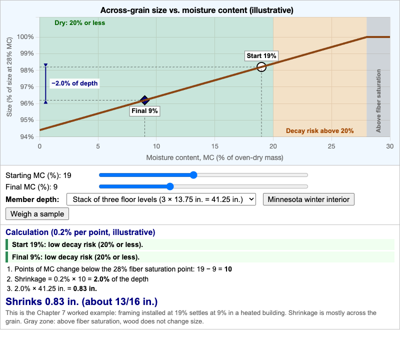

    Students set a starting and a final moisture content on a line chart of across-grain size versus moisture, read the shrinkage in inches for a chosen member depth, and weigh a sample to compute its moisture content step by step. A Minnesota winter preset shows how a heated interior dries framing.

