# The Dome Without a Frame

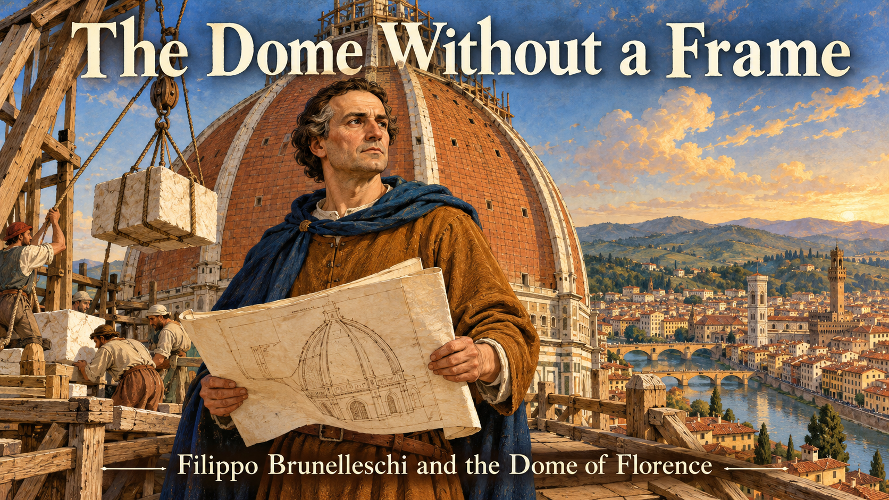

Cover Image Prompt

(This is the Cover Image. Do not include this label in the image.)
Please generate a wide-landscape 16:9 cover image for a graphic novel in an Italian Renaissance fresco and tempera-inspired illustration style with warm lighting, gouache texture, and confident ink linework. In the center, a sturdy man of about fifty named Filippo Brunelleschi, with a broad forehead, short dark-brown hair going gray at the temples, deep-set watchful eyes, an ochre-brown wool tunic, and a deep blue hood draped over one shoulder, stands on a timber work platform high above the city, holding a folded parchment plan in one hand. Behind him the half-built ribbed brick dome of Florence Cathedral curves upward in terracotta-red courses, with no wooden framework beneath it, only open sky inside the curve. Far below, the red-tiled rooftops of Florence, a river with a stone bridge, and distant olive-green Tuscan hills glow in late afternoon light. A rope from a tall wooden crane hangs beside him, carrying a pale stone block. A hand-lettered title reads "The Dome Without a Frame" across the top in a classical Roman-style serif typeface, with a smaller subtitle "Filippo Brunelleschi and the Dome of Florence" along the bottom. Color palette: terracotta, ochre, cream, deep blue, and olive green. Emotional tone: daring, awe-struck, quietly triumphant. Generate the image immediately without asking clarifying questions.

Narrative Prompt

This story follows the goldsmith and engineer Filippo Brunelleschi (1377–1446) from his apprenticeship in Florence to the 1436 consecration of the cathedral he crowned with a dome, and on to the lantern that was begun just before his death. The settings are Florence and, according to tradition, Rome, between about 1392 and 1446. The art style is Italian Renaissance fresco and tempera-inspired illustration with warm lighting, gouache texture, and ink linework, in a palette of terracotta, ochre, cream, deep blue, and olive green. Brunelleschi is drawn as a stylized interpretation rather than a portrait: a sturdy man of middling height with a broad forehead, deep-set watchful eyes, and short dark-brown hair that turns gray across the panels, wearing an ochre-brown wool tunic and a deep blue hood draped over one shoulder, and always carrying a folded parchment or a small wooden model. Lorenzo Ghiberti (1378–1455) is a slender man with a neat dark pointed beard and a terracotta-red gown with a fur-trimmed collar. Two characters, Bruno, a master mason, and Tommaso, his apprentice, are invented composites who stand for the thousands of real masons and laborers who built the dome; they are not historical individuals. Bruno is a broad-shouldered man with a gray-streaked black beard, a cream linen cap, and a leather apron. Tommaso is a lanky boy of about fifteen in 1417 who grows into a master mason by 1446, always with curly light-brown hair and an olive-green tunic. Keep all four looks consistent in every panel, aging Brunelleschi and Tommaso gradually. Creative liberties: the dates, places, structures, and machines are drawn from published sources, but all conversations and most individual scenes are imagined. The Rome visit in Panel 2 is a long-standing tradition that some historians doubt, and the 1423 sickbed episode in Panel 7 is a traditional account whose details cannot be fully verified. The tavern-on-the-dome story is a legend, so Panel 8 shows only the documented practice of bringing food and diluted wine up to the workers. The famous "egg" anecdote is also a legend and is left out. The quotation at the end is a published English translation of a real 1436 dedication. Show no readable text in any panel image except where a prompt explicitly asks for it.

### Prologue – A Hole in the Sky

For more than a hundred years, Florence's great cathedral stood with a gap where its roof should have been: an octagonal opening about 44 meters wide, starting some 52 meters above the floor, open to the weather. Everyone agreed it had to be closed with a dome. No one agreed how, because the usual method needed a forest of timber that Tuscany did not have. The man who solved the problem was not a trained architect at all. He was a goldsmith who understood weight, force, and machines, and this is the story of how he built a dome without a frame.

## Panel 1: A Goldsmith's Hands

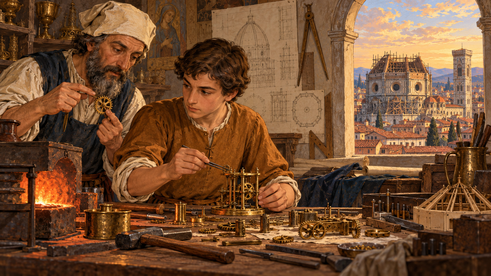

Image Prompt

(This is Panel 01. Do not include the panel number in the image.)
I am about to ask you to generate a series of images for a graphic novel. Please make the images have a consistent style and consistent characters. Do not ask any clarifying questions. Just generate the image immediately when asked.

Please generate a 16:9 image in an Italian Renaissance fresco and tempera-inspired illustration style with warm lighting, gouache texture, and ink linework, depicting panel 1 of 10. The scene shows Filippo Brunelleschi as a fifteen-year-old apprentice, with a broad forehead, deep-set watchful eyes, and short dark-brown hair, wearing a simple ochre-brown wool tunic, bent over a wooden workbench in a goldsmith's workshop in Florence in about 1392. On the bench are tiny brass gears, a half-assembled clockwork mechanism, small hammers, fine tongs, and a small furnace glowing orange. An older bearded master goldsmith in a cream linen cap leans over his shoulder, pointing at a gear. Through an arched window behind them, the unfinished cathedral with its open, roofless octagon can be seen against a golden sky, along with red-tiled rooftops. Strips of drawn plans and a wooden compass hang on the wall. Color palette: terracotta, ochre, cream, deep blue, and olive green. The emotional tone should be quiet, focused curiosity. Generate the image immediately without asking clarifying questions.

Filippo Brunelleschi was born in Florence in 1377, and at about fifteen he was apprenticed as a goldsmith and sculptor. The trade taught him to cast bronze, to work to the thickness of a fingernail, and to think about how small parts fit together into a moving whole. In 1398 he qualified as a master and joined the guild of silk merchants, which also enrolled goldsmiths. He also designed elaborate clockworks and hydraulic machines, none of which survive. Notice what the workshop gave him: not a degree in architecture, but a feel for gears, levers, and mechanical advantage that he would later use on a scale no goldsmith had ever tried.

## Panel 2: The Ruins of Rome

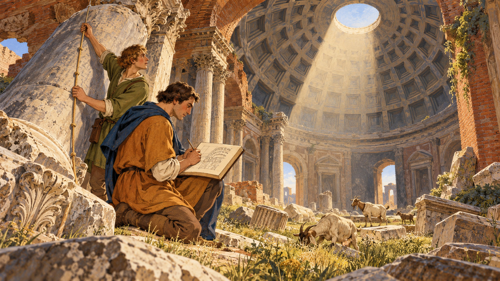

Image Prompt

(This is Panel 02. Do not include the panel number in the image.)
Please generate a 16:9 image in an Italian Renaissance fresco and tempera-inspired illustration style with warm lighting, gouache texture, and ink linework, depicting panel 2 of 10. Make the characters and style consistent with the prior panel. The scene shows Filippo Brunelleschi as a man of about twenty-six, with a broad forehead, deep-set watchful eyes, short dark-brown hair, an ochre-brown wool tunic, and a deep blue hood draped over one shoulder, kneeling in the ruins of Rome in about 1403, sketching a broken stone arch in a notebook. Beside him stands a young companion with short curly hair and an olive-green tunic, representing the sculptor Donatello, holding a knotted measuring cord against a toppled column. Behind them rises the huge coffered concrete dome of an ancient Roman temple with a great round opening at its top, casting a column of light onto the floor. Goats graze among fallen marble blocks and tall grass, and a few brick vaults arch overhead. Color palette: ochre, cream, terracotta, olive green, and deep blue shadows. The emotional tone should be wonder and hunger to understand how it was built. Generate the image immediately without asking clarifying questions.

Tradition says that around 1402 to 1404 the young goldsmith traveled to Rome with his friend, the sculptor Donatello, and spent months measuring and sketching ancient ruins. Historians doubt how extensive that first trip was, since his first firmly documented stay in Rome dates to 1432, but the habit of studying old buildings is clearly in his later work. The Pantheon especially mattered: its dome is nearly as wide as the one Florence needed, and it showed that a huge dome could stand. Its concrete recipe, though, had been forgotten, and Brunelleschi would have to find another way to build with the materials Florence had: brick, stone, mortar, and timber.

## Panel 3: A Hole Too Big to Fill

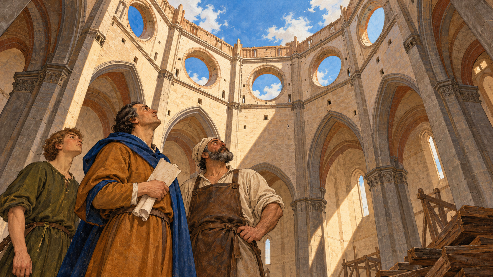

Image Prompt

(This is Panel 03. Do not include the panel number in the image.)
Please generate a 16:9 image in an Italian Renaissance fresco and tempera-inspired illustration style with warm lighting, gouache texture, and ink linework, depicting panel 3 of 10. Make the characters and style consistent with the prior panel. The scene shows the interior of the unfinished Florence Cathedral in about 1417, looking up from the stone floor at the tall octagonal drum, which is open to a bright blue sky with drifting white clouds, with eight great circular windows set high in its walls. Brunelleschi, now about forty, with short dark-brown hair, a deep blue hood, and an ochre-brown tunic, stands with a folded parchment in his hand and his head tilted back. Beside him stand Bruno, a broad-shouldered master mason with a gray-streaked black beard, cream linen cap, and leather apron, and Tommaso, a lanky boy of about fifteen with curly light-brown hair and an olive-green tunic, both gazing upward. In a corner lie a few stacked timber beams that look tiny compared with the enormous gap. A shaft of sunlight falls diagonally across the nave. Color palette: cream stone, terracotta, ochre, deep blue sky, and olive green. The emotional tone should be awe mixed with doubt. Generate the image immediately without asking clarifying questions.

The cathedral's plan had called for a dome since 1296, and in 1367 Florence chose the model by Neri di Fioravanti: a giant octagonal dome with no Gothic flying buttresses, the sloping outside props that other cathedrals used to push back against a roof's outward thrust. That left a puzzle. A masonry dome is built from courses of stone or brick, and while the mortar is wet, each unfinished ring can slump inward or outward unless something holds it. The usual solution is centering, a temporary wooden form shaped like the dome. For a span of 44 meters, starting 52 meters in the air, there was not enough timber in Tuscany to build one, and such a structure would have blocked the cathedral for years.

## Panel 4: The Contest

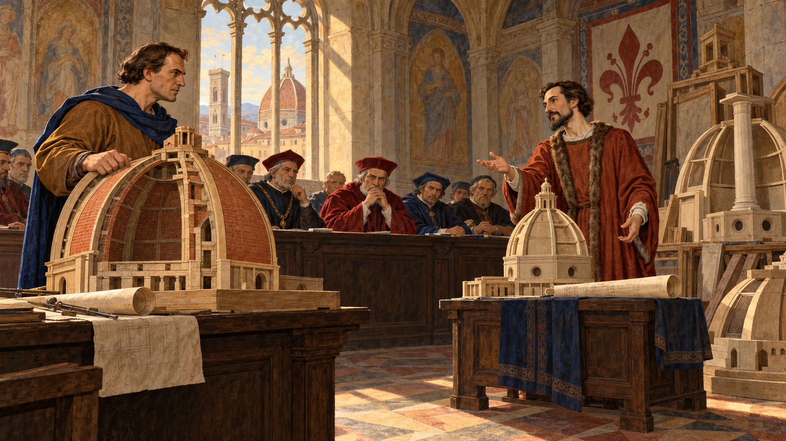

Image Prompt

(This is Panel 04. Do not include the panel number in the image.)
Please generate a 16:9 image in an Italian Renaissance fresco and tempera-inspired illustration style with warm lighting, gouache texture, and ink linework, depicting panel 4 of 10. Make the characters and style consistent with the prior panel. The scene shows a stone-vaulted council chamber in Florence in 1418, with a long dark wooden table at which a row of stern overseers in deep red and deep blue robes sit with folded hands. In front of them, Brunelleschi, about forty-one, with short dark-brown hair, an ochre-brown tunic, and a deep blue hood, stands beside a large wooden-and-brick scale model of a double-shelled dome, one hand resting on it, his jaw set. Facing him across the room stands Lorenzo Ghiberti, a slender man with a neat dark pointed beard and a terracotta-red gown with a fur-trimmed collar, gesturing gracefully toward his own smaller model and a rolled drawing. Other rejected models, including one with a tall central pillar, are stacked in the corner. Late afternoon light falls through a tall arched window onto the table. Color palette: terracotta, deep blue, ochre, cream, and olive green. The emotional tone should be tense rivalry and high stakes. Generate the image immediately without asking clarifying questions.

On 19 August 1418, the wool guild that ran the cathedral works announced a competition to design the dome. The two best-known contenders were both goldsmiths: Brunelleschi and his old rival Lorenzo Ghiberti, who had won the commission for the Baptistery's bronze doors in 1401 after a famously close contest. Brunelleschi promised to build two nested domes without elaborate scaffolding and guarded the details of his method. He won, helped by a wooden-and-brick model he built with Donatello and Nanni di Banco, but the overseers appointed Ghiberti as his co-supervisor at an equal salary of 36 florins a year. Construction began in 1420, and the two men would be tied together for years.

## Panel 5: Two Shells and Five Hoops

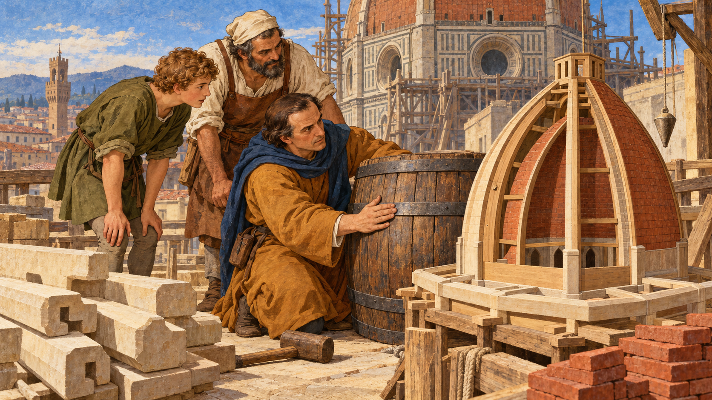

Image Prompt

(This is Panel 05. Do not include the panel number in the image.)
Please generate a 16:9 image in an Italian Renaissance fresco and tempera-inspired illustration style with warm lighting, gouache texture, and ink linework, depicting panel 5 of 10. Make the characters and style consistent with the prior panel. The scene shows an open-air workshop yard beside the cathedral in about 1420, with Brunelleschi, about forty-three, with short dark-brown hair, an ochre-brown tunic, and a deep blue hood, kneeling next to a large wooden barrel bound with iron hoops. He presses a hand against one hoop while Tommaso, now a lanky youth of about eighteen with curly light-brown hair and an olive-green tunic, and Bruno, a broad-shouldered master mason with a gray-streaked black beard, cream linen cap, and leather apron, lean in to watch. Beside the barrel stands a cutaway wooden model of an eight-sided dome with an inner shell, an outer shell, a narrow gap between them, eight stout ribs at the corners, and a ring of pale stone beams laid like an octagonal rail track around its base. Stacks of sandstone beams, a pile of red bricks, a wooden mallet, and a plumb line hang nearby. Warm morning sun, with the cathedral's drum rising in the background. Color palette: terracotta, ochre, cream, deep blue, and olive green. The emotional tone should be eager teaching and shared discovery. Generate the image immediately without asking clarifying questions.

Brunelleschi's plan rested on a simple idea about forces. Masonry is strong when it is squeezed, called compression, and weak when it is pulled apart, called tension. A dome's weight does not only press down: it also pushes the base outward, like a barrel trying to burst, and that outward push puts a ring of tension around the base called hoop stress. Gothic builders answered it with buttresses; Brunelleschi answered it from the inside, with a lighter double shell of brick and horizontal chains that worked like barrel hoops: four of stone and iron plus a fifth of wood, set at different heights. Because the dome is an octagon, not a circle, the stone chains had to be built as stiff octagons of sandstone beams joined with iron, and vertical ribs at the corners carried the weight down to the drum.

## Panel 6: The Machine That Never Turned Around

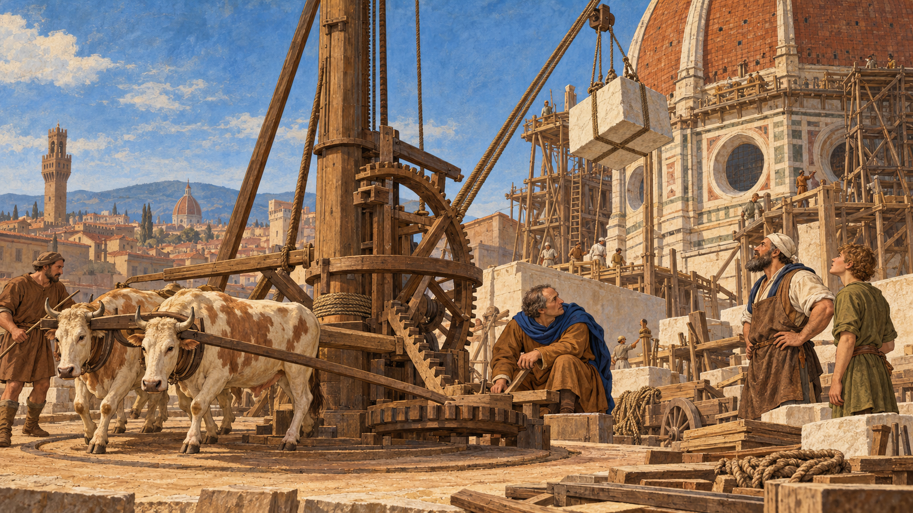

Image Prompt

(This is Panel 06. Do not include the panel number in the image.)
Please generate a 16:9 image in an Italian Renaissance fresco and tempera-inspired illustration style with warm lighting, gouache texture, and ink linework, depicting panel 6 of 10. Make the characters and style consistent with the prior panel. The scene shows a work yard at the base of the rising dome in about 1423, dominated by a tall wooden hoisting machine with a large central upright shaft, big wooden gears, and a long rope that runs up toward a pulley high on the dome. A single yoke of two cream-and-brown oxen walks in a slow circle turning a wooden arm, led by a stable hand in a plain brown tunic. Brunelleschi, about forty-six, with short dark-brown hair going gray at the temples, an ochre-brown tunic, and a deep blue hood, crouches beside the gears, one hand on a lever, studying them closely. Bruno, a broad-shouldered master mason with a gray-streaked black beard, cream linen cap, and leather apron, and Tommaso, a lanky young man of about twenty-one with curly light-brown hair and an olive-green tunic, watch a large pale stone block swing up on the rope. Wooden planks, coils of rope, and carts line the yard. Color palette: terracotta, ochre, cream, deep blue, and olive green. The emotional tone should be mechanical wonder and energetic purpose. Generate the image immediately without asking clarifying questions.

A dome of more than four million bricks needs a way to lift its materials, and Brunelleschi did what a goldsmith does best: he designed a machine. His three-speed hoist, driven by a single yoke of oxen walking in a circle, could raise heavy loads. Oxen cannot walk backward, and unhitching them to lower a load wasted time, so he added a clutch and reverse gear that lowered or raised the load without turning the animals around. For lateral moves at the top, he built a tall crane called the *castello*, with counterweights, to swing stone blocks into place. Later engineers, including Leonardo da Vinci, studied and sketched his machines.

## Panel 7: The Sickbed

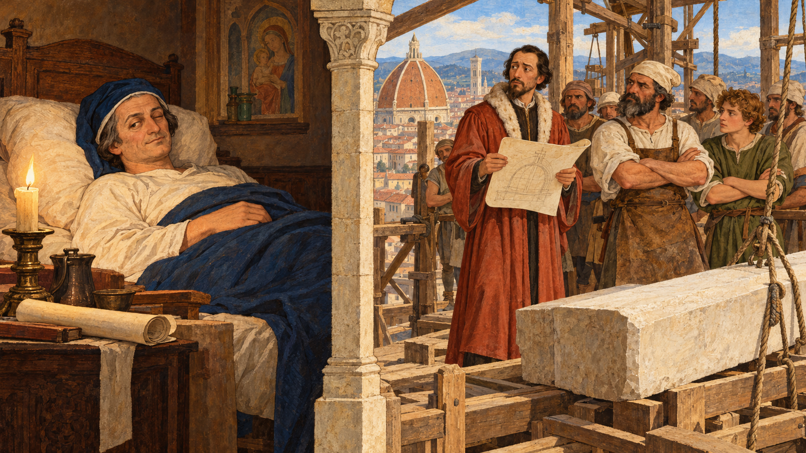

Image Prompt

(This is Panel 07. Do not include the panel number in the image.)
Please generate a 16:9 image in an Italian Renaissance fresco and tempera-inspired illustration style with warm lighting, gouache texture, and ink linework, depicting panel 7 of 10. Make the characters and style consistent with the prior panel. The scene is split in two by a painted column of stone. On the left, in a modest Florentine bedroom, Brunelleschi, about forty-six, with short dark-brown hair going gray at the temples, lies propped on a pillow under a wool blanket in a deep blue nightcap, with one eye partly open and a faint knowing smile, while a candle and a rolled drawing sit on a bedside table. On the right, high on a timber platform of the half-built dome, Lorenzo Ghiberti, a slender man with a neat dark pointed beard and a terracotta-red gown with a fur-trimmed collar, stands uneasily, holding a drawing while Bruno, a broad-shouldered master mason with a gray-streaked black beard, cream linen cap, and leather apron, and several masons wait with arms folded, looking at him expectantly and waiting for instructions. A pale stone beam lies unplaced on the platform. Color palette: terracotta, ochre, cream, deep blue, and olive green. The emotional tone should be wry, tense, and subtly humorous. Generate the image immediately without asking clarifying questions.

The two supervisors did not make an easy team. By tradition, in 1423, just as the masons were ready to install key masonry meant to resist the dome's outward thrust, Brunelleschi took to his bed, ill or pretending to be ill, and left Ghiberti in charge. The workers kept coming back to Brunelleschi for instructions, and Ghiberti could not supply them. The overseers learned who really understood the dome, and Brunelleschi emerged as its recognized inventor and director. Later his salary was raised to 100 florins a year, while Ghiberti's stayed at 36.

## Panel 8: Life Up in the Dome

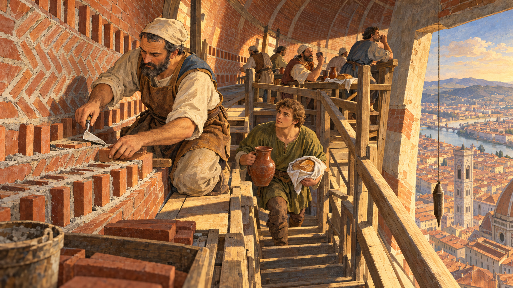

Image Prompt

(This is Panel 08. Do not include the panel number in the image.)
Please generate a 16:9 image in an Italian Renaissance fresco and tempera-inspired illustration style with warm lighting, gouache texture, and ink linework, depicting panel 8 of 10. Make the characters and style consistent with the prior panel. The scene shows the inside of the rising dome in about 1430, between the inner and outer shells: a narrow brick passage with a sloping floor and a curved ceiling of red bricks. Bruno, a broad-shouldered master mason with a gray-streaked black beard, cream linen cap, and leather apron, kneels on a timber platform with a small trowel, setting bricks in a zigzag herringbone pattern, with bricks standing on edge at regular intervals between flat courses. Tommaso, now a young man of about twenty-eight with curly light-brown hair and an olive-green tunic, carries a heavy ceramic jug and a loaf of bread in a cloth up a narrow wooden stair. Other masons eat and drink at the rail of a wooden platform that has a sturdy railing. Through a gap in the wall, the red-tiled rooftops of Florence and the river glow far below, bathed in golden afternoon light. A plumb line hangs from a string beside the wall. Color palette: terracotta, ochre, cream, deep blue, and olive green. The emotional tone should be hardworking, focused, and quietly brave. Generate the image immediately without asking clarifying questions.

As the dome climbed, each ring of brick tilted further inward, and wet mortar could not hold the bricks in place. Brunelleschi's brickwork used a herringbone pattern, with bricks set on edge at intervals between flat courses, a technique that historians still study to understand how it passed the weight of each fresh course to the nearest vertical rib. Climbing down for lunch from that height wasted hours and risked falls, so food and wine were brought up to the workers, and Brunelleschi added parapets to the hanging platforms. He also had the wine diluted with water to keep the masons clear-headed, though workers pushed back and that rule was later revoked. A story says taverns were actually set up on the dome; that is a legend, but the idea of feeding the crew on the dome itself is real.

## Panel 9: Consecration Day

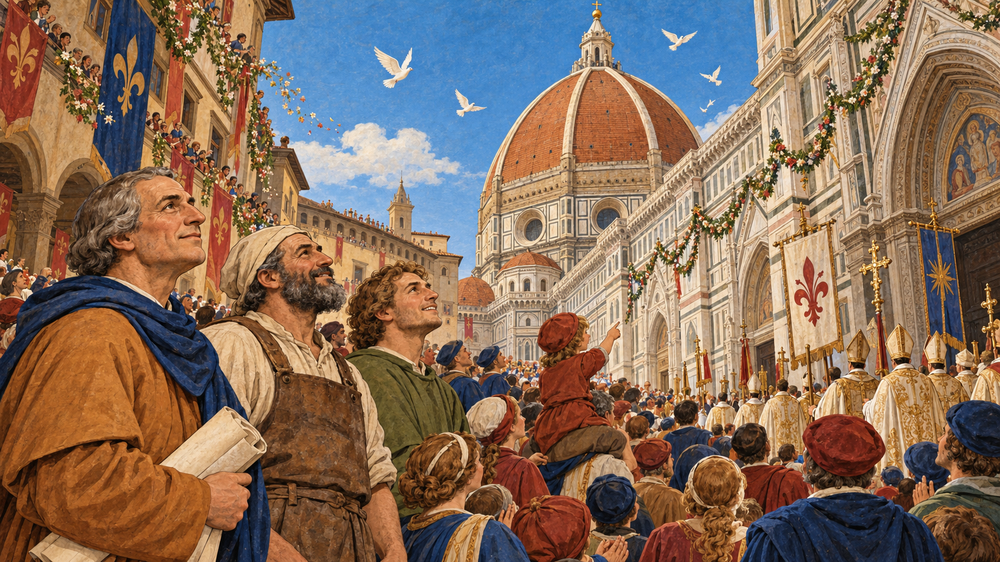

Image Prompt

(This is Panel 09. Do not include the panel number in the image.)
Please generate a 16:9 image in an Italian Renaissance fresco and tempera-inspired illustration style with warm lighting, gouache texture, and ink linework, depicting panel 9 of 10. Make the characters and style consistent with the prior panel. The scene shows the square in front of Florence Cathedral on 25 March 1436, packed with citizens in deep blue, terracotta-red, and olive-green clothing, looking up at the newly finished terracotta-red brick dome with its eight pale ribs rising against a clear spring sky. A procession of clergy in cream-and-gold robes with banners walks toward the cathedral doors. At the edge of the crowd, Brunelleschi, now fifty-eight, with gray hair and a deep blue hood, stands next to Bruno, a broad-shouldered master mason with a gray-streaked black beard, cream linen cap, and leather apron, and Tommaso, now about thirty-four with curly light-brown hair and an olive-green tunic, all three looking up with open faces. A child on someone's shoulders points at the dome. Flower garlands hang between windows and white doves wheel overhead. Color palette: terracotta, ochre, cream, deep blue, and olive green. The emotional tone should be joyful, proud, and reverent. Generate the image immediately without asking clarifying questions.

On 25 March 1436, Pope Eugenius IV consecrated the cathedral, and the dome, finished apart from the lantern, stood over Florence for everyone to see. It was built of more than four million bricks and tens of thousands of tons of material, and no wooden form had held it up during construction. Leon Battista Alberti, who dedicated his book *On Painting* to Brunelleschi that same year, called the dome a structure rising above the skies and wide enough to cover all the Tuscan people with its shadow. The dome had taken sixteen years, and thousands of unnamed masons, carters, and laborers, to raise.

## Panel 10: The Lantern and the Legacy

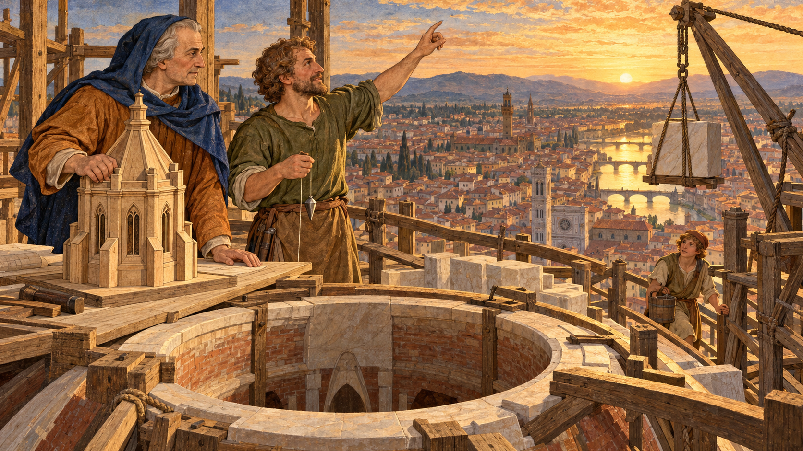

Image Prompt

(This is Panel 10. Do not include the panel number in the image.)
Please generate a 16:9 image in an Italian Renaissance fresco and tempera-inspired illustration style with warm lighting, gouache texture, and ink linework, depicting panel 10 of 10. Make the characters and style consistent with the prior panel. The scene shows the open crown of the dome at the top of Florence Cathedral in 1446, with a timber work platform around the circular opening. Brunelleschi, now sixty-nine, with gray hair, a deep blue hood, and an ochre-brown tunic, stands with one hand on a large wooden model of an eight-sided lantern with eight slender arched windows and eight small buttresses, resting on a plank. Beside him, Tommaso, now a master mason of about forty-four with curly light-brown hair, an olive-green tunic, and a plumb line in his hand, points up at the opening. Pale marble blocks wait beside a crane. Far below and behind them, Florence spreads out in gold evening light with the river, bridges, and red rooftops, and a young apprentice with a bucket watches from the stair. Color palette: terracotta, ochre, cream, deep blue, olive green, and gold. The emotional tone should be reflective, hopeful, and passing the torch. Generate the image immediately without asking clarifying questions.

Even after the dome was done, Brunelleschi had to win one more competition for its crown, an eight-sided lantern with eight buttresses and eight arched windows, and the work began only months before his death on 15 April 1446. His friend Michelozzo finished the lantern in 1461, and a gilt copper ball and cross topped it in 1469, bringing the whole structure to about 114.5 meters. Florence honored him with a burial in the cathedral crypt, a rare tribute for an architect, and a later statue shows him looking up at his dome. The dome still stands, and its design, with hoops inside, ribs for weight, and masonry held in compression, is a lesson in how builders turn forces into form.

### Epilogue – What Made Brunelleschi Different?

Brunelleschi combined the goldsmith's patience with the engineer's courage. He could not wait for a technology that did not yet exist, so he invented his own: machines to lift, chains to bind, and a brick pattern to hold fresh masonry in place. He also understood the whole site, from how bricks were laid to how workers ate and how rivals behaved. The lessons below show a builder who treated an impossible problem as a series of smaller, solvable ones.

| Challenge | How Brunelleschi Responded | Lesson for Today |
|-----------|---------------------------|------------------|
| The dome was too wide and too high to support with timber centering | He designed a self-supporting double-shell dome built in rings, with herringbone brickwork to carry the fresh courses | When the standard method is impossible, redesign the method |
| A dome pushes outward and could burst at the base | He bound the shells with stone, iron, and wood chains that acted like barrel hoops | Find the path the forces take, then give each force the right material |
| There was no machine that could lift stone that high | He designed an ox-driven three-speed hoist with a reverse gear, and a counterweighted crane | Good building depends on good tools; sometimes you must invent them |
| Working at great height was slow and dangerous | He added parapets, brought food and diluted wine up to the crew, and kept the work going | Safety and logistics are part of engineering, not an afterthought |
| A rival shared the authority and the credit | He earned control through technical mastery that the whole site could see | Competence that others depend on is the strongest argument |

### Call to Action

The next time you see a vault, an arch, or a dome, ask where the weight goes and what is holding the base together. Brunelleschi's chains, ribs, and shells are a working lesson in [structural loads and load paths](../../chapters/06-structural-loads/index.md), and his bricks and stone are the same materials explored in [concrete and masonry](../../chapters/08-concrete-masonry/index.md). His sixteen years on one site also show why the [design and construction process](../../chapters/02-design-construction-process/index.md) rewards people who plan the building and the way to build it together. Learn the forces, respect the crew, and let's build it right.

---

*"...ample to cover with its shadow all the Tuscan people..."*
—Leon Battista Alberti, 1436 dedication to Brunelleschi in *On Painting* (English translation), on the dome

---

## References

1. [Wikipedia: Filippo Brunelleschi](https://en.wikipedia.org/wiki/Filippo_Brunelleschi) - Biography of the goldsmith, engineer, and architect, including his training, his work in Florence, and his burial in the cathedral
2. [Wikipedia: Florence Cathedral](https://en.wikipedia.org/wiki/Florence_Cathedral) - History of Santa Maria del Fiore, the 1418 competition, and the structure and construction of the dome
3. [Wikipedia: Lorenzo Ghiberti](https://en.wikipedia.org/wiki/Lorenzo_Ghiberti) - Biography of Brunelleschi's rival and co-supervisor, the sculptor of the Baptistery doors
4. [National Geographic: Brunelleschi's Dome](https://www.nationalgeographic.com/magazine/article/Il-Duomo) - Feature article on the dome's engineering, the hoist, the brickwork, and the workers
5. [Museo Galileo: The Dome of Santa Maria del Fiore](https://brunelleschi.imss.fi.it/itineraries/place/thedomeofsantamariafiore.html) - Museum research site with dates, dimensions, and technical features of the dome
