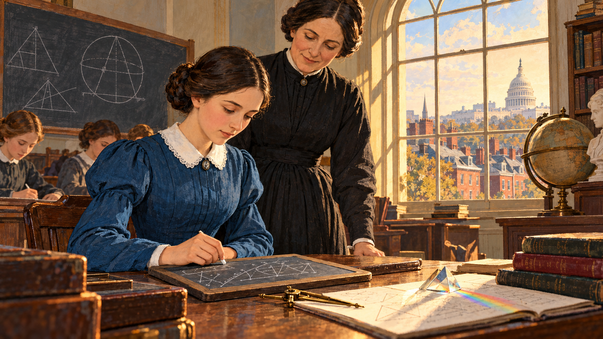
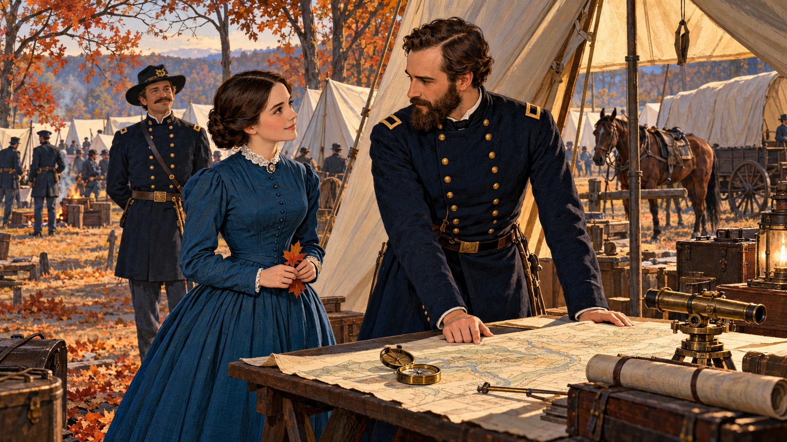
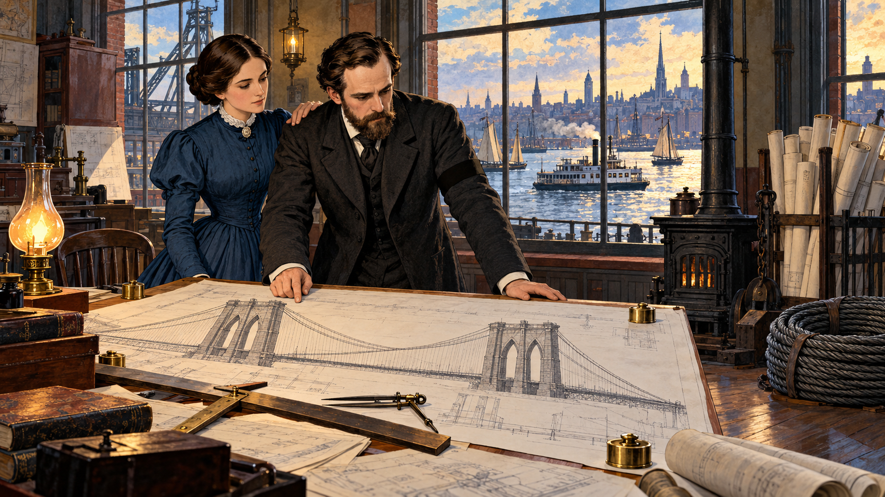
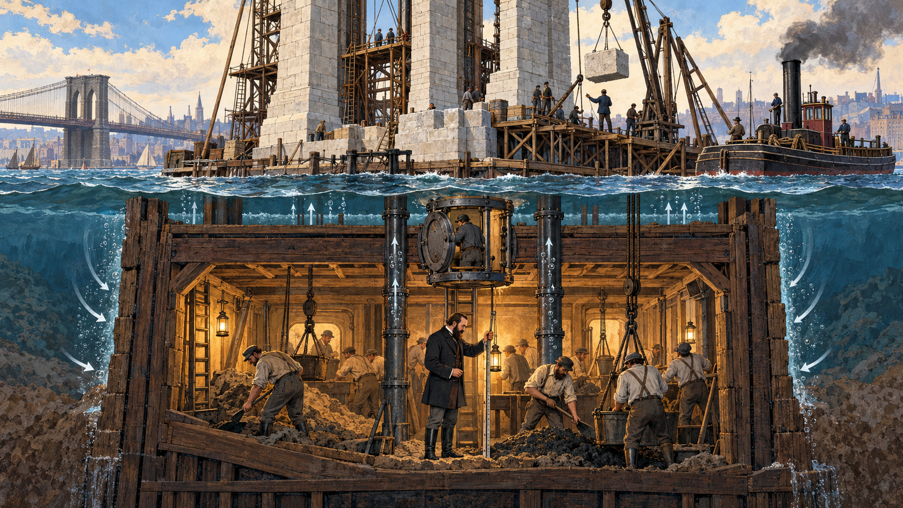
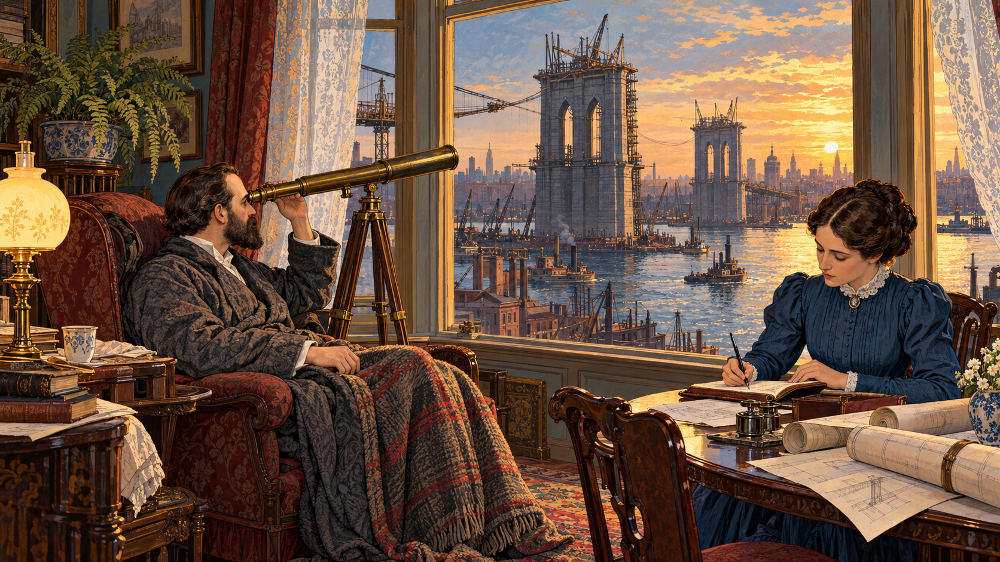
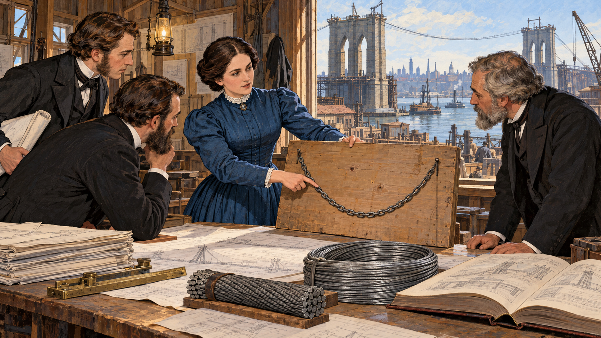
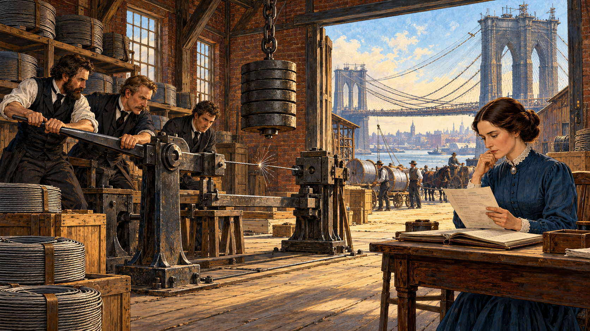
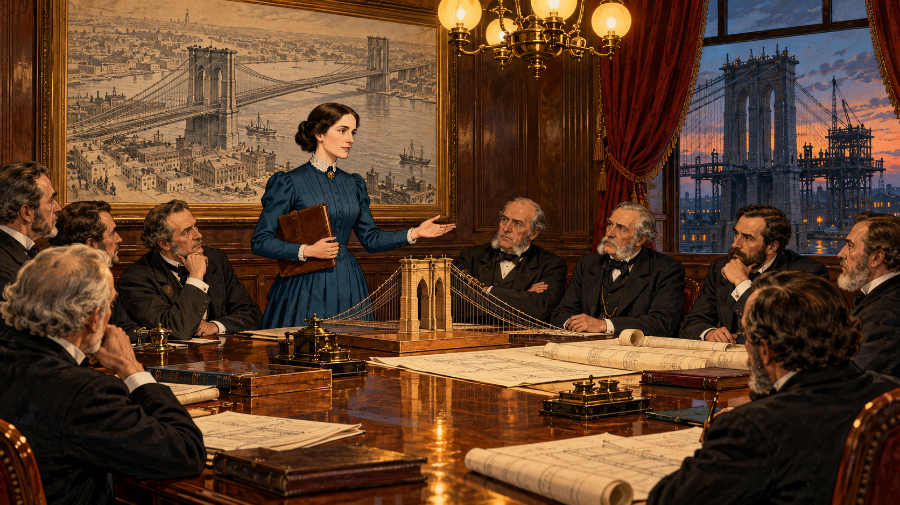
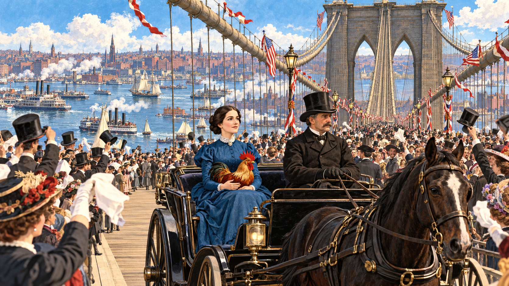
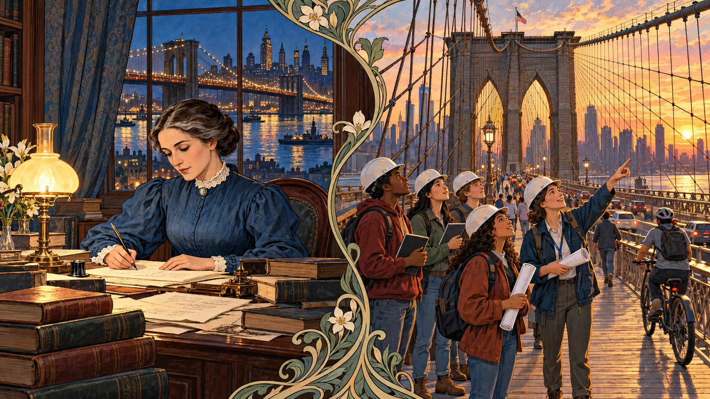

# The Woman on the Bridge

Cover Image Prompt

(This is the Cover Image. Do not include this label in the image.)
Please generate a wide-landscape 16:9 cover image for a graphic novel in a Gilded Age, Art Nouveau-influenced American industrial illustration style with gouache texture and ink linework. In the center foreground stands Emily Warren Roebling, a slender woman in her late thirties with dark brown hair parted in the center and gathered in a low coiled bun, a calm oval face with steady dark eyes, and a high-collared river-blue day dress with a small white lace collar and a tiny silver brooch. She holds a rolled blueprint under one arm and looks out over the East River at dusk. Behind her rise the two pointed-arch limestone and granite towers of the Brooklyn Bridge in 1883, with the great steel cables sweeping down in graceful curves and the web of diagonal stay wires fanning from the towers. Gaslights glow amber along the promenade, a tall-masted sailing ship and a small steam ferry cross the river, and the red-brick warehouses of Brooklyn line the shore. Decorative Art Nouveau vine-and-whiplash borders frame the scene. A hand-lettered title reads "The Woman on the Bridge" across the top in an ornate Victorian serif typeface, with a smaller subtitle "Emily Warren Roebling and the Brooklyn Bridge" along the bottom. Color palette: steel gray, brick red, gaslight amber, and river blue. Emotional tone: dignified, determined, and quietly triumphant. Generate the image immediately without asking clarifying questions.

Narrative Prompt

This story follows Emily Warren Roebling (1843–1903) from her school days in the 1850s and 1860s through the building of the Brooklyn Bridge, which opened on May 24, 1883, to her later years as a writer and student of the law. The settings are Cold Spring and Washington, D.C., a Civil War army camp, the East River waterfront in Brooklyn and Manhattan, and the Roeblings' home on Columbia Heights. The art style is Gilded Age, Art Nouveau-influenced American industrial illustration: gouache texture, confident ink linework, and a palette of steel gray, brick red, gaslight amber, and river blue. Emily is drawn as a stylized interpretation rather than a portrait: a slender woman with dark brown hair parted in the center and gathered in a low coiled bun, a calm oval face with steady dark eyes, and a high-collared river-blue dress with a small white lace collar and a tiny silver brooch. Washington Roebling is drawn as a lean man with a full dark beard and mustache, a high forehead, and serious deep-set eyes, in a dark wool coat when well and a charcoal dressing gown over a white shirt when ill. Keep both looks consistent in every panel, letting Emily's dark hair gain a few gray streaks only in the last panel. Creative liberties: the dates, places, people, and engineering facts come from published sources, but the conversations and the individual scenes are imagined to make the story visible. In particular, the study-table scene in Panel 6 with a hanging chain, the wire-testing shed in Panel 7, and the trustees' meeting in Panel 8 are dramatizations of events that happened in outline, not records of specific sessions. The rooster that Emily carries in Panel 9 is a long-repeated tradition about the first crossing; accounts differ on exactly when she rode and who saw it. Historians also still debate how much of the technical decision-making was hers and how much was Washington's, so this story shows her mainly as the skilled, informed link between the chief engineer and the people who built the bridge. The telescope in Panel 5 is also part of the traditional account. Show no readable text in any panel image except where a prompt explicitly asks for it.

### Prologue – The First One Across

On the morning the Brooklyn Bridge opened, the longest suspension bridge in the world stood ready, and the first person across it was not the president, the mayor, or the chief engineer. It was a woman who held no engineering degree and no official engineering title. Emily Warren Roebling had spent more than a decade learning the mathematics of cables, the strength of steel, and the politics of a huge public project, because the one man who knew the whole design could not leave his bed. This is the story of how she turned a family crisis into a bridge.

## Panel 1: A Girl Who Liked Algebra

Image Prompt

(This is Panel 01. Do not include the panel number in the image.)
I am about to ask you to generate a series of images for a graphic novel. Please make the images have a consistent style and consistent characters. Do not ask any clarifying questions. Just generate the image immediately when asked.

Please generate a 16:9 image in a Gilded Age, Art Nouveau-influenced American industrial illustration style with gouache texture and ink linework, depicting panel 1 of 10. The scene shows Emily Warren as a girl of about sixteen, with dark brown hair parted in the center and gathered in a simple braided bun, a calm oval face with steady dark eyes, and a plain river-blue school dress with a white collar, seated at a wooden desk in a bright school classroom in Washington, D.C., in about 1860. Spread in front of her are a slate covered with algebra figures drawn as abstract marks (no readable numbers or letters), a brass compass, and a small glass prism throwing a tiny rainbow on the page. A tall arched window behind her looks out over brick rowhouses and the white dome of a distant government building. A globe stands on a shelf, a chalkboard behind her shows geometric diagrams of triangles and circles, and a stern but kind teacher in a plain dark dress looks over her shoulder with an approving nod. Warm amber afternoon light fills the room. Color palette: steel gray, brick red, gaslight amber, and river blue. The emotional tone should be quiet, focused curiosity. Generate the image immediately without asking clarifying questions.

Emily Warren was born in 1843 in Cold Spring, New York, the second-youngest of twelve children. She attended the Georgetown Visitation Convent school in Washington, D.C., where she excelled in science and algebra. Her older brother Gouverneur, an army engineer officer, cheered on her education. Few doors into engineering were open to a woman in that century, but Emily kept a habit that would matter more than any diploma: she learned hard things on purpose.

## Panel 2: A Soldier Named Washington

Image Prompt

(This is Panel 02. Do not include the panel number in the image.)
Please generate a 16:9 image in a Gilded Age, Art Nouveau-influenced American industrial illustration style with gouache texture and ink linework, depicting panel 2 of 10. Make the characters and style consistent with the prior panel. The scene shows Emily, now a young woman of about twenty with dark brown hair parted in the center and gathered in a low coiled bun, a calm oval face with steady dark eyes, and a river-blue day dress with a small white lace collar and a tiny silver brooch, standing beside a canvas headquarters tent at a Union army camp in Virginia in autumn 1864. Facing her is Washington Roebling, a lean man of twenty-seven with a full dark beard and mustache, a high forehead, and serious deep-set eyes, in a dark blue officer's coat with brass buttons. A camp table between them holds a large map weighed down with a brass compass and a surveyor's level. Behind them are neat rows of white tents, a horse tied to a post, a line of bare oak trees with orange leaves, and a wagon with canvas cover. Her brother, a tall officer with a dark mustache and a general's hat, stands in the background smiling. Color palette: steel gray, brick red, gaslight amber, and river blue, with autumn orange accents. The emotional tone should be warm, shy, and full of possibility. Generate the image immediately without asking clarifying questions.

In 1864, during the Civil War, Emily visited her brother at his army headquarters and met one of his staff officers, Washington Roebling, an engineer and the son of the famous bridge builder John A. Roebling. They traded letters for months, and on January 18, 1865, they married in Cold Spring, New York, in a double wedding with one of her brothers. Washington's family business made wire rope for suspension bridges, and soon Emily was sharing a life built around bridges, cables, and the question of how far a span could stretch.

## Panel 3: A Dream Left on the Drafting Table

Image Prompt

(This is Panel 03. Do not include the panel number in the image.)
Please generate a 16:9 image in a Gilded Age, Art Nouveau-influenced American industrial illustration style with gouache texture and ink linework, depicting panel 3 of 10. Make the characters and style consistent with the prior panel. The scene shows a high-ceilinged engineer's office on the Brooklyn waterfront in 1869. Washington Roebling, a lean man in his early thirties with a full dark beard and mustache, a high forehead, and serious deep-set eyes, wears a dark wool coat with a black mourning band on his sleeve and stands at a large slanted drafting table. Spread on it are the huge ink drawings of two tall pointed-arch stone towers joined by sweeping curved cables, held down with brass weights beside a pair of dividers and a T-square. Emily, with dark brown hair parted in the center and gathered in a low coiled bun and a river-blue dress with a white lace collar and tiny silver brooch, rests a hand on his shoulder, looking at the drawings with him. A tall window shows the East River with a steam ferry and sailing ships and, across the water, the church steeples of Manhattan. A cast-iron stove, rolled drawings in a rack, and a coil of heavy wire rope on the floor fill the room. Color palette: steel gray, brick red, gaslight amber, and river blue. The emotional tone should be solemn resolve. Generate the image immediately without asking clarifying questions.

John A. Roebling's great plan for a bridge over the East River moved forward in 1867, when the state authorized it and named him chief engineer. In the summer of 1869, an accident during a survey led to a fatal infection, and his 32-year-old son Washington took over. Washington had already studied caisson construction in Europe, and Emily had gone with him, giving birth to their son John in Germany in 1867. Now the whole design, the longest suspension span ever attempted, rested on one young engineer and the family beside him.

## Panel 4: Working Beneath the River

Image Prompt

(This is Panel 04. Do not include the panel number in the image.)
Please generate a 16:9 image in a Gilded Age, Art Nouveau-influenced American industrial illustration style with gouache texture and ink linework, depicting panel 4 of 10. Make the characters and style consistent with the prior panel. The scene is a dramatic cutaway diagram-style illustration of the giant timber caisson for the Manhattan tower of the Brooklyn Bridge in 1872. The upper half, above the water line, shows a rising stone tower of pale limestone blocks with a derrick lifting a block, scaffolds, and a steam tug alongside on the East River. The lower half shows the sealed, lamplit working chamber under the riverbed, with thick timber walls and roof, a dozen workers in canvas clothes and caps digging sand and loading buckets, tall iron air pipes and a round air lock hatch in the ceiling, and a lantern on a hook. In the chamber, Washington Roebling, with a full dark beard and mustache, wears a dark wool coat and rubber boots and checks a measuring rod with a lantern. Bubbles and small arrows of air suggest compressed air pushing the water out. Color palette: steel gray, brick red, gaslight amber, and river blue. The emotional tone should be tense, careful, and awe-inspiring. Generate the image immediately without asking clarifying questions.

To build towers in a muddy river, the crew sank huge timber boxes called caissons, open at the bottom like upside-down cups. Pumps filled each caisson with compressed air, which pushed the water out so men could dig in a dry chamber while masonry piled on top and sank the box deeper. The Manhattan caisson reached 78.5 feet below high water with air pressure about 35 pounds per square inch. Coming back up too fast let nitrogen dissolved in the blood form bubbles, much like opening a shaken soda, and many workers fell ill with the pain, weakness, and paralysis that doctors began calling caisson disease. The danger was unknown then, and Washington, who went down again and again to supervise, was among those who paid for it.

## Panel 5: The Engineer at the Window

Image Prompt

(This is Panel 05. Do not include the panel number in the image.)
Please generate a 16:9 image in a Gilded Age, Art Nouveau-influenced American industrial illustration style with gouache texture and ink linework, depicting panel 5 of 10. Make the characters and style consistent with the prior panel. The scene shows a tall second-floor bay window in the Roebling home on Columbia Heights in Brooklyn in the mid-1870s, with a view across the East River to the unfinished stone towers of the Brooklyn Bridge, scaffolds and derricks on top. Washington Roebling, a lean man with a full dark beard and mustache, a high forehead, and serious deep-set eyes, rests in an upholstered armchair in a charcoal dressing gown over a white shirt, a blanket over his knees, calmly looking through a brass telescope on a wooden tripod pointed at the towers. Beside him at a small round table sits Emily, with dark brown hair parted in the center and gathered in a low coiled bun, in a river-blue dress with a white lace collar and tiny silver brooch, writing in a leather notebook with a steel pen. Lace curtains, a potted fern, a gaslight lamp, and a stack of rolled drawings fill the warm room. The river outside glows with golden evening light. Color palette: steel gray, brick red, gaslight amber, and river blue. The emotional tone should be gentle, patient, and determined. Generate the image immediately without asking clarifying questions.

After a long day in the caissons in 1872, Washington was left with cramps, poor eyesight, and trouble keeping his balance, and he never again worked at the site as he had before. He stayed chief engineer through the entire project, directing the work from the Roeblings' home on Columbia Heights. According to long-repeated accounts, he followed progress through a telescope aimed at the towers, and Emily wrote down his instructions to carry to the assistant engineers. The bridge now depended on a conversation between two people in a quiet room and the crews at work on the river.

## Panel 6: Learning the Language of Cables

Image Prompt

(This is Panel 06. Do not include the panel number in the image.)
Please generate a 16:9 image in a Gilded Age, Art Nouveau-influenced American industrial illustration style with gouache texture and ink linework, depicting panel 6 of 10. Make the characters and style consistent with the prior panel. The scene shows the plain timber-framed field office of the bridge company on the Brooklyn shore in about 1876. Emily, with dark brown hair parted in the center and gathered in a low coiled bun, a calm oval face with steady dark eyes, and a river-blue dress with a white lace collar and tiny silver brooch, stands at a large worktable pointing at a wooden board on which a loose steel chain hangs in a smooth curve between two nails. Three assistant engineers in dark frock coats, one gray-bearded, one young with side-whiskers, one holding a rolled drawing, lean in to listen with respectful, impressed expressions. On the table lie a thick pile of drawings, a brass slide rule, a coil of galvanized steel wire, a short sample of bundled wire cable, and a large open reference book. Through the window the stone towers rise in the distance, and the first thin temporary wire spans the river between them. Color palette: steel gray, brick red, gaslight amber, and river blue. The emotional tone should be confident and focused. Generate the image immediately without asking clarifying questions.

Emily did not simply carry messages. She studied Washington's plans, copied his specifications, and learned the strength of materials, stress analysis, cable construction, and the mathematics of the catenary, the curve a free-hanging chain takes. She dealt with engineers, contractors, trustees, and reporters, and she sketched specifications for manufacturers. Here is the science she had to master: the deck's weight hangs from vertical suspenders on the cables, so the cables carry it in tension, a pulling force that steel wire resists very well. The cables pass over the towers, which push down in compression, and the pull is held at each end by massive anchorages. That chain of forces, from deck to suspenders to cables to towers and anchorages and finally down through the foundations into the ground, is called the load path, and every piece of it has to be strong enough.

## Panel 7: Bad Wire in the Cables

Image Prompt

(This is Panel 07. Do not include the panel number in the image.)
Please generate a 16:9 image in a Gilded Age, Art Nouveau-influenced American industrial illustration style with gouache texture and ink linework, depicting panel 7 of 10. Make the characters and style consistent with the prior panel. The scene shows a long brick testing shed near the Brooklyn anchorage in the summer of 1878. On the left, three assistant engineers in dark frock coats and rolled sleeves operate a large iron wire-testing machine with a lever arm and a hanging weight, pulling a single thin steel wire taut until it parts with a visible small snap. Around them are shelves of labeled-looking wire coils drawn as plain bundles with no readable text, wooden crates, and wagons loaded with spools outside the open door. On the right, Emily, with dark brown hair parted in the center and gathered in a low coiled bun and a river-blue dress with a white lace collar and tiny silver brooch, sits at a small desk with an open ledger, reading a handwritten letter with a thoughtful, serious expression. Through the doorway the great cables, half-spun, sag in graceful curves between the stone towers over the river. Color palette: steel gray, brick red, gaslight amber, and river blue. The emotional tone should be alert, grave, and determined. Generate the image immediately without asking clarifying questions.

In January 1877 the bridge company awarded the contract for the steel wire to a contractor named J. Lloyd Haigh. By the summer of 1878, Washington's assistant engineers discovered that Haigh was swapping wire that had failed inspection for wire that had passed. Roughly 221 tons of the rejected wire were already spun into the cables, and it could not be pulled out. Washington judged that the cables still had a safety margin of about five, meaning they could carry roughly five times the load they would ever be expected to bear, down from six in the design (some modern accounts say four). To restore the margin, he had 150 extra wires added to each cable, paid for by Haigh. A safety factor is the gap between what a structure can carry and what it must carry, and it exists because real materials and real workmanship are never perfect.

## Panel 8: The Vote on the Chief Engineer

Image Prompt

(This is Panel 08. Do not include the panel number in the image.)
Please generate a 16:9 image in a Gilded Age, Art Nouveau-influenced American industrial illustration style with gouache texture and ink linework, depicting panel 8 of 10. Make the characters and style consistent with the prior panel. The scene shows an oak-paneled boardroom of the bridge company in Brooklyn in 1882, lit by a glowing gaslight chandelier. Around a long polished table sit nine trustees in dark frock coats, high collars, and mutton-chop whiskers, some leaning forward with folded arms, some listening with skeptical frowns, a few nodding. At the head of the table stands Emily, with dark brown hair parted in the center and gathered in a low coiled bun, a calm oval face with steady dark eyes, and a river-blue dress with a white lace collar and tiny silver brooch, holding a leather folio of drawings in one hand and gesturing calmly with the other. On the wall behind her hangs a large framed bird's-eye drawing of the finished bridge, and on the table lies a small wooden model of a tower with cables made of thread. A heavy red velvet curtain frames a window showing the unfinished bridge lit by dusk. Color palette: steel gray, brick red, gaslight amber, and river blue. The emotional tone should be tense and poised, with quiet courage. Generate the image immediately without asking clarifying questions.

By 1882 the bridge was nearly finished, and some people wanted a healthy chief engineer in place of Washington. Accounts say the bridge company was preparing to vote on his removal, and Emily lobbied politicians and engineers on his behalf, speaking up for the man who knew the whole design. Her effort succeeded. Washington kept his title, and the project kept the one person who understood how every piece fit.

## Panel 9: The First Crossing

Image Prompt

(This is Panel 09. Do not include the panel number in the image.)
Please generate a 16:9 image in a Gilded Age, Art Nouveau-influenced American industrial illustration style with gouache texture and ink linework, depicting panel 9 of 10. Make the characters and style consistent with the prior panel. The scene shows the roadway of the newly completed Brooklyn Bridge on a bright spring day, May 24, 1883. Emily, with dark brown hair parted in the center and gathered in a low coiled bun, a calm oval face with steady dark eyes, and a river-blue dress with a white lace collar and tiny silver brooch, sits upright in an open black carriage drawn by one dark horse, driven by a coachman in a top hat, with a red-and-gold rooster held in her lap. On both sides, the sweeping steel cables and the fan of diagonal stay wires rise toward a pointed-arch stone tower ahead. Hundreds of people in Victorian dress and top hats crowd the approach, waving hats and handkerchiefs under strings of small flags. Far below, the East River is crowded with sailing ships and steam ferries with plumes of white smoke, and the red-brick skyline of Brooklyn stretches behind. Color palette: steel gray, brick red, gaslight amber, and river blue, with festive red-and-white flag accents. The emotional tone should be joyful, proud, and triumphant. Generate the image immediately without asking clarifying questions.

On May 24, 1883, after more than a decade of work, the Brooklyn Bridge opened. By tradition, Emily was the first to cross, riding in a carriage with a rooster in her lap as a symbol of victory. President Chester A. Arthur and New York officials marched across in the official ceremony, and that first day about 150,000 people and 1,800 vehicles used the span. At the opening ceremony, trustee Abram S. Hewitt declared the bridge an everlasting monument to Emily's devotion and to women's capacity for higher education.

## Panel 10: What the Bridge Still Carries

Image Prompt

(This is Panel 10. Do not include the panel number in the image.)
Please generate a 16:9 image in a Gilded Age, Art Nouveau-influenced American industrial illustration style with gouache texture and ink linework, depicting panel 10 of 10. Make the characters and style consistent with the prior panel. The scene is a single composition split into two harmonious halves by a curving Art Nouveau vine border. On the left, in 1899, Emily, now a woman in her fifties with a few gray streaks in her dark brown hair parted in the center and gathered in a low coiled bun and steady dark eyes, wears a river-blue dress with a white lace collar and tiny silver brooch and writes with a pen at a lamplit desk piled with law books and loose pages; through a tall window behind her, the Brooklyn Bridge glows in the evening. On the right, in the present day, a diverse group of young students in hard hats and work boots, women and men, stand on the bridge's wooden pedestrian promenade holding tablets and rolled plans, looking up at the cables and stone towers with wonder, while a teacher points to the cable curve. In the background, a stream of cyclists, walkers, and cars cross the bridge under a golden sunset. Color palette: steel gray, brick red, gaslight amber, and river blue. The emotional tone should be inspiring, hopeful, and open-ended. Generate the image immediately without asking clarifying questions.

Emily kept learning after the bridge opened. She completed a women's law course at New York University in 1899, wrote an essay on the legal disabilities of married women, and took part in women's causes. She died on February 28, 1903, in Trenton, New Jersey, at 59, and Washington lived until 1926. More than 140 years later, the bridge she helped finish still carries people across the East River, and in 2024 Rensselaer Polytechnic Institute awarded her its first posthumous honorary degree, a Doctor of Engineering.

### Epilogue – What Made Emily Roebling Different?

Emily had no engineering degree, no official title, and no permission to be there. What she had was an unusual mix of skills: she could learn a hard subject quickly, explain it clearly, and keep many people working toward one goal. She treated communication, politics, and patience as part of the engineering, and she understood that a bridge is as much a human system as a steel one. Historians still debate exactly how much she decided herself, but there is no doubt that the Brooklyn Bridge would have been much harder to finish without her.

| Challenge | How Emily Responded | Lesson for Today |
|-----------|---------------------|------------------|
| She had no formal engineering training | She studied the mathematics, materials, and cable design until the engineers relied on her | Learn the fundamentals deeply; competence earns trust |
| The chief engineer could not leave his room | She turned his ideas into clear written instructions and drawings for the builders | Clear communication is a core engineering skill |
| Defective wire was found inside the cables | The team documented it, calculated the remaining margin, and added 150 wires per cable | Test, check your margins, and fix problems openly |
| Trustees wanted to replace the chief engineer | She lobbied on his behalf and kept the one person who knew the whole design | Leadership includes protecting the team and the project |
| Women were shut out of technical careers | She kept studying, later took a law course, and wrote about women's rights | Credit the people who do the work, and keep learning |

### Call to Action

Next time you cross a bridge, look at the cables and ask where the forces go. Every beam, wire, and footing in this book belongs to a chain of forces, and [Chapter 6: Structural Loads](../../chapters/06-structural-loads/index.md) shows you how to follow it. The pulling and pushing forces that Emily had to learn are explained in [Chapter 3: Forces, Heat, and Physics](../../chapters/03-forces-heat-physics/index.md). When a hidden flaw appears, as it did in the Brooklyn Bridge's wire, the lessons of [Chapter 21: Durability and Failure](../../chapters/21-durability-failure/index.md) will help you decide what to do. Learn it, check it, and let's build it right.

---

*"...an everlasting monument to the self-sacrificing devotion of woman..."*
—Abram S. Hewitt, speaking of Emily Warren Roebling at the bridge opening, May 24, 1883

---

## References

1. [Wikipedia: Emily Warren Roebling](https://en.wikipedia.org/wiki/Emily_Warren_Roebling) - Biography of the woman who helped supervise the building of the Brooklyn Bridge
2. [Wikipedia: Brooklyn Bridge](https://en.wikipedia.org/wiki/Brooklyn_Bridge) - History, design, caissons, cables, wire fraud, and opening of the bridge
3. [Wikipedia: Washington Roebling](https://en.wikipedia.org/wiki/Washington_Roebling) - Biography of the chief engineer, his Civil War service, and his illness
4. [Gotham Oratory Archive: Address of Hon. Abram S. Hewitt at the Opening Ceremonies](https://gothamoratoryarchive.omeka.net/oration-address-of-hon-abram-s-hewitt-at-the-opening-ceremonies-of-the-new-york-and-brooklyn-bridge) - Text of the 1883 speech that honored Emily Roebling
5. [STRUCTURE Magazine: Brooklyn Bridge, Part 2](https://www.structuremag.org/article/brooklyn-bridge-part-2/) - Engineering article on the cables, towers, anchorages, and wire fraud
