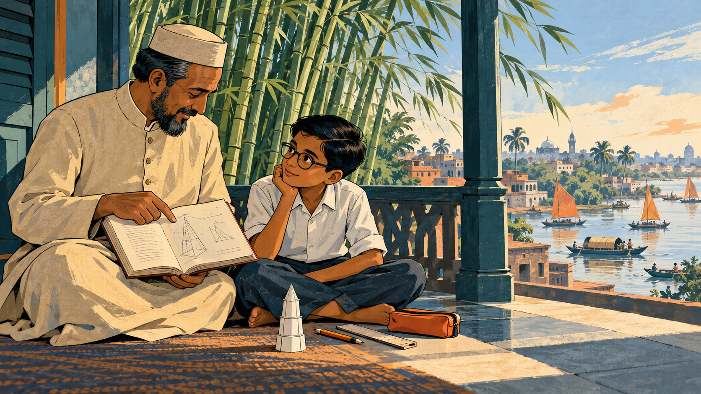
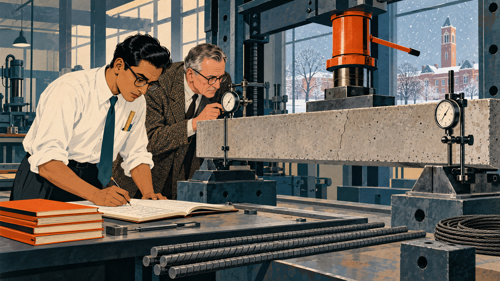
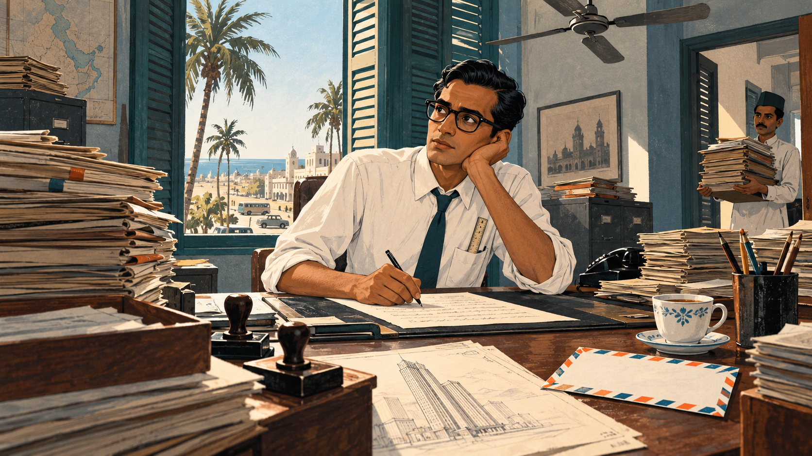
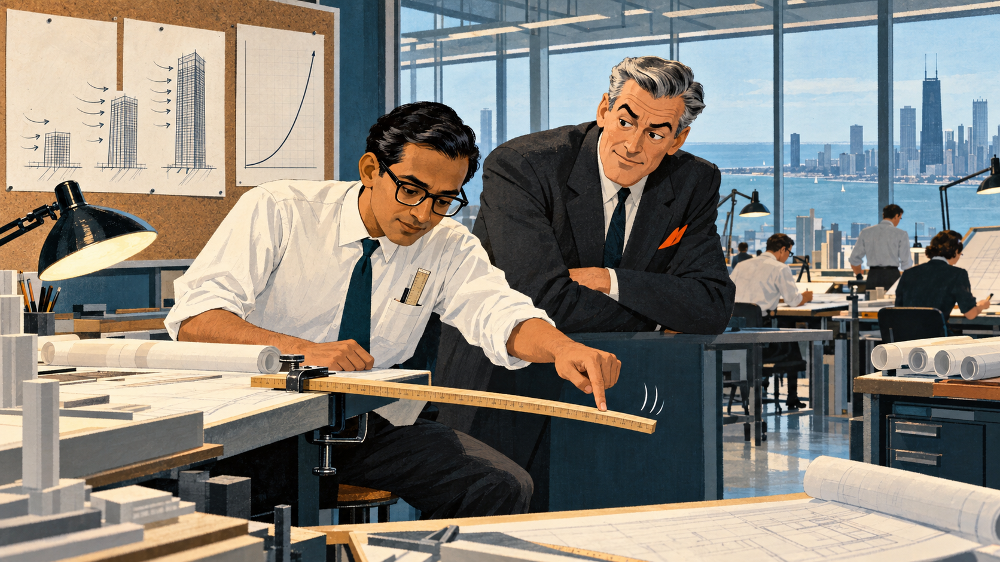
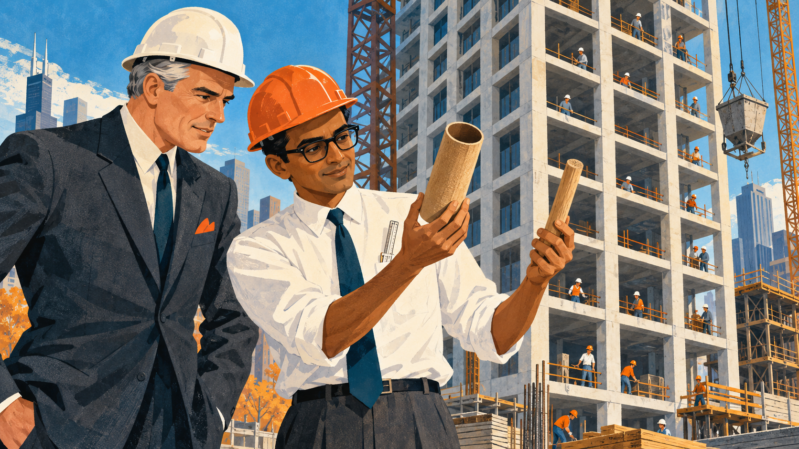
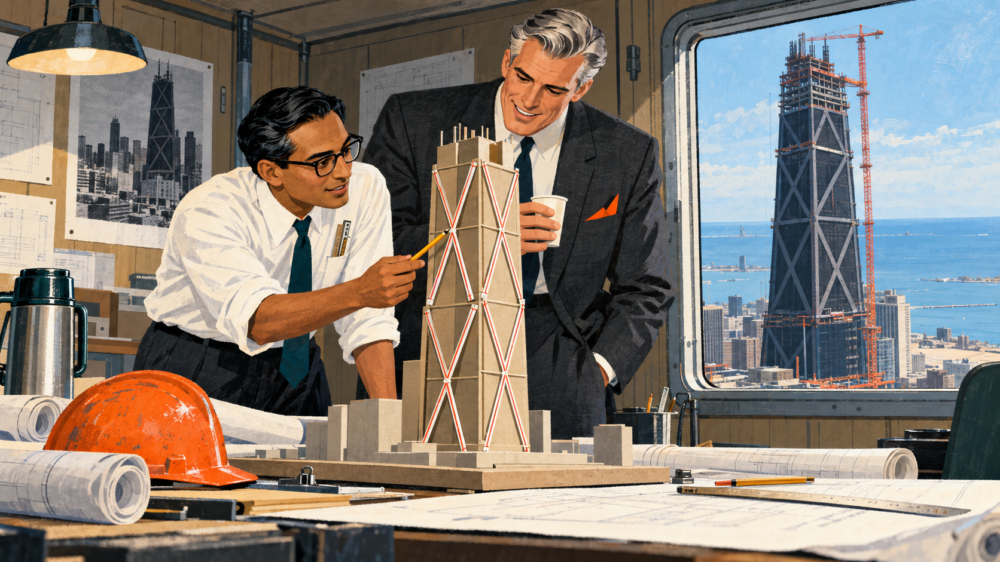
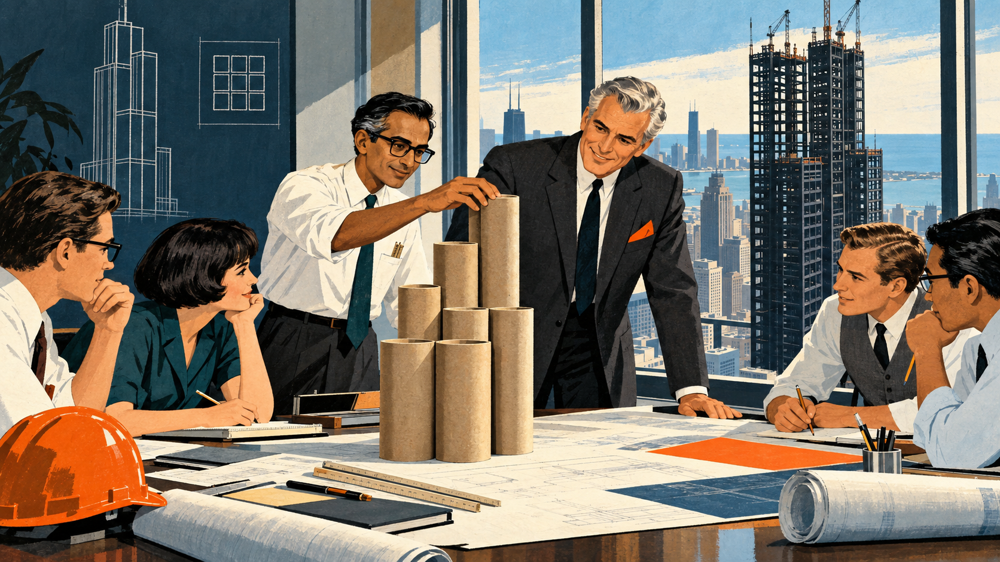
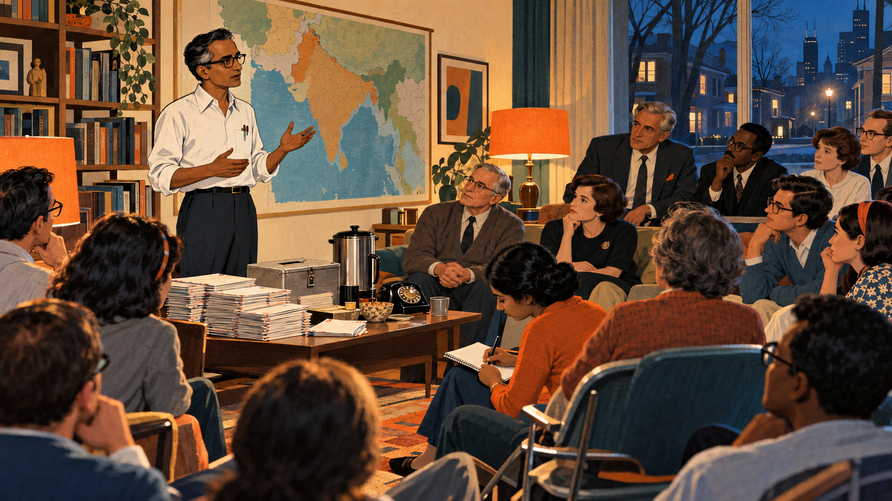
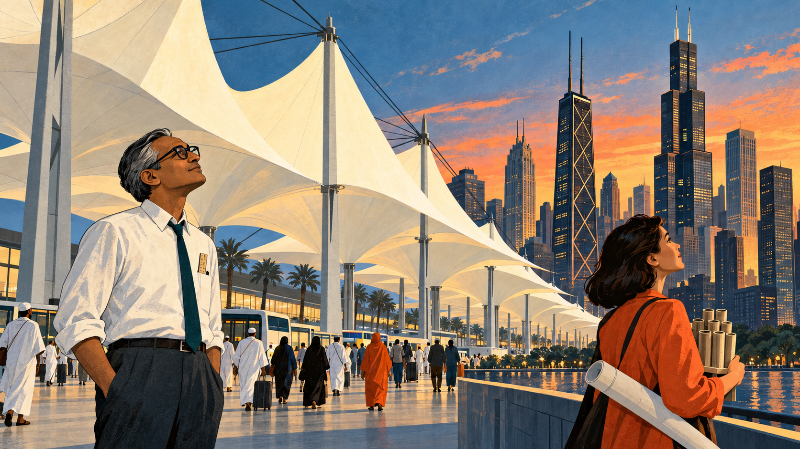

# The Building as a Tube

Cover Image Prompt

(This is the Cover Image. Do not include this label in the image.)
Please generate a wide-landscape 16:9 cover image for a graphic novel in a mid-century modernist editorial illustration style (atomic-age clean lines, gouache texture, confident ink linework). In the center foreground, a slim man in his forties with medium-brown skin, short black hair combed back, dark-rimmed rectangular glasses, a white shirt with rolled sleeves, a narrow dark teal tie, and a slide rule in his shirt pocket stands on a rooftop terrace holding a tall cardboard tube upright like a tiny tower. Behind him rises a Chicago skyline in 1970 made of three very tall towers: one with a gridded concrete-looking facade, one black steel tower with giant X-shaped braces on its sides, and one black tower made of nine square columns bundled together and stepping down in height. Gusts of wind are drawn as sweeping pale-blue ink lines streaming harmlessly past the towers, and a calm lake stretches to the horizon under a cream-colored sky. A hand-lettered title reads "The Building as a Tube" across the top in a bold geometric sans-serif typeface, with a smaller subtitle "Fazlur Rahman Khan and the Skyscrapers That Stand Against the Wind" along the bottom. Color palette: steel blue, concrete gray, safety orange, cream, and deep teal. Emotional tone: confident, curious, quietly triumphant. Generate the image immediately without asking clarifying questions.

Narrative Prompt

This story follows the structural engineer Fazlur Rahman Khan (1929–1982) from his childhood in Dhaka, then part of British India, through his studies at the University of Illinois and his career at Skidmore, Owings & Merrill (SOM) in Chicago, to his death in Jeddah, Saudi Arabia. It is a mystery with a reveal and a fix: why do towers become so expensive above roughly 30 or 40 stories, and what is the better idea? The settings range from 1930s Dhaka to 1950s Illinois, 1960s Karachi and Chicago, and 1980s Jeddah. The art style is a mid-century modernist editorial illustration: atomic-age clean lines, gouache texture, and ink linework, in steel blue, concrete gray, safety orange, cream, and deep teal. Fazlur is drawn as a stylized interpretation rather than a portrait: a slim man with medium-brown skin, short black hair combed back (graying at the temples in the later panels), dark-rimmed glasses, a white shirt with rolled sleeves, a narrow dark teal tie, and a slide rule in his shirt pocket. His collaborator, the architect Bruce Graham, is drawn as a tall, broad-shouldered man with swept-back silver-gray hair, a charcoal suit, and a safety-orange pocket square. Keep both looks consistent in every panel. Creative liberties: the dates, places, buildings, and engineering ideas are drawn from published sources, but the individual scenes and all conversations are imagined to make the thinking visible. In particular, the yardstick demonstration in Panel 4, the cardboard-tube models in Panels 5 through 7, the living-room meeting in Panel 8, and the closing scene in Panel 9 are dramatizations, not records of specific events. The story that Dhaka's bamboo inspired the tube is a tradition retold in biographies of Khan, and the story that the nine-tube Sears Tower plan came from a handful of staggered cigarettes is reported only as hearsay, so the story mentions them as tradition and the images do not show either as fact. Sources differ by a year or two on when the first tube building was designed and finished, so the story gives the range. Show no readable text in any panel image except where a prompt explicitly asks for it.

### Prologue – The Wind Problem

Every tall building is in a fight with the sky, and gravity is not the opponent that matters most. Gravity pulls straight down, and engineers have known for thousands of years how to stack stone and steel to answer it. The sideways push of wind is different. It grows with height, it never politely stays still, and by the 1950s it was the reason skyscrapers had become so costly that few developers dared to build them. A boy from Dhaka, who grew up in a city of low buildings, would find a better answer, and his idea now shapes skylines around the world.

## Panel 1: A Boy in Dhaka

Image Prompt

(This is Panel 01. Do not include the panel number in the image.)
I am about to ask you to generate a series of images for a graphic novel. Please make the images have a consistent style and consistent characters. Do not ask any clarifying questions. Just generate the image immediately when asked.

Please generate a 16:9 image in a mid-century modernist editorial illustration style (atomic-age clean lines, gouache texture, confident ink linework), depicting panel 1 of 9. The scene shows a ten-year-old boy named Fazlur with medium-brown skin, short black hair, small dark-rimmed glasses, and a white shirt with rolled sleeves, sitting cross-legged on a veranda floor in Dhaka, in British India, in about 1939. Beside him, his father, a kind man in a long cream-colored coat and a small cap, holds an open mathematics textbook and points at a geometric diagram. A tall grove of green bamboo sways behind them in the wind, its slender hollow stalks bending and springing back. Beyond the veranda are low brick buildings of two or three stories, palm trees, and country boats on a wide river under a pale sky. On the floor beside the boy lie a pencil, a ruler, and a tiny paper tower he has folded. Color palette: steel blue, concrete gray, safety orange accents on the boy's pencil case and the boats' sails, cream, and deep teal. The emotional tone should be quiet curiosity and warmth. Generate the image immediately without asking clarifying questions.

Fazlur Rahman Khan was born on 3 April 1929 in Dhaka, then part of British India. His father, Abdur Rahman Khan, was a mathematics teacher and textbook author who later became a senior education official in Bengal, and the house was full of books and numbers. Biographies say that Dhaka had almost no tall buildings in those years, and a tradition often retold about Khan says that the bamboo growing around the city, hollow, light, and wonderfully springy in the wind, stayed in his mind and later helped shape his ideas. Whether or not that story is exactly true, he did grow into a student who trusted mathematics and loved to see how things stood up.

## Panel 2: A Scholarship to Illinois

Image Prompt

(This is Panel 02. Do not include the panel number in the image.)
Please generate a 16:9 image in a mid-century modernist editorial illustration style (atomic-age clean lines, gouache texture, confident ink linework), depicting panel 2 of 9. Make the characters and style consistent with the prior panel. The scene shows Fazlur as a young man of about twenty-four, with medium-brown skin, short black hair combed back, dark-rimmed rectangular glasses, a white shirt with rolled sleeves, a narrow dark teal tie, and a slide rule in his shirt pocket, standing in a university structures laboratory in Urbana, Illinois, in 1953. In front of him, a long gray concrete beam rests on two supports inside a heavy steel testing frame, with a hydraulic jack on top and dial gauges clipped to its sides. He leans over a notebook, writing numbers, while an older professor in a tweed jacket studies a gauge beside him. Snow falls outside a tall window, and across a flat prairie campus a brick tower is visible. On a workbench sit steel reinforcing bars, a coil of cable, and a stack of notebooks. Color palette: concrete gray, steel blue, cream, deep teal, and safety orange on the jack's handle and a stack of notebooks. The emotional tone should be intense, patient concentration. Generate the image immediately without asking clarifying questions.

After studying civil engineering in Dhaka and at Bengal Engineering College near Calcutta, Khan won a Fulbright scholarship and a government scholarship and traveled to the United States in 1952. At the University of Illinois at Urbana-Champaign he earned two master's degrees and then a doctorate in structural engineering in 1955, with a thesis on prestressed concrete beams. Prestressing squeezes concrete with stretched steel cables so it resists bending, and Khan spent long days measuring exactly how beams bend and break under load. That habit of testing ideas against real behavior, not just formulas, would serve him for the rest of his life.

## Panel 3: The Wrong Desk

Image Prompt

(This is Panel 03. Do not include the panel number in the image.)
Please generate a 16:9 image in a mid-century modernist editorial illustration style (atomic-age clean lines, gouache texture, confident ink linework), depicting panel 3 of 9. Make the characters and style consistent with the prior panel. The scene shows Fazlur, about twenty-nine, with medium-brown skin, short black hair combed back, dark-rimmed rectangular glasses, a white shirt with rolled sleeves, and a narrow dark teal tie, seated at a large wooden government desk in a Karachi office in 1959. Towering stacks of paper folders and rubber stamps surround him, and a ceiling fan turns slowly overhead. He is writing a letter by hand while a half-hidden pencil sketch of a tall tower peeks out from under his blotter. Through the tall shuttered window behind him are palm trees, a dusty street, and sea light. On the corner of the desk is a blue-and-orange airmail envelope and a cup of tea. A clerk at the door carries yet another pile of files. Color palette: concrete gray, cream, deep teal, faded steel blue, and safety orange on the envelope. The emotional tone should be restless longing for real design work. Generate the image immediately without asking clarifying questions.

In 1955 Khan joined Skidmore, Owings & Merrill (SOM) in Chicago, and he stayed for a few years. In 1957 he returned to the part of the world he had come from and took a job with the Karachi Development Authority, in what was then Pakistan. The work was mostly administration, forms and meetings, and he missed designing structures. He wrote to SOM, and in June 1960 he and his wife, Liselotte, returned to Chicago. He had learned something useful: he wanted to be an engineer who designed things, not one who only managed paperwork.

## Panel 4: The Price of Going Up

Image Prompt

(This is Panel 04. Do not include the panel number in the image.)
Please generate a 16:9 image in a mid-century modernist editorial illustration style (atomic-age clean lines, gouache texture, confident ink linework), depicting panel 4 of 9. Make the characters and style consistent with the prior panel. The scene shows a busy architecture and engineering studio on an upper floor in Chicago in 1961, with a long wall of windows overlooking a gray-blue lake. In the foreground, Fazlur, with medium-brown skin, short black hair combed back, dark-rimmed rectangular glasses, a white shirt with rolled sleeves, a narrow dark teal tie, and a slide rule in his shirt pocket, has a long wooden yardstick clamped flat to the edge of a drafting table so that it sticks out sideways like a diving board, and he gently pushes the free end with one finger so it bends. Bruce, a tall broad-shouldered architect with swept-back silver-gray hair, a charcoal suit, and a safety-orange pocket square, leans on the table with crossed arms and raised eyebrows, watching. Pinned to a corkboard behind them are pencil sketches of three towers of rising height with sweeping arrows pushing on their sides, and a curved line graph rising steeply with no readable numbers. Drafting lamps, T-squares, and rolled drawings fill the room. Color palette: steel blue, concrete gray, cream, deep teal, and safety orange. The emotional tone should be a spark of discovery inside a puzzle. Generate the image immediately without asking clarifying questions.

Back in Chicago, Khan and architect Bruce Graham faced the question that haunted every tall building: why does each extra floor cost more than the one below it? Khan's answer began with a simple picture. A tower is a vertical cantilever, like a diving board turned upright and fixed at the ground, and the wind is a hand pushing sideways on it. Gravity load grows in a straight line with each floor, but the wind gets stronger higher up, it acts on a longer lever, and a tower's sway grows much faster than its height, roughly with the fourth power of height in a simple model. Engineers of the day fought the wind with heavy braced frames and stiff walls around a central core, and past roughly 30 or 40 stories the steel needed to hold the tower still began to eat the profit. Khan called this extra cost the premium for height, and he wanted to get rid of it.

## Panel 5: Push the Strength to the Edge

Image Prompt

(This is Panel 05. Do not include the panel number in the image.)
Please generate a 16:9 image in a mid-century modernist editorial illustration style (atomic-age clean lines, gouache texture, confident ink linework), depicting panel 5 of 9. Make the characters and style consistent with the prior panel. The scene shows a Chicago construction site in 1964 on a bright autumn day. In the foreground, Fazlur, with medium-brown skin, short black hair combed back, dark-rimmed rectangular glasses, a white shirt with rolled sleeves, a narrow dark teal tie, and a safety-orange hard hat, holds up a hollow cardboard tube in one hand and a solid wooden rod in the other, comparing them with a quiet smile. Beside him, Bruce, a tall broad-shouldered architect with swept-back silver-gray hair, a charcoal suit with a safety-orange pocket square, and a white hard hat, looks at the tube with interest. Behind them rises the pale gray concrete frame of a residential tower with a tight grid of closely spaced slender columns around its outside edge, linked by deep horizontal beams at every floor, with small rectangular window openings between them. A tower crane, a bucket of wet concrete, and workers in hard hats move along the open floors. Color palette: concrete gray, steel blue, cream, deep teal, and safety orange. The emotional tone should be a breakthrough moment with practical, down-to-earth confidence. Generate the image immediately without asking clarifying questions.

Khan's reveal was to move the strength from the middle of the building to its outside. Think of a hollow cardboard tube compared with a solid rod: material far from the center resists bending much better than material near the center, because it sits farther out on the lever. So in the apartment tower now known as Plaza on DeWitt, originally the DeWitt-Chestnut Apartments, he lined the outer wall with slender concrete columns set close together and tied them with deep beams at every floor. The whole outer wall behaved like one hollow tube standing on the ground, and the wind was resisted by the skin instead of by heavy structure inside. This framed tube, designed in the early 1960s and completed in 1966 at 43 stories, is widely regarded as the first of its kind, and it freed the interior for open floor plans.

## Panel 6: The Crossing Beams

Image Prompt

(This is Panel 06. Do not include the panel number in the image.)
Please generate a 16:9 image in a mid-century modernist editorial illustration style (atomic-age clean lines, gouache texture, confident ink linework), depicting panel 6 of 9. Make the characters and style consistent with the prior panel. The scene shows the inside of a cluttered construction site trailer in Chicago in 1967. On a table in the foreground sits a model of a tall tower made of cardboard with a few drinking straws taped on its sides in giant X shapes. Fazlur, with medium-brown skin, short black hair combed back, dark-rimmed rectangular glasses, a white shirt with rolled sleeves, a narrow dark teal tie, and a slide rule in his shirt pocket, points to the X-shaped straws with a pencil. Bruce, a tall broad-shouldered architect with swept-back silver-gray hair, a charcoal suit, and a safety-orange pocket square, holds a paper cup of coffee and smiles at the model. Through the trailer window, a gigantic black steel tower rises unfinished with huge diagonal X-shaped braces along its tapering sides, a tower crane beside it, and the gray-blue lake beyond. Rolled drawings, a hard hat, and a steel thermos sit on the table. Color palette: steel blue, concrete gray, cream, deep teal, and safety orange on the hard hat and crane. The emotional tone should be excited problem-solving, with a sense of scale. Generate the image immediately without asking clarifying questions.

For a 100-story tower, a plain framed tube was not enough. Khan found a problem called shear lag. In an ideal hollow tube, every part of the wall carries its share of the wind load, but in a framed tube the columns near the corners work hard while those in the middle of each face lag behind, because the floor beams between columns bend and give. The taller the tower, the worse it gets. For the John Hancock Center, which Khan and Graham designed at SOM and which was completed in 1969, Khan added giant diagonal braces on the outside walls. The diagonals tie the whole face together, send wind forces down to the corners, and let the columns be spaced farther apart. The result is a trussed tube whose structure is its architecture, and it used less steel per square foot of floor than the much shorter Empire State Building.

## Panel 7: Nine Tubes Together

Image Prompt

(This is Panel 07. Do not include the panel number in the image.)
Please generate a 16:9 image in a mid-century modernist editorial illustration style (atomic-age clean lines, gouache texture, confident ink linework), depicting panel 7 of 9. Make the characters and style consistent with the prior panel. The scene shows a conference room in downtown Chicago in 1971 with a large window showing a black steel tower frame, nine square columns bundled together, already rising high above the rooftops. On the long table sit nine cardboard mailing tubes standing upright in a three-by-three bundle, cut to different heights so that the cluster steps up like a staircase of towers, and Fazlur, with medium-brown skin, short black hair now showing a touch of gray at the temples, dark-rimmed rectangular glasses, a white shirt with rolled sleeves, and a narrow dark teal tie, adjusts the tallest tube. Bruce, a tall broad-shouldered architect with swept-back silver-gray hair, a charcoal suit, and a safety-orange pocket square, nods with approval beside him. Four young engineers, a woman with a short dark bob and a man in a gray vest among them, lean over drawings and slide rules. Color palette: steel blue, concrete gray, cream, deep teal, and safety orange on a folded blueprint and a hard hat. The emotional tone should be creative collaboration and rising ambition. Generate the image immediately without asking clarifying questions.

The next commission, a 110-story headquarters tower for a Chicago retailer, needed an even bolder idea. Khan and Graham bundled nine square tubes, each 75 feet on a side, in a three-by-three grid. The walls the tubes share inside the building act as extra webs, which make the outer walls work more evenly and cut shear lag, and tubes can stop at different heights, so the tower narrows as it climbs and offers less surface to the wind. One often-told story says the staggered arrangement came to Graham and Khan as a handful of cigarettes was stacked on a table, but that tale is unconfirmed. What is certain is that the Sears Tower, now called the Willis Tower, was completed in 1973 and stayed the tallest building in the world until 1998, about 25 years.

## Panel 8: A Homeland in Crisis

Image Prompt

(This is Panel 08. Do not include the panel number in the image.)
Please generate a 16:9 image in a mid-century modernist editorial illustration style (atomic-age clean lines, gouache texture, confident ink linework), depicting panel 8 of 9. Make the characters and style consistent with the prior panel. The scene shows an evening in a warm Chicago living room in 1971, crowded with about fifteen neighbors and friends of different ages sitting on sofas, folding chairs, and the floor. Fazlur, with medium-brown skin, short black hair with gray at the temples, dark-rimmed rectangular glasses, a white shirt with rolled sleeves, and no tie, stands near a bookshelf and speaks with one open hand raised. On the wall behind him hangs a large map of South Asia with no readable labels. On a coffee table in front of him are stacks of stuffed envelopes, a metal collection box, a coffee urn, and a rotary telephone. A young woman in the front row writes in a notebook, and an older man in a cardigan nods gravely. Outside the window, the streetlights of a Chicago neighborhood glow blue in the dusk. Color palette: warm cream, deep teal, steel blue, concrete gray, and safety orange on lampshades and a cushion. The emotional tone should be solemn, determined, and hopeful. Generate the image immediately without asking clarifying questions.

Khan did not shut his door to the world outside his drawing board. In 1971 a war erupted in East Pakistan, the region that would become Bangladesh, and millions of Bengali refugees fled the fighting. From Chicago, Khan helped create the Bangladesh Emergency Welfare Appeal to raise money for food and medical care and to raise awareness among Americans. Engineering News-Record named him its Construction Man of the Year, and in its February 1972 issue he said that an engineer must not lose himself in technology but must appreciate life, art, music, and, above all, people.

## Panel 9: Tents and Towers

Image Prompt

(This is Panel 09. Do not include the panel number in the image.)
Please generate a 16:9 image in a mid-century modernist editorial illustration style (atomic-age clean lines, gouache texture, confident ink linework), depicting panel 9 of 9. Make the characters and style consistent with the prior panel. The scene is a single hopeful frame in two connected halves with a soft gradient of dusk light across both. On the left, in 1981, Fazlur, with medium-brown skin, short black hair now mostly gray, dark-rimmed rectangular glasses, a white shirt with rolled sleeves, and a narrow dark teal tie, stands beneath an enormous roof of white fabric tents hung from steel cables and tall pylons at an airport terminal in Jeddah, looking up at the pale peaks. Around him, travelers in white and colorful clothing walk across a wide shaded plaza. The tent peaks flow into the right half, where a Chicago skyline of tall towers (one with giant X-braces, one with nine bundled tubes) glows in the dusk. In the right foreground, a young woman engineering student in a safety-orange jacket holds a small cardboard tube model and gazes up at the towers, with a rolled drawing under her arm. Color palette: steel blue, concrete gray, cream, deep teal, and safety orange. The emotional tone should be reflective, inspiring, and open-ended. Generate the image immediately without asking clarifying questions.

Khan's last major project was the Hajj Terminal at King Abdulaziz International Airport in Jeddah, completed in 1981, where more than a million pilgrims arrive each year. He answered the sun and the vast crowds with 210 tent-like fabric roofs supported by steel cables and pylons, covering one of the largest roofs ever built, and it won an Aga Khan Award for Architecture in 1983. Fazlur Khan died of a heart attack on 27 March 1982, on a trip to Jeddah, at the age of 52. He is buried in Chicago, a city whose skyline he changed, and the tube systems he created or inspired are used in many of the tallest buildings in the world.

### Epilogue – What Made Fazlur Khan Different?

Khan did not try to fight the wind with more steel. He asked what the wind was actually doing to a tower, drew the answer as a simple picture, and then redesigned the whole building so the structure and the skin were the same thing. He tested each idea in real buildings, found where it broke down, and fixed it, from the framed tube to the trussed tube to the bundled tube. He also worked closely with architects, so the structure became a part of the beauty of the building, not something hidden behind it.

| Challenge | How Khan Responded | Lesson for Today |
|-----------|---------------------|------------------|
| Tall buildings got far more expensive above roughly 30 or 40 stories | He saw the tower as a cantilever fighting wind, and named the extra cost the premium for height | Find the load that really governs your design before you add material |
| Heavy bracing and core walls used steel where it did the least good | He moved the strength to the outside wall, like a hollow tube, where it resists bending best | Put material where it works hardest, not where it is easiest to hide |
| The framed tube suffered shear lag as buildings grew taller | He added giant X-braces for the John Hancock Center and bundled nine tubes for the Sears Tower | Every solution has limits, so study where it fails and invent the next one |
| Engineers and architects often worked in separate worlds | He partnered with Bruce Graham so structure and form shaped each other | The best buildings come from teams that respect each other's craft |
| A great engineer can become lost in technology | He supported refugee relief in 1971 and said an engineer must appreciate people | Technical skill serves people, so keep them in view |

### Call to Action

Next time you look at a tall building, ask what the wind is doing to it, and where the structure hides in plain sight. As you study this book, let Khan's story guide you through [Chapter 6 on structural loads and load paths](../../chapters/06-structural-loads/index.md), [Chapter 3 on forces](../../chapters/03-forces-heat-physics/index.md), and [Chapter 7 on steel framing](../../chapters/07-wood-steel-framing/index.md), where the same ideas appear in every beam, column, and brace. Then sketch your own tower, find the real load, and let's build it right.

---

*"The technical man must not be lost in his own technology"*
—Fazlur R. Khan, *Engineering News-Record*, 10 February 1972

---

## References

1. [Wikipedia: Fazlur Rahman Khan](https://en.wikipedia.org/wiki/Fazlur_Rahman_Khan) - Biography of the Bangladeshi-American structural engineer, his education, career, and honors
2. [Wikipedia: Tube (structure)](https://en.wikipedia.org/wiki/Tube_(structure)) - Overview of framed, trussed, and bundled tube systems and how they resist lateral loads
3. [Wikipedia: Willis Tower](https://en.wikipedia.org/wiki/Willis_Tower) - History and bundled-tube structure of the building originally called the Sears Tower
4. [Dr. Fazlur R. Khan archive: Construction's Man of the Year, Engineering News-Record, 1972](https://drfazlurrkhan.com/professional-milestones/en-r-constructions-man-of-the-year-issue-february-10-1972/) - The 1972 profile that records Khan's views, with summaries of his major buildings
5. [Aga Khan Development Network: Hajj Terminal](https://the.akdn/en/how-we-work/our-agencies/aga-khan-trust-culture/akaa/hajj-terminal) - Award record and description of the Jeddah terminal he designed with SOM
