# The School in the Clay

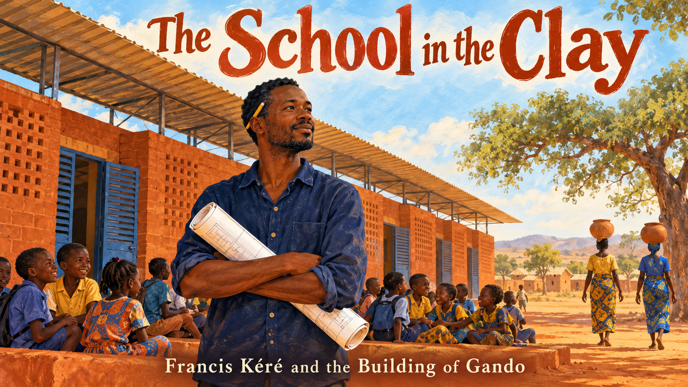

Cover Image Prompt

(This is the Cover Image. Do not include this label in the image.)
Please generate a wide-landscape 16:9 cover image for a graphic novel in a warm contemporary editorial illustration style with gouache texture and confident linework. In the center, a lean man in his thirties with short dark hair, warm brown skin, a neat short beard, an indigo cotton shirt with rolled sleeves, a yellow pencil tucked behind one ear, and a rolled set of drawings under his arm stands in the shade of a long low school building in Gando, Burkina Faso. The building has thick laterite-red clay brick walls, small shuttered blue windows, and a wide corrugated metal roof that floats above the walls on slim steel supports, with a visible gap of bright sky between roof and building. Schoolchildren in colorful clothes sit on the swept red earth in front of the classrooms, and two women carrying large clay water pots on their heads walk past in the background. A shea tree and a pale blue sky with soft heat shimmer fill the horizon. A hand-lettered title reads "The School in the Clay" across the top in a friendly serif typeface, with a smaller subtitle "Francis Kéré and the Building of Gando" along the bottom. Color palette: laterite red, ochre, indigo, and sky blue. Emotional tone: proud, warm, quietly hopeful. Generate the image immediately without asking clarifying questions.

Narrative Prompt

This story follows the architect Diébédo Francis Kéré (born 1965) from his childhood in Gando, a village in Burkina Faso, through his carpentry apprenticeship and architecture studies in Berlin, to the building of the Gando Primary School (completed 2001) and the Pritzker Architecture Prize of 2022. The settings range from 1970s Gando and Tenkodogo to Berlin in 1985 and the mid-1990s, and back to Gando for the building of the school. The art style is a warm contemporary editorial illustration: gouache texture, confident linework, and a palette of laterite red, ochre, indigo, and sky blue. Francis is drawn as a stylized interpretation rather than a portrait: as a child, a slim boy with short dark hair in a faded indigo shirt; as an adult, a lean man with short dark hair, warm brown skin, a neat short beard (flecked with silver in the last panel), an indigo cotton shirt with rolled sleeves, a yellow pencil tucked behind one ear, and a rolled set of drawings under his arm. Keep his look, and the look of the villagers, consistent in every panel. Creative liberties: the historical facts (dates, places, awards, materials, and the roof design) are drawn from published sources, but the individual scenes are imagined to make the story visible. In particular, the moment of leaving Gando (Panel 1), the workshop and studio scenes in Berlin (Panels 3 and 4), the fundraising table in Berlin (Panel 5), the meeting with the village elders (Panel 6), and the village celebration in Panel 10 are dramatizations, not records of specific events. The doubts that some villagers had about building in clay are reported in published accounts of the project, but the details of the conversation are imagined. The story's one quote block uses words published by the Pritzker Architecture Prize, and no invented words are put in the mouth of a real person. Where sources disagree on a detail, such as the date of the Gando library, the story follows the Pritzker Architecture Prize biography. Show no readable text in any panel image except where a prompt explicitly asks for it.

### Prologue – The First Child to Go to School

Why would a village boy who had never seen a school become the architect who redesigned the school? Francis Kéré was the first child from Gando to be sent to school, and the classroom that waited for him was so hot and dark that he never forgot it. Decades later he returned with an idea: build a school that is cool and bright, using the clay under the villagers' own feet, and build it together with them. This is the story of how a carpenter's apprentice from Burkina Faso learned that good building science can be local, simple, and shared.

## Panel 1: The Boy Who Was Sent Away to Learn

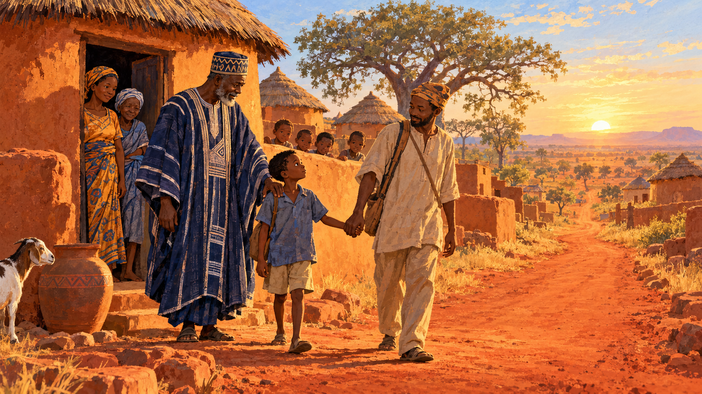

Image Prompt

(This is Panel 01. Do not include the panel number in the image.)
I am about to ask you to generate a series of images for a graphic novel. Please make the images have a consistent style and consistent characters. Do not ask any clarifying questions. Just generate the image immediately when asked.

Please generate a 16:9 image in a warm contemporary editorial illustration style with gouache texture and confident linework, depicting panel 1 of 10. The scene shows a slim seven-year-old boy with short dark hair, warm brown skin, and a faded indigo shirt standing at the edge of the village of Gando, Burkina Faso, in about 1972, holding the hand of his uncle at dawn. Behind them, a dignified older man in a long embroidered robe, the village chief, rests a hand on the boy's shoulder, and the boy's mother and grandmother stand in the doorway of a round mud-walled house with a thatched roof. Smaller children watch from behind a low clay wall. A long red dirt road leads toward the horizon past a shea tree, and a goat and a clay water pot sit near the doorway. Low golden light lights the dust in the air. Color palette: laterite red, ochre, indigo, and pale morning sky blue. The emotional tone should be tender, proud, and a little frightened. Generate the image immediately without asking clarifying questions.

Francis Kéré was born in Gando, Burkina Faso, on 10 April 1965. His father was the village chief, and he wanted his eldest son to learn to read and to translate letters. Because Gando had no school, the first child from his village to be sent to one had to leave his family at the age of seven and go to live with an uncle in the city. That journey was the first step on a long road that would lead him far from Gando and, eventually, back to it.

## Panel 2: The Hot Classroom

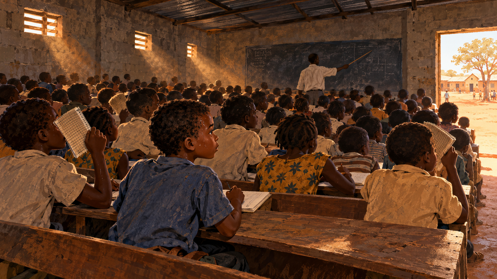

Image Prompt

(This is Panel 02. Do not include the panel number in the image.)
Please generate a 16:9 image in a warm contemporary editorial illustration style with gouache texture and confident linework, depicting panel 2 of 10. Make the characters and style consistent with the prior panel. The scene shows a crowded classroom in the town of Tenkodogo, Burkina Faso, in about 1973. The slim eight-year-old boy with short dark hair and a faded indigo shirt sits squeezed on a long wooden bench among more than a hundred pupils in plain school clothes. The room has gray concrete block walls, a low dark ceiling under a sheet-metal roof, and only a few tiny window openings, so only thin shafts of light cut through hazy air. Children fan themselves with notebooks, a teacher at a slate chalkboard points with a stick, and tiny beads of sweat shine on foreheads. Through a doorway, a sun-baked yard of red earth glares white. Color palette: heavy gray, dull ochre, dusty indigo, with one hot orange shaft of sunlight. The emotional tone should be stifling and determined. Generate the image immediately without asking clarifying questions.

His classroom in Tenkodogo was built of concrete blocks, and it had almost no ventilation or light. More than a hundred pupils shared the room for hours at a time. The building science was simple and unforgiving: a metal roof in full sun gets very hot and radiates that heat down onto everyone below, and with so few openings the warm, stale air has nowhere to go. Trapped in that heat, Francis promised himself that he would someday build better schools.

## Panel 3: The Carpenter from Burkina Faso

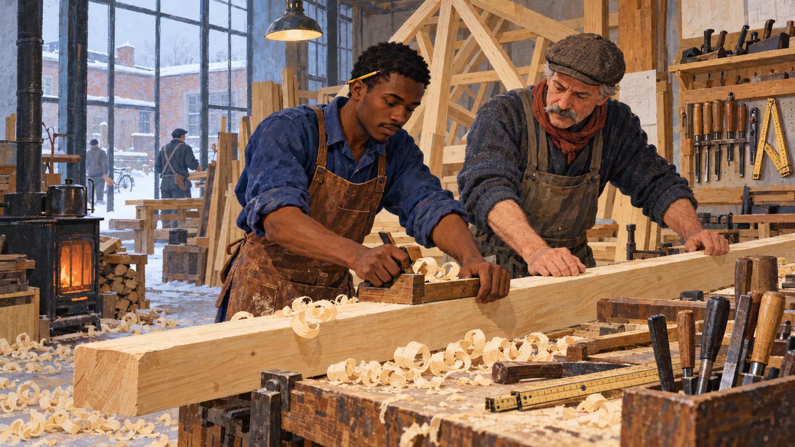

Image Prompt

(This is Panel 03. Do not include the panel number in the image.)
Please generate a 16:9 image in a warm contemporary editorial illustration style with gouache texture and confident linework, depicting panel 3 of 10. Make the characters and style consistent with the prior panel. The scene shows Francis at age twenty, a lean young man with short dark hair, warm brown skin, a faint short beard, an indigo cotton shirt with rolled sleeves under a leather carpenter's apron, and a yellow pencil tucked behind one ear, in a busy carpentry workshop in Berlin, Germany, in 1985. He guides a long wooden roof rafter along a workbench beside an older German master carpenter with a gray mustache and a flat cap. Pale wood shavings curl across the floor, a half-built timber roof truss stands against the wall, and hand planes, chisels, and a folding rule hang on a pegboard. Through a frosted window, gray winter sky and a snow-dusted brick courtyard glow, and a small stove warms the room. Color palette: pine-wood ochre, cold gray-blue, with warm indigo and one thread of laterite red in a scarf. The emotional tone should be focused, homesick, and quietly determined. Generate the image immediately without asking clarifying questions.

In 1985 Francis, then twenty, left Africa for Berlin on a carpentry scholarship. By day he learned to build roofs and furniture, and he attended secondary-school classes by night. His apprenticeship came through a development-aid program in Germany, and for a young man from a village of clay houses, the cold winters and the exacting German craft tradition must have felt a world away. Learning to make roofs, though, gave him a hands-on feel for how a roof is framed, supported, and made to shed weather, knowledge that would matter when he designed his own.

## Panel 4: Learning to Draw What He Remembered

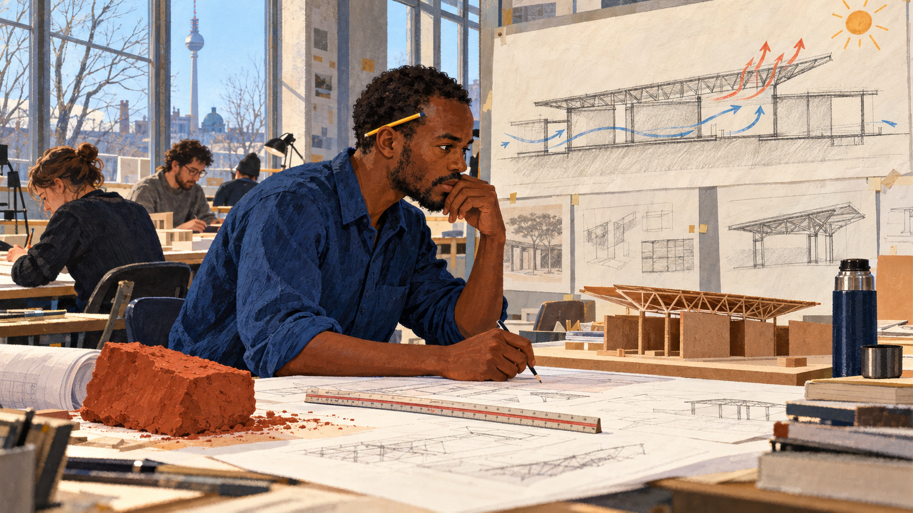

Image Prompt

(This is Panel 04. Do not include the panel number in the image.)
Please generate a 16:9 image in a warm contemporary editorial illustration style with gouache texture and confident linework, depicting panel 4 of 10. Make the characters and style consistent with the prior panel. The scene shows Francis in his late twenties, a lean man with short dark hair, warm brown skin, a neat short beard, an indigo cotton shirt with rolled sleeves, and a yellow pencil tucked behind one ear, at a drafting table in a bright architecture studio at a Berlin technical university in the mid-1990s. Pinned above the table are large sections drawn in pencil: a long low building with a raised roof, with curved blue arrows showing air flowing in at the bottom and out at the top, and a small sun in the corner. On the table sit a block of red clay, a ruler, a model of a roof made from cardboard, and a thermos of tea. Classmates in sweaters work at other tables. Through a tall window, winter light falls on bare trees. Color palette: cream paper, indigo, laterite red accents, and soft gray. The emotional tone should be intense curiosity and purpose. Generate the image immediately without asking clarifying questions.

Francis went on to study architecture at the Technische Universität Berlin. He won a scholarship there in 1995 and finished his architecture degree in 2004. At his drafting table he began to ask how the physics he was learning, such as heat rising, shade, air moving, and thick walls cooling slowly, could be used in a place that could not afford air conditioning. The classroom of his childhood became the problem he wanted to solve.

## Panel 5: Building Blocks for Gando

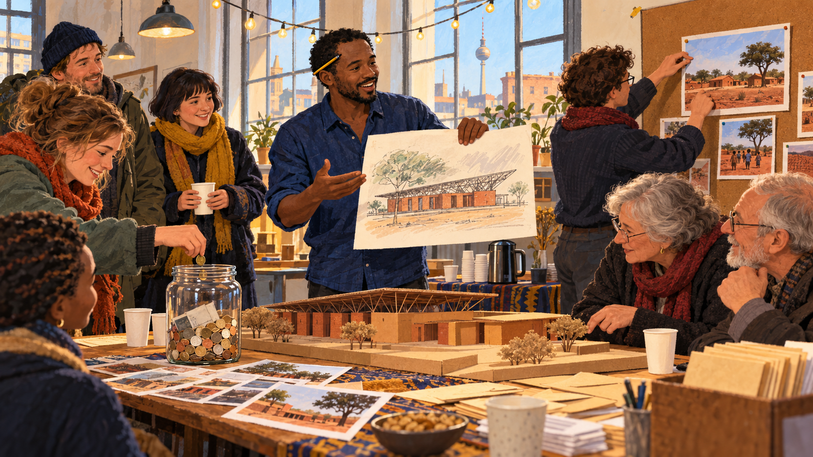

Image Prompt

(This is Panel 05. Do not include the panel number in the image.)
Please generate a 16:9 image in a warm contemporary editorial illustration style with gouache texture and confident linework, depicting panel 5 of 10. Make the characters and style consistent with the prior panel. The scene shows Francis, now about thirty-three, a lean man with short dark hair, warm brown skin, a neat short beard, an indigo cotton shirt with rolled sleeves, and a yellow pencil tucked behind one ear, standing at a table in a small community hall in Berlin, Germany, in 1998, holding up a hand-drawn sketch of a low school building. Around him, a diverse group of friends and neighbors of different ages in warm jackets lean in, a woman puts coins in a glass jar, a young man pins a photograph of a red-earth village onto a corkboard, and an older couple studies a small cardboard model of a school with a high roof. A kettle, paper cups, and stacks of envelopes sit on a side table. Light from tall windows and a string of small lamps gives a gentle glow. Color palette: warm ochre, indigo, laterite red, and cream. The emotional tone should be hopeful and grateful. Generate the image immediately without asking clarifying questions.

While still a student, Francis felt a duty to the community that had supported him, and in 1998, with the help of friends, he founded an association called Schulbausteine für Gando, which means "Building Blocks for Gando." It is known today as the Kéré Foundation. It raised money internationally for one specific thing: a primary school for his village. He did not want to build a copy of a European building; he wanted to combine what he had learned in Europe with the building methods of Burkina Faso.

## Panel 6: Clay Is Not a Poor Man's Material

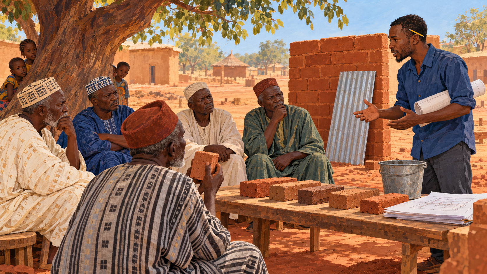

Image Prompt

(This is Panel 06. Do not include the panel number in the image.)
Please generate a 16:9 image in a warm contemporary editorial illustration style with gouache texture and confident linework, depicting panel 6 of 10. Make the characters and style consistent with the prior panel. The scene shows Francis, a lean man in his mid-thirties with short dark hair, warm brown skin, a neat short beard, an indigo cotton shirt with rolled sleeves, a yellow pencil tucked behind one ear, and a rolled set of drawings under his arm, standing under a big shea tree in Gando, Burkina Faso, in about 1999. Before him sit a semicircle of village elders on low wooden stools in long robes and caps, some arms crossed, one frowning, one rubbing a brick between his fingers. On a plank table lie several sample bricks of different shades of red-brown clay, a bucket of water, and a small stack of drawings. Behind them stands a small test wall of fresh bricks with a sheet of corrugated metal laid against it. The ground is bare, sun-baked red earth, and a few children peek from behind a tree trunk. Color palette: laterite red, ochre, indigo, and pale sky blue. The emotional tone should be tense but respectful, a conversation between generations. Generate the image immediately without asking clarifying questions.

Not everyone in Gando believed in clay. Clay was what people had always built with, and some villagers saw it as old-fashioned, and feared that the rains would wash it away. Francis answered with building science: clay is cheap, plentiful, and easy to shape, but plain earth erodes in rain. He would strengthen the clay with some cement so the bricks became stronger and more water-resistant, and he would protect the walls with a roof that overhangs generously. He also brought something the village needed: training so that local people could learn to press the bricks themselves.

## Panel 7: The Whole Village Builds

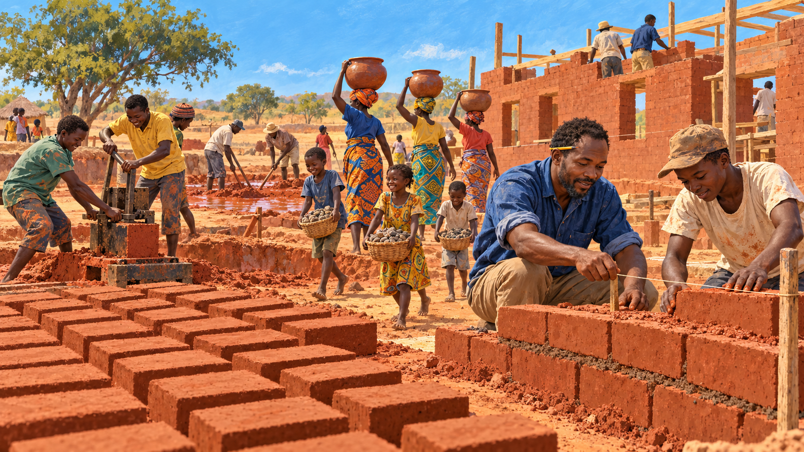

Image Prompt

(This is Panel 07. Do not include the panel number in the image.)
Please generate a 16:9 image in a warm contemporary editorial illustration style with gouache texture and confident linework, depicting panel 7 of 10. Make the characters and style consistent with the prior panel. The scene shows a busy construction site in Gando, Burkina Faso, in about 2000. In the foreground, a line of women in bright patterned wraps carry large water pots on their heads toward a pit where men mix red clay with water, and a group of children carry small stones in baskets toward a trench for the foundation. Two young men press clay into a hand-operated brick press, and a row of freshly made red bricks dries in rows on the ground. Francis, a lean man with short dark hair, warm brown skin, a neat short beard, an indigo cotton shirt with rolled sleeves, and a yellow pencil tucked behind one ear, kneels beside a stacking wall, showing a young mason how to level a course of bricks with a string line. A half-finished brick wall stands behind them under a hot, bright sky. Color palette: laterite red, ochre, saffron, indigo, and bright sky blue. The emotional tone should be joyful and industrious, a community in motion. Generate the image immediately without asking clarifying questions.

Soon the whole village was building. Children gathered stones for the foundation. Women carried water so that the clay could be mixed and pressed into bricks. Men and young apprentices learned to make and lay the bricks, and Francis taught them on the job. Thick earth walls have **thermal mass**: they take a long time to heat up in the day and a long time to cool at night, so the hottest part of the afternoon is slowed before it reaches the room inside.

## Panel 8: The Roof That Floats

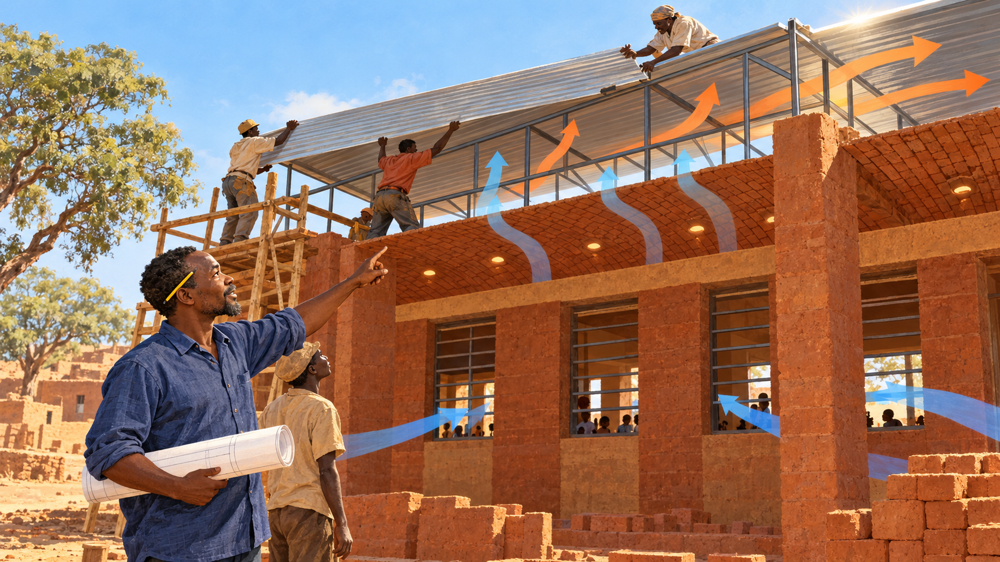

Image Prompt

(This is Panel 08. Do not include the panel number in the image.)
Please generate a 16:9 image in a warm contemporary editorial illustration style with gouache texture and confident linework, depicting panel 8 of 10. Make the characters and style consistent with the prior panel. The scene shows the nearly finished school building in Gando, Burkina Faso, in about 2000, with thick laterite-red brick walls and a ceiling of dry-stacked bricks with small round gaps between them. Several workers on a wooden scaffold are lifting a long sheet of corrugated metal roofing onto a frame of slim steel bars that holds it well above the brick ceiling, leaving a wide airy gap. Francis, a lean man with short dark hair, warm brown skin, a neat short beard, an indigo cotton shirt with rolled sleeves, and a yellow pencil tucked behind one ear, stands on the ground with a rolled drawing, pointing up at the gap. Painted in the air, translucent curved arrows of cool blue flow in through low window openings, rise through the brick ceiling, and exit under the raised roof edge in warm orange. Hot afternoon sun glances off the metal. Color palette: laterite red, steel silver, ochre, sky blue, with soft blue and orange air-flow arrows. The emotional tone should be clever, focused, and quietly triumphant. Generate the image immediately without asking clarifying questions.

This was the key idea. In Burkina Faso a corrugated metal roof is a common solution, but a metal roof in direct sun gets extremely hot and heats the room below. Francis pulled the roof away from the classroom and held it on slim steel supports high above a ceiling of dry-stacked bricks with gaps between them. The roof shades the walls and sheds the rain. The air gap carries off the heat the metal collects. Cool air enters through the windows, warm air rises through the perforated brick ceiling, and it escapes beneath the roof edge. This is a form of **stack ventilation**, and it needs no electricity at all.

## Panel 9: A School That Grows

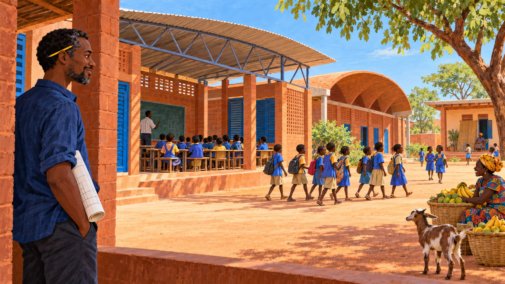

Image Prompt

(This is Panel 09. Do not include the panel number in the image.)
Please generate a 16:9 image in a warm contemporary editorial illustration style with gouache texture and confident linework, depicting panel 9 of 10. Make the characters and style consistent with the prior panel. The scene shows the finished Gando Primary School in Gando, Burkina Faso, in about 2008, in the soft light of mid-morning. A long low red-brick school with a raised metal roof and blue shutters stands on swept earth, and in the open classroom a teacher at a green chalkboard teaches a row of children in bright school smocks who sit comfortably in the shade. Beside it stands a newer wing with a gently curved vaulted ceiling, and a small house for teachers with a woven mat on its porch. A line of children in uniforms walks across the courtyard, a woman sells fruit from a basket nearby, and a young goat looks on. Francis, now with a few strands of silver in his neat short beard, an indigo cotton shirt with rolled sleeves, a yellow pencil tucked behind one ear, and a rolled drawing under his arm, watches from the shaded verandah with a small smile. Color palette: laterite red, ochre, indigo, sky blue, and fresh green from a tree. The emotional tone should be calm, proud, and communal. Generate the image immediately without asking clarifying questions.

The school opened in 2001, and it worked. Pupils learned in rooms that stayed far more comfortable than the concrete-block classrooms of the region, and the number of students grew from about 120 to 700. Francis added teachers' housing in 2004, an extension in 2008, and later a library in 2019. In 2004 the Aga Khan Award for Architecture honored the school, and Francis finally had proof that the quiet physics of clay, shade, and moving air could win the highest respect.

## Panel 10: A Village Hears the News

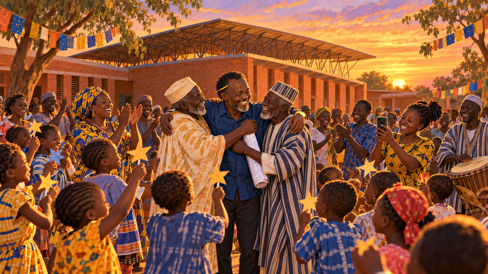

Image Prompt

(This is Panel 10. Do not include the panel number in the image.)
Please generate a 16:9 image in a warm contemporary editorial illustration style with gouache texture and confident linework, depicting panel 10 of 10. Make the characters and style consistent with the prior panel. The scene shows the courtyard of the Gando school in Gando, Burkina Faso, in March 2022, in warm golden evening light. A crowd of villagers of all ages in colorful clothes gather around a young teacher holding a smartphone, clapping, dancing, and laughing, while children wave small hand-made paper stars. In the middle, Francis, now with silver flecks in his neat short beard, an indigo cotton shirt with rolled sleeves, a yellow pencil tucked behind one ear, and a rolled set of drawings under his arm, is embraced by two elders in long robes. Behind them rise the red-brick walls and raised metal roof of the school, and above it a wide orange-and-lavender sunset sky. Strings of bright cloth flags hang between trees, and a drum is being played at the side. Color palette: laterite red, golden ochre, indigo, and lavender sky. The emotional tone should be joyful, grateful, and shared. Generate the image immediately without asking clarifying questions.

In March 2022 the Pritzker Architecture Prize, often called architecture's highest honor, was announced for Francis Kéré, the first native African to receive it. The prize organization described his intelligent use of local materials to respond to the natural climate, and it named Gando Primary School, his first building, as the foundation of his approach. The prize honored a building that Gando's people had made with their own hands as much as it honored its designer.

### Epilogue – What Made Francis Kéré Different?

Kéré did not invent clay brick or the metal roof. What he did was combine them intelligently: thick local earth for thermal mass, a little cement for strength and water resistance, a raised roof for shade and rain protection, and an air gap for natural ventilation. He also refused to separate the building from the building process. He trained villagers to make bricks, raised money abroad, and let a whole community own the result. The best engineers and builders, he showed, solve the problem in front of them with the materials and people they have.

| Challenge | How Kéré Responded | Lesson for Today |
|-----------|---------------------|------------------|
| Gando had no school, and the nearest classrooms were hot, dark, and crowded | He left to learn, and then used what he learned to bring a better school home | Education is only half the job; the other half is bringing it back to the people who need it |
| Concrete block and a bare metal roof overheated the classrooms | He used thick local clay-and-cement bricks for thermal mass and lifted the roof above a perforated brick ceiling | Understand how heat actually moves before choosing materials |
| Plain clay erodes in rain, and some villagers doubted it | He added cement for strength and gave the walls a wide overhanging roof | Respect tradition, and improve it with data and craft |
| The village had little money and almost no trained builders | He raised funds in Berlin and trained local people to make and lay bricks | Teaching skills can be as valuable as supplying materials |
| A single school helps one village, but the idea can help many | He added housing, an extension, and a library, and the school's design inspired later work | Build in a way that others can learn from and copy |

### Call to Action

Next time you step into a hot room, ask why. Is the roof soaking up the sun? Do the walls store heat or slow it down? Does the air have anywhere to go? Explore how clay and masonry store heat in [Chapter 8: Concrete and Masonry](../../chapters/08-concrete-masonry/index.md), why a material's density and conductivity decide how it behaves in [Chapter 5: Material Properties](../../chapters/05-material-properties/index.md), and how ventilated roof layers keep a building cool in [Chapter 13: Roof Assemblies](../../chapters/13-roof-assemblies/index.md). Then take a good idea, learn from the people who will use it, and let's build it right.

---

*"Everyone deserves quality, everyone deserves luxury, and everyone deserves comfort."*
—Francis Kéré, quoted by the Pritzker Architecture Prize

---

## References

1. [Wikipedia: Diébédo Francis Kéré](https://en.wikipedia.org/wiki/Di%C3%A9b%C3%A9do_Francis_K%C3%A9r%C3%A9) - Biography of the Burkinabé-German architect, his education, the Gando school, and his awards
2. [Wikipedia: Thermal mass](https://en.wikipedia.org/wiki/Thermal_mass) - The building-science idea that heavy materials absorb and release heat slowly, as in the school's clay walls
3. [Wikipedia: Stack effect](https://en.wikipedia.org/wiki/Stack_effect) - How warm air rising through a building draws in cooler air, the principle behind the school's passive ventilation
4. [The Pritzker Architecture Prize: Diébédo Francis Kéré](https://www.pritzkerprize.com/laureates/diebedo-francis-kere) - The 2022 laureate biography with details of his childhood, his training, and the Gando Primary School
5. [Kéré Architecture: Gando Primary School](https://www.kerearchitecture.com/work/building/gando-primary-school-3) - The architect's own project description of the materials, roof, and ventilation design
