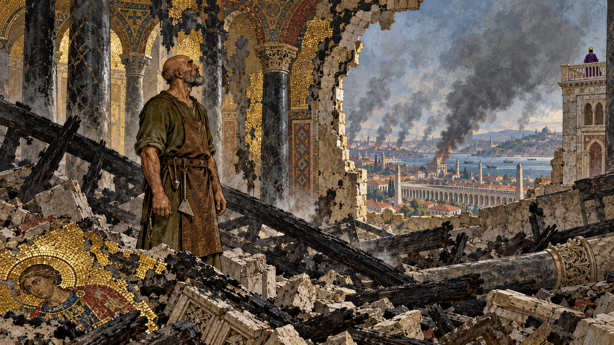
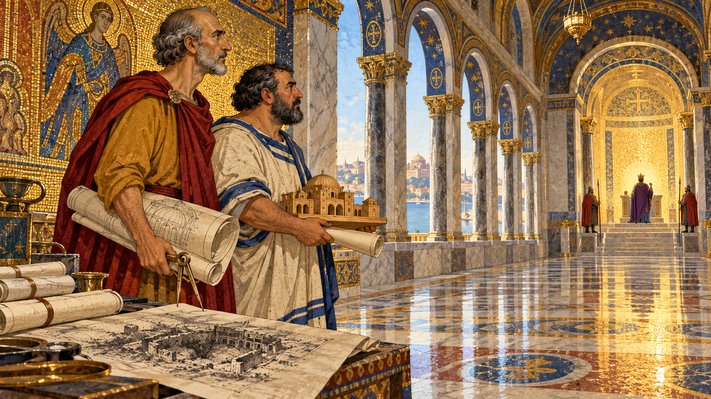
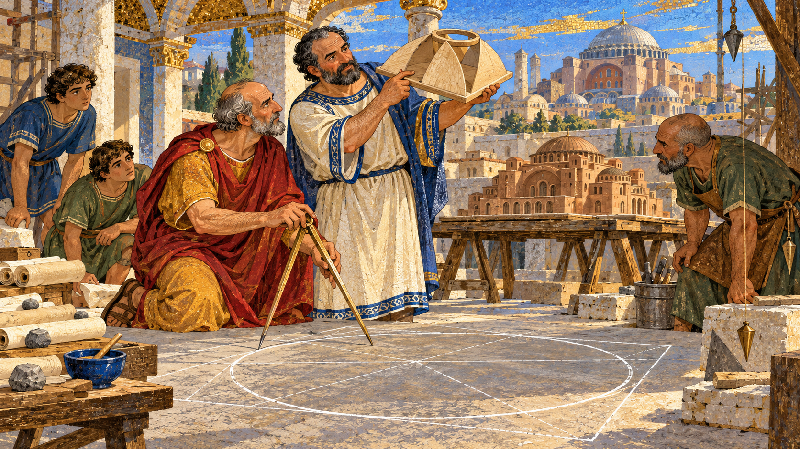
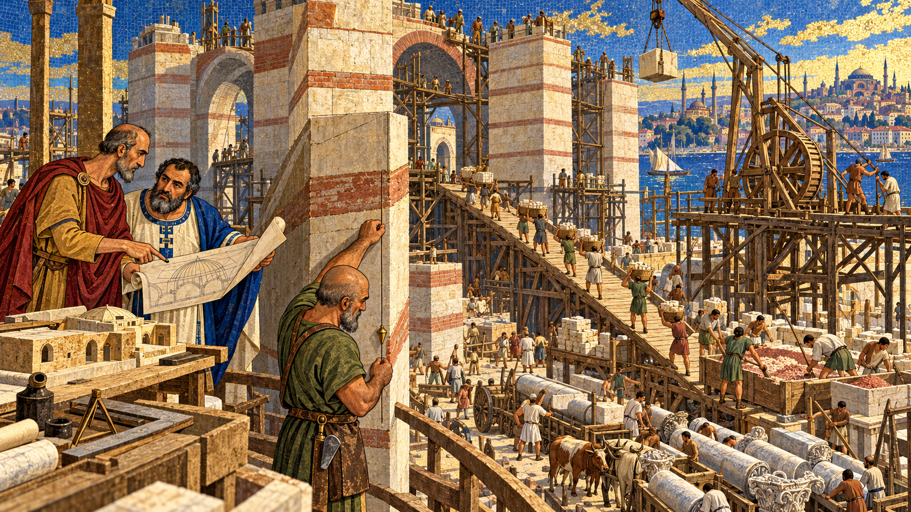
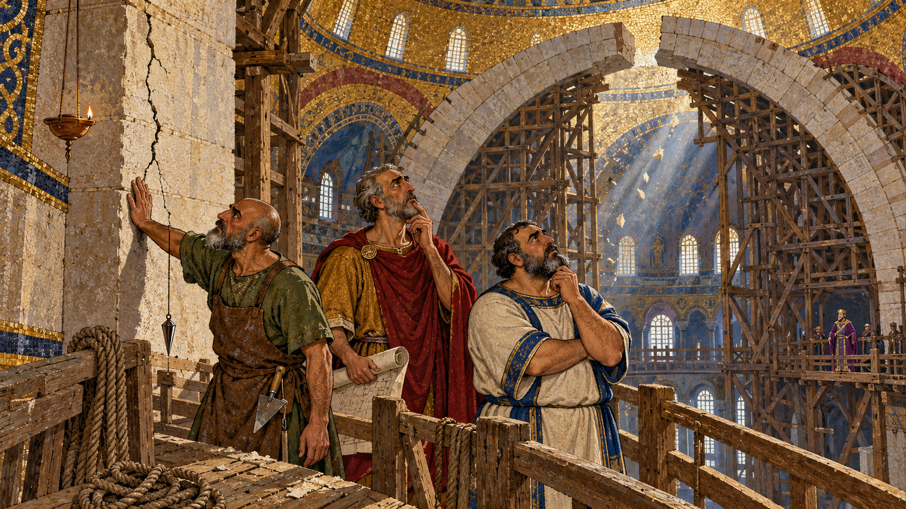
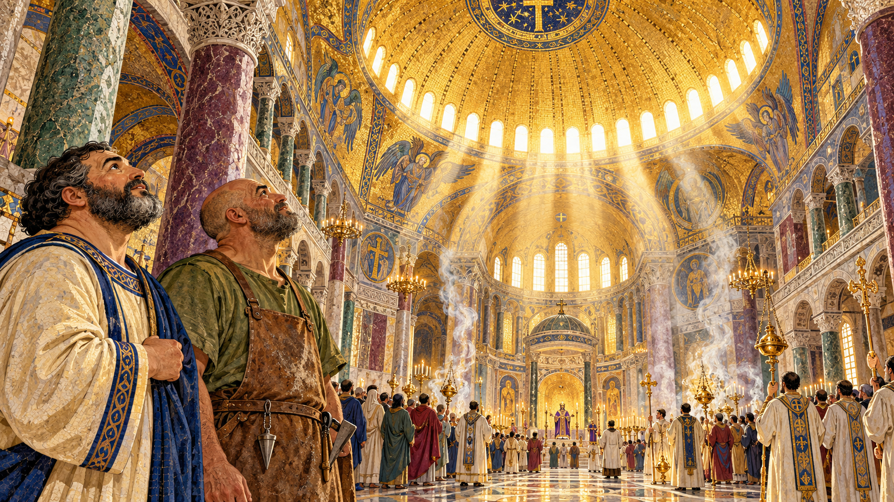
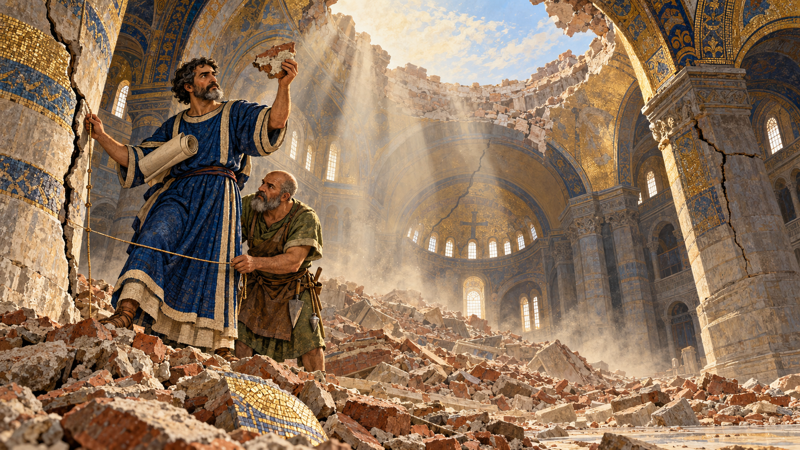
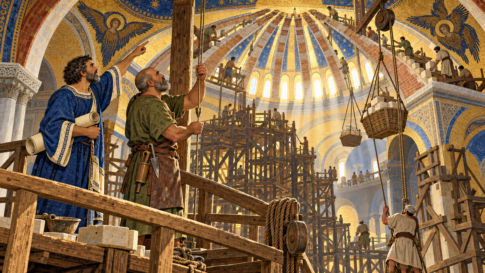

# A Dome Like Heaven

Cover Image Prompt

(This is the Cover Image. Do not include this label in the image.)
Please generate a wide-landscape 16:9 cover image for a graphic novel in a Byzantine mosaic-inspired editorial illustration style with gouache texture and ink linework. In the center foreground, two men in 6th-century Byzantine dress stand on a marble floor looking up: Anthemius, a tall lean man of about sixty with a high forehead, a close-cropped gray beard, an ochre tunic, and a deep red cloak pinned at one shoulder, holding a bronze compass; and Isidore of Miletus, a stocky broad-shouldered man of about fifty-seven with a round face, a short black beard flecked with gray, and a marble-cream tunic with lapis-blue trim, holding a small wooden model of a dome. Above them rises the vast interior of Hagia Sophia: a huge gold-mosaic dome ringed at its base by a crown of small windows pouring light inward, so that the dome seems to float, held up by four enormous curved triangular pendentives and great arches. Faint translucent chalk-line geometry (circles inside squares, arcs, and a sphere cut into four slices) drifts in the golden air like ideas being gathered. A hand-lettered title reads "A Dome Like Heaven" across the top in a bold classical serif typeface, with a smaller subtitle "Anthemius, Isidore, and the Building of Hagia Sophia" along the bottom. Color palette: gold, lapis blue, deep red, marble cream, and olive green. Emotional tone: awe, ambition, and quiet determination. Generate the image immediately without asking clarifying questions.

Narrative Prompt

This story follows the building and rebuilding of Hagia Sophia, the great church of Constantinople (today Istanbul), from the fire of January 532 through its first consecration in December 537, the collapse of its dome in 558, and the reconsecration of the rebuilt dome in December 562. The designers are Anthemius of Tralles and Isidore of Miletus, two scholars of geometry and mechanics chosen by Emperor Justinian I, and, after the collapse, Isidore of Miletus's nephew Isidore the Younger. The art style is a Byzantine mosaic-inspired editorial illustration with gouache texture and confident ink linework, in a palette of gold, lapis blue, deep red, marble cream, and olive green. Keep the recurring characters consistent in every panel. Anthemius is a tall lean man of about sixty with a high forehead, a close-cropped gray beard, an ochre tunic, a deep red cloak pinned at one shoulder, and ink-stained fingers. Isidore of Miletus is a stocky broad-shouldered man of about fifty-seven with a round face, a short black beard flecked with gray, and a marble-cream tunic with lapis-blue trim. The master mason is a weathered man in his forties with a shaved head, an olive-green linen tunic, a leather apron, and a plumb line and trowel at his belt, with a gray beard in the later panels. Isidore the Younger is a middle-aged man with dark curly hair, a neatly trimmed gray-flecked beard, a lapis-blue tunic with cream trim, and a rolled plan under one arm. The Emperor is never shown in detail: only a small, distant figure in a purple robe and diadem. Creative liberties: the dates, places, names, and events are drawn from published sources, but no portraits of the builders survive, so every face and costume is imagined. The master mason is a fictional, unnamed composite of the thousands of craftsmen who built the church. The scenes in Panels 2, 3, 4, and 6 are imagined dramatizations (for example, the chalk-and-model geometry demonstration in Panel 3 and Isidore's presence at the 537 consecration in Panel 6), and no dialogue is quoted. Panel 5 dramatizes an episode that Procopius reports in *On Buildings*, and Panel 7 imagines the engineers studying the wreckage, which the historian Agathias says they did. Three details are tradition rather than established fact and are labeled that way in the text: the figure of more than ten thousand workers, the lightweight bricks said to come from Rhodes, and Justinian's remark about Solomon. Sources also disagree on exactly how much of the dome fell in 558. Show no readable text in any panel image except where a prompt explicitly asks for it.

### Prologue – A Fire and a Promise

In January 532, a week of rioting in Constantinople left the city's greatest church a pile of charred stone. A few weeks later, the emperor asked two scholars to build a new one that would be larger than anything the Roman world had seen, topped by a dome that a contemporary historian said seemed to hang from heaven. They finished in under six years. About twenty years after that, the dome fell down. This is the story of how Anthemius of Tralles, Isidore of Miletus, and a nephew named Isidore the Younger learned that a great building is built twice: once with confidence, and once with what failure teaches.

## Panel 1: Smoke Over Constantinople

Image Prompt

(This is Panel 01. Do not include the panel number in the image.)
I am about to ask you to generate a series of images for a graphic novel. Please make the images have a consistent style and consistent characters. Do not ask any clarifying questions. Just generate the image immediately when asked.

Please generate a 16:9 image in a Byzantine mosaic-inspired editorial illustration style with gouache texture and ink linework, depicting panel 1 of 8. The scene shows the master mason, a weathered man in his forties with a shaved head, an olive-green linen tunic, a leather apron, and a plumb line and trowel at his belt, standing alone in the burned shell of a large basilica in Constantinople in January 532. Around him: blackened marble columns, charred roof timbers fallen across the floor, drifting gray ash, a cracked stone wall with a gap open to the sky, and a scorched gold-mosaic fragment glinting in the rubble. Through the gap behind him the city skyline is visible, with tall columns of dark smoke rising over the curved arches of the Hippodrome stadium and a gray-blue harbor beyond. On a distant palace terrace, a tiny figure in a purple robe and diadem watches the smoke, with no facial detail. The scene is otherwise empty of people. Color palette: charcoal gray, smoky olive, muted deep red, and glints of gold. The emotional tone should be sorrowful but resolute. No readable text anywhere. Generate the image immediately without asking clarifying questions.

On January 13 and 14, 532, a revolt that began in the Hippodrome, the city's chariot-racing stadium, spread fire through Constantinople and burned the great church of Hagia Sophia, whose name means Holy Wisdom. The historian Procopius described the church as a charred mass of ruins. The revolt is called the Nika riots after the rioters' cry of "Nika," or "Victory," and it ended within about a week. Emperor Justinian I did not leave the ruin as a scar on his capital; he treated it as a building site.

## Panel 2: Two Scholars, One Impossible Job

Image Prompt

(This is Panel 02. Do not include the panel number in the image.)
Please generate a 16:9 image in a Byzantine mosaic-inspired editorial illustration style with gouache texture and ink linework, depicting panel 2 of 8. Make the characters and style consistent with the prior panel. The scene shows a long marble gallery of the Great Palace in Constantinople in February 532. In the foreground, seen from the side, stand Anthemius, a tall lean man of about sixty with a high forehead, a close-cropped gray beard, an ochre tunic, and a deep red cloak pinned at one shoulder, holding a bronze compass and rolled drawings, and Isidore of Miletus, a stocky broad-shouldered man of about fifty-seven with a round face, a short black beard flecked with gray, and a marble-cream tunic with lapis-blue trim, carrying a scroll and a small wooden model of a dome. At the far end of the gallery, a small distant figure in a purple robe and diadem stands in a pool of golden light, with no facial detail, as two guards in red cloaks stand at the side. Details: a gold-mosaic wall, a row of round-arched windows, a polished marble floor reflecting the light, stacks of scrolls on a side table, and a faint charcoal-smudged map of the burned site. Color palette: gold, lapis blue, deep red, marble cream, and olive. The emotional tone should be awe mixed with nervous ambition. No readable text anywhere. Generate the image immediately without asking clarifying questions.

On February 23, 532, only weeks after the fire, Justinian began a third church on the site, and Procopius reports that he gathered craftsmen from across the world. For the design he chose Anthemius of Tralles and Isidore of Miletus, two men better known as scholars than as builders. Anthemius wrote on geometry and on how curved mirrors focus light, while Isidore taught physics and solid geometry in Alexandria and Constantinople and compiled the first comprehensive collection of Archimedes' works. Justinian was betting that people who understood the mathematics of curves could handle the largest vault anyone had attempted.

## Panel 3: A Round Dome on a Square Room

Image Prompt

(This is Panel 03. Do not include the panel number in the image.)
Please generate a 16:9 image in a Byzantine mosaic-inspired editorial illustration style with gouache texture and ink linework, depicting panel 3 of 8. Make the characters and style consistent with the prior panel. The scene shows a sunlit workshop courtyard in Constantinople in 532, with a big plaster floor on which a huge chalk circle has been drawn inside a larger square. Anthemius, a tall lean man of about sixty with a high forehead, a close-cropped gray beard, an ochre tunic, and a deep red cloak, kneels beside the drawing holding a long bronze compass. Isidore of Miletus, a stocky broad-shouldered man of about fifty-seven with a round face, a short black beard flecked with gray, and a marble-cream tunic with lapis-blue trim, holds up a pale wooden sphere that has been sliced so that four curved triangular wedges rise from the corners of a square wooden base to meet in a circle at the top. Details: a clay model of a church with a low dome on a trestle table, rolls of papyrus weighted by stones, a plumb bob hanging from a rafter, a lapis-blue pigment bowl, and two young apprentices peering in. Color palette: marble cream, ochre, lapis blue, olive, and touches of gold. The emotional tone should be eureka-bright and intellectually playful. No readable text anywhere. Generate the image immediately without asking clarifying questions.

Their problem was geometry. They wanted a huge round dome floating over a square hall, with no forest of columns blocking the view. The answer was the pendentive: four curved, triangular pieces of a sphere that rise from the corners of the square and blend into a circle at the top. Pendentives gather the dome's weight and funnel it into four giant corner piers, so the load has a clear path to the ground; Hagia Sophia was one of the first large buildings to rely on them. Two big half-domes at the east and west ends help brace the main dome along the length of the church.

## Panel 4: Ten Thousand Hands

Image Prompt

(This is Panel 04. Do not include the panel number in the image.)
Please generate a 16:9 image in a Byzantine mosaic-inspired editorial illustration style with gouache texture and ink linework, depicting panel 4 of 8. Make the characters and style consistent with the prior panel. The scene shows the busy construction site of Hagia Sophia in Constantinople in about 534, seen from a raised platform. Four enormous stone piers rise in the middle of a square, with wooden scaffolding and a ramp climbing alongside them. The master mason, a weathered man in his forties with a shaved head, an olive-green linen tunic, and a leather apron, stands in the foreground holding a plumb line against a pier. Behind him, workers carry baskets of very pale, light-colored bricks up the ramp, others stir a wooden trough of pinkish mortar mixed with crushed brick, and a timber crane with a treadwheel lifts a block. Stacks of marble columns lie in the foreground next to ox carts. Anthemius, a tall lean man in an ochre tunic and a deep red cloak, and Isidore of Miletus, a stocky man in a marble-cream tunic with lapis-blue trim, stand at the edge of the platform pointing at a rolled drawing. Details: thick bands of mortar between the bricks, rope and pulley, shaded awnings, and hundreds of small workers. Color palette: terracotta, cream, olive, lapis blue, and gold dust in the sunbeams. The emotional tone should be energetic and determined. No readable text anywhere. Generate the image immediately without asking clarifying questions.

Construction raced ahead, with more than ten thousand workers on site according to the traditional figure. Later Byzantine tradition says the dome's bricks were made on the island of Rhodes from clay so light that twelve of them weighed no more than one ordinary brick, and the great dome is indeed a thin shell, only about 60 centimeters (two feet) thick across a span of roughly 32 meters (105 feet). The builders laid the masonry with joints of lime mortar mixed with crushed brick and pottery, joints as thick as the bricks or thicker. According to the structural historian Rowland Mainstone, the crews also worked so fast that the soft mortar had little time to harden, so the heavy walls squeezed it and began to lean outward as the weight grew.

## Panel 5: The Arch That Held Itself Up

Image Prompt

(This is Panel 05. Do not include the panel number in the image.)
Please generate a 16:9 image in a Byzantine mosaic-inspired editorial illustration style with gouache texture and ink linework, depicting panel 5 of 8. Make the characters and style consistent with the prior panel. The scene shows the inside of the unfinished Hagia Sophia in Constantinople in about 535, high on a timber working platform beside a massive stone pier. A great half-built stone arch curves overhead, its two halves reaching toward each other with a gap still open at the top and supported underneath by a dense frame of wooden props. A thin, jagged crack, drawn as a fine dark line, runs up the face of the pier. The master mason, a weathered man in his forties with a shaved head, an olive-green linen tunic, and a leather apron, presses his palm flat beside the crack. Anthemius, a tall lean man of about sixty with a gray beard, an ochre tunic, and a deep red cloak, and Isidore of Miletus, a stocky man with a short black beard flecked with gray and a marble-cream tunic with lapis-blue trim, look up at the arch with tense, worried faces. In the lower background, a small distant figure in a purple robe and diadem stands on a wooden gallery listening, with no facial detail. Details: flakes of plaster falling in a slant of light, a coil of rope, a plumb line hanging straight, and a clay lamp. Color palette: dusty cream, ochre, deep red, lapis blue shadows, and olive. The emotional tone should be held-breath tension. No readable text anywhere. Generate the image immediately without asking clarifying questions.

During construction, Procopius reports, the piers under the unfinished eastern arch suddenly began to crack, and Anthemius and Isidore, frightened, took the problem to Justinian. The emperor, who was no builder, told them to finish the curve of the arch, because once it closed it would carry itself and no longer need the props beneath it. The craftsmen did so, and the arch hung secure. An arch under construction is a different structure from a finished one: it needs temporary props until the last stone, the keystone, locks it, and when it closes the load shifts into compression along its curve and out to the piers.

## Panel 6: A Dome Hung from Heaven

Image Prompt

(This is Panel 06. Do not include the panel number in the image.)
Please generate a 16:9 image in a Byzantine mosaic-inspired editorial illustration style with gouache texture and ink linework, depicting panel 6 of 8. Make the characters and style consistent with the prior panel. The scene shows the finished interior of Hagia Sophia in Constantinople on the day of its consecration, 27 December 537. A ring of forty small arched windows around the base of the immense gold-mosaic dome blazes with light, so that the dome seems to float above the nave without any visible support. Marble columns in green and white, purple porphyry, and polished cream floors reflect the glow. In the lower foreground, Isidore of Miletus, a stocky man with a round face, a short black beard flecked with gray, and a marble-cream tunic with lapis-blue trim, stands beside the master mason, a weathered man with a shaved head, an olive-green linen tunic, and a leather apron, both with their heads tipped back in wonder. Small robed figures of priests carrying censers and a procession of citizens fill the nave, and a tiny distant figure in a purple robe and diadem stands near the front, with no facial detail. Smoke from incense curls up through shafts of golden light. Color palette: gold, lapis blue, deep red, marble cream, and olive green. The emotional tone should be transcendent and overwhelmed. No readable text anywhere. Generate the image immediately without asking clarifying questions.

On December 27, 537, five years and ten months after the first stone, Justinian and the patriarch Menas dedicated the new Hagia Sophia. Forty windows around the dome's base flooded the nave with light and lightened the structure, so Procopius wrote that the dome seemed not to rest on solid masonry but to be suspended from Heaven. A later tradition says the emperor declared that he had surpassed Solomon, builder of the Temple in Jerusalem. Anthemius, whose death date is not firmly recorded, appears to have died early in the project, and Agathias later wrote that he had long been dead by 558.

## Panel 7: The Night the Dome Fell

Image Prompt

(This is Panel 07. Do not include the panel number in the image.)
Please generate a 16:9 image in a Byzantine mosaic-inspired editorial illustration style with gouache texture and ink linework, depicting panel 7 of 8. Make the characters and style consistent with the prior panel. The scene shows the interior of Hagia Sophia in Constantinople at dawn in May 558, after an earthquake. The great dome is gone from the center, leaving an open gap with ragged stone edges through which pale morning light and dust pour down onto a mound of fallen bricks and cracked mortar on the marble floor. The huge curved arches and corner piers still stand, with one visible diagonal crack and one pier leaning slightly outward, and a half-dome at the far end has a long fracture. Fine dust hangs in glowing shafts of light. In the foreground, standing on a ridge of rubble, is Isidore the Younger, a middle-aged man with dark curly hair, a neatly trimmed gray-flecked beard, a lapis-blue tunic with cream trim, and a rolled plan under one arm, holding up a broken brick with a thick band of mortar to the light. Beside him, the master mason, now with a gray beard, an olive-green linen tunic, and a leather apron, measures a crack with a knotted cord. The nave is otherwise empty of people. Color palette: dusty cream, ochre, ash gray, lapis blue in the shadows, and a thin line of gold in the broken mosaic. The emotional tone should be sober and thoughtful, with a spark of determination. No readable text anywhere. Generate the image immediately without asking clarifying questions.

An earthquake in December 557 cracked the dome, and in May 558, according to the usual account, the dome came down, along with parts of the eastern half-dome (sources differ on exactly how much fell). The usual diagnosis, which modern analysts share, is that the dome was too flat. A dome carries its weight mainly by pressing along its curved ribs, but a flatter one also pushes out harder at its base, where the masonry has to resist a ring-shaped tension like the hoops of a barrel, and brick and mortar are weak when pulled apart. That outward push had deformed the piers that carried the dome, and the shaking finished the job.

## Panel 8: Higher, Lighter, Ribbed

Image Prompt

(This is Panel 08. Do not include the panel number in the image.)
Please generate a 16:9 image in a Byzantine mosaic-inspired editorial illustration style with gouache texture and ink linework, depicting panel 8 of 8. Make the characters and style consistent with the prior panel. The scene shows the interior of Hagia Sophia in Constantinople in about 561, with a tall wooden scaffold filling the center of the nave and a new, taller dome taking shape above it: forty curved stone-and-brick ribs sweep up from the base to meet at the crown, like the ribs of an umbrella, with windows between them letting in beams of light. On a high timber platform in the foreground stands Isidore the Younger, a middle-aged man with dark curly hair, a neatly trimmed gray-flecked beard, a lapis-blue tunic with cream trim, and a rolled plan under one arm, pointing up at a rib. Beside him the master mason, a gray-bearded man in an olive-green linen tunic and leather apron, checks a rib with a plumb line. Workers on ropes lift pale, lightweight bricks in baskets, and others straighten the great piers with timber braces. Details: a wooden measuring rod, a pulley with coiled rope, a glowing ring of window openings, a clean fresh arch edge, and warm lamplight against cool shadow. Color palette: gold, lapis blue, deep red, marble cream, and olive green. The emotional tone should be hopeful, patient, and proud. No readable text anywhere. Generate the image immediately without asking clarifying questions.

Justinian ordered an immediate rebuild, and Isidore the Younger, nephew of the elder Isidore, led it. Agathias reports that he and the other engineers studied the old design and the surviving structure to work out what had gone wrong. They took down the remains, strengthened the supporting walls and piers, raised the dome about 6 meters (20 Byzantine feet), gave it a ribbed form, and used lighter materials. The new church was dedicated again on December 24, 562, and although later earthquakes brought down parts of the dome again, notably in 989, builders repaired it each time and added buttresses over the centuries, so the dome still stands.

### Epilogue – What Made These Builders Different?

Anthemius and Isidore of Miletus brought geometry and physics to a construction site and dared to solve a problem that nobody had solved at that scale. When the structure complained, in cracks and flaking stone, they told the person responsible instead of hiding it. When the dome fell, Isidore the Younger did not blame the earthquake alone: he studied the wreckage, found the design's weakness, and fixed it. Hagia Sophia survived because each generation after them kept inspecting, repairing, and strengthening it.

| Challenge | How These Builders Responded | Lesson for Today |
|-----------|------------------------------|------------------|
| A round dome had to sit on a square hall with no room for columns | Anthemius and Isidore used pendentives and semi-domes to give the load a clear path to four piers | Solve the load path first, and let the shape follow |
| Piers began to crack during construction, before the arch was complete | They reported the problem, finished the arch so it carried itself, and replaced strained parts | A structure under construction behaves differently than a finished one, and early warnings are worth acting on |
| The first dome was too flat and pushed outward, and earthquakes weakened it until it collapsed in 558 | Isidore the Younger studied what was left and rebuilt a taller, ribbed dome with lighter materials | Treat a failure as data: diagnose it before rebuilding |
| Heavy masonry in an earthquake zone is unforgiving | Later builders added buttresses and repaired damage again and again over centuries | Design for the hazards of the site, and keep maintaining what you build |
| A great building has to outlive its designers | Isidore the Younger, and later repairers, inherited a design and improved it | Record what you learn, because someone else will carry the work forward |

### Call to Action

The next time you look at a dome, an arch, or a heavy brick wall, trace the path of the load from the top to the ground. Chapter 6 on [structural loads and load paths](../../chapters/06-structural-loads/index.md) will give you the tools for that, Chapter 8 on [concrete and masonry](../../chapters/08-concrete-masonry/index.md) will show you why brick and mortar like to be squeezed and hate being pulled, and Chapter 21 on [durability and failure](../../chapters/21-durability-failure/index.md) will teach you to read cracks and failures as lessons. Great engineers and builders are not the ones who never see a failure; they are the ones who learn from it and build better. Let's build it right.

---

*"...to cover the space with its golden dome suspended from Heaven."*
—Procopius, *On Buildings*, Book I, on the dome of Hagia Sophia (Dewing translation)

---

## References

1. [Wikipedia: Hagia Sophia](https://en.wikipedia.org/wiki/Hagia_Sophia) - History of the church from the 532 fire through the 537 consecration, the 558 collapse, and later repairs
2. [Wikipedia: Anthemius of Tralles](https://en.wikipedia.org/wiki/Anthemius_of_Tralles) - Biography of the Byzantine mathematician and architect who co-designed Hagia Sophia
3. [Wikipedia: Isidore of Miletus](https://en.wikipedia.org/wiki/Isidore_of_Miletus) - Biography of the geometer and physicist, his scholarship, and his nephew Isidore the Younger
4. [World History Encyclopedia: Hagia Sophia](https://www.worldhistory.org/Hagia_Sophia/) - Overview of the building's design, construction, dome problems, and rebuilding
5. [Procopius, On Buildings, Book I (LacusCurtius)](https://penelope.uchicago.edu/Thayer/E/Roman/Texts/Procopius/Buildings/1A%2A.html) - A contemporary sixth-century account of the building, including the cracking piers and the arch episode, in the Dewing translation
