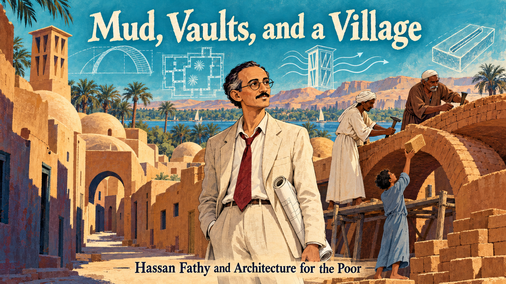
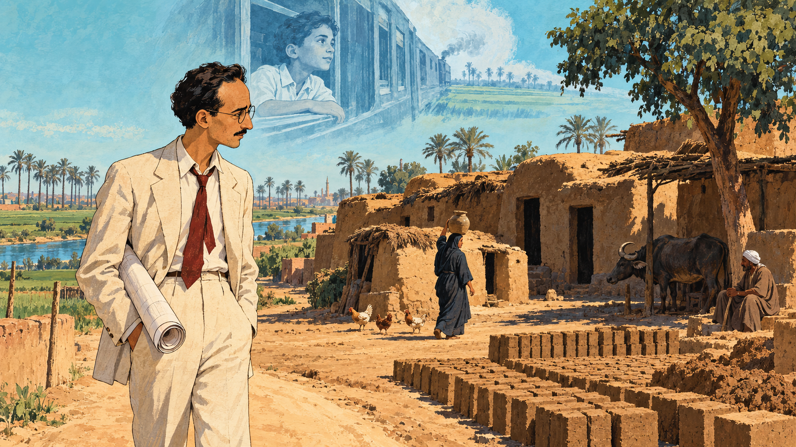
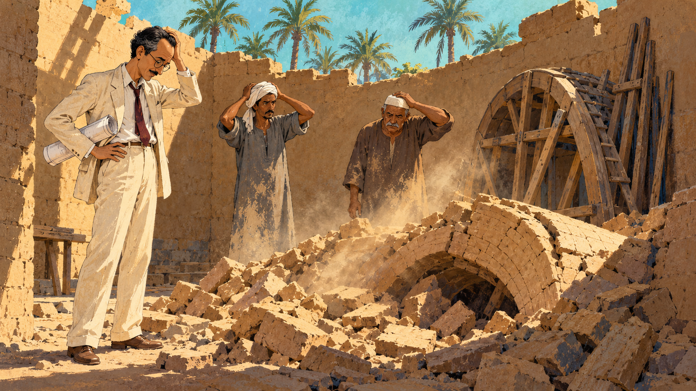
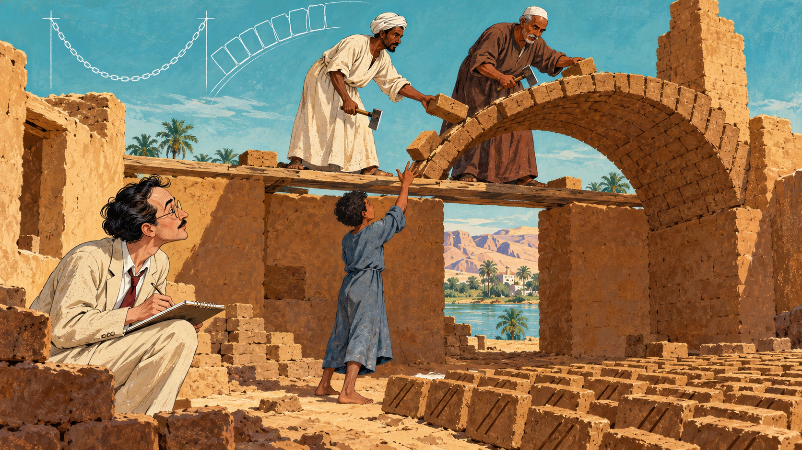
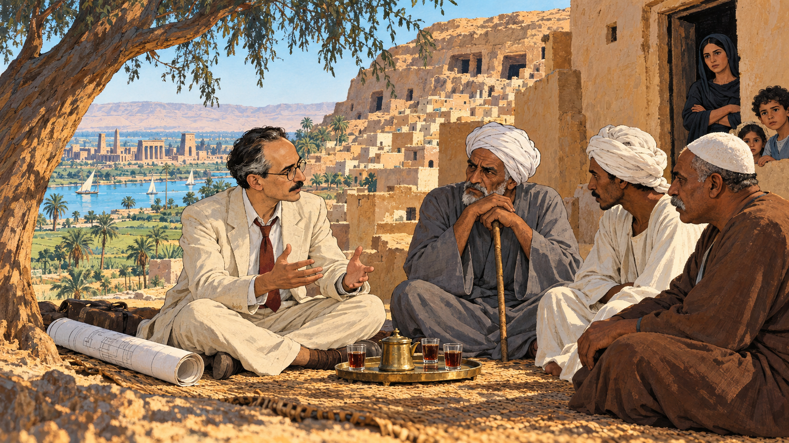
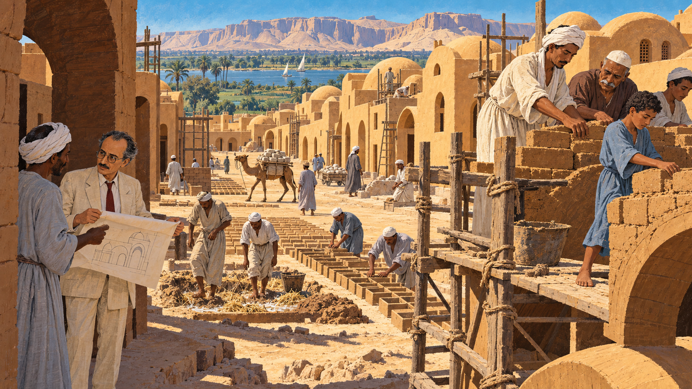
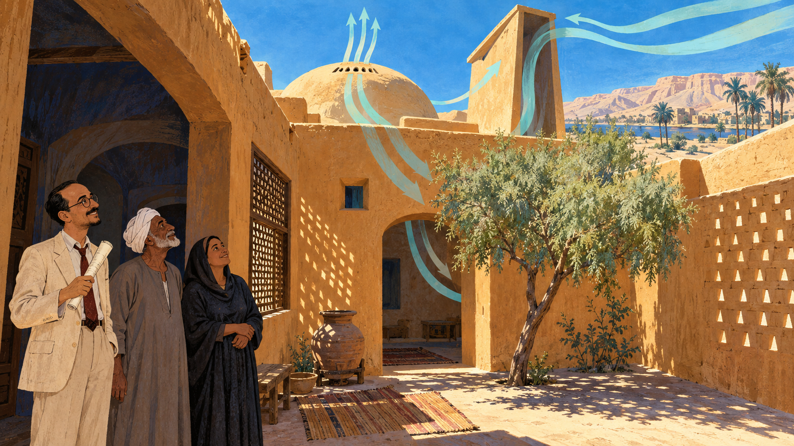
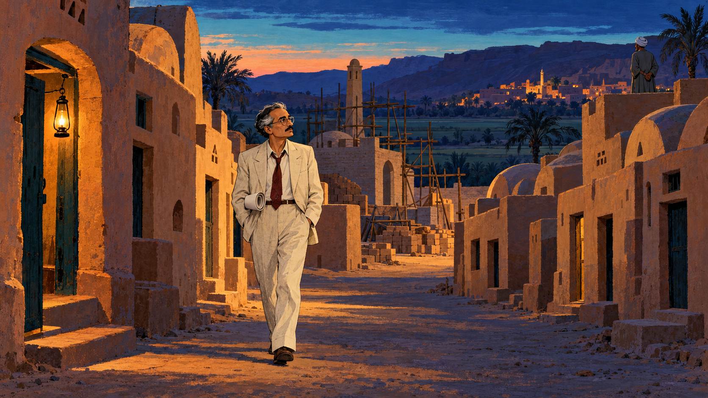
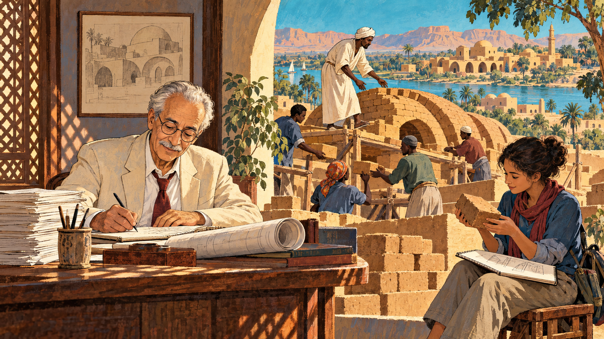

# Mud, Vaults, and a Village

Cover Image Prompt

(This is the Cover Image. Do not include this label in the image.)
Please generate a wide-landscape 16:9 cover image for a graphic novel in a mid-century editorial illustration style with gouache texture and confident ink linework. In the center foreground, a slender Egyptian man in his early forties with a high forehead, dark hair with a little gray at the temples, a thin dark mustache, round wire-rimmed glasses, a cream linen suit with a loosened dark-red tie, and a rolled drawing under his arm stands in a sunlit lane between rows of ochre mud-brick houses topped with rounded domes and long barrel vaults. Behind him, two Nubian masons in long galabeyas, one with a white turban cloth and one with a white skullcap, stand on planks building a curved brick vault with small adzes while a barefoot boy in a faded blue galabeya tosses up a brick. A tall wind-catcher chimney rises from one roof. A strip of Nile-turquoise sky and a line of date palms sit above the rooftops, and low desert hills glow in the distance. Around the scene, ghostly translucent line drawings float in the air like ideas being gathered: a sweeping arch curve, a courtyard plan, a wind-catcher with curved arrows of air, and a single brick with two parallel grooves. A hand-lettered title reads "Mud, Vaults, and a Village" across the top in a friendly serif typeface, with a smaller subtitle "Hassan Fathy and Architecture for the Poor" along the bottom. Color palette: sand, mud-brick ochre, Nile turquoise, terracotta, and deep indigo shadows. Emotional tone: warm, proud, quietly hopeful. Generate the image immediately without asking clarifying questions.

Narrative Prompt

This story follows the Egyptian architect Hassan Fathy (1900–1989) from his early dream of improving village life, through his discovery of Nubian mud-brick vaulting in 1941, to the building of New Gourna near Luxor in the 1940s and the publication of his book *Architecture for the Poor*. The settings are the Nile Delta, the outskirts of Cairo, Aswan, and the west bank of the Nile at Luxor, between about 1910 and the 1980s. The art style is a mid-century editorial illustration: gouache texture, confident ink outlines, and a desert palette of sand, mud-brick ochre, Nile turquoise, terracotta, and deep indigo. Hassan is drawn as a stylized interpretation rather than a portrait: slender, with a high forehead, a thin dark mustache, round wire-rimmed glasses, a cream linen suit with a loosened dark-red tie, and a rolled drawing under his arm, with his dark hair turning silver across the panels. Two Nubian masons from Aswan recur: a lean man with a white turban cloth and a long cream galabeya, and a broader, older man with a gray mustache, a brown galabeya, and a white skullcap. A village boy of about fourteen in a faded blue galabeya and a village elder in his sixties with a white turban and a gray galabeya recur as composite figures. Keep each look consistent in every panel. Creative liberties: the dates, places, names, numbers, and events are drawn from published sources, mainly Fathy's own account in *Architecture for the Poor* and secondary histories, but the individual scenes are imagined to make the story visible. The ghostly boy at the train window in Panel 1, the meeting of Fathy and village elders in Panel 4, and the walk through the empty street in Panel 7 are dramatizations, not records of specific moments, and the boy and the elder are composite figures rather than named individuals. Fathy's book is his own, and often one-sided, telling of the project, so the story also draws on later scholarship about why many villagers did not move. Sources disagree on some dates and counts for New Gourna, and the story notes this where it matters. Show no readable text in any panel image except where a prompt explicitly asks for it.

### Prologue – A Roof Made of Mud

How do you put a roof on a house when you have no timber, no steel, and no money? Hassan Fathy faced that question in the first years of World War II, and the answer he found was an ancient technique that Nubian builders in southern Egypt were still using at that very moment. He fell in love with that answer, tried to build an entire village with it, and met both a stunning success and a painful disappointment. This is the story of how a roof of earth, a village by the Nile, and a book called *Architecture for the Poor* changed how the world thinks about building with the ground beneath our feet.

## Panel 1: A Question Seen from a Train Window

Image Prompt

(This is Panel 01. Do not include the panel number in the image.)
I am about to ask you to generate a series of images for a graphic novel. Please make the images have a consistent style and consistent characters. Do not ask any clarifying questions. Just generate the image immediately when asked.

Please generate a 16:9 image in a mid-century editorial illustration style with gouache texture and ink linework, depicting panel 1 of 8. The scene shows a slender Egyptian man of about twenty-seven with a high forehead, dark hair, a thin dark mustache, round wire-rimmed glasses, a cream linen suit with a loosened dark-red tie, and a rolled drawing under his arm, standing on a dusty lane at the edge of a farm in the Nile Delta, Egypt, in about 1927. Before him stands a cluster of low, dark mud huts with no windows, a few chickens, a water buffalo in the shade of a single tree, and a woman in a dark headscarf carrying a clay jar. Unfinished sun-dried mud bricks are stacked in rows in the sun beside the huts. In the pale turquoise sky above him floats a faint, translucent, ghostly drawing of a small boy in a white collared shirt looking out of an old steam-train window at green fields rushing past. A pencil-thin line of date palms and a canal glitter in the distance. His shoulders are slightly bowed as he looks at the huts, thoughtful and troubled. Color palette: sand, mud-brick ochre, Nile turquoise, terracotta, and indigo shadows. The emotional tone should be quiet determination mixed with unease. Generate the image immediately without asking clarifying questions.

Hassan Fathy was born in Alexandria in 1900 and graduated as an architect in 1926. He later wrote that as a boy he had watched the Egyptian countryside slide past a train window on the way from Cairo to the seaside, and that he dreamed of someday building a village. Then, as a young architect supervising a school in the Delta, he walked through real farms and was shocked by the dark, windowless huts in which families lived. His first reaction was to want to fix the housing, and his second, which would shape his career, was to notice that those huts were made of the cheapest building material in the world: sun-dried mud.

## Panel 2: When the Roofs Fell Down

Image Prompt

(This is Panel 02. Do not include the panel number in the image.)
Please generate a 16:9 image in a mid-century editorial illustration style with gouache texture and ink linework, depicting panel 2 of 8. Make the characters and style consistent with the prior panel. The scene shows the same slender Egyptian man, now about forty, with a high forehead, dark hair with a little gray at the temples, a thin dark mustache, round wire-rimmed glasses, a cream linen suit with a loosened dark-red tie, and a rolled drawing under his arm, standing in a roofless mud-brick room on a farm near Cairo in about 1940. At his feet lies a heap of broken mud bricks where a half-built curved vault has just collapsed. Two local masons in plain gray galabeyas with dust on their arms stand with their hands on their heads. Behind them, a rough wooden frame in the shape of an arch, called centering, leans against the wall, and a few thin wooden beams are stacked in the corner. Through the open roof, a pale turquoise sky and a line of palm trees are visible, and a dust cloud still hangs in a shaft of sunlight. Color palette: ochre, sand, dusty gray-brown, turquoise sky, and indigo shadows. The emotional tone should be frustration, humor, and stubborn curiosity. Generate the image immediately without asking clarifying questions.

Fathy had started designing country houses in mud brick, and he even held an exhibition of them in 1937, but roofs were the problem. Timber was expensive, and once World War II cut off supplies of steel and timber, he wondered whether the bricks could roof themselves. A normal brick vault is built over a temporary wooden frame called centering, and Fathy knew that centering was beyond a poor family's budget, so at a farm near Cairo he asked his masons to build vaults without it. The vaults promptly fell down, again and again, and Fathy later admitted that he had begun to fear the secret had been lost with the ancient builders.

## Panel 3: The Masons from Aswan

Image Prompt

(This is Panel 03. Do not include the panel number in the image.)
Please generate a 16:9 image in a mid-century editorial illustration style with gouache texture and ink linework, depicting panel 3 of 8. Make the characters and style consistent with the prior panel. The scene shows the same farm, in 1941, with the roofless room now carrying a half-finished curved brick vault that leans out from a taller end wall. Two Nubian masons stand on a pair of wooden planks laid across the side walls: a lean man in his forties with a white turban cloth and a long cream galabeya, and a broader, older man with a gray mustache, a brown galabeya, and a white skullcap. Each holds a short-handled adze and has no other tool at his belt. A barefoot boy of about fourteen in a faded blue galabeya stands below, tossing a small grooved mud brick up to them. On the ground are rows of drying bricks with two diagonal finger-drawn grooves across their faces. Fathy, the slender man with round wire-rimmed glasses, a thin dark mustache, a cream linen suit, and dark-red tie, crouches at the edge of the room with his sketchbook, wide-eyed. In the pale turquoise sky behind, faint ghostly line drawings float: a hanging chain curve and a leaning row of bricks. Color palette: ochre, cream, Nile turquoise, terracotta, and deep indigo. The emotional tone should be wonder and respect. Generate the image immediately without asking clarifying questions.

Fathy's elder brother, who worked on the Aswan Dam, told him that Nubian builders raised vaults with no supports at all. In February 1941 Fathy traveled to Aswan with a group from the School of Fine Arts and found the technique alive in the village of Gharb Aswan. Back in Cairo he wrote for masons, and two of them, Abdu Hamed and Abdul Rahim Abu en Nur, arrived and finished a three-by-four-meter room roof in about a day and a half, using only adzes. They traced an arch on the end wall, then laid mud bricks in courses that lean against it, with each brick stuck to the one below by grooves and a little wet mud, so the roof grew out into empty air. The shape is the secret: earth is strong when it is squeezed (compression) but weak when it is bent or pulled (tension), and a vault curved the right way turns every load into squeezing along the arch. Fathy's own estimate was that such a room cost about a fifth of the same room in timber or concrete, and it needed no steel, no timber, and no centering.

## Panel 4: A Village on Top of Tombs

Image Prompt

(This is Panel 04. Do not include the panel number in the image.)
Please generate a 16:9 image in a mid-century editorial illustration style with gouache texture and ink linework, depicting panel 4 of 8. Make the characters and style consistent with the prior panel. The scene shows the hillside village of Old Gourna on the west bank of the Nile near Luxor, Egypt, in 1945. Crowded ochre and sand-colored mud houses cling to a rocky slope, with dark openings of ancient rock-cut tombs among them, and green farmland, the river, and a distant temple skyline stretch in the valley below. In the shade of a large tamarisk tree in the foreground, Fathy, now about forty-five with a high forehead, dark hair graying at the temples, a thin dark mustache, round wire-rimmed glasses, a cream linen suit, dark-red tie, and a rolled drawing beside him, sits cross-legged on a woven mat across from a village elder in his sixties with a white turban, a gray galabeya, and a walking staff, and two other men in turbans. Tea glasses sit on a small brass tray between them. Behind them, a woman in a dark headscarf stands in a doorway with her arms folded, listening, and a few children peek around the wall. The elder's expression is serious and unconvinced. Color palette: warm ochre, sand, Nile turquoise, terracotta, and indigo shadows. The emotional tone should be tense respect, with two sides listening to each other. Generate the image immediately without asking clarifying questions.

In 1945 the Egyptian Department of Antiquities needed a solution. About seven thousand people lived in Old Gourna, in houses built on and around the ancient tombs of Thebes, and for decades many families had earned a living from the antiquities trade, which meant the tombs were being damaged and looted. Officials had decided to move the villagers to a new site, and when they saw Fathy's mud-brick buildings they asked him to design the new village. Fathy accepted, took a three-year leave from his teaching at the School of Fine Arts, and began meeting the families, but the people of Gourna had never asked to leave. They were being moved from homes, fields, and a livelihood they knew, and they did not have to like the plan just because it was free and well meant.

## Panel 5: Training a Village to Build

Image Prompt

(This is Panel 05. Do not include the panel number in the image.)
Please generate a 16:9 image in a mid-century editorial illustration style with gouache texture and ink linework, depicting panel 5 of 8. Make the characters and style consistent with the prior panel. The scene shows the building site of New Gourna in 1946, on flat farmland between the Nile valley and the desert hills. A street of newly built mud-brick houses with ochre domes and barrel vaults runs toward the camera. On a plank scaffold in the foreground, the two Nubian masons, the lean man in the white turban cloth and cream galabeya and the broader older man with the gray mustache, brown galabeya, and white skullcap, guide a row of young village apprentices laying bricks, including a barefoot boy of about fourteen in a faded blue galabeya. In the middle ground, workers in galabeyas mix mud and straw with their feet in a shallow pit and press wet bricks into wooden molds, setting them in long rows to dry in the sun. A camel carries stone along a dirt track. Fathy, with a few more gray hairs, a high forehead, a thin dark mustache, round wire-rimmed glasses, a cream linen suit, and a dark-red tie, stands in the shade of a half-built wall unrolling a drawing and talking with a mason. Color palette: sand, ochre, terracotta, Nile turquoise, and deep indigo. The emotional tone should be busy, hands-on pride. Generate the image immediately without asking clarifying questions.

Fathy brought in masons from Aswan, hired local workers, and set up a system to train village boys and men as masons, so that skill would stay in the community. By the end of the project, he reported, forty-six local masons had learned to build vaults and domes. The village plan gave a neighborhood to each of the five hamlets of Old Gourna and included a mosque, a market, a khan (a traditional inn and workshop building), a theater, a town hall, and two schools. Fathy's own accounts claimed that the buildings cost only a fraction of comparable government buildings in concrete, but because he had to pay laborers and could not use the cooperative building traditions he hoped for, he admitted that Gourna did not fully prove the cost case.

## Panel 6: Houses That Breathe

Image Prompt

(This is Panel 06. Do not include the panel number in the image.)
Please generate a 16:9 image in a mid-century editorial illustration style with gouache texture and ink linework, depicting panel 6 of 8. Make the characters and style consistent with the prior panel. The scene shows an enclosed courtyard of a mud-brick house in New Gourna, Egypt, in 1947, in blazing midday sun. A thick ochre wall with a small deep-set window wraps around a courtyard with a tamarisk tree, a clay water jar in the shade, and a woven mat. On the roof, a tall slanted wind-catcher chimney opens toward the sky, and thin curved ribbons of pale turquoise air are drawn flowing in over the roof, down through the room, and out through the top of a dome. A carved wooden lattice screen, a mashrabiya, softens the light at one window, and a perforated mud-brick wall lets in a pattern of small bright dots. Fathy, with a high forehead, a thin dark mustache, round wire-rimmed glasses, a cream linen suit, and a dark-red tie, stands in the shaded doorway fanning himself with his rolled drawing, with a pleased expression, while the village elder in his gray galabeya and white turban and a woman in a dark headscarf stand beside him looking up at the airflow. Outside the courtyard, the desert looks hot and white. Color palette: sand, ochre, terracotta, Nile turquoise, and indigo shadows. The emotional tone should be cool relief and ingenious calm. Generate the image immediately without asking clarifying questions.

Upper Egypt is hot and dry, with a huge swing between day and night. Fathy used thick earthen walls because mud is a poor heat conductor and has high thermal mass, so it heats slowly during the day and releases that heat slowly at night; at Gourna he found the downstairs rooms peaked roughly five hours after the outdoor air did. His courtyards act like wells for cool night air, domes let rising hot air escape at the top, and a wind-catcher, called a malqaf, scoops higher, cleaner wind down into the room. In the Gourna schools he added a damp charcoal tray inside the wind-catcher, so that evaporating water cooled the incoming air, and he reported a temperature drop of about 10 degrees Celsius. He also borrowed wooden lattice screens, called mashrabiya, from Cairo's old houses to soften harsh light and keep a view without direct glare.

## Panel 7: A Village That Waited

Image Prompt

(This is Panel 07. Do not include the panel number in the image.)
Please generate a 16:9 image in a mid-century editorial illustration style with gouache texture and ink linework, depicting panel 7 of 8. Make the characters and style consistent with the prior panel. The scene shows a quiet street of New Gourna, Egypt, in 1948, at dusk, lined with neat ochre mud-brick houses with domed and vaulted roofs, but with only a few doors open and most windows dark. Fathy, now with a good deal of gray in his dark hair, a thin dark mustache, round wire-rimmed glasses, a cream linen suit, a loosened dark-red tie, and a rolled drawing under his arm, walks slowly down the middle of the street, shoulders heavy but head up. Beyond the end of the street, a half-finished building site has stacked bricks, an idle wooden scaffold, and a half-built mosque wall under an indigo sky. On the distant hillside across the fields, the lights of Old Gourna glow warm in the dusk, where a village elder in a white turban and gray galabeya stands on a rooftop looking out across the fields. A single lantern hangs in a doorway. Color palette: indigo dusk, glowing ochre, terracotta, and a last strip of turquoise sky. The emotional tone should be bittersweet, with weight and respect for both sides. Generate the image immediately without asking clarifying questions.

The project stalled. Fathy blamed late money, missing supplies, and a hostile bureaucracy, and by 1948, after three building seasons, one summary reports that fewer than 225 of about 900 planned buildings had been finished. Meanwhile, many villagers kept refusing to move. They had reasons: their income came from the antiquities trade near the old hillside, and domes were buildings they associated with mosques and tombs, not family homes, while courtyards were not used the way Fathy hoped. Later scholars have also criticized the project as paternalistic, and when Fathy visited in 1961 he found few houses occupied, although the forty-six masons he trained were still working in the region. In later years villagers did move into some houses and changed them to fit their needs, which shows how a community can claim a design on its own terms.

## Panel 8: A Book, a Prize, and a Revival

Image Prompt

(This is Panel 08. Do not include the panel number in the image.)
Please generate a 16:9 image in a mid-century editorial illustration style with gouache texture and ink linework, depicting panel 8 of 8. Make the characters and style consistent with the prior panel. The scene is a hopeful montage in one frame with a warm spirit of continuity. In the left foreground, an older Fathy in his late seventies with silver hair, a thin white mustache, round wire-rimmed glasses, and a cream linen suit sits at a wooden desk in a Cairo studio in about 1980, writing in a notebook beside a thick stack of manuscript pages and a rolled drawing; a framed sketch of domes and vaults hangs behind him, and a carved lattice screen casts a pattern of light across the desk. Through a wide arched window on the right, the scene opens into a sunny village in West Africa, where a diverse group of young builders in work clothes lay mud bricks to raise a long curved vault on a new house, a mason in a white turban cloth guiding them from a plank. In the far background, the ochre domes and vaults of New Gourna rise against a Nile-turquoise sky. In the foreground, a university student of any background sits on a low stool with a sketchbook and a single mud brick in her hands, studying it closely. Color palette: sand, ochre, turquoise, terracotta, and deep indigo. The emotional tone should be inspiring and open-ended. Generate the image immediately without asking clarifying questions.

Fathy told the story in his book, first published in Egypt in 1969 as *Gourna: A Tale of Two Villages* and republished by the University of Chicago Press in 1973 as *Architecture for the Poor*. Readers around the world found a rare combination of building science, honest failure, and respect for craft. In 1980 he received the Aga Khan Chairman's Award for Architecture and the Right Livelihood Award, and he died in Cairo in 1989. Since 2000 an organization called La Voûte Nubienne has trained masons in West Africa to build Nubian vaults, which suggests that the technique Fathy rescued still has work to do. New Gourna itself, though incomplete, appeared on the World Monuments Watch in 2010, and its mosque and market still stand.

### Epilogue – What Made Hassan Fathy Different?

Fathy looked at what poor families were already building with and asked what it was good for, instead of asking how to replace it. He studied old building traditions closely enough to understand the physics hiding inside them: compression in vaults, thermal mass in walls, and evaporative cooling in wind-catchers. He also lived the hardest lesson in engineering, that a technically good design can still fail if the people it is meant for do not share in the decisions. He wrote honestly about both sides, and that honesty is why his book is still read.

| Challenge | How Fathy Responded | Lesson for Today |
|-----------|---------------------|------------------|
| Steel and timber were scarce in wartime, and concrete was too costly for poor families | He went back to mud brick and searched for a way to roof it without timber | Constraints can push you to rediscover better solutions |
| His first vaults collapsed repeatedly | He found Nubian masons who already knew the technique and worked with them | Failure is data, and the people with experience are your best teachers |
| Roofing with earth needed an unfamiliar structural form | He learned that a well-shaped vault keeps earth in compression, where it is strong | Understand how a material wants to carry load before you design with it |
| Houses had to stay livable in a hot desert without electricity | He used thick walls, courtyards, domes, and wind-catchers to manage heat and air | Climate-responsive design starts with the physics of heat and airflow |
| Many villagers did not want to leave Old Gourna, and the project stalled | He documented the failure honestly, and later users reshaped the houses | A design is only finished when the people it serves accept and shape it |

### Call to Action

The next time you walk past a brick wall, look at the arches over the windows and ask where the forces go. As you read this book, notice how [Chapter 8: Concrete and Masonry](../../chapters/08-concrete-masonry/index.md) explains why masonry is strong in compression and weak in tension, how [Chapter 4: Moisture, Air, and Comfort](../../chapters/04-moisture-air-comfort/index.md) explains thermal comfort and airflow, and how [Chapter 20: Sustainable Materials](../../chapters/20-sustainable-materials/index.md) asks which materials can be built from where we are. Then pick a hot, dry, or hungry place in the world, learn from the people who already build there, and let's build it right.

---

*"...the Nubians have been building like this for six thousand years..."*
—Hassan Fathy, *Architecture for the Poor*

---

## References

1. [Wikipedia: Hassan Fathy](https://en.wikipedia.org/wiki/Hassan_Fathy) - Biography of the Egyptian architect, his career, awards, and writings
2. [Wikipedia: New Gourna](https://en.wikipedia.org/wiki/New_Gourna) - Overview of the village near Luxor, its design, and its mixed outcome
3. [Wikipedia: Nubian vault](https://en.wikipedia.org/wiki/Nubian_vault) - How mud-brick vaults are built without formwork and how the technique has been revived
4. [JSTOR Daily: Hassan Fathy and New Gourna](https://daily.jstor.org/hassan-fathy-and-new-gourna/) - Balanced account of New Gourna, why residents resisted, and its later reassessment
5. [Right Livelihood: Hassan Fathy](https://www.rightlivelihood.org/the-change-makers/find-a-laureate/hassan-fathy/) - Profile of Fathy's 1980 Right Livelihood Award and his work building for the poor
