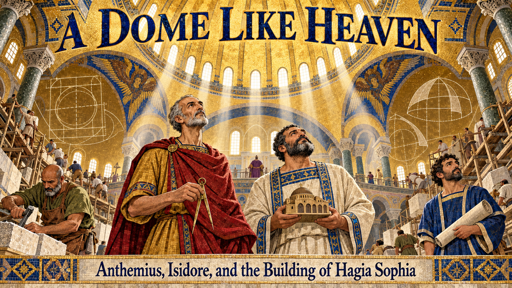
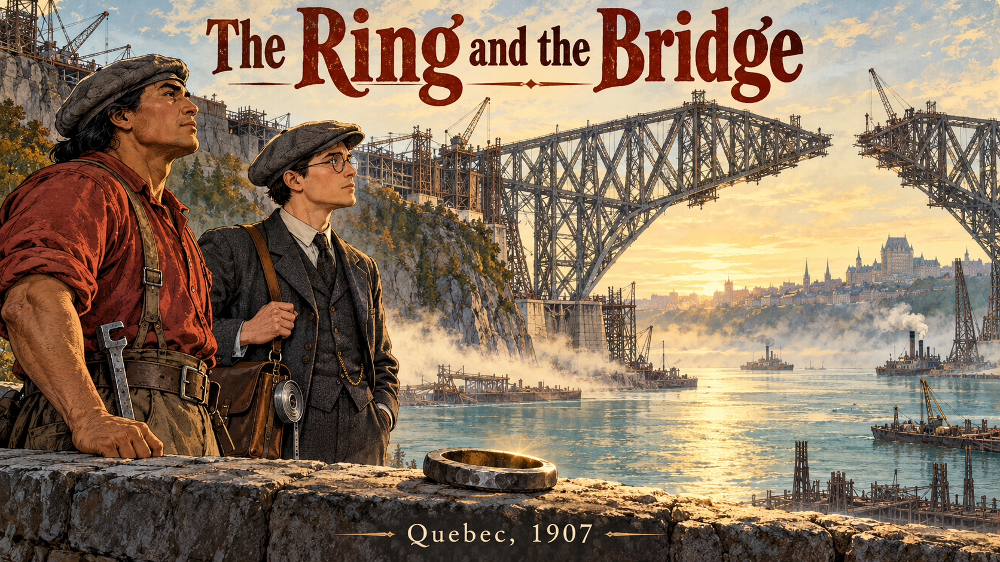
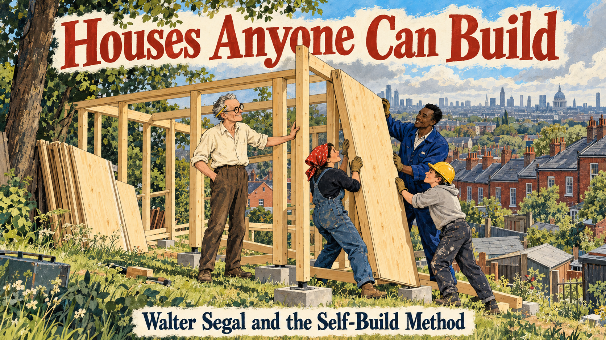
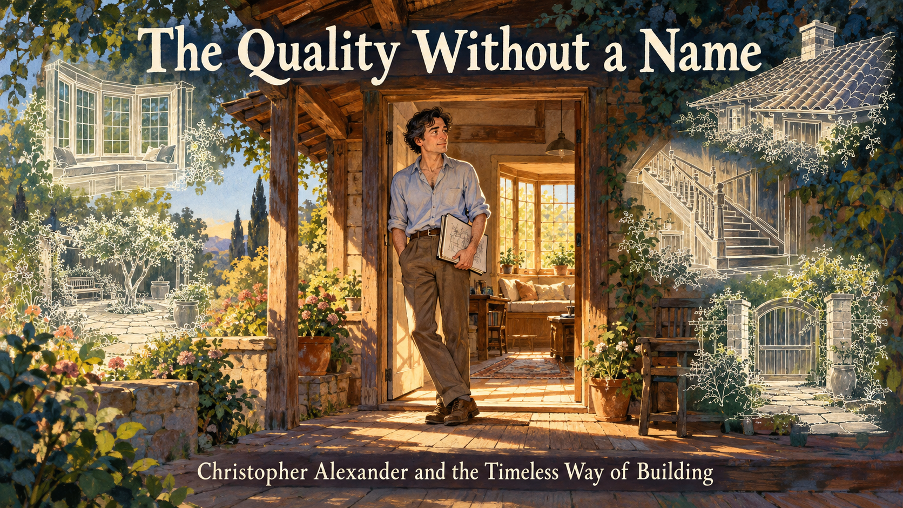

# Graphic Novel Stories for the Science of the Built Environment

Each story follows a person or an idea that shaped how we understand buildings. They run in roughly chronological order, from the builders of Hagia Sophia to the architects and engineers of today. Looking for more? See the [Story Ideas](story-ideas.md) page.

- **[A Dome Like Heaven](hagia-sophia-builders/index.md)**

    
    Two Byzantine geometers raised Hagia Sophia in under six years, watched its dome fall in an earthquake, and rebuilt it as a lesson in learning from failure.

- **[The Shrine That Is Always New](ise-shrine-horyuji-carpenters/index.md)**

    
    A shrine rebuilt every twenty years and a master carpenter who reads each tree show how craft knowledge passes from master to apprentice across centuries.

- **[The Dome Without a Frame](brunelleschi-florence-dome/index.md)**

    
    A goldsmith and clockmaker out-thinks the experts and raises the vast brick dome of Florence Cathedral without a full wooden frame.

- **[The Woman on the Bridge](emily-roebling-brooklyn-bridge/index.md)**

    
    When her husband falls ill, Emily Roebling teaches herself bridge engineering and carries the Brooklyn Bridge to its opening in 1883.

- **[The Bell Tower That Stood](julia-morgan-earthquake-architect/index.md)**

    
    Julia Morgan breaks into Paris's top architecture school, builds a reinforced concrete bell tower, and watches it stand through the 1906 earthquake.

- **[Mud, Vaults, and a Village](hassan-fathy-mud-brick/index.md)**

    
    Hassan Fathy learns to vault mud brick from Nubian masons, builds New Gourna in Egypt, and turns its hard lessons into *Architecture for the Poor*.

- **[The Ring and the Bridge](quebec-bridge-iron-ring/index.md)**

    
    The 1907 Quebec Bridge failure, the Kahnawake ironworkers who built it, and the Iron Ring that reminds engineers of their responsibility.

- **[Houses Anyone Can Build](walter-segal-self-build/index.md)**

    
    Walter Segal turns standard timber and sheet sizes into a bolt-together house that families on a London waiting list build themselves.

- **[The Building as a Tube](fazlur-khan-tube-skyscrapers/index.md)**

    
    A boy from Dhaka discovers that wind, not gravity, limits tall buildings, and invents the tube that lets skyscrapers soar.

- **[The Quality Without a Name](timeless-way-of-building/index.md)**

    
    How a mathematician-turned-architect asked why some places feel alive, tested his answers from Berkeley to Oregon to Mexicali, and wrote *The Timeless Way of Building*.

- **[The $20,000 House](rural-studio-samuel-mockbee/index.md)**

    
    Samuel Mockbee sends architecture students to rural Alabama to build dignified homes from hay bales, tires, and windshields.

- **[The School in the Clay](francis-kere-gando-school/index.md)**

    
    The first child from Gando to attend school becomes an architect and builds a clay school that stays cool, with his whole village.

