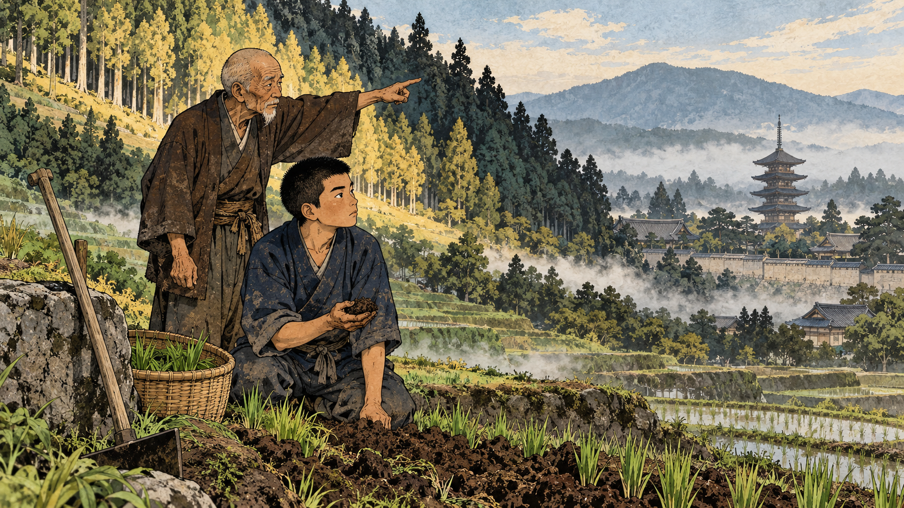
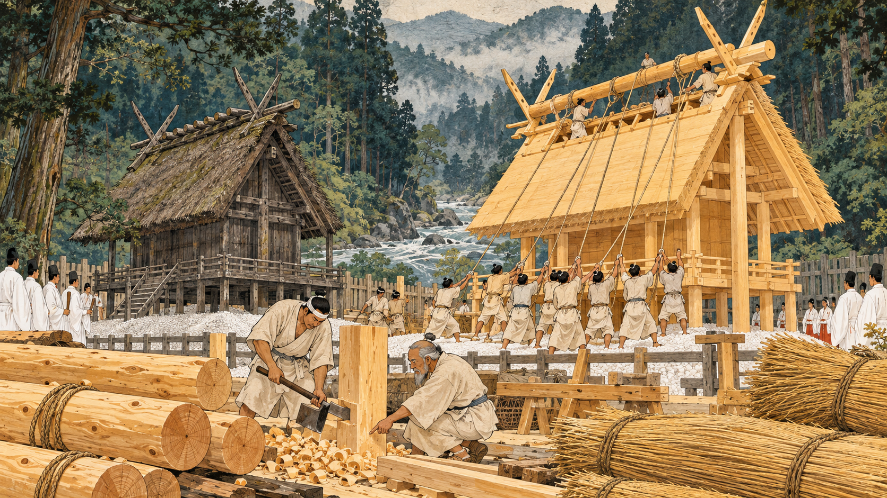
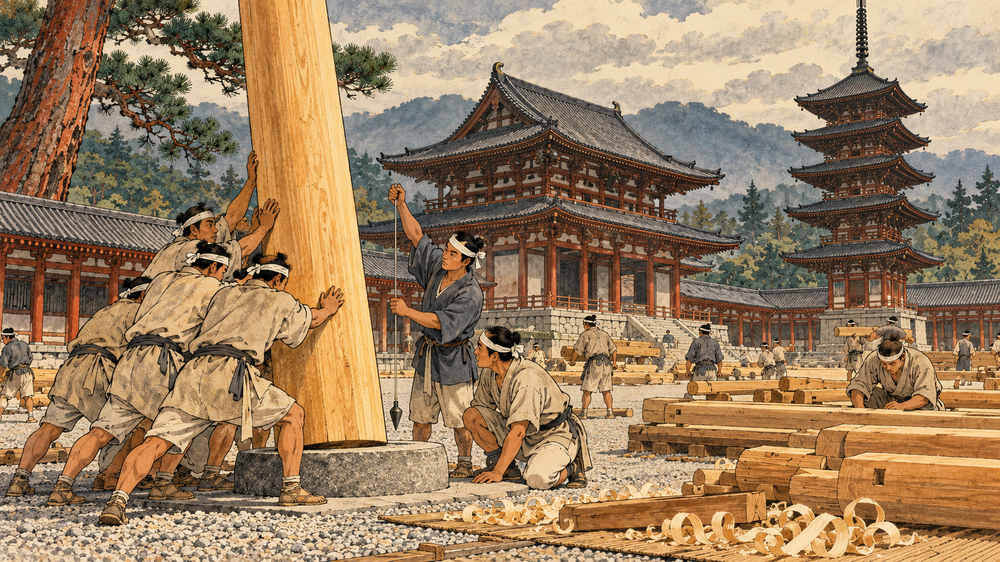
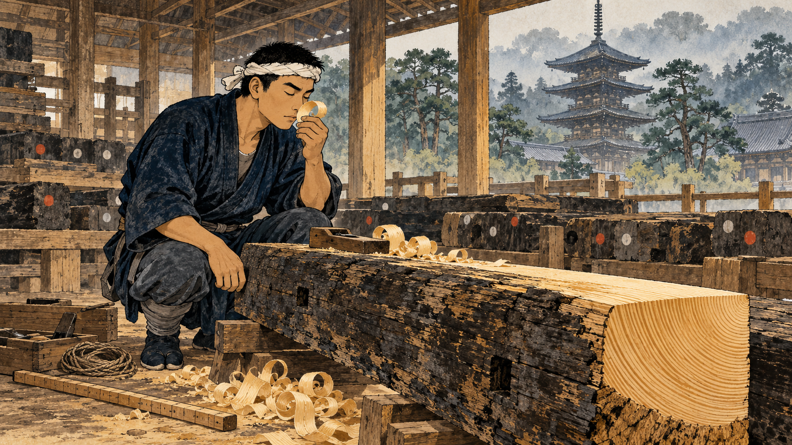
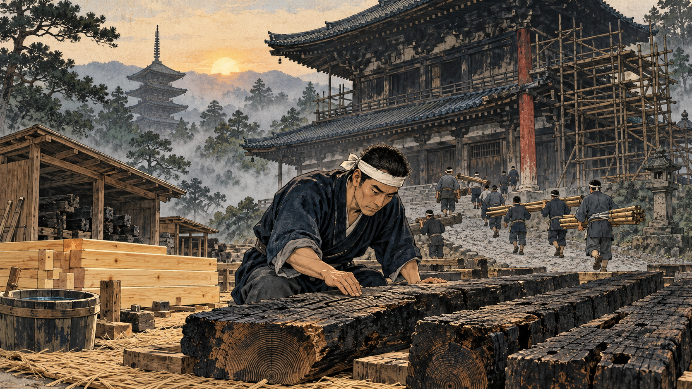
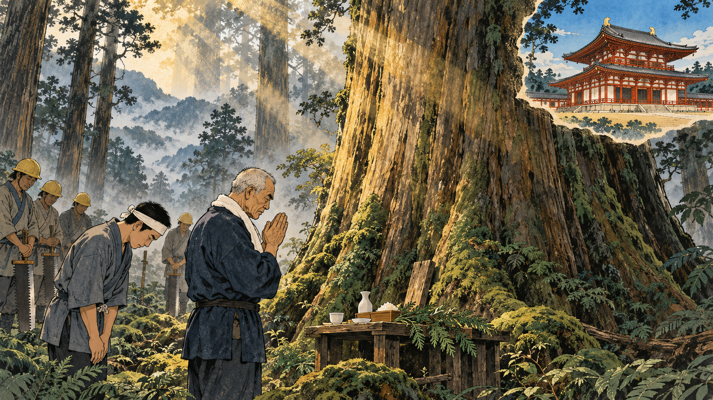
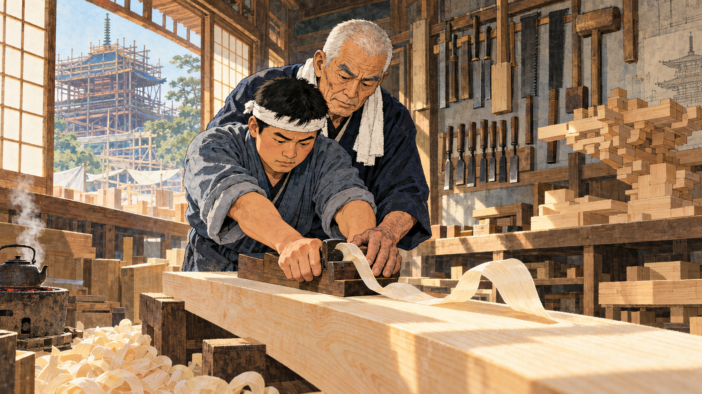
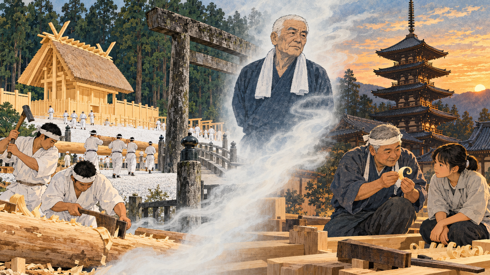

# The Shrine That Is Always New

Cover Image Prompt

(This is the Cover Image. Do not include this label in the image.)
Please generate a wide-landscape 16:9 cover image for a graphic novel in a Japanese woodblock- and ink-wash-inspired editorial illustration style with gouache texture and ink linework. In the foreground center, an elderly Japanese master carpenter in his sixties with a deeply lined weathered face, close-cropped white hair, thick gray eyebrows, a square jaw, narrow serious eyes, a dark indigo cotton work coat, and a white towel around his neck holds up a long, translucent, curling shaving of pale golden hinoki cypress wood so that the light glows through it. To his left, rising from morning mist, stands a newly built wooden shrine with a steep thatched roof, crossed roof-end finials, golden unpainted cypress walls, and a gravel yard beside an empty rectangle of white stones where its twin once stood. To his right, a weathered five-story wooden pagoda with wide dark eaves stands among old pine trees on a stone-based temple terrace. A plain unpainted wooden torii gate stands between them, and a few red maple leaves drift through the air. Across the top, the title "The Shrine That Is Always New" is brush-lettered in a bold calligraphic serif, with a smaller subtitle "Ise Shrine and the Temple Carpenters of Japan" along the bottom. Color palette: hinoki gold, charcoal ink, moss green, vermilion accent, and misty gray-blue. Emotional tone: reverent, calm, and quietly proud. Generate the image immediately without asking clarifying questions.

Narrative Prompt

This story follows the Japanese master carpenter Tsunekazu Nishioka (1908–1995), head carpenter of Hōryū-ji in Nara, and sets his lifework beside the Ise Shrine's tradition of rebuilding its sanctuaries every twenty years. The settings range from the late 7th century to 1920s Nara, post-war Hōryū-ji, the Yakushi-ji reconstruction of the 1970s, and the Ise rebuilding of 2013. The art style is Japanese woodblock- and ink-wash-inspired editorial illustration with gouache texture and ink linework, in a palette of hinoki gold, charcoal ink, moss green, vermilion accent, and misty gray-blue. Nishioka is drawn as a stylized interpretation rather than a portrait, with the same square jaw and narrow serious eyes in every era and a dark indigo cotton work coat: as a boy of thirteen with close-cropped black hair and a faded indigo jacket, as a young master carpenter of about twenty-five with short black hair and a white headband, and from the 1970s onward as an elderly man with a deeply lined face, close-cropped white hair, thick gray eyebrows, and a white towel around his neck. His grandfather Tsunekichi is a small elderly man with a thin white beard and a dark brown kimono. The recurring apprentice is a round-faced young man in his early twenties with short black hair, a gray-blue work coat, and a white headband; he is inspired by Mitsuo Ogawa, Nishioka's main disciple, and appears in the final panel as a gray-haired master. Keep these looks consistent in every panel. Creative liberties: the dates, places, names, projects, and quoted teachings come from published sources, but every scene is imagined, and no pictures survive of several of them. In particular, the late-7th-century Ise scene in Panel 2 is a reconstruction of a tradition, not a record. The boy-and-grandfather scene in Panel 1, the beam-reading in Panel 4, the felling ceremony in Panel 6, and the workshop lesson in Panel 7 dramatize teachings Nishioka described in his writings and interviews. Ogawa's real appearance and the exact years of his apprenticeship are not shown or claimed, and Nishioka is not known to have worked at Ise, so the Ise panels are a comparison, not a biography. Show no readable text in any panel image except where a prompt explicitly asks for it.

### Prologue – Two Ways to Beat Rot

Wood is one of the oldest building materials, and it has one great enemy: moisture. Water swells it, softens it, and feeds the fungi that rot it. Yet in Japan, two wooden traditions have defied that enemy for well over a thousand years, and they could hardly look more different. At Ise, the sanctuaries are torn down and built again, new and golden, every twenty years. At Hōryū-ji in Nara, builders have kept ancient timbers standing for more than thirteen centuries by repairing them. This is the story of the carpenter who spent his life on the second path, and what he shared with the first.

## Panel 1: The Boy Who Was Sent to Farm School

Image Prompt

(This is Panel 01. Do not include the panel number in the image.)
I am about to ask you to generate a series of images for a graphic novel. Please make the images have a consistent style and consistent characters. Do not ask any clarifying questions. Just generate the image immediately when asked.

Please generate a 16:9 image in a Japanese woodblock- and ink-wash-inspired editorial illustration style with gouache texture and ink linework, depicting panel 1 of 8. The scene shows a thirteen-year-old boy with close-cropped black hair, a square jaw, narrow serious eyes, and a faded indigo cotton jacket, kneeling in a green terraced field in Nara, Japan, in 1921, holding up a handful of dark crumbly soil. Beside him stands his grandfather Tsunekichi, a small elderly man with a thin white beard, a shaved head, a dark brown kimono, and hands like knotted roots, pointing up the hillside. Behind them, a forested hillside shows pale cypress trees on a sunny slope and darker, more crowded trees on a shaded slope. In the misty distance rises the tiered roof of an ancient five-story pagoda above old temple walls. A wooden hoe leans against a stone, a bamboo basket of seedlings sits at the boy's side, and a thin plume of morning mist drifts between the rice terraces. Color palette: moss green, earth brown, hinoki gold, charcoal ink, and misty gray-blue. The emotional tone should be patient, curious, and rooted in the land. Generate the image immediately without asking clarifying questions.

Tsunekazu Nishioka was born on 4 September 1908 in a village beside Hōryū-ji in Nara, the grandson and son of the temple's master carpenters. After elementary school, in 1921, his grandfather Tsunekichi sent him not to a technical school but to the Ikoma Agricultural School. A carpenter, the old man believed, must understand soil and weather before he can understand wood. The idea is sound science: a tree is a record of its life, with ring width, density, and grain shaped by the slope, the sun, the wind, and the water it grew in.

## Panel 2: The Shrine That Is Rebuilt

Image Prompt

(This is Panel 02. Do not include the panel number in the image.)
Please generate a 16:9 image in a Japanese woodblock- and ink-wash-inspired editorial illustration style with gouache texture and ink linework, depicting panel 2 of 8. Make the characters and style consistent with the prior panel. The scene shows a sacred cedar-forested river valley in Ise, Mie, Japan, in about the year 690, imagined as a traditional-era scene. Two equal rectangular plots of white gravel sit side by side. On the left stands an aged, gray-brown thatched shrine with a steep roof, crossed finials, and raised floor on posts. On the right, a team of about a dozen carpenters in undyed hemp robes with hair tied back raise a bright new shrine of pale golden hinoki wood, lifting a long ridge beam into place on ropes. In the foreground, one carpenter squares a post with a broad-bladed adze, shavings piling at his feet, while an older man points to where a post meets the ground. Stacked hinoki logs, bundled golden reed thatch, a plain unpainted wooden fence, and priests in white robes watching from the edge complete the scene. Color palette: hinoki gold, white gravel, moss green, charcoal ink, and a touch of vermilion. The emotional tone should be solemn, communal, and hopeful. Generate the image immediately without asking clarifying questions.

Across the mountains, in Mie Prefecture, the Ise shrines follow a different answer to the same problem. Tradition dates their first rebuilding to about 690, in the reigns of Emperor Tenmu and Empress Jitō, and ever since, the sanctuaries have been rebuilt on a neighboring plot every twenty years. The design echoes an old rice granary, with posts set straight into the earth under a thatched roof, and wood in damp ground eventually rots, so a fresh building beats a losing fight against decay. Rebuilding also keeps knowledge alive, because a carpenter who helps raise the shrine as a young man can lead the work in the next cycle, with the old hands still beside him.

## Panel 3: The Temple That Is Mended

Image Prompt

(This is Panel 03. Do not include the panel number in the image.)
Please generate a 16:9 image in a Japanese woodblock- and ink-wash-inspired editorial illustration style with gouache texture and ink linework, depicting panel 3 of 8. Make the characters and style consistent with the prior panel. The scene shows the Hōryū-ji temple compound in Nara, Japan, in about the year 700, imagined as a traditional-era scene: a two-story main hall with a wide hipped-gable roof and a five-story pagoda, both with deep dark eaves and vermilion-tinted pillars, standing on stone-faced raised platforms inside a covered cloister with a gravel courtyard. In the foreground, a team of carpenters in hemp robes lifts a large golden hinoki pillar upright onto a flat round stone base while others check it with a plumb line made of string and a small weight. Stacks of fresh timbers lie on mats, curling pale shavings drift on the ground, and a tall red pine stands to one side. Pale gray clouds hang above the hills. Color palette: hinoki gold, vermilion, charcoal ink, moss green, and misty gray-blue. The emotional tone should be patient, hardworking, and proud. Generate the image immediately without asking clarifying questions.

Hōryū-ji, founded in 607 by Prince Shōtoku, took the other path. When lightning burned its buildings in 670, the temple was rebuilt, reportedly by about 711, and its main hall, the Kondō, is recognized as the oldest wooden building in the world. It survives by being cared for rather than replaced: stone bases lift the columns off damp ground, deep eaves throw rain clear of the walls, and carpenters swap out a failing piece at a time. Tree-ring dating shows that the pagoda's central pillar came from a tree felled in 594, older than the temple itself, and UNESCO named the Hōryū-ji area one of Japan's first World Heritage Sites in 1993.

## Panel 4: Reading the Beams

Image Prompt

(This is Panel 04. Do not include the panel number in the image.)
Please generate a 16:9 image in a Japanese woodblock- and ink-wash-inspired editorial illustration style with gouache texture and ink linework, depicting panel 4 of 8. Make the characters and style consistent with the prior panel. The scene shows young master carpenter Tsunekazu Nishioka, about twenty-five, lean and broad-shouldered with short black hair, a square jaw, narrow serious eyes, a dark indigo cotton work coat, a white headband, gray-blue leg wraps, and split-toe socks, in 1934 at Hōryū-ji in Nara, Japan, kneeling in an open-sided workshop beside a long dark weathered beam from a temple building laid across two trestles. He has just shaved a thin surface off one end with a hand plane, and the fresh cut glows pale gold, showing tight parallel growth rings. He raises a curl of shaving to his nose, eyes closed. A wooden measuring rod and a coil of string lie nearby, and several other old beams, each marked with painted dots instead of words, lie in rows behind him. Through the open side, the temple's pagoda rises through pine trees and mist. Color palette: hinoki gold, charcoal ink, moss green, faint vermilion, and misty gray-blue. The emotional tone should be focused, intimate, and reverent. Generate the image immediately without asking clarifying questions.

In 1934, at twenty-five, Nishioka became head carpenter of Hōryū-ji, as his father and grandfather had been before him. He learned from the old beams themselves and from the oral rules called *kuden* that his family had handed down. One rule said to look at each tree's character, not just its measurements, and another said to use a tree as it stood on the mountain, so that a tree from a south-facing slope goes on the south side of a building. The physics behind the habit is real: wood shrinks mostly across its growth rings and hardly at all along the grain, so a timber cut and placed without regard to its grain will twist and crack as it dries. Wood scientists agree that growing conditions change a tree's ring width and density, and the *kuden* turn that observation into a rule for placing each beam.

## Panel 5: After the Fire

Image Prompt

(This is Panel 05. Do not include the panel number in the image.)
Please generate a 16:9 image in a Japanese woodblock- and ink-wash-inspired editorial illustration style with gouache texture and ink linework, depicting panel 5 of 8. Make the characters and style consistent with the prior panel. The scene shows Hōryū-ji in Nara, Japan, at dawn in 1949, with the ancient two-story main hall standing quiet in cold mist, its roof and upper walls darkened with soot and a bamboo scaffold on one side. In the foreground, Nishioka, now about forty, lean with short black hair, a square jaw, narrow serious eyes, a dark indigo cotton work coat, and a white headband, kneels on straw mats in front of a row of dark charred beams laid out in order, running his hand along one as he studies its growth rings. Behind him, a dozen carpenters in work coats carry timbers and wooden scaffolding poles up a gravel path. A bucket of water, a bundle of fresh golden cypress boards, and a plain wooden shed for storing the old timbers stand nearby. Soft, quiet light touches the soot-dark roof and the green pines. Color palette: charcoal ink, ash gray, hinoki gold, moss green, and a single vermilion pillar. The emotional tone should be somber resolve and determination. Generate the image immediately without asking clarifying questions.

On 26 January 1949, a fire broke out while the Kondō was being dismantled for repair. It heavily damaged the hall and destroyed the Asuka-period wall paintings inside, a loss that shocked Japan, and the date is now observed as a fire prevention day for cultural properties. Nishioka stood among the carpenters who rebuilt the hall, and the work was finished in 1954. The charred timbers were carefully set aside in a fireproof storehouse, and tree-ring dating later showed that roughly fifteen to twenty percent of the seventh-century wood remains in the hall, so even a building that "survives" is a long conversation between old wood and new.

## Panel 6: The Trees of Yakushi-ji

Image Prompt

(This is Panel 06. Do not include the panel number in the image.)
Please generate a 16:9 image in a Japanese woodblock- and ink-wash-inspired editorial illustration style with gouache texture and ink linework, depicting panel 6 of 8. Make the characters and style consistent with the prior panel. The scene shows a misty mountain cypress forest in Taiwan in the early 1970s. In the center foreground stands the elderly Nishioka, now in his sixties, with a deeply lined weathered face, close-cropped white hair, thick gray eyebrows, a square jaw, narrow serious eyes, a dark indigo cotton work coat, and a white towel around his neck, his palms pressed together in prayer before a gigantic ancient cypress whose trunk is as wide as a small room. Beside him bows a young apprentice in his early twenties, round-faced with short black hair, a gray-blue work coat, and a white headband. A small offering table with sake cups, rice, and a branch of evergreen sits at the base of the tree. A few forestry workers in hard hats stand respectfully in the background, holding crosscut saws. Shafts of golden light pierce the mist, ferns cover the forest floor, and a small inset vignette in the corner shows the finished two-story main hall of Yakushi-ji with a vermilion frame against a blue sky. Color palette: moss green, hinoki gold, charcoal ink, vermilion, and misty gray-blue. The emotional tone should be reverent and awestruck. Generate the image immediately without asking clarifying questions.

In 1970, Nishioka was asked to rebuild the Kondō of Yakushi-ji in Nara, and Japan no longer had trees big enough for its great columns, so the project imported old-growth cypress from Taiwan. By Nishioka's account, the carpenters did not treat such ancient trees as mere lumber and held a service before cutting, praying that the trees would serve as timbers for another two thousand years. He also opposed reinforcing the buildings with iron, arguing that hinoki alone could last a thousand years, while iron rusts and turns brittle in three or four hundred years, forcing the wood around it to be replaced. The Kondō was completed in 1976, and the West Pagoda followed in 1981.

## Panel 7: Learning with the Hands

Image Prompt

(This is Panel 07. Do not include the panel number in the image.)
Please generate a 16:9 image in a Japanese woodblock- and ink-wash-inspired editorial illustration style with gouache texture and ink linework, depicting panel 7 of 8. Make the characters and style consistent with the prior panel. The scene shows a plain timber workshop at the Yakushi-ji site in Nara, Japan, around 1980, with sun streaming through wide paper-screened windows. Elderly Nishioka, with a deeply lined weathered face, close-cropped white hair, thick gray eyebrows, a square jaw, narrow serious eyes, a dark indigo cotton work coat, and a white towel around his neck, stands behind his young apprentice, round-faced with short black hair, a gray-blue work coat, and a white headband. The apprentice pushes a hand plane along a long pale hinoki board on a low bench, and one thin translucent shaving curls up from the blade. Nishioka's weathered hand rests on the apprentice's, guiding the angle. Hand tools hang on the wall in neat rows: adzes, saws, chisels, and a wooden mallet. Pale shavings pile on the floor, a half-built wooden bracket assembly stands on a shelf, and a tea kettle steams on a small charcoal brazier. Color palette: hinoki gold, warm wood brown, charcoal ink, moss green, and misty gray-blue. The emotional tone should be strict yet tender. Generate the image immediately without asking clarifying questions.

Nishioka had a fierce reputation as a teacher and was nicknamed *oni*, the devil, for his strictness. His main disciple, Mitsuo Ogawa, sought him out and was not accepted at first. Nishioka held that learning by hand and feel lasts, while facts memorized fade, and he let apprentices find their mistakes with the wood. In this scene a young carpenter learns to pull a single clean shaving from a plank of hinoki, a skill that matters because a smoothly planed surface tends to shed rainwater while a torn, fuzzy one holds moisture.

## Panel 8: Twenty Years, Thirteen Hundred Years

Image Prompt

(This is Panel 08. Do not include the panel number in the image.)
Please generate a 16:9 image in a Japanese woodblock- and ink-wash-inspired editorial illustration style with gouache texture and ink linework, depicting panel 8 of 8. Make the characters and style consistent with the prior panel. The scene is a single wide frame divided by a gentle ribbon of white mist. On the left, in Ise, Mie, Japan, in October 2013, a new shrine of bright golden hinoki wood with a thatched roof and crossed finials stands in a cedar forest beside an empty rectangle of white gravel. Young carpenters in white work clothes are carrying logs and swinging adzes in the foreground, and an old, gray-weathered torii gate of heavy timber stands at the edge of a stone bridge. On the right, at the Hōryū-ji temple in Nara, the pagoda glows in evening light, and a gray-haired master carpenter in his sixties, round-faced with short gray hair, a gray-blue work coat, and a white headband, kneels beside a teenage girl in a light work jacket and shows her a thin curl of hinoki shaving. In the misty center between the two scenes, a faint, translucent figure of the elderly Nishioka, with close-cropped white hair, thick gray eyebrows, and an indigo coat, stands with his hands behind his back and looks on. Color palette: hinoki gold, moss green, charcoal ink, vermilion accent, and misty gray-blue. The emotional tone should be hopeful and continuous, like a handing-over of the torch. Generate the image immediately without asking clarifying questions.

At Ise in October 2013, the sanctuaries were renewed for the sixty-second time, after eight years of ceremonies and preparation. Each rebuilding takes roughly ten thousand cypress trees, and the shrine now plants its own forest on a 200-year plan, begun in the Taishō era, though in 2013 only about a quarter of the wood came from shrine land and the rest from the Kiso region. Nothing is wasted: the old pillars become torii gates at the Uji Bridge, then gates farther along the pilgrim road, and other timber goes to shrines around Japan. Nishioka died in 1995, but his habits of reading each tree, repairing before replacing, and teaching with the hands live on through apprentices like Ogawa, and the next Ise rebuilding is scheduled for 2033.

### Epilogue – What Made Nishioka Different?

Nishioka did not try to be a genius. He inherited a lineage, studied soil and trees before cutting a single board, and spent decades putting every old beam back where it belonged. His life shows that a building is not finished when it is built, but kept alive by people who understand how its material grows, shrinks, ages, and fails. Ise renews the form every twenty years so the skills never fade; Hōryū-ji keeps the same wood going by careful repair. Either way, the real structure is the chain of people who pass the knowledge on.

| Challenge | How Nishioka Responded | Lesson for Today |
|-----------|---------------------------|------------------|
| Wood rots when it stays wet | Used stone bases, deep eaves, and carefully placed, well-seasoned timber; repaired failing parts early | Moisture control and early maintenance matter more than any clever structure |
| Every tree grows differently | Read each tree's character and placed it by how it grew, rather than treating wood as uniform stock | Variable natural materials need judgment, not just a table of average values |
| Modern fixes like iron reinforcement can cause new failures | Argued that all-hinoki joinery would outlast iron, which rusts and turns brittle | Choose materials that age at compatible rates |
| Big old-growth trees were no longer available in Japan | Imported Taiwan cypress for Yakushi-ji and honored the trees with a ceremony | Sourcing has a real cost; Ise's 200-year forest plan shows how to plan supply for generations |
| Craft knowledge can vanish within a generation | Taught by hand, passed the *kuden* to apprentices, and wrote books so others could learn | Skills that are not taught are lost, so build the next generation of builders |

### Call to Action

Next time you see a wooden building more than a hundred years old, ask what has kept it alive: dry feet, a good roof, careful repair, and people who knew the wood. As you read [Chapter 7 on wood and steel framing](../../chapters/07-wood-steel-framing/index.md), look at how grain and moisture shape what a stud or beam can do. Study [Chapter 5 on material properties](../../chapters/05-material-properties/index.md) to see how strength, stiffness, and shrinkage are measured. And in [Chapter 21 on durability and failure](../../chapters/21-durability-failure/index.md), think of Nishioka's rule of using every tree as it grew, and let's build it right.

---

*"When a temple or shrine carpenter says wood, he means hinoki."*
—Tsunekazu Nishioka, as translated by Kyoto University's Institute for Research in Humanities

---

## References

1. [Wikipedia: Ise Grand Shrine](https://en.wikipedia.org/wiki/Ise_Grand_Shrine) - Overview of Ise Jingū, its architecture, materials, and the twenty-year Shikinen Sengū rebuilding
2. [Wikipedia: Hōryū-ji](https://en.wikipedia.org/wiki/H%C5%8Dry%C5%AB-ji) - History of the Nara temple, the 670 fire and rebuilding, the 1949 Kondō fire, and UNESCO World Heritage listing
3. [Wikipedia: Tsunekazu Nishioka](https://en.wikipedia.org/wiki/Tsunekazu_Nishioka) - Biography of the Hōryū-ji master carpenter, his projects, teachings, and apprentice Mitsuo Ogawa
4. [Kyoto University: The World of Tsunekazu Nishioka, a Temple Carpenter](https://www.zinbun.kyoto-u.ac.jp/~shakti/en/hinoki) - Institute for Research in Humanities essay on Nishioka's training, his view of hinoki, and his approach to using each tree
5. [Japan for Sustainability: Rebuilding Every 20 Years Renders Sanctuaries Eternal](https://www.japanfs.org/en/news/archives/news_id034293.html) - Article on the Sengū ceremony at Ise Jingū, its timber supply, and the reuse of old materials
