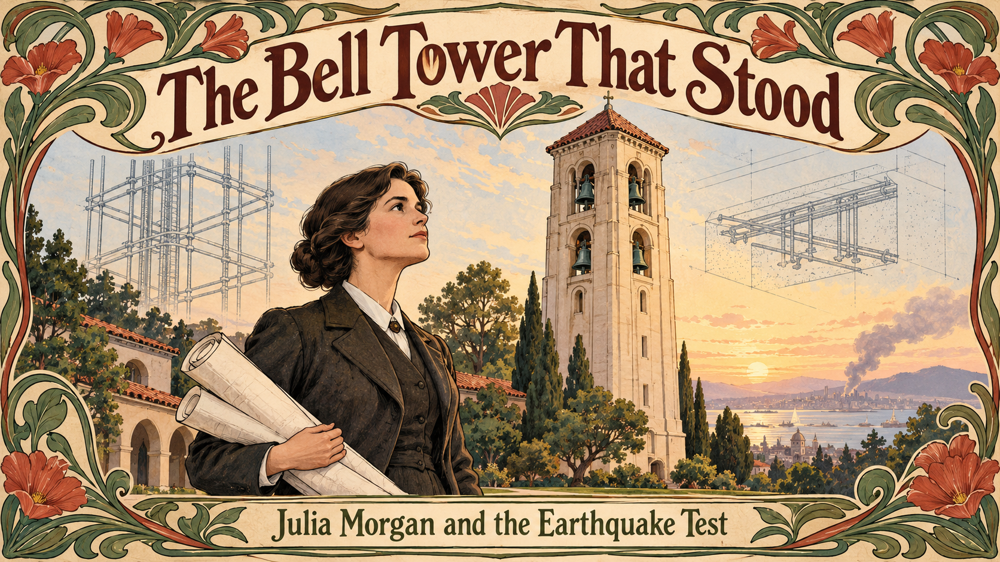
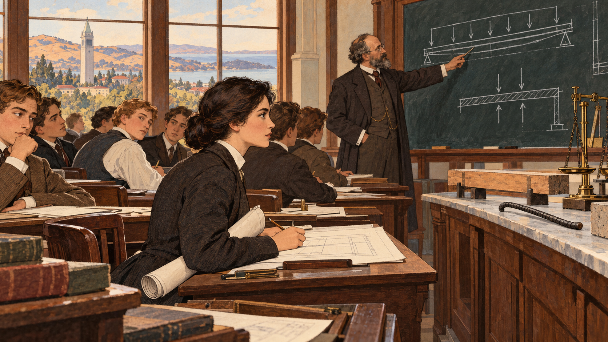
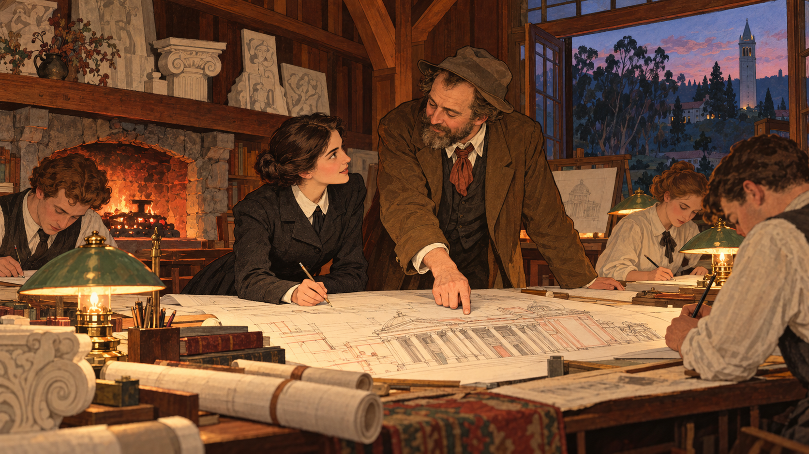
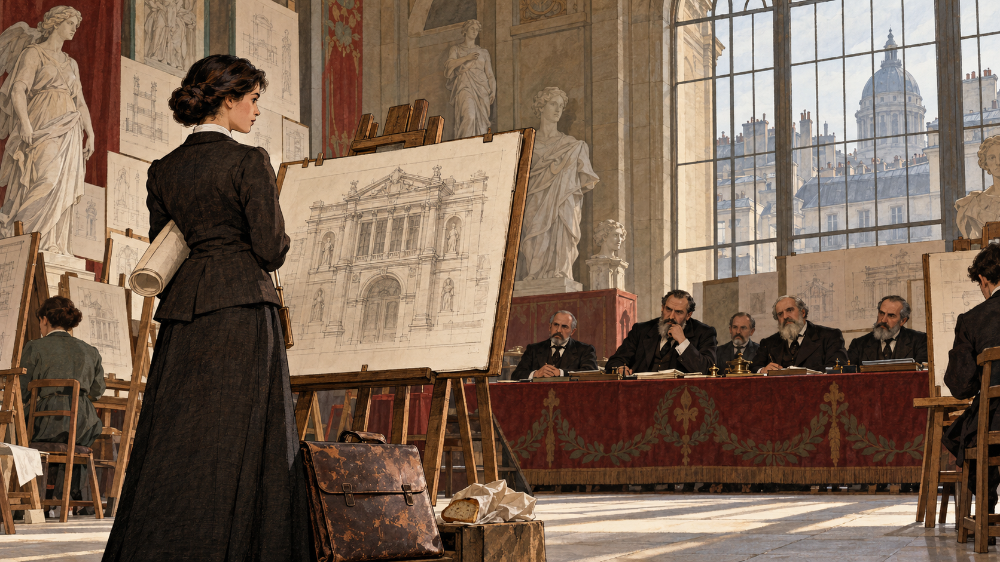
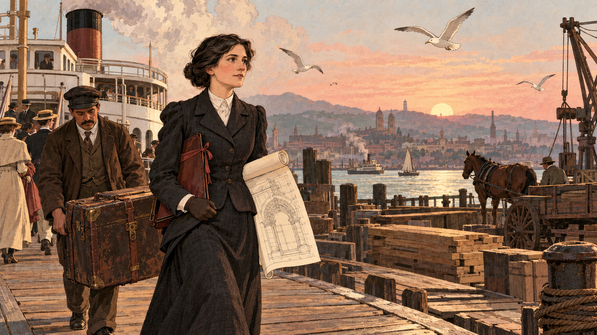
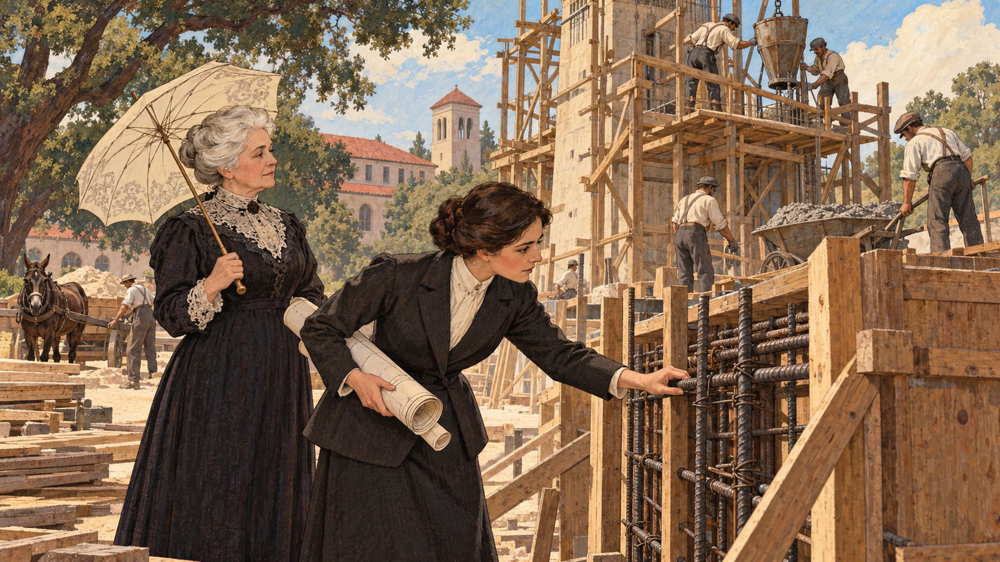
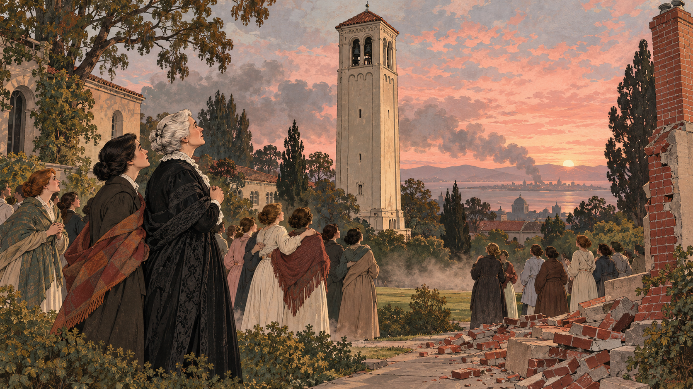
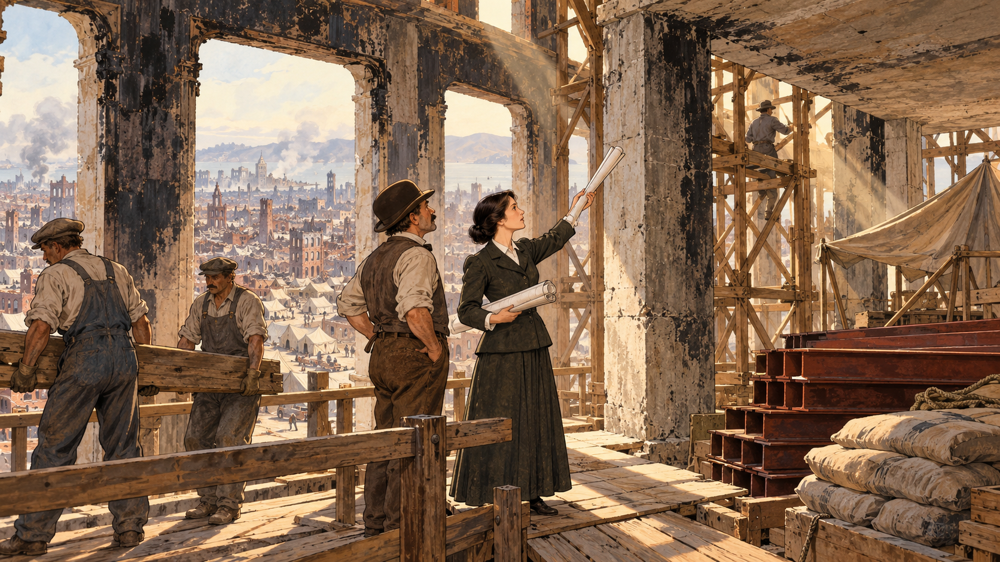
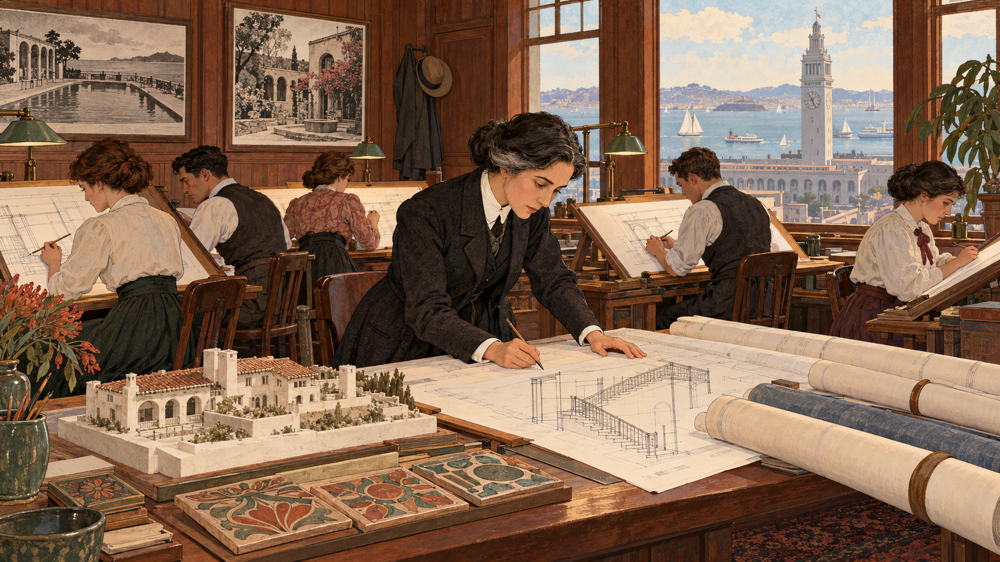
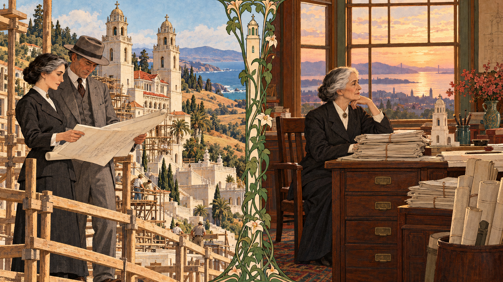

# The Bell Tower That Stood

Cover Image Prompt

(This is the Cover Image. Do not include this label in the image.)
Please generate a wide-landscape 16:9 cover image for a graphic novel in an early-1900s American Arts and Crafts style, influenced by Art Nouveau editorial illustration, with gouache texture and confident ink linework. In the center foreground stands Julia Morgan, a slight woman in her early thirties with dark hair pinned in a low bun, serious dark eyes, a practical dark wool suit with a plain white collar, and a roll of drawings under her arm. She looks up at a tall five-story reinforced concrete bell tower behind her, with a red clay tile roof and several arched openings that hold bronze bells, rising from a green college lawn in a pale gold dawn sky. Swirling Art Nouveau vines and whiplash curves frame the corners of the image, and faint translucent line drawings of steel reinforcing bars and a cross-section of a beam float in the sky beside the tower. In the far distance, a thin column of smoke rises over a bay. Hand-lettered across the top in a friendly Arts and Crafts serif typeface is the title "The Bell Tower That Stood," and a smaller subtitle along the bottom reads "Julia Morgan and the Earthquake Test." Color palette: redwood brown, adobe cream, sage green, brick red, and dusty rose. Emotional tone: quiet determination and hard-won pride. Generate the image immediately without asking clarifying questions.

Narrative Prompt

This story follows the California engineer and architect Julia Morgan (1872–1957) from her student years at the University of California, Berkeley, through the École des Beaux-Arts in Paris, to the Mills College bell tower that stood through the 1906 San Francisco earthquake, and on to a career of more than 700 buildings. The settings range from 1890s Berkeley and Paris to 1904 Oakland, 1906 San Francisco, and the Hearst estate at San Simeon. The art style is an early-1900s American Arts and Crafts editorial illustration influenced by Art Nouveau: gouache texture, ink linework, and a palette of redwood brown, adobe cream, sage green, brick red, and dusty rose. Julia is drawn as a stylized interpretation rather than a portrait: a slight woman with dark hair pinned in a low bun, serious dark eyes, a practical dark wool suit with a plain white collar, and a roll of drawings under her arm, with silver slowly entering her hair in the later panels. Her teacher Bernard Maybeck is drawn as a warm, rumpled man with a short beard, a loose cravat, and a soft hat, and Mills College president Susan Mills as an older woman with white hair in a bun and a dark dress with a lace collar. Keep these looks consistent in every panel. Creative liberties: the dates, places, buildings, and outcomes are drawn from published sources, but the scenes, expressions, and conversations are imagined to make the work visible. In particular, Maybeck's evening studio in Panel 2, the Paris examination hall in Panel 3, the construction-site scene in Panel 5, the campus gathering on the morning of the earthquake in Panel 6, and Morgan's walk through the damaged hotel in Panel 7 are dramatizations, not records of specific moments. Sources disagree on a few details, such as whether Morgan entered the Beaux-Arts in 1898 or 1899 and whether she closed her office in 1950 or 1951, and the story notes these where they appear. The building-science explanations describe how reinforced concrete and earthquake-resistant design work in general; they are not a reconstruction of the tower's reinforcement drawings. Show no readable text in any panel image except where a prompt explicitly asks for it.

### Prologue – A Tower in the Ruins

On the morning of April 18, 1906, a great earthquake shook the San Francisco Bay Area, and fires spread through the city for days. Across the bay in Oakland, a slim concrete bell tower on a women's college campus was still standing. It had been designed two years earlier by a 32-year-old woman who had needed three attempts to get into the architecture school she wanted. This is the story of Julia Morgan, an engineer who thought like an artist and an architect who thought like an engineer, and of how steel, concrete, and stubbornness built a career.

## Panel 1: The Only Woman in the Room

Image Prompt

(This is Panel 01. Do not include the panel number in the image.)
I am about to ask you to generate a series of images for a graphic novel. Please make the images have a consistent style and consistent characters. Do not ask any clarifying questions. Just generate the image immediately when asked.

Please generate a 16:9 image in an early-1900s American Arts and Crafts style influenced by Art Nouveau editorial illustration, with gouache texture and ink linework, depicting panel 1 of 9. The scene shows Julia Morgan as a young woman of about twenty, a slight woman with dark hair pinned in a low bun, serious dark eyes, a practical dark wool suit with a plain white collar, and a roll of drawings under her arm, in an engineering classroom at the University of California, Berkeley, in about 1892. She is the only woman in the room, seated in the front row among a dozen young men in high collars and vests. On the blackboard behind her are chalk diagrams of beams with arrows pointing down and up, with no readable words. On a lab bench by the window sits a small wooden beam with a bent iron rod beside it and a brass scale. Through the tall window are the golden hills of Berkeley and the distant bay. A bearded professor in a long coat points at a diagram. The young men glance sideways at her, and she keeps her eyes on the diagram, pencil moving. Color palette: redwood brown, adobe cream, sage green, brick red, and dusty rose. The emotional tone should be quiet concentration under curious eyes. Generate the image immediately without asking clarifying questions.

Julia Morgan was born in San Francisco on January 20, 1872, and grew up across the bay in Oakland. In 1890 she entered the University of California, Berkeley, and studied civil engineering because the university offered no architecture program. She was often the only woman in her math, science, and engineering classes, and in 1894 she graduated as the first woman to earn a bachelor's degree in civil engineering at Berkeley with honors. Engineering taught her to ask the question every beam asks: when a load pushes down, which part pulls apart and which part gets squeezed?

## Panel 2: An Open Door on a Hillside

Image Prompt

(This is Panel 02. Do not include the panel number in the image.)
Please generate a 16:9 image in an early-1900s American Arts and Crafts style influenced by Art Nouveau editorial illustration, with gouache texture and ink linework, depicting panel 2 of 9. Make the characters and style consistent with the prior panel. The scene shows Julia Morgan, now about twenty-three, a slight woman with dark hair pinned in a low bun, serious dark eyes, a practical dark wool suit with a plain white collar, and a roll of drawings under her arm, at a long drafting table in the evening studio of her teacher Bernard Maybeck, in Berkeley in about 1895. Maybeck is a warm, rumpled man with a short beard, a loose cravat, and a soft hat pushed back on his head, and he leans over a large drawing of a grand columned building, pointing at a detail. Around the table, three other young students in shirtsleeves sketch by lamplight. The rustic redwood-paneled room has exposed beams, a stone fireplace with glowing coals, plaster casts of classical ornaments on the shelves, and an open window with a view of a eucalyptus-dark hillside. Julia's pencil is poised, her face lit with excitement. Color palette: redwood brown, adobe cream, sage green, brick red, and dusty rose. The emotional tone should be warm mentorship and widening ambition. Generate the image immediately without asking clarifying questions.

In her last year at Berkeley, Julia found a second teacher in Bernard Maybeck, a lecturer who gathered promising students at his home to draw and talk about architecture. Maybeck himself had studied in Paris, and he saw that Julia's engineering mind could be matched by a gifted eye. He urged her to pursue the architecture course at the École des Beaux-Arts, then the most famous architecture school in the world. It was an extraordinary suggestion, because that school had never admitted a woman.

## Panel 3: Three Tries in Paris

Image Prompt

(This is Panel 03. Do not include the panel number in the image.)
Please generate a 16:9 image in an early-1900s American Arts and Crafts style influenced by Art Nouveau editorial illustration, with gouache texture and ink linework, depicting panel 3 of 9. Make the characters and style consistent with the prior panel. The scene shows Julia Morgan, about twenty-six, a slight woman with dark hair pinned in a low bun, serious dark eyes, a practical dark wool suit with a plain white collar, and a roll of drawings under her arm, in a high-ceilinged stone examination hall in Paris in about 1898. She stands at an easel with a freshly finished ink-and-wash drawing of a classical facade, while a row of five stern men with beards and black frock coats sit behind a long table at the far end of the hall, one of them frowning at her drawing. Along the walls hang plaster casts of statues and rows of other candidates' drawings. A tall arched window lets in cold gray light, with the iron-and-glass roofs of Paris and a stone dome beyond. At her feet are her worn leather portfolio and a lunch wrapped in paper, as she has little money. Her jaw is set. Color palette: redwood brown, adobe cream, sage green, brick red, and dusty rose, with cool gray in the shadows. The emotional tone should be lonely resolve in the face of a closed door. Generate the image immediately without asking clarifying questions.

Julia sailed for Paris in 1896 to prepare for the entrance examinations. Her first attempt placed too low, and on her second try in 1898, one account says, the examiners arbitrarily lowered her marks. She hired a tutor, François-Benjamin Chaussemiche, a winner of the school's top prize, and tried a third time. She placed 13th out of 376 applicants and was admitted, in 1898 or 1899 depending on the source, as the first woman in the school's architecture program. Money was tight, and she never asked her family for extra, learning to live on a very small budget, a habit that would later help her keep clients' projects on budget.

## Panel 4: A Certificate and a Ferry Home

Image Prompt

(This is Panel 04. Do not include the panel number in the image.)
Please generate a 16:9 image in an early-1900s American Arts and Crafts style influenced by Art Nouveau editorial illustration, with gouache texture and ink linework, depicting panel 4 of 9. Make the characters and style consistent with the prior panel. The scene shows Julia Morgan, now thirty, a slight woman with dark hair pinned in a low bun, serious dark eyes, a practical dark wool suit with a plain white collar, and a roll of drawings under her arm, stepping off a steam ferry onto a wooden pier in the San Francisco Bay Area in 1902. A porter carries her battered steamer trunk beside her. On the pier are stacks of lumber, a horse-drawn cart, gulls, and a few passengers in long coats and straw hats. Behind her, across the water, a low skyline of church towers and the hills above the bay, with a hazy peach sunrise. In her gloved hand, partly unrolled, is a drawing of an arched stone doorway. A slim leather folder tucked in her arm is tied with ribbon, suggesting a diploma. Behind her, the ferry's smokestack puffs soft clouds. Color palette: redwood brown, adobe cream, sage green, brick red, and dusty rose. The emotional tone should be tired triumph looking toward the work ahead. Generate the image immediately without asking clarifying questions.

In 1902 Julia finished the course in three years, rather than the usual five, and became the first woman to receive an architecture certificate from the École des Beaux-Arts. She came home to California and went to work for the architect John Galen Howard on buildings for the Berkeley campus. In 1904 she became the first woman licensed to practice architecture in California. Now she needed a client willing to hire a young woman, and she needed a building that would show what she could do.

## Panel 5: Steel Inside the Stone

Image Prompt

(This is Panel 05. Do not include the panel number in the image.)
Please generate a 16:9 image in an early-1900s American Arts and Crafts style influenced by Art Nouveau editorial illustration, with gouache texture and ink linework, depicting panel 5 of 9. Make the characters and style consistent with the prior panel. The scene shows a construction site on a college campus in Oakland, California, in the spring of 1903. In the center, Julia Morgan, about thirty-one, a slight woman with dark hair pinned in a low bun, serious dark eyes, a practical dark wool suit with a plain white collar, and a roll of drawings under her arm, leans toward a wooden formwork wall where a cage of crisscrossed iron reinforcing bars is tied in place, one hand on a bar. Beside her stands Susan Mills, an older woman with white hair in a bun and a dark dress with a lace collar, holding a parasol and watching. Behind them rises the half-built square tower, with timber scaffolding, workmen in rolled-up sleeves and flat caps pouring concrete from wooden buckets, and a wheelbarrow full of gray mix. Oak trees and a red-roofed campus hall appear in the background, along with a mule cart of sand. Dust and sunlight fill the air. Color palette: redwood brown, adobe cream, sage green, brick red, and dusty rose. The emotional tone should be focused craftsmanship and quiet trust. Generate the image immediately without asking clarifying questions.

Mills College president Susan Mills hired Julia to design a bell tower, El Campanil, a 72-foot, five-story tower completed in the spring of 1904. Its walls were reinforced concrete, among the earliest such towers in California. Here is why that mattered. Concrete is strong when it is squeezed, as stone is, but weak when it is pulled or bent, because it cracks. Steel is strong in tension. Embed steel bars in the concrete where the pulling happens, and the two materials work as a team: the concrete carries the squeezing, the steel carries the pulling, and the concrete's alkaline paste also protects the steel from rust. The two expand and shrink with temperature at nearly the same rate, so they do not tear each other apart.

## Panel 6: The Morning the Ground Moved

Image Prompt

(This is Panel 06. Do not include the panel number in the image.)
Please generate a 16:9 image in an early-1900s American Arts and Crafts style influenced by Art Nouveau editorial illustration, with gouache texture and ink linework, depicting panel 6 of 9. Make the characters and style consistent with the prior panel. The scene shows a college lawn in Oakland, California, at about sunrise on April 18, 1906. In the center of the frame stands the tall reinforced concrete bell tower, with its red clay roof and arched bell openings, straight and intact against a dusty pink and gray sky. Scattered across the lawn are a few dozen young women and teachers in long coats and shawls over nightgowns, in small groups with their arms around one another, all looking up at the tower with astonished relief. Susan Mills, an older woman with white hair in a bun and a dark dress with a lace collar, stands at the front. A few fallen bricks from an older chimney lie in a neat spill on the path, and a small cloud of drifting dust hangs low over the grass. Far away across the bay, a thin gray column of smoke rises from the distant city on the horizon. Color palette: redwood brown, adobe cream, sage green, brick red, and dusty rose, with smoky gray. The emotional tone should be awe and quiet relief, with a distant sense of loss. Generate the image immediately without asking clarifying questions.

At about 5:12 a.m. on April 18, 1906, the San Francisco earthquake struck, with an estimated magnitude near 7.9, and fires then burned much of the city for days. Reports from the time and later accounts say El Campanil came through undamaged, and that architects and contractors went to look at it. An earthquake is a horizontal load: the ground jerks sideways, and a heavy building tries to stay where it was. Brick and stone walls held together only by mortar are weak when pulled apart, so they crack and shed their pieces. A reinforced tower can bend a little, because steel stretches before it snaps, a property called ductility, and its steel ties the foundation, walls, and roof into one continuous load path so that the forces can flow safely down to the ground. One tower surviving does not prove a design for every earthquake, but it was strong evidence that she was onto something.

## Panel 7: Rebuilding on the Hill

Image Prompt

(This is Panel 07. Do not include the panel number in the image.)
Please generate a 16:9 image in an early-1900s American Arts and Crafts style influenced by Art Nouveau editorial illustration, with gouache texture and ink linework, depicting panel 7 of 9. Make the characters and style consistent with the prior panel. The scene shows Julia Morgan, now thirty-four, a slight woman with dark hair pinned in a low bun, serious dark eyes, a practical dark wool suit with a plain white collar, and a roll of drawings under her arm, standing on a wooden plank walkway inside the sooty, fire-darkened shell of a large white stone and concrete hotel on a San Francisco hill in late 1906. Through the empty window openings behind her is a view of a city of rubble, cleared streets, and tents, with a lingering gray haze. In the foreground, a foreman in a bowler hat and two workmen in overalls carry a long timber, and a stack of new iron beams and bags of cement sit under a canvas. Julia points her roll of drawings up at a bare structural column and a slab, and the foreman nods. Wooden scaffolding climbs the walls, and sunlight cuts through the dust in golden shafts. Color palette: redwood brown, adobe cream, sage green, brick red, and dusty rose, with charcoal and soot gray. The emotional tone should be sober, capable, and hopeful. Generate the image immediately without asking clarifying questions.

The fire had also destroyed Julia's rented downtown office. Soon after the earthquake, the owners of the Fairmont, a huge new hotel on Nob Hill, hired her to repair and redesign it, because her reputation for earthquake-resistant reinforced concrete had grown. The hotel's structure had survived the shaking, but its interior had been badly damaged by fire. Her work helped the hotel reopen on April 18, 1907, one year after the earthquake, and it brought her a national reputation as a superb engineer and an innovative designer. She opened a new office on the 13th floor of the Merchants Exchange Building in San Francisco, where she worked until retirement.

## Panel 8: A Small Office With Big Drawings

Image Prompt

(This is Panel 08. Do not include the panel number in the image.)
Please generate a 16:9 image in an early-1900s American Arts and Crafts style influenced by Art Nouveau editorial illustration, with gouache texture and ink linework, depicting panel 8 of 9. Make the characters and style consistent with the prior panel. The scene shows Julia Morgan, about forty-five with a hint of gray at her temples, a slight woman with dark hair pinned in a low bun, serious dark eyes, a practical dark wool suit with a plain white collar, and a roll of drawings under her arm, in her busy drafting office on the thirteenth floor of a San Francisco office building in about 1917. Six young draftswomen and draftsmen in shirtsleeves and long skirts work at slanted drafting tables around her, while she leans over one drawing with a pencil, correcting a staircase detail. On a side table sit hand-painted ceramic tiles, a small plaster model of a seaside lodge with a timber roof, and rolls of blueprints. Tall windows behind them show the Ferry Building clock tower, the bay, and sailboats. Redwood-paneled walls hold framed photographs of a swimming pool and a courtyard, and a hat and coat hang from a peg. Color palette: redwood brown, adobe cream, sage green, brick red, and dusty rose. The emotional tone should be industrious, intimate, and quietly proud. Generate the image immediately without asking clarifying questions.

Julia ran a small, hands-on office in the Beaux-Arts workshop style, where a staff of young designers learned by working beside her. Colleagues described how thorough she was, and she shared profits with her staff, which was unusual at the time. She took on projects for women's organizations and colleges, including a series of YWCA buildings across California, Utah, Arizona, and Hawaii that gave young working women places to live, meet, and swim. At Asilomar, begun in 1913 as a YWCA conference ground on the coast of Monterey, she built with local stone and redwood. She avoided publicity and spoke to the press only about the work, and in time her office produced more than 700 buildings.

## Panel 9: A Castle on a Hill, a Quiet Goodbye

Image Prompt

(This is Panel 09. Do not include the panel number in the image.)
Please generate a 16:9 image in an early-1900s American Arts and Crafts style influenced by Art Nouveau editorial illustration, with gouache texture and ink linework, depicting panel 9 of 9. Make the characters and style consistent with the prior panel. The scene is split into two harmonious halves divided by a slim tower-shaped column of vines in Art Nouveau style. On the left, in about 1925, Julia Morgan, about fifty-three with gray at her temples, a slight woman with dark hair pinned in a low bun, serious dark eyes, a practical dark wool suit with a plain white collar, and a roll of drawings under her arm, stands on a scaffold at a hilltop estate on the California coast, with a half-finished palace of pale concrete with twin bell towers and terraces behind her, a tall man in a gray suit and hat looking at the drawings with her, and rolling golden hills and the blue Pacific beyond. On the right, in about 1950, Julia, now in her late seventies with silver hair, sits in her emptied drafting office, her hand resting on a tall stack of tied-up bundles of drawings and a wooden filing cabinet, a window behind her glowing with late golden light over the bay, a small tower model on her desk. Color palette: redwood brown, adobe cream, sage green, brick red, and dusty rose. The emotional tone should be a lifetime's work, quietly complete. Generate the image immediately without asking clarifying questions.

In 1919 William Randolph Hearst, a newspaper publisher whose mother, Phoebe Hearst, had recommended Julia for major projects, chose her to design his estate at San Simeon in California, known today as Hearst Castle. She worked with him for more than twenty years while he kept changing his mind, and the main house is built on a core of reinforced concrete faced in stone. The work continued until 1947, ending as Hearst's health declined. Julia retired around 1950 and closed her office by 1951, and she died on February 2, 1957, at age 85. A popular rumor says she destroyed her records, but archivists at Cal Poly say she kept many of her drawings and files, and her heirs donated them to the university in 1980. In 2014 the American Institute of Architects awarded her its Gold Medal, 57 years after her death, making her the first woman to receive it.

### Epilogue – What Made Julia Morgan Different?

Julia Morgan combined an engineer's respect for how materials behave with an artist's love of beautiful rooms. She did not set out to be a pioneer; she set out to build well, and she kept applying for admission, kept learning the material, and kept putting a single tower in front of doubters. Her own best argument was the quiet kind: a building that was still standing. Her story is also a reminder that proof is partial. One tower surviving one earthquake did not make all concrete safe, and engineers and building codes have spent the century since turning such lessons into rules.

| Challenge | How Morgan Responded | Lesson for Today |
|-----------|---------------------------|------------------|
| No school she wanted would admit a woman | She prepared, tried again, and found a tutor until she was admitted | Barriers are often a test of preparation and persistence |
| Reinforced concrete was a new material, and clients were wary | She chose it for the Mills bell tower and built it carefully | Learn a material's physics, then let your work make the argument |
| An earthquake is a horizontal load that brittle masonry cannot take | She relied on steel in tension, ductility, and connected load paths | Design for how structures fail, not only for how they stand |
| Her office burned down in the 1906 fire | She repaired a fire-damaged hotel, then opened a new office within the year | Disasters are when engineers and builders are needed most |
| She worked quietly, avoiding fame | She let hundreds of buildings, and a small team she trained, carry her name | Craft and teaching can outlast a personal reputation |

### Call to Action

Next time you walk past an old building, ask what keeps it standing when the ground shakes and the wind pushes. Start with how [reinforced concrete and masonry](../../chapters/08-concrete-masonry/index.md) share loads between steel and stone, then follow the forces in [structural loads](../../chapters/06-structural-loads/index.md), and see how [building codes](../../chapters/17-building-codes-permits/index.md) turn the lessons of past disasters into rules. Julia Morgan learned the physics, earned the license, and built the tower. Go and build something that stands.

---

*"...designer of simple dwellings and of stately homes..."*
—University of California, 1929 honorary degree citation honoring Julia Morgan

---

## References

1. [Wikipedia: Julia Morgan](https://en.wikipedia.org/wiki/Julia_Morgan) - Biography of the California architect and engineer, her education, major projects, and honors
2. [Wikipedia: Reinforced concrete](https://en.wikipedia.org/wiki/Reinforced_concrete) - How steel reinforcement lets concrete resist tension and bending
3. [Wikipedia: 1906 San Francisco earthquake](https://en.wikipedia.org/wiki/1906_San_Francisco_earthquake) - The earthquake and fires of April 1906 and their effect on the city
4. [Cal Poly Library: Researching Architect Julia Morgan](https://guides.lib.calpoly.edu/juliamorgan) - University archive guide to Morgan's papers, drawings, and photographs
5. [Teaching American History: How the San Francisco Earthquake Ignited Julia Morgan's Architectural Career](https://teachingamericanhistory.org/blog/how-the-san-francisco-earthquake-ignited-julia-morgans-architectural-career/) - Article on El Campanil, the Fairmont repair, and her rise
