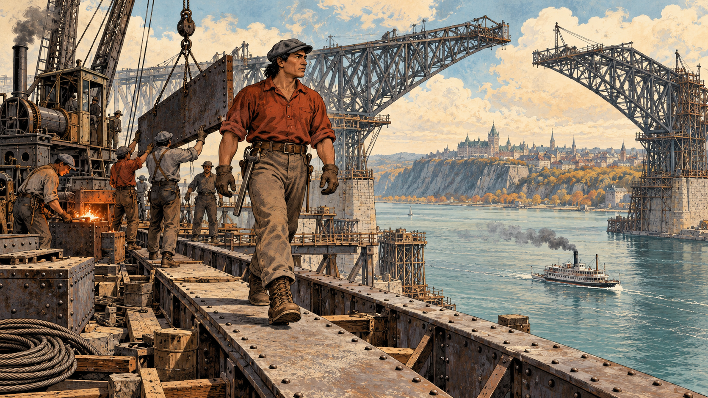
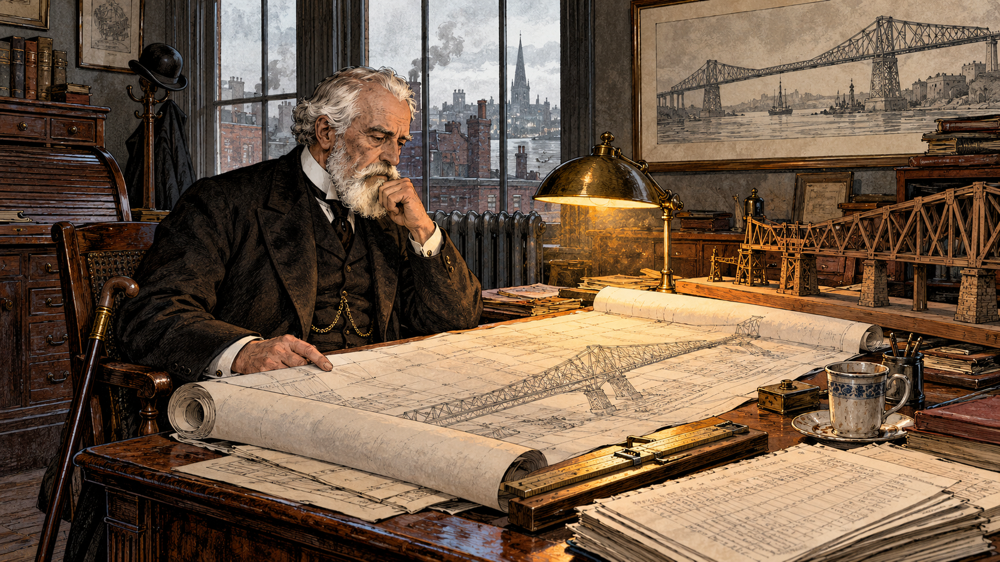
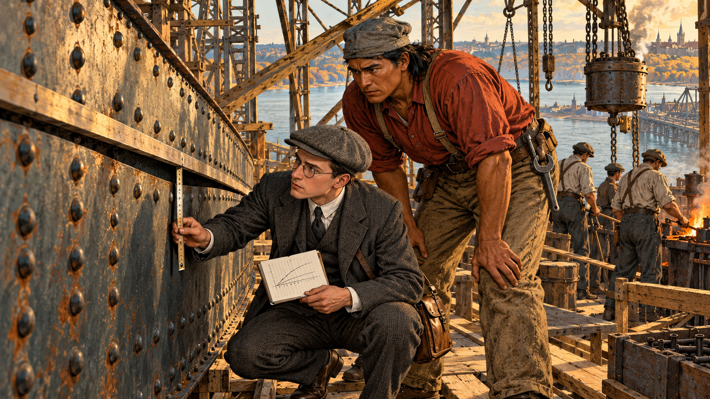
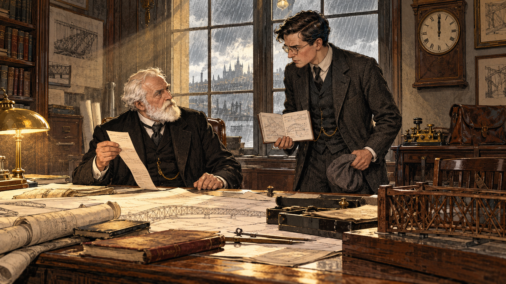
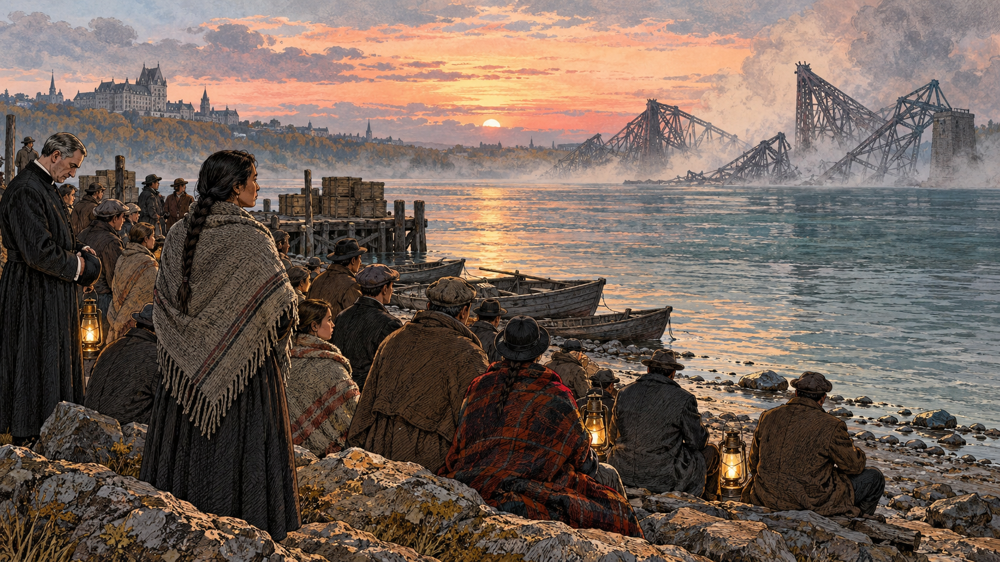
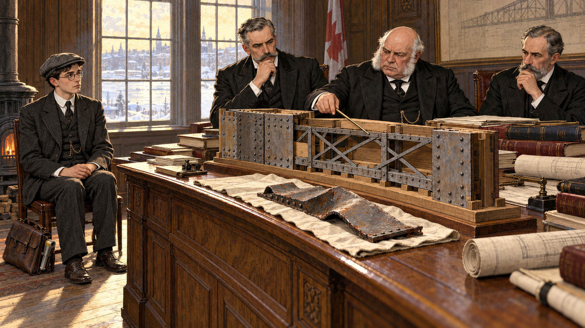
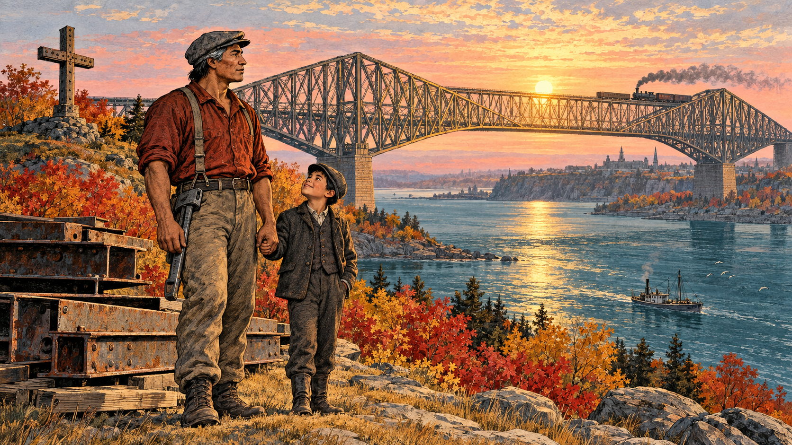
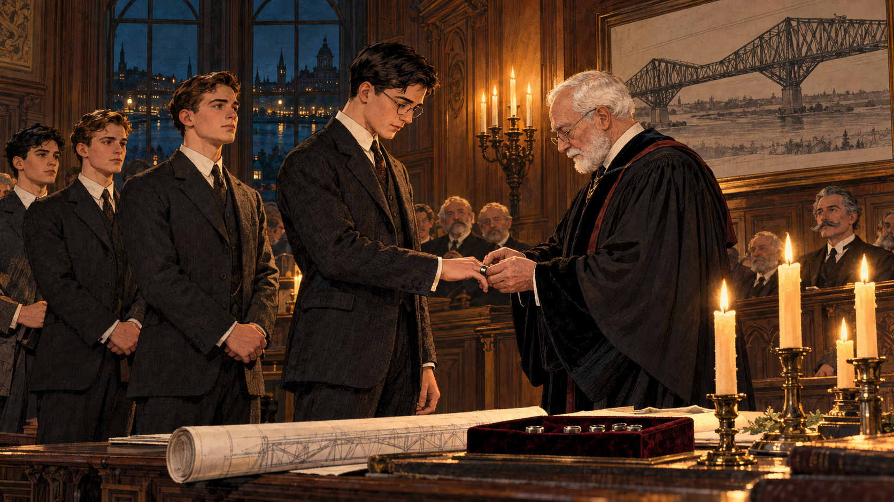

# The Ring and the Bridge

Cover Image Prompt

(This is the Cover Image. Do not include this label in the image.)
Please generate a wide-landscape 16:9 cover image for a graphic novel in an early-1900s industrial engraving-and-gouache illustration style with fine ink linework and soft painted washes. In the center background, an enormous half-built steel cantilever bridge rises from the cliffs on the south shore of a wide river near Quebec City in the summer of 1907, its great lattice arms reaching out over blue-green water in the early morning mist. In the foreground on the left stands a broad-shouldered Kahnawake Mohawk ironworker in his early thirties with straight black hair under a gray cloth cap, a rust-red work shirt with rolled sleeves, canvas trousers, leather boots, and a long steel spud wrench tucked in his belt, looking up at the steel with calm, skilled confidence. Beside him stands a slim young engineer with neat dark hair, round wire spectacles, a charcoal wool suit and waistcoat with a watch chain, a flat gray cap, and a brown leather satchel with a steel measuring tape coiled at its side, looking at the same steel with a thoughtful, worried frown. On a stone parapet between them rests a plain, rough-faceted iron ring catching the first gold light. A hand-lettered title reads "The Ring and the Bridge" across the top in a sturdy early-1900s serif typeface, with a smaller subtitle "Quebec, 1907" along the bottom. Color palette: iron gray, rust red, river blue-green, sepia cream, and autumn gold. Emotional tone: solemn, respectful, quietly hopeful. Generate the image immediately without asking clarifying questions.

Narrative Prompt

This story follows the building of the Quebec Bridge over the St. Lawrence River (construction began in 1903), its failure on August 29, 1907, the Kahnawake Mohawk ironworkers who were among its builders, and the Iron Ring ritual that Canadian engineers still take today. The settings range from the Kahnawake community and the bridge site near Quebec City in 1907 to a New York consulting office, a Royal Commission hearing room in 1907-08, and a candlelit ceremony in Montreal in 1925. The art style is an early-1900s industrial engraving-and-gouache illustration with confident ink linework and a palette of iron gray, rust red, river blue-green, sepia cream, and autumn gold. Three recurring characters keep one look in every panel. The Kahnawake ironworker is a broad-shouldered man in his early thirties with straight black hair under a gray cloth cap, a rust-red work shirt with rolled sleeves, canvas trousers, leather boots, and a steel spud wrench in his belt; he is a skilled professional, drawn with dignity and never as a stereotype. The young engineer, a stylized stand-in for the junior engineer Norman McLure, is slim with neat dark hair, round wire spectacles, a charcoal wool suit and waistcoat with a watch chain, a flat gray cap, and a leather satchel with a steel measuring tape. The consulting engineer, a stylized stand-in for Theodore Cooper, is elderly with a full white beard and a black frock coat. The three Royal Commission engineers wear black frock coats: one tall with a gray handlebar mustache, one stout and bald with white side-whiskers, and one lean with a trimmed gray beard. Creative liberties: the dates, places, numbers, and findings come from published sources, but the individual scenes and the small amount of dialogue are imagined to make the human story visible. The ironworker is a composite, not a real individual. The conversations in Panels 3 and 4, the quiet gathering in Panel 6, and the faces in every panel are dramatizations; the people shown are stylized interpretations, not portraits. The story shows the aftermath of the disaster only at a distance and with restraint. Two claims are labeled as tradition in the text: that Kahnawake's women resolved that the men would never again work in one large group, and that the first Iron Rings were made from the fallen bridge's steel, which historians describe as apocryphal. Show no readable text in any panel image except where a prompt explicitly asks for it.

### Prologue – The Weight You Cannot See

Every bridge, building, and roof must carry two kinds of load. Live loads come and go: a train, a crowd, wind, snow. The dead load never leaves, because it is the structure's own weight, and it is the one you must predict before a single piece of steel exists. In 1907 a great bridge in Quebec failed because its dead load had been underestimated and a warning from a younger engineer did not travel fast enough. This is the story of that bridge, the Mohawk ironworkers who built it, and a small iron ring that engineers still wear to remember what happened.

## Panel 1: Steel Over the St. Lawrence

Image Prompt

(This is Panel 01. Do not include the panel number in the image.)
I am about to ask you to generate a series of images for a graphic novel. Please make the images have a consistent style and consistent characters. Do not ask any clarifying questions. Just generate the image immediately when asked.

Please generate a 16:9 image in an early-1900s industrial engraving-and-gouache illustration style with fine ink linework and painted washes, depicting panel 1 of 8. The scene shows the half-built Quebec Bridge in the summer of 1907 on the St. Lawrence River near Quebec City, its two enormous lattice arms reaching out from the south shore. In the foreground, a crew of Kahnawake Mohawk ironworkers walks calmly along a wide steel beam: the lead figure is a broad-shouldered man in his early thirties with straight black hair under a gray cloth cap, a rust-red work shirt with rolled sleeves, canvas trousers, leather boots, and a long steel spud wrench tucked in his belt, balanced with easy confidence. Behind him, other ironworkers in similar work clothes guide a hanging steel plate on a crane cable, and a small portable forge glows orange where rivets are heated. A steam-powered derrick, stacks of riveted plates, and coils of cable fill the work platform. Far below, a steamboat trails smoke on the blue-green river, and the cliffs and church spires of Quebec City rise in the hazy distance. Color palette: iron gray, rust red, river blue-green, sepia cream, and autumn gold. The emotional tone should be pride, skill, and the quiet confidence of experts at work. Generate the image immediately without asking clarifying questions.

The Quebec Bridge was meant to be the longest cantilever bridge in the world, a railway link across the St. Lawrence that had defeated engineers for decades. Among the men raising it were ironworkers from Kahnawake, a Mohawk community on the south shore of the river near Montreal. Their families had been working on high steel since the 1880s, when men from Kahnawake helped build a railway bridge across the river near their homes, and they were known for walking beams hundreds of feet in the air without fear. In the summer of 1907 they were adding steel to the arms of the Quebec Bridge, panel by panel, every piece fitted to the next.

## Panel 2: The Span That Grew

Image Prompt

(This is Panel 02. Do not include the panel number in the image.)
Please generate a 16:9 image in an early-1900s industrial engraving-and-gouache illustration style with fine ink linework and painted washes, depicting panel 2 of 8. Make the characters and style consistent with the prior panel. The scene shows a quiet engineering consulting office in New York City around 1907, with tall windows looking out on brick rooftops and a gray sky. An elderly engineer with a full white beard and white hair, a black frock coat, and a high white collar sits at a large drafting desk, studying a long roll of bridge drawings by lamplight. Beside him on the desk stand a brass slide rule, a wooden model of a cantilever bridge arm, a stack of calculation sheets covered in columns of figures with no readable numbers, and a cup of cold tea. A framed sketch of a long steel bridge hangs on the wall, and a cane leans against his chair. A radiator, a roll-top cabinet, and a hat stand with a bowler hat complete the room. The old man's expression is composed, tired, and sure of himself. Color palette: sepia cream, iron gray, rust red accents, and dim autumn gold lamplight. The emotional tone should be quiet confidence with a faint, unnoticed shadow of fatigue. Generate the image immediately without asking clarifying questions.

The bridge's consulting engineer was Theodore Cooper, a famous bridge designer who directed the work from New York and, citing poor health, did not visit the site while the superstructure rose. The main span had been lengthened from 1,600 to 1,800 feet to save money and time. A longer span means heavier steel, and heavier steel means a heavier bridge that must carry itself. The designers at the Phoenix Bridge Company did not recalculate the dead load for the longer span. Cooper estimated the increase at about seven percent and accepted it as not fatal, so the weight of the real steel quietly outgrew the numbers the design depended on.

## Panel 3: The Chord That Bent

Image Prompt

(This is Panel 03. Do not include the panel number in the image.)
Please generate a 16:9 image in an early-1900s industrial engraving-and-gouache illustration style with fine ink linework and painted washes, depicting panel 3 of 8. Make the characters and style consistent with the prior panel. The scene shows the work platform of the half-built Quebec Bridge in August 1907. In the foreground, a slim young engineer with neat dark hair, round wire spectacles, a charcoal wool suit and waistcoat with a watch chain, a flat gray cap, and a brown leather satchel crouches beside a huge riveted steel box-shaped lower chord, holding a steel measuring tape against a long straightedge laid along its side. The steel plate of the chord visibly curves away from the straightedge, leaving a gap of a few inches. Next to him stands a broad-shouldered Kahnawake Mohawk ironworker in his early thirties with straight black hair under a gray cloth cap, a rust-red work shirt with rolled sleeves, canvas trousers, and a steel spud wrench in his belt, leaning in and studying the bend with a serious frown. Behind them, a work crew pauses at a riveting forge, and wooden scaffolding and chain hoists hang overhead. A small notebook in the engineer's hand is filled with sketched curves and tick marks with no readable numbers. Gold afternoon light slants through the lattice. Color palette: iron gray, rust red, river blue-green, sepia cream, and autumn gold. The emotional tone should be uneasy concentration, with two skilled people sensing that something is wrong. Generate the image immediately without asking clarifying questions.

Norman McLure, a junior engineer who inspected the work for Cooper, measured the problem. The lower chords near the south pier, the huge steel members along the bottom of the arm, were bending. A chord is a compression member: it is squeezed end to end by the weight above, much as you squeeze a long ruler between your palms. A slender member under compression can suddenly bow sideways, called buckling, and once it begins to bend it loses strength fast. Reports of the time describe a chord out of line by about three-quarters of an inch rising to more than two inches in roughly a week. The bend was visible to anyone who sighted along the steel.

## Panel 4: A Telegram Too Late

Image Prompt

(This is Panel 04. Do not include the panel number in the image.)
Please generate a 16:9 image in an early-1900s industrial engraving-and-gouache illustration style with fine ink linework and painted washes, depicting panel 4 of 8. Make the characters and style consistent with the prior panel. The scene shows the New York consulting office from before, on a midday in late August 1907. The slim young engineer with neat dark hair, round wire spectacles, a charcoal wool suit and waistcoat with a watch chain, and a flat gray cap held in his hand stands anxiously beside the large desk, holding open a small notebook of sketched curves and measurements. The elderly engineer with a full white beard and white hair and a black frock coat sits behind the desk, looking up from a long thin slip of telegram paper he holds in his hand. A wall clock shows the middle of the day, and a brass telegraph key sits on a side table next to a leather messenger bag. Rolled drawings, a wooden model of a bridge arm, and a window with streaming gray rain fill the background. Dust hangs in a shaft of pale gold light. Color palette: sepia cream, iron gray, rust red, and dim autumn gold. The emotional tone should be tense urgency, with the quiet dread that time is running out. Generate the image immediately without asking clarifying questions.

On August 27, McLure wrote to Cooper, and then he traveled to New York to explain in person. On the morning of August 29, after they met, Cooper sent a telegram to the bridge company: add no more load to the bridge until the facts had been considered. The message was not passed on to Quebec in time. Late that afternoon, near quitting time, the south arm and part of the central span failed and fell into the river. Seventy-five of the eighty-six men on the bridge died, and sources differ slightly on the exact count.

## Panel 5: The Shore at Dawn

Image Prompt

(This is Panel 05. Do not include the panel number in the image.)
Please generate a 16:9 image in an early-1900s industrial engraving-and-gouache illustration style with fine ink linework and painted washes, depicting panel 5 of 8. Make the characters and style consistent with the prior panel. The scene shows a quiet riverbank near Quebec City at dawn on August 30, 1907, seen from a respectful distance. In the far distance, across the wide blue-green St. Lawrence, a dark, tangled silhouette of twisted steel girders stands in drifting pale dust and morning mist, with no people visible near it. On the shore in the foreground, a few dozen townspeople and families, including a Kahnawake woman in her thirties with a long dark braid, a dark wool dress, and a gray shawl, stand and sit close together, holding lanterns that still glow in the half-light and wrapped in blankets. A priest in a black cassock stands at the edge of the group with bowed head. Small rowboats rest at the water's edge, a stack of wooden crates sits on a pier, and a few wet stones glisten. A pale rose-gold sunrise edges the clouds. The scene is hushed. Color palette: iron gray, river blue-green, sepia cream, muted rust red, and soft autumn gold. The emotional tone should be grief held in silence, patience, and solidarity. Generate the image immediately without asking clarifying questions.

The next morning families waited at the river's edge for news. Back in Kahnawake, a community of about 2,000 people, the only telephone had rung with the terrible word, and thirty residents set out for Quebec to find their men. Thirty-three of the dead were Mohawk ironworkers from Kahnawake; by one account the loss left 25 widows and 53 children without fathers. Community history says that the women then resolved that never again would so many of the men work together on a single high-steel job. That account is tradition rather than a record of a single meeting, but it reflects a real change: the community later raised steel crosses at the two ends of the reserve in memory of the men.

## Panel 6: The Inquiry

Image Prompt

(This is Panel 06. Do not include the panel number in the image.)
Please generate a 16:9 image in an early-1900s industrial engraving-and-gouache illustration style with fine ink linework and painted washes, depicting panel 6 of 8. Make the characters and style consistent with the prior panel. The scene shows a paneled government hearing room in Canada in the winter of 1907 to 1908. Three engineers in black frock coats sit behind a long oak table: one tall with a gray handlebar mustache, one stout and bald with white side-whiskers and a pocket watch chain, and one lean with a trimmed gray beard. On the table in front of them stands a large cutaway wooden model of a built-up steel chord, showing riveted plates and thin diagonal lacing bars, and beside it a bent piece of recovered steel plate laid on a cloth. Stacks of bound reports, brass dividers, and rolled drawings cover the table. At the side of the room, the slim young engineer with neat dark hair, round wire spectacles, and a charcoal wool suit sits quietly in a wooden chair with his satchel at his feet, hands folded. Tall frosted windows let pale gold winter light fall across the floor, and a stove ticks in the corner. Color palette: sepia cream, iron gray, oak brown, rust red accents, and autumn gold. The emotional tone should be sober, searching, and determined to learn. Generate the image immediately without asking clarifying questions.

A Royal Commission of three engineers, Henry Holgate, J. G. G. Kerry, and John Galbraith, investigated and reported in early 1908. It concluded that the failure began in the lower chords of the anchor arm near the main pier, which were defectively designed, and that the dead load had been assumed at too low a value. It blamed errors of judgment by Cooper and by the Phoenix Bridge Company's chief designer, Peter Szlapka, and noted that no one connected with the design had fully appreciated how much the problem demanded. In plain terms, the chords were too weak, their lacing was too light to make each one behave as a single stiff column, and the design numbers were not independently rechecked when the span grew.

## Panel 7: Back on the Steel

Image Prompt

(This is Panel 07. Do not include the panel number in the image.)
Please generate a 16:9 image in an early-1900s industrial engraving-and-gouache illustration style with fine ink linework and painted washes, depicting panel 7 of 8. Make the characters and style consistent with the prior panel. The scene shows the south shore of the St. Lawrence River at sunrise in the autumn of 1917, with the finished Quebec Bridge spanning the entire river in the background, its heavy steel lattice arms and long central span glowing gold, and a small steam train crossing the top. In the foreground stand the broad-shouldered Kahnawake Mohawk ironworker, now in his forties with a few gray streaks at the temples under his gray cloth cap, a rust-red work shirt with rolled sleeves, canvas trousers, and a steel spud wrench in his belt, and beside him a young boy in a wool cap who looks up at him, holding the ironworker's hand. Near them lies a stack of weathered steel beams on a wooden pallet, and a small girder cross stands on a hill, silhouetted against the pink sky. Autumn maples glow red and gold along the riverbank, and a fishing boat drifts on the blue-green water. Color palette: iron gray, rust red, river blue-green, sepia cream, and autumn gold. The emotional tone should be resilient, dignified, and quietly proud. Generate the image immediately without asking clarifying questions.

Engineers rebuilt the bridge, heavier and stronger, and learned a second hard lesson on September 11, 1916, when the central span was being hoisted into place. A casting in the lifting equipment failed, the span fell into the river, and thirteen workers died. The bridge was finished in 1917, with the first train crossing in December, and its 549-meter (1,801-foot) span is still the longest cantilever span in the world. The ironworkers of Kahnawake kept building too, now in smaller crews, on bridges and on the steel frames of cities. Many settled in a Brooklyn neighborhood they called Little Caughnawaga, and their steelwork helped raise New York skyscrapers, among them the Empire State Building. Their trade had suffered the worst of the disaster, and they kept it alive.

## Panel 8: The Ring

Image Prompt

(This is Panel 08. Do not include the panel number in the image.)
Please generate a 16:9 image in an early-1900s industrial engraving-and-gouache illustration style with fine ink linework and painted washes, depicting panel 8 of 8. Make the characters and style consistent with the prior panel. The scene shows a dim, candlelit wood-paneled meeting hall in Montreal in April 1925. A short line of young graduates in dark suits stands with right hands extended, and at the front a white-haired university professor with round glasses and a short white beard, in a black academic gown, places a rough-faceted, plain iron ring on the little finger of the first young engineer's right hand. A table before them holds a few tall candles, a roll of drawings, and a small velvet-lined tray with several more rings. Behind them, a tall arched window shows a night sky over the city, and on the wall hangs a framed drawing of a long steel cantilever bridge. Warm candlelight reflects on the oak paneling and on the graduates' serious faces. Color palette: iron gray, rust red, river blue-green night shadows, sepia cream, and autumn gold candlelight. The emotional tone should be solemn, humble, and hopeful, a promise being made. Generate the image immediately without asking clarifying questions.

In 1922 H. E. T. Haultain, an engineering professor at the University of Toronto, proposed a ceremony to remind engineers of their obligation to the public, and Rudyard Kipling wrote its text. The first Ritual of the Calling of an Engineer took place in Montreal on April 25, 1925. Graduates receive a ring, still called the Iron Ring, and wear it on the little finger of the working hand, where its rough facets catch on paper as they sketch and sign. Engineering tradition ties the ritual to the Quebec Bridge disaster, and the ring stands for humility, responsibility, and the knowledge that others will stand on what you build. A popular story says the first rings were made from the fallen bridge's steel, but that claim is apocryphal: the first rings were reportedly produced by veterans of the First World War, and modern rings are made of wrought iron or stainless steel.

### Epilogue – What Did the Bridge Teach Us?

The Quebec Bridge failed because a prediction was wrong and a warning moved too slowly. It also shows how engineering improves: a Royal Commission looked for the causes, the designers' errors were published, and rules of practice grew stronger. The Mohawk ironworkers of Kahnawake paid a heavy price for decisions they did not make, and their community responded with grief, dignity, and an unbroken commitment to skilled work. The Iron Ring asks every new engineer to carry that history forward.

| Challenge | How the Engineers and Ironworkers Responded | Lesson for Today |
|-----------|---------------------------------------------|------------------|
| The dead load was underestimated when the span grew | The Royal Commission traced the failure to the dead-load assumption and the design of the lower chords | When a design changes, recalculate everything it touches, especially the structure's own weight |
| A slender compression chord began to buckle | McLure measured the bend and reported it repeatedly, and ironworkers saw it in the steel | Treat measured distortion in a compression member as an alarm, never as an inconvenience |
| A junior engineer's warning did not reach the site in time | The commission blamed errors in judgment and weak oversight of the design and the site | Build clear chains of authority so that a stop-work order reaches the people at risk immediately |
| The Kahnawake community lost 33 of its ironworkers | Families grieved, raised steel crosses, and, by community tradition, spread the men across smaller crews | Honor the people who build, and design work so that one failure cannot take a whole community |
| Engineers needed a daily reminder of responsibility | Haultain's ritual and the Iron Ring made humility and public duty a visible part of the profession | Remember that other people will trust their lives to your calculations |

### Call to Action

You will not be asked to design a bridge tomorrow, but you will be asked to check a number, sign a drawing, or speak up when something looks wrong. Learn how structures carry their own weight and the loads placed on them in [Chapter 6: Structural Loads and Load Paths](../../chapters/06-structural-loads/index.md), study why buildings fail and how to catch the warning signs early in [Chapter 21: Durability and Building Failure](../../chapters/21-durability-failure/index.md), and see how independent review is written into practice in [Chapter 17: Building Codes, Permits, and Enforcement](../../chapters/17-building-codes-permits/index.md). Measure carefully, listen to the person holding the tape, and let's build it right.

---

*"Add no more load to bridge till after due consideration of facts."*
—Theodore Cooper, telegram sent August 29, 1907, as quoted on Wikipedia

*"...the most major event in our history."*
—Andrew Delisle Sr., Kahnawake elder, on the 1907 disaster, as quoted by Canada's History

---

## References

1. [Wikipedia: Quebec Bridge](https://en.wikipedia.org/wiki/Quebec_Bridge) - Overview of the bridge, the 1907 and 1916 failures, the Royal Commission, and the completed structure
2. [Wikipedia: Iron Ring](https://en.wikipedia.org/wiki/Iron_Ring) - History of the Canadian engineer's ring, Haultain, Kipling, the first 1925 ceremony, and the disputed Quebec Bridge steel claim
3. [Wikipedia: Mohawk skywalkers](https://en.wikipedia.org/wiki/Mohawk_skywalkers) - Background on Kahnawake and other Mohawk ironworkers and their work on bridges and skyscrapers
4. [Canada's History: A Community's Loss](https://www.canadashistory.ca/explore/first-nations-inuit-metis/a-community-s-loss) - How the 1907 disaster affected Kahnawake families and the community's response
5. [Structure Magazine: Quebec Bridge, The First Failure, 1907](https://www.structuremag.org/article/quebec-bridge-the-first-failure-1907/) - Engineering account of the design changes, dead-load error, chord deformation, and Royal Commission findings
