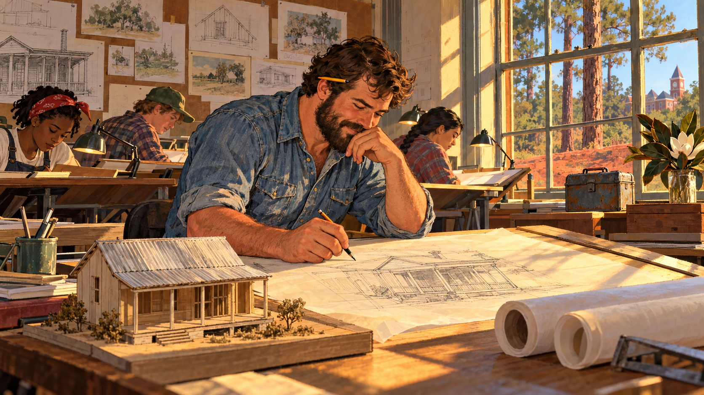
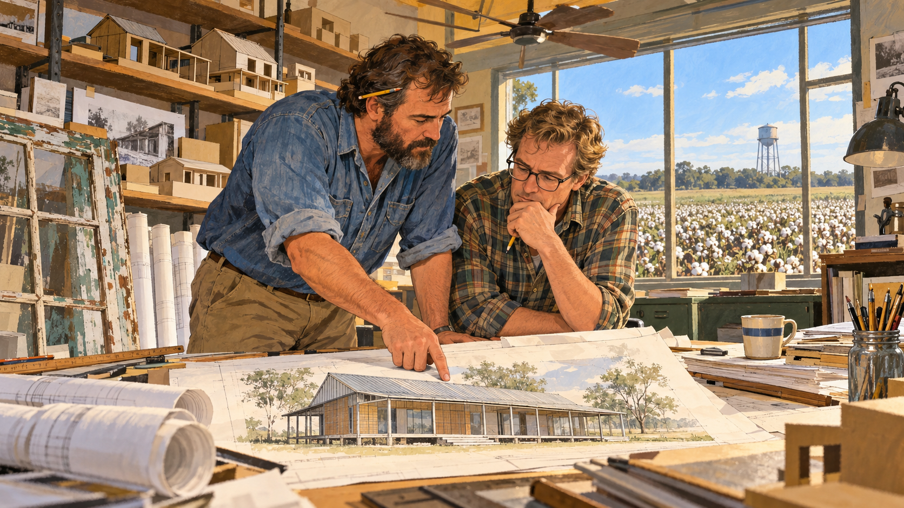
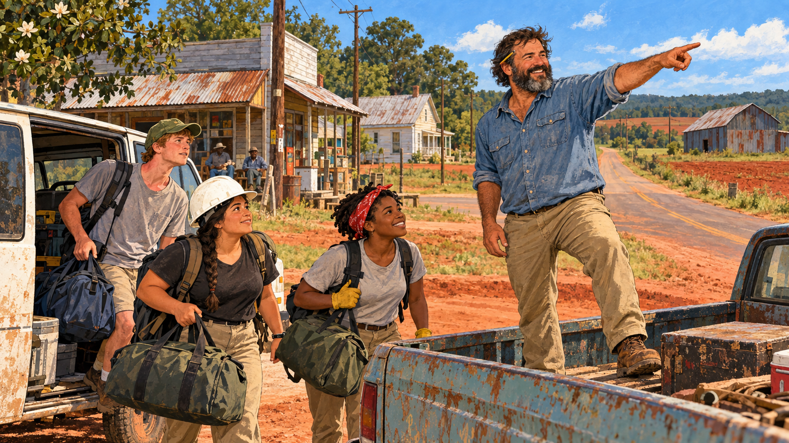
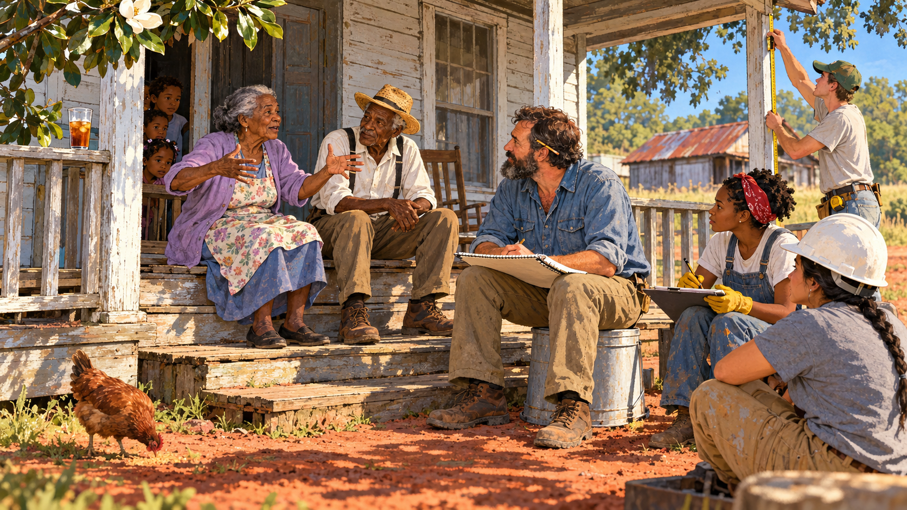
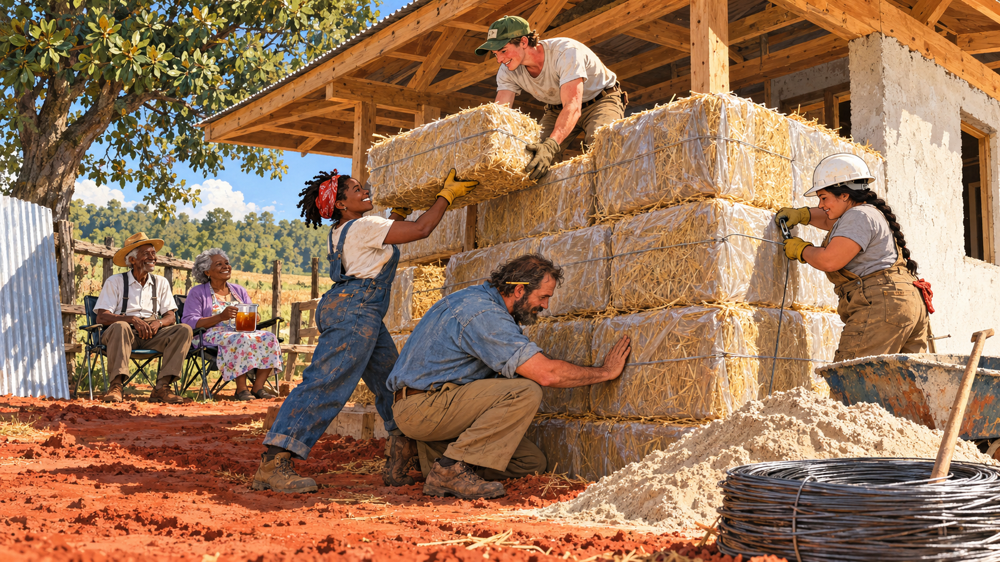
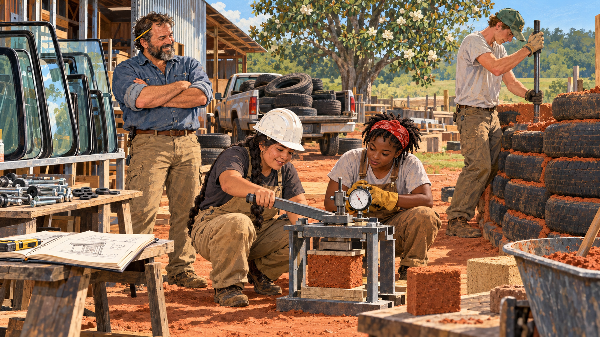
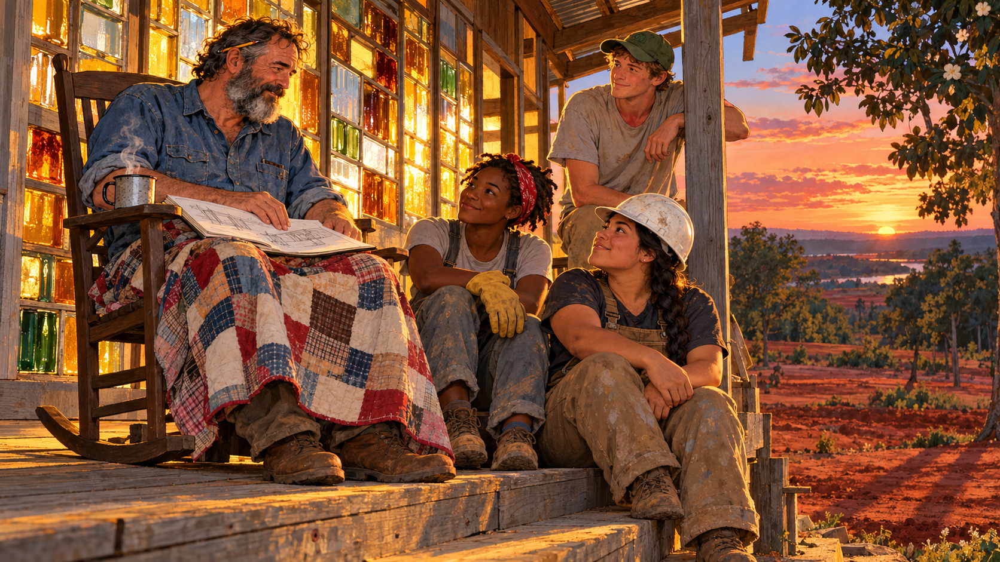
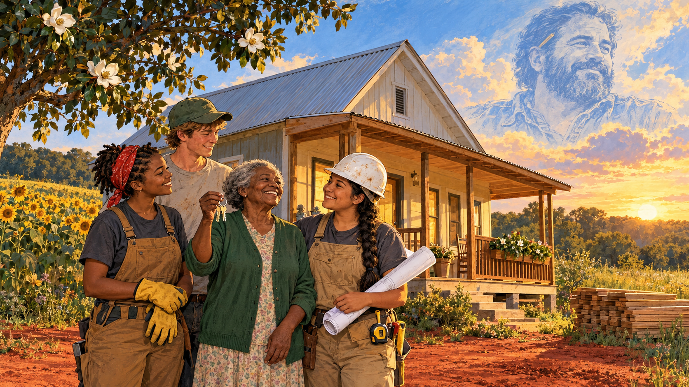

# The $20,000 House

Cover Image Prompt

(This is the Cover Image. Do not include this label in the image.)
Please generate a wide-landscape 16:9 cover image for a graphic novel in a warm contemporary American editorial illustration style with gouache texture and confident ink linework. In the center, on the deep front porch of a small rounded-wall stucco house in rural Alabama, stands Samuel "Sambo" Mockbee, a broad-shouldered man with a full dark beard flecked with gray, a sun-creased face, a faded blue denim work shirt with sleeves rolled to the elbow, khaki work trousers, and scuffed brown boots. Beside him are three students in work clothes: Dana, a young Black woman with short twists, a red bandana, and yellow work gloves; Tom, a lanky young white man in a green ball cap with a sunburned neck; and Lupe, a stocky young Latina woman with a long dark braid and a white hard hat. An elderly Black couple sits in rocking chairs on the porch, the man in a tan straw hat and suspenders, the woman in a lavender cardigan. Behind the house are red clay fields, a corrugated-steel silver roof catching the light, a magnolia tree, and a wide sky blue horizon dotted with hay bales and a stack of old tires. A hand-lettered title reads "The $20,000 House" across the top in a sturdy slab-serif typeface, with a smaller subtitle "Samuel Mockbee and the Rural Studio" along the bottom. Color palette: red clay, hay gold, sky blue, corrugated-steel silver, and magnolia green. Emotional tone: warm, proud, and quietly hopeful. Generate the image immediately without asking clarifying questions.

Narrative Prompt

This story follows the architect and teacher Samuel "Sambo" Mockbee (1944–2001) from his boyhood in Meridian, Mississippi, to the founding of Auburn University's Rural Studio in Hale County, Alabama, in 1993, and then to the Twenty K House (also written 20K House) that the studio began after his death. The settings range from 1970s Auburn and 1980s Mississippi to the red-clay fields of Hale County in the 1990s and the 2000s. The art style is a warm contemporary American editorial illustration: gouache texture, confident ink linework, and a palette of red clay, hay gold, sky blue, corrugated-steel silver, and magnolia green. Mockbee is drawn as a stylized interpretation rather than a portrait: a broad-shouldered man with a full dark beard (gray appears gradually across the panels), a sun-creased face, a faded blue denim work shirt with sleeves rolled to the elbow, khaki work trousers, scuffed brown boots, and a carpenter's pencil behind one ear. Three recurring students are invented composites: Dana, a young Black woman with short twists, a red bandana, and yellow work gloves; Tom, a lanky young white man in a green ball cap with a sunburned neck; and Lupe, a stocky young Latina woman with a long dark braid and a white hard hat. Shepherd and Alberta Bryant, the clients of the first project, are real people, drawn with dignity as collaborators: Shepherd is a slim man with white hair, a tan straw hat, and suspenders over a white shirt, and Alberta is a slim, gray-haired woman in a lavender cardigan and floral apron. Keep all of these looks consistent in every panel. Creative liberties: the dates, places, materials, and project names are drawn from published sources, but the conversations and individual scenes are imagined. In particular, the students Dana, Tom, and Lupe are composites and not real Rural Studio students, the porch conversation with the Bryants in Panel 4 is a dramatization of the fact that they told the team what they wanted in a house, the materials-testing scene in Panel 6 illustrates good practice rather than a record of a specific session, and the homeowner in Panel 8 is a composite and not a real Twenty K House client. Sources disagree on a few small details, such as the exact year of founding (1992 or 1993; this story uses 1993, the date given by Rural Studio itself), the number of grandchildren in the Bryant household, and the thickness of the hay bale walls, so this story avoids those exact figures. Show no readable text in any panel image except where a prompt explicitly asks for it.

### Prologue – A House Worth Living In

What does a family deserve from the place where they sleep, cook, and grow old? For Samuel Mockbee, the answer was simple: a house that keeps out the rain, keeps in the warmth, and lifts the spirit. He believed that good design is not only for people who can pay for it, and he found a way to prove it with college students, borrowed trucks, and some very unusual building materials. This is the story of how an architect from Mississippi turned a classroom into a construction site, and how his idea grew into a $20,000 house that anyone can learn from.

## Panel 1: A Mississippi Boy Learns to Draw

Image Prompt

(This is Panel 01. Do not include the panel number in the image.)
I am about to ask you to generate a series of images for a graphic novel. Please make the images have a consistent style and consistent characters. Do not ask any clarifying questions. Just generate the image immediately when asked.

Please generate a 16:9 image in a warm contemporary American editorial illustration style with gouache texture and ink linework, depicting panel 1 of 8. The scene shows Samuel "Sambo" Mockbee as a young man of about twenty-eight, a broad-shouldered man with a short dark beard, a faded blue denim work shirt with sleeves rolled to the elbow, khaki trousers, and a carpenter's pencil behind one ear, bent over a slanted wooden drafting table in an Auburn University architecture studio in 1973. On the table: a pencil drawing of a porch, a roll of tracing paper, and a small balsa-wood model of a tin-roofed house. Around him are other students at tilted tables, a wall pinned with sketches of Southern farmhouses, and a tall window showing pine trees and red clay soil. On the sill sits a battered tin lunch pail and a small pot of magnolia leaves. Late afternoon light turns the paper gold. Color palette: red clay, hay gold, sky blue, and magnolia green. The emotional tone should be focused, curious, and a little mischievous. Generate the image immediately without asking clarifying questions.

Samuel Mockbee was born on December 23, 1944, in Meridian, Mississippi, and grew up there during the civil rights era. After two years in the Army, he enrolled in the architecture school at Auburn University and earned his degree in 1974. His friends called him Sambo, and he loved porches, tin roofs, and the plain, hard-working buildings of the rural South. He had already decided that a house should answer to the people and the place around it, not to a fashion magazine.

## Panel 2: Architect, Then Teacher

Image Prompt

(This is Panel 02. Do not include the panel number in the image.)
Please generate a 16:9 image in a warm contemporary American editorial illustration style with gouache texture and ink linework, depicting panel 2 of 8. Make the characters and style consistent with the prior panel. The scene shows Samuel Mockbee, now about forty, a broad-shouldered man with a full dark beard just starting to show gray, a faded blue denim work shirt with sleeves rolled to the elbow, and a carpenter's pencil behind one ear, in a small architecture office in a Mississippi town in about 1988. He leans over a drafting table with a partner, a bespectacled man in a plaid shirt, studying a drawing of a modern house with a long porch and a galvanized-steel roof. On the shelves behind them are cardboard house models, a stack of rolled plans, a jar of pencils, and an old windowsill salvaged from a barn. Through a wide window, a flat green landscape of cotton fields and a water tower. A ceiling fan turns lazily and a coffee cup sits on a stack of drawings. Color palette: hay gold, magnolia green, corrugated-steel silver, and sky blue. The emotional tone should be restless and thoughtful, as if a bigger question is forming. Generate the image immediately without asking clarifying questions.

Mockbee returned to Mississippi and built a successful practice. In 1983 he and Coleman Coker founded the firm Mockbee Coker, and their houses drew on porches, dogtrot plans, and galvanized-steel roofs. But clients with money for an architect were not the only people who needed good houses. In the early 1990s he left full-time practice to teach at Auburn, where he and fellow professor Dennis K. "D.K." Ruth began to ask a bold question: what if architecture students learned by building real things for people who could never hire an architect?

## Panel 3: Moving Class to Hale County

Image Prompt

(This is Panel 03. Do not include the panel number in the image.)
Please generate a 16:9 image in a warm contemporary American editorial illustration style with gouache texture and ink linework, depicting panel 3 of 8. Make the characters and style consistent with the prior panel. The scene shows Samuel Mockbee, a broad-shouldered man with a full dark beard flecked with gray, a faded blue denim work shirt with sleeves rolled to the elbow, khaki trousers, and scuffed brown boots, standing in the bed of an old pickup truck in the small crossroads community of Newbern, Hale County, Alabama, in 1993. Around him three students climb out of a dusty van with duffel bags: Dana, a young Black woman with short twists, a red bandana, and yellow work gloves; Tom, a lanky young white man in a green ball cap with a sunburned neck; and Lupe, a stocky young Latina woman with a long dark braid and a white hard hat. Behind them are a tiny general store with a tin awning, an old clapboard house, a field of red clay, and a hand-painted barn. A wide sky blue horizon holds a few white clouds. Mockbee points down the road with a big grin. Color palette: red clay, hay gold, sky blue, and magnolia green. The emotional tone should be anticipation, a little nervousness, and open-hearted welcome. Generate the image immediately without asking clarifying questions.

In August 1993 Mockbee and Ruth launched the Rural Studio in Hale County, a poor part of Alabama's Black Belt where more than 30 percent of the people live in poverty. Students from Auburn moved to the village of Newbern, lived in the community, and went to work there; Mockbee drove roughly 170 miles from his home in Canton, Mississippi, to teach them. They worked as a design-build team: the students were both the designers and the builders, the neighbors were the owners, and everyone sat at the same table. Mockbee wanted architects who had learned their craft by listening first and swinging a hammer second.

## Panel 4: The Porch Conversation

Image Prompt

(This is Panel 04. Do not include the panel number in the image.)
Please generate a 16:9 image in a warm contemporary American editorial illustration style with gouache texture and ink linework, depicting panel 4 of 8. Make the characters and style consistent with the prior panel. The scene shows the weathered wooden front porch of an old, modest house with a rusting tin roof in Mason's Bend, Hale County, Alabama, in 1993. On the porch steps sits Alberta Bryant, a slim, gray-haired Black woman in a lavender cardigan and floral apron, gesturing with both hands as she describes a big porch. Beside her, Shepherd Bryant, a slim Black man with white hair, a tan straw hat, and suspenders over a white shirt, leans forward with a thoughtful nod. Facing them, Samuel Mockbee, a broad-shouldered bearded man in a faded blue denim shirt with rolled sleeves, sits on an upturned bucket holding a sketchbook, while Dana, with short twists, a red bandana, and yellow gloves, sketches on a clipboard, and Tom, a lanky young man in a green ball cap, measures the porch with a tape. A few young grandchildren peek around the doorframe. A glass of sweet tea sweats on the railing, a chicken pecks in the red dirt, and a magnolia tree throws shade across the yard. Color palette: red clay, hay gold, sky blue, and magnolia green. The emotional tone should be respectful, attentive, and warm, with the Bryants as the experts about their own lives. Generate the image immediately without asking clarifying questions.

The first project was a house for Shepherd and Alberta Bryant in Mason's Bend, who were raising their grandchildren in an old, unheated house with no plumbing. Mockbee and his students sat on the Bryants' porch and asked what they wanted. The Bryants answered clearly: a big front porch, and room for each of their grandchildren to have a place to sleep and study. Those two requests became the design brief, because the owners knew how they lived and the students were there to draw and build it.

## Panel 5: Walls Made of Hay

Image Prompt

(This is Panel 05. Do not include the panel number in the image.)
Please generate a 16:9 image in a warm contemporary American editorial illustration style with gouache texture and ink linework, depicting panel 5 of 8. Make the characters and style consistent with the prior panel. The scene shows a building site in Mason's Bend, Alabama, in 1994, where the walls of a small house are rising from stacked rectangular hay bales wrapped in clear plastic and tied with wire, laid like big bricks in staggered rows. A broad wooden roof frame with a deep overhang already shelters the walls. On the right, one finished wall is already coated in rough pale stucco. Dana, with short twists, a red bandana, and yellow work gloves, lifts a bale to Tom, a lanky young man in a green ball cap, who sets it on the wall, while Lupe, with a long dark braid and white hard hat, pulls tight wire through a bale with pliers. Samuel Mockbee, a broad-shouldered bearded man in a faded blue denim shirt with rolled sleeves, kneels near the base of the wall and presses his palm against a bale, checking it for dampness. Shepherd and Alberta Bryant watch from folding chairs under a tree, Alberta holding a pitcher of tea. Red clay ground, a pile of stucco sand, a wheelbarrow, a stack of wire coils, and a corrugated-steel silver roofing sheet leaning on a fence complete the scene. Color palette: hay gold, red clay, sky blue, and magnolia green. The emotional tone should be industrious pride and joyful teamwork. Generate the image immediately without asking clarifying questions.

For their walls, the students stacked dense hay bales wrapped in plastic, tied them together with wire, and covered them with stucco, a cement-based plaster. A thick bale wall slows heat flow, so the finished house stays warm in winter and the Bryants could heat it with a wood-burning stove, but the enemy of any bale wall is liquid water, because damp hay rots, grows mold, and feeds insects. Builders therefore keep bales dry (the usual target is a moisture content well under 20 percent), shed rain with a wide roof overhang, and seal the walls with plaster. The house was finished in 1994 as the Rural Studio's first completed home.

## Panel 6: Tires, Glass, and Careful Testing

Image Prompt

(This is Panel 06. Do not include the panel number in the image.)
Please generate a 16:9 image in a warm contemporary American editorial illustration style with gouache texture and ink linework, depicting panel 6 of 8. Make the characters and style consistent with the prior panel. The scene shows a busy workshop yard at the Rural Studio in Hale County, Alabama, in about 1998. In the foreground, Lupe, with a long dark braid and white hard hat, and Dana, with short twists, a red bandana, and yellow work gloves, kneel beside a small test block of pressed earth held in a simple steel frame, adding weight with a hand lever and watching a dial. Behind them, Tom, a lanky young man in a green ball cap, rams soil into a thick stack of old tires that form a curved wall, tamping with a long steel rod. To the left, a tall rack holds a neat stack of salvaged car windshields leaning against steel rails, with steel bolts and rubber washers laid out on a bench beside them. Samuel Mockbee, a broad-shouldered bearded man with a bit more gray, a faded blue denim shirt with rolled sleeves, and a carpenter's pencil behind one ear, stands with arms folded, grinning with approval. A hand-drawn notebook lies open on a sawhorse, a truck bed holds donated tires, and a magnolia tree stands in the distance. Color palette: red clay, corrugated-steel silver, sky blue, and magnolia green. The emotional tone should be playful ingenuity combined with careful, serious attention. Generate the image immediately without asking clarifying questions.

Money was tight, so the Rural Studio built with what it could find: for Yancey Chapel (1995) the students packed roughly a thousand donated tires with soil and stuccoed them. For the Mason's Bend Community Center (1999–2000) they bought dozens of discarded car windshields from a scrap yard for about $120 and fastened them with bolts and rubber washers, because glass that is already holed cannot safely be drilled. They also rammed walls from a mix of sand, clay, and cement, which stores heat by day and releases it at night. Salvage is only a bargain if it is tested: a builder must check an unknown material for strength, moisture, and safety before trusting it.

## Panel 7: Honors, Illness, and a Long Evening

Image Prompt

(This is Panel 07. Do not include the panel number in the image.)
Please generate a 16:9 image in a warm contemporary American editorial illustration style with gouache texture and ink linework, depicting panel 7 of 8. Make the characters and style consistent with the prior panel. The scene shows the porch of a finished community building at Mason's Bend, Alabama, at sunset in late 2001. Samuel Mockbee, a broad-shouldered man with a full beard now mostly gray, a faded blue denim shirt with rolled sleeves, and a patchwork quilt over his knees, sits in a wooden rocking chair, his thin hand resting on a student's sketch. Beside him, Dana, with short twists, a red bandana, and yellow work gloves, and Lupe, with a long dark braid and white hard hat, sit on the steps looking up at him, and Tom, a lanky young man in a green ball cap, leans on a post. Behind them, a wall of salvaged glass glows amber as the low sun shines through, scattering warm color across the porch boards. Beyond the porch are red clay fields, long shadows from magnolia trees, and sky blue deepening to rose. A tin cup of coffee steams on the arm of the rocker. Color palette: amber gold, red clay, sky blue, and magnolia green. The emotional tone should be tender, grateful, and unhurried. Generate the image immediately without asking clarifying questions.

In 2000 the MacArthur Foundation named Mockbee a MacArthur Fellow, and the $500,000 prize went to the Rural Studio's work. By then he was already ill with leukemia, first diagnosed in 1998, yet he kept teaching and building. He died on December 30, 2001, at age 57. His students stayed on in Hale County, and in 2004 the American Institute of Architects awarded him its Gold Medal, one of the profession's highest honors.

## Panel 8: The $20,000 House

Image Prompt

(This is Panel 08. Do not include the panel number in the image.)
Please generate a 16:9 image in a warm contemporary American editorial illustration style with gouache texture and ink linework, depicting panel 8 of 8. Make the characters and style consistent with the prior panel. The scene shows a small, simple gabled house with a corrugated-steel silver roof and a deep front porch in rural Hale County, Alabama, in about 2012, with a freshly stained wooden porch rail and red clay yard. In front of the house, a gray-haired Black woman in a plain green cardigan, a retired homeowner, holds a ring of house keys and smiles. Beside her stand three students of a later class who look like the earlier ones: Dana, with short twists, a red bandana, and yellow work gloves; Tom, a lanky young man in a green ball cap; and Lupe, with a long dark braid and white hard hat, all holding tools and a rolled drawing. In the far background, a faint sketch of a bearded man in a denim shirt is drawn into the clouds, as if the sky were a tracing paper. A large sunflower field, a magnolia tree, a window box, and a neat stack of lumber complete the scene. Late golden light fills the porch. Color palette: hay gold, red clay, sky blue, corrugated-steel silver, and magnolia green. The emotional tone should be quietly triumphant and inspiring. Generate the image immediately without asking clarifying questions.

After Mockbee's death, Andrew Freear, who had joined the studio in 2000, became director and carried the work forward. Beginning in 2004 and 2005, the studio launched the Twenty K House, a research project on a simple one-bedroom home of about 500 square feet that a contractor could build for $20,000: about $10,000 to $12,000 for materials and the rest for labor. Rural Studio chose the number because it is roughly the highest mortgage a person living on Social Security can carry. That is a legacy of Mockbee's idea, not a project he built himself, and it shows what students, clients, and builders can learn when they treat affordability as a design problem.

### Epilogue – What Made Samuel Mockbee Different?

Mockbee did not treat poverty as a reason to lower his standards. He treated it as a reason to think harder about materials, comfort, and beauty, and he made students live where the work was so that they felt its stakes. His clients were collaborators who knew their own needs. He also trusted students to build real buildings, while insisting that they learn the science behind them: how water moves, how walls hold heat, and how a material proves it is strong enough.

| Challenge | How Mockbee Responded | Lesson for Today |
|-----------|---------------------------|------------------|
| Many rural families in Hale County could not afford an architect | He created a design-build studio where students designed and built homes for them | Good design is a service, and it can reach people the market overlooks |
| Money for materials was very limited | He used donated and salvaged tires, windshields, bricks, and hay, and tested them | Free materials still need engineering: test strength, moisture, and safety before you trust them |
| Hay and earth walls can rot or fail if they get wet | Students wrapped and stuccoed bales and shielded walls with wide roof overhangs | Moisture control is the first rule of durable building |
| Clients are often treated as people to be helped, not people to be heard | The Bryants named the porch and the rooms, and the team designed around their answers | The owner is the expert on how they live, so listen before you draw |
| Mockbee died in 2001, with the work unfinished | Andrew Freear and the students kept building, and later started the Twenty K House | Build a program and a community that can outlive its founder |

### Call to Action

Next time you see a building, ask what it is made of, where the material came from, and who it is for. When you reach Chapter 20 on [sustainable materials](../../chapters/20-sustainable-materials/index.md), think about what makes a salvaged or local material safe to trust. In Chapter 11 on [enclosure and insulation](../../chapters/11-enclosure-insulation/index.md), you will see how thick walls, plaster, and roof overhangs control heat and moisture. And in Chapter 2 on the [design and construction process](../../chapters/02-design-construction-process/index.md), you will see how owners, designers, and builders can work together as the Rural Studio did. Let's build it right.

---

*"Everyone, rich or poor, deserves a shelter for the soul."*
—Samuel Mockbee, quoted in *Architectural Record*

---

## References

1. [Wikipedia: Samuel Mockbee](https://en.wikipedia.org/wiki/Samuel_Mockbee) - Biography of the architect and Auburn professor, his firm, honors, and death in 2001
2. [Wikipedia: Rural Studio](https://en.wikipedia.org/wiki/Rural_Studio) - Overview of Auburn University's design-build program, its projects, and the Twenty K House
3. [Wikipedia: Straw-bale construction](https://en.wikipedia.org/wiki/Straw-bale_construction) - Background on bale walls, insulation, plaster finishes, and moisture risks
4. [Rural Studio: Our Story](https://ruralstudio.org/about/our-story/) - The program's own account of its founding in 1993, its mission, and the 20K House research
5. [Encyclopedia of Alabama: Rural Studio](https://encyclopediaofalabama.org/article/rural-studio/) - Reference article on the Hay Bale House, the Hale County setting, and how students live and work in Newbern
