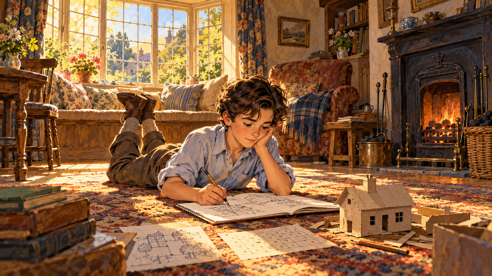
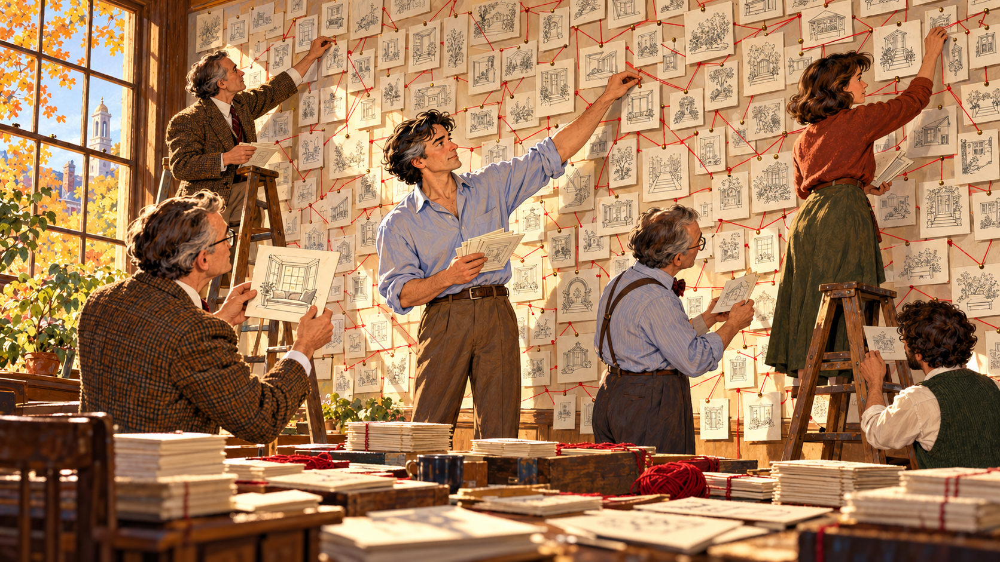
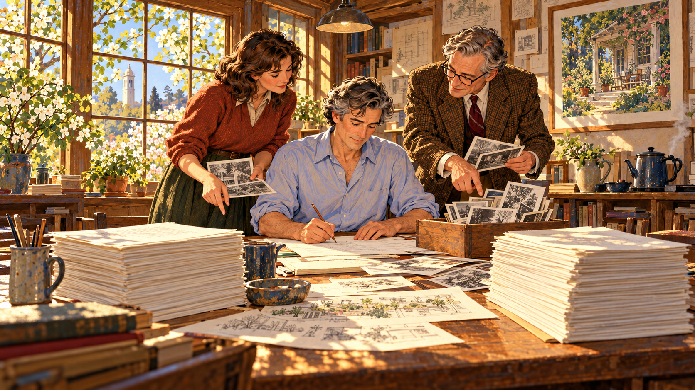

# The Quality Without a Name

Cover Image Prompt

(This is the Cover Image. Do not include this label in the image.)
Please generate a wide-landscape 16:9 cover image for a graphic novel in a warm mid-century editorial illustration style with gouache texture and confident ink linework. In the center, a tall lean man in his late thirties with dark wavy hair, a pale blue shirt with rolled-up sleeves, and a sketchbook under one arm stands in the open doorway of a small sunlit wooden cottage with a deep porch. Sunlight pours through a window seat behind him onto a worn plank floor. Around the cottage, ghostly translucent line drawings float in the air: a bay-window alcove, a garden courtyard, a gate, a staircase, and a tiled roof, like ideas being gathered. A hand-lettered title reads "The Quality Without a Name" across the top in a friendly serif typeface, with a smaller subtitle "Christopher Alexander and the Timeless Way of Building" along the bottom. Color palette: terracotta, ochre, sage green, cream, and deep indigo shadows. Emotional tone: warm, curious, quietly hopeful. Generate the image immediately without asking clarifying questions.

Narrative Prompt

This story follows the architect and design theorist Christopher Alexander (1936–2022) from his childhood in England through his years at Cambridge, Harvard, and Berkeley, to the 1979 publication of *The Timeless Way of Building*. The settings range from 1940s England to 1960s India, 1970s Berkeley, Oregon, and Mexico. The art style is a warm mid-century editorial illustration: gouache texture, confident ink outlines, and an earthy palette of terracotta, ochre, sage green, cream, and deep indigo. Christopher is drawn as a stylized interpretation rather than a portrait: tall and lean, with dark wavy hair that gradually turns silver across the panels, a pale blue shirt with rolled-up sleeves, and a sketchbook always under his arm. Keep his look, and the look of his Berkeley team, consistent in every panel. Creative liberties: the historical facts (dates, places, books, collaborators) are drawn from published sources, but the conversations and the individual scenes are imagined to make the creative process visible. In particular, the photograph-pairing experiment in Panel 6 and the wall of pattern cards in Panel 8 are dramatizations of the kind of comparison and pattern-gathering Alexander and his team describe in their work, not records of specific sessions. Show no readable text in any panel image except where a prompt explicitly asks for it.

### Prologue – A Question About Rooms

Why does one room make you want to stay all afternoon, while another, with the same size and the same furniture, makes you want to leave? Most people never ask. Christopher Alexander asked it for his whole life, and he kept asking until he found an answer precise enough to build with. This is the story of how that question became *The Timeless Way of Building*, a book that taught architects, city planners, and eventually computer programmers to look for the quality that makes a place feel alive.

## Panel 1: A Boy Who Loved Numbers and Rooms

Image Prompt

(This is Panel 01. Do not include the panel number in the image.)
I am about to ask you to generate a series of images for a graphic novel. Please make the images have a consistent style and consistent characters. Do not ask any clarifying questions. Just generate the image immediately when asked.

Please generate a 16:9 image in a warm mid-century editorial illustration style with gouache texture and ink linework, depicting panel 1 of 12. The scene shows a ten-year-old boy with dark wavy hair and a pale blue shirt lying on his stomach on the floor of a small English cottage living room in about 1946, drawing in a notebook. Beside him lie a pencil-drawn grid of numbers and a tiny cardboard model of a house. Behind him a bay window with a deep window seat floods the room with golden afternoon light, and an older woman sits knitting in the glow. Through the window you can see a medieval stone church spire and a lane of old brick houses in Chichester. A cat sleeps on the window seat. Color palette: terracotta, ochre, cream, and sage green. The emotional tone should be quiet curiosity and warmth. Generate the image immediately without asking clarifying questions.

Christopher Alexander was born in Vienna in 1936, and his family left Austria for England when he was two. He grew up in Chichester and Oxford, in towns where old streets and ordinary houses felt right in a way he could not yet explain. At school he was drawn to science and mathematics, and in 1954 he won a top scholarship to Trinity College, Cambridge. The boy who loved numbers also loved places, and he had not yet noticed that those two loves would one day meet.

## Panel 2: Two Degrees, One Itch

Image Prompt

(This is Panel 02. Do not include the panel number in the image.)
Please generate a 16:9 image in a warm mid-century editorial illustration style with gouache texture and ink linework, depicting panel 2 of 12. Make the characters and style consistent with the prior panel. The scene shows Christopher as a young man of about twenty, with dark wavy hair and a pale blue shirt with rolled sleeves, at a cluttered desk in a Cambridge college room in 1957. On the left half of the desk, sheets covered in equations and a slide rule. On the right half, a rolled architectural drawing and a ruler. Through the arched stone window behind him are Gothic college spires and a punt on a river. On the wall hangs a photograph of a village lane, pinned beside a diagram of a lattice. His hands are pressed against his temples as he studies both halves, torn between them. A cold cup of tea sits steaming faintly. Color palette: indigo, cream, ochre, and warm gray. The emotional tone should be restless puzzlement. Generate the image immediately without asking clarifying questions.

At Cambridge he earned a bachelor's degree in architecture and a master's in mathematics, and the two subjects did not seem to speak to each other. Mathematics was exact and logical. The architecture of his day was mostly fashion and opinion. He felt a nagging question: if a village lane could feel so right, and nobody had drawn it with a plan, then there must be an exact reason, and a mathematician ought to be able to find it.

## Panel 3: The Village That Nobody Designed

Image Prompt

(This is Panel 03. Do not include the panel number in the image.)
Please generate a 16:9 image in a warm mid-century editorial illustration style with gouache texture and ink linework, depicting panel 3 of 12. Make the characters and style consistent with the prior panel. The scene shows Christopher, in his mid-twenties with dark wavy hair and a pale blue shirt with rolled sleeves, crouched in a dusty courtyard of a small village in Gujarat, India, in about 1960, sketching in his notebook. Around him: mud-plastered houses with painted doorways, a woman carrying a brass water pot on her head, children playing beside a shaded well, a neem tree, and a shaded verandah where elders sit. His notebook shows tiny diagrams of how the houses, courtyards, and paths connect. Warm dusty air and long afternoon shadows. Color palette: terracotta, saffron, ochre, and turquoise accents. The emotional tone should be wonder and respect. Generate the image immediately without asking clarifying questions.

His answer began in an Indian village. For his doctoral work at Harvard, where he arrived from England in 1958, Alexander studied how a village in Gujarat had been built, house by house, by people who were not architects. Each family added rooms and courtyards that fit their needs, and the village still felt whole. No master plan existed. The idea that ordinary people can make wonderful places became the seed of everything he wrote later.

## Panel 4: Notes on the Synthesis of Form

Image Prompt

(This is Panel 04. Do not include the panel number in the image.)
Please generate a 16:9 image in a warm mid-century editorial illustration style with gouache texture and ink linework, depicting panel 4 of 12. Make the characters and style consistent with the prior panel. The scene shows Christopher, about twenty-six, with dark wavy hair and a pale blue shirt with rolled sleeves, at a chalkboard in a Harvard lecture room around 1962, covered in diagrams of circles and links, tree-like trees of boxes, and overlapping bubbles that show how requirements connect. Behind him, three professors in tweed jackets sit in a row, one raising an eyebrow, one nodding, one taking notes. A tall window shows red-brick buildings and autumn leaves. A stack of punched computer cards sits on the table. Color palette: deep green chalkboard, cream, rust red, and indigo. The emotional tone should be intellectual excitement mixed with the pressure of being judged. Generate the image immediately without asking clarifying questions.

Alexander finished his dissertation in 1962, the first doctorate in architecture ever awarded at Harvard, and it became his first book, *Notes on the Synthesis of Form*. It argued that a good design is a good fit between a form and its context, and that a designer could break a tangled problem into smaller parts and solve each one. Computer scientists loved it. Alexander, though, was already uneasy. A diagram of requirements could tell you what to avoid, but it could not tell you what made a place feel alive.

## Panel 5: A Workshop in Berkeley

Image Prompt

(This is Panel 05. Do not include the panel number in the image.)
Please generate a 16:9 image in a warm mid-century editorial illustration style with gouache texture and ink linework, depicting panel 5 of 12. Make the characters and style consistent with the prior panel. The scene shows Christopher, now in his early thirties with a touch of gray at the temples, with a pale blue shirt with rolled sleeves, in a sunny, slightly shabby wooden workshop in Berkeley, California, in 1967. Around a big paper-strewn table sit five young colleagues in 1960s clothes: a woman with a long dark braid, a bearded man in a flannel shirt, a man in round glasses, a woman with short curly hair, and a tall man with a sketchbook. Corkboards covered with photographs and sticky drawings line the wall. Through the window are eucalyptus trees and the hills above San Francisco Bay. A coffee pot and mismatched mugs sit on the table. Color palette: warm redwood brown, ochre, sage, and sky blue. The emotional tone should be collaborative energy and optimism. Generate the image immediately without asking clarifying questions.

In 1963 Alexander moved to the University of California, Berkeley, as a professor of architecture. In 1967 he founded the Center for Environmental Structure, a small, scrappy research group that worked in an ordinary building with ordinary tables. His collaborators included Sara Ishikawa, Murray Silverstein, Max Jacobson, Ingrid King, and Shlomo Angel. Together they set out to learn what made a place good, not by arguing about taste, but by watching how people actually lived.

## Panel 6: Which Place Is More Alive?

Image Prompt

(This is Panel 06. Do not include the panel number in the image.)
Please generate a 16:9 image in a warm mid-century editorial illustration style with gouache texture and ink linework, depicting panel 6 of 12. Make the characters and style consistent with the prior panel. The scene shows a large table in the Berkeley workshop in the early 1970s, covered with pairs of photographs laid side by side: a sunny courtyard cafe beside a blank parking lot, a cozy porch beside a bare office corridor, a crowded village lane beside a wide empty plaza. Christopher, with a few gray hairs and a pale blue shirt with rolled sleeves, and his team of five stand around the table pointing at the same pictures, nodding in agreement. One student holds up a finger pointing at the lively photo in each pair. Warm lamplight and a chalk-dusted blackboard in the background. Color palette: cream, ochre, terracotta, and deep green. The emotional tone should be surprised delight at discovering agreement. Generate the image immediately without asking clarifying questions.

Then came a simple experiment. The team laid out photographs of places in pairs and asked a plain question: which of these is more alive? Again and again, almost everyone, whatever their background, chose the same one. People who could not agree on style agreed on this. Something real was going on, something shared across people, and it could be tested. Alexander felt that he had found the first solid ground under his old question.

## Panel 7: Seven Words and Still No Name

Image Prompt

(This is Panel 07. Do not include the panel number in the image.)
Please generate a 16:9 image in a warm mid-century editorial illustration style with gouache texture and ink linework, depicting panel 7 of 12. Make the characters and style consistent with the prior panel. The scene shows Christopher alone at a desk late at night in his Berkeley home study in 1972, with silver streaks now in his dark wavy hair and a pale blue shirt with rolled sleeves. He stares at a large sheet of paper tacked above the desk with several crossed-out hand-drawn word clouds, with no readable words, only loops and scribbles suggesting attempts to name something. Crumpled drafts litter the floor. A single desk lamp makes a warm pool of light. Through the window, the lights of the Berkeley hills glow over the bay. On the desk, a photograph of a sunlit courtyard is propped against a stack of books, glowing as if it holds the answer. Color palette: deep indigo night, amber lamplight, and cream paper. The emotional tone should be intense, tender searching. Generate the image immediately without asking clarifying questions.

What was it, exactly, that the lively places had? Alexander tried words: alive, whole, comfortable, free, exact, egoless, eternal. Each captured a piece, and none was enough. Finally he gave up trying to name it with a single word and called it **the quality without a name**. He insisted that it was objective and precise, even though it resisted a label, and that you could learn to recognize it by looking closely at real places.

## Panel 8: Patterns on the Wall

Image Prompt

(This is Panel 08. Do not include the panel number in the image.)
Please generate a 16:9 image in a warm mid-century editorial illustration style with gouache texture and ink linework, depicting panel 8 of 12. Make the characters and style consistent with the prior panel. The scene shows the Berkeley workshop in about 1974, its walls now covered floor to ceiling with hundreds of small cards, each carrying a tiny pencil sketch of a room, a window seat, a garden gate, a courtyard, or a staircase, connected with strings of red yarn like a web. Christopher, with silver hair at the temples, a pale blue shirt with rolled sleeves, and his five colleagues stand on stools and ladders pinning cards and sorting them into groups. One team member holds a card showing a sunny window seat with a cushion. Afternoon sun streams in. Color palette: cream paper, red yarn accents, ochre, sage, and warm wood brown. The emotional tone should be excited discovery and organized creativity. Generate the image immediately without asking clarifying questions.

As the team studied lively places, they noticed that the same solutions kept returning. A window seat that catches the light, a gradual transition from street to private room, a courtyard that people actually use, a low building height that keeps you connected to the ground. Alexander called each recurring solution a **pattern**. A pattern states a problem that appears again and again, and it describes the core of a solution that you can use a million times without ever doing it the same way twice.

## Panel 9: Testing the Patterns in the Real World

Image Prompt

(This is Panel 09. Do not include the panel number in the image.)
Please generate a 16:9 image in a warm mid-century editorial illustration style with gouache texture and ink linework, depicting panel 9 of 12. Make the characters and style consistent with the prior panel. The scene is split into two harmonious halves divided by a hand-drawn tree branch. On the left, in about 1974, Christopher with graying hair, a pale blue shirt with rolled sleeves, and a group of university students and staff walk across a green Pacific Northwest campus lawn with tall Douglas fir trees, holding a rolled campus map and talking with a gray-haired groundskeeper. On the right, in about 1976, a group of Mexican families and young builders in work clothes stand around a half-built low house of pale concrete block with a vaulted roof in Mexicali, laying out the walls with string and stakes under hot bright sun. Color palette: forest green and cream on the left, sun-baked terracotta and sky blue on the right. The emotional tone should be hands-on, humble, and hopeful. Generate the image immediately without asking clarifying questions.

Alexander never wanted the patterns to stay on paper. At the University of Oregon, the team helped plan campus growth with the patterns and the people who used the campus, and wrote up the results as *The Oregon Experiment* (1975). In Mexicali, Mexico, families worked with the team to design and build their own low-cost houses. In both places the patterns were hypotheses: ideas to be tested, and corrected when they did not work.

## Panel 10: Writing Down the Way

Image Prompt

(This is Panel 10. Do not include the panel number in the image.)
Please generate a 16:9 image in a warm mid-century editorial illustration style with gouache texture and ink linework, depicting panel 10 of 12. Make the characters and style consistent with the prior panel. The scene shows Christopher, with silver-gray hair and a pale blue shirt with rolled sleeves, seated at a long wooden table in the Berkeley workshop in 1977 with two tall stacks of printed pages in front of him: one stack of loose manuscript pages for the practical book, one for the theoretical book. He holds a pencil and writes in a clear bold hand on a long page, while two colleagues stand beside him pointing to a box of photographs and sketches. A window behind them shows a tree in blossom. A kettle steams on a side shelf and a framed photo of a beautiful lived-in porch hangs on the wall. Color palette: cream paper, wood brown, ochre, sage green, and soft sky blue. The emotional tone should be focused, patient, and joyful. Generate the image immediately without asking clarifying questions.

The team now had two jobs. The first was practical: collect the patterns into a language that anyone could use. That book, *A Pattern Language* (1977), contains 253 patterns, each linking to the others like words in a sentence. The second job was to explain why the language works, how it connects to the quality without a name, and how a person could learn to build in this way. That explanation became *The Timeless Way of Building*, which Alexander wrote in an unusual style. Its argument is carried by italic headlines, so a reader could grasp the whole idea in about an hour.

## Panel 11: The Book Arrives

Image Prompt

(This is Panel 11. Do not include the panel number in the image.)
Please generate a 16:9 image in a warm mid-century editorial illustration style with gouache texture and ink linework, depicting panel 11 of 12. Make the characters and style consistent with the prior panel. The scene shows a corner of a bright 1979 bookstore, with a thick book with a plain cover standing face-out on a table display, and a mixed crowd around it: a young woman carpenter with a tool belt flipping through pages, an older man in a cardigan reading intently, a student with a backpack sitting on the floor, and a woman architect leaning on the shelf. Near the doorway, Christopher, with silver-gray hair, a pale blue shirt with rolled sleeves, and a sketchbook, watches quietly with a small smile. Warm afternoon light streams through shop windows onto wooden floors. Color palette: warm gold, cream, wood brown, and sage. The emotional tone should be quiet pride and wonder. Generate the image immediately without asking clarifying questions.

*The Timeless Way of Building* appeared in 1979. It runs to more than 500 pages and opens with a daring claim: there is one timeless way of building, a thousand years old and the same today as ever, and the great traditional places were made by people close to the center of it. The book is in three parts: the quality itself, the gate, which is the language of patterns that lets you reach it, and the way, a living process of building that anyone can learn. It was both read and argued about, loved by builders and neighbors, and doubted by some professional architects who found its claims too bold.

## Panel 12: Patterns Everywhere

Image Prompt

(This is Panel 12. Do not include the panel number in the image.)
Please generate a 16:9 image in a warm mid-century editorial illustration style with gouache texture and ink linework, depicting panel 12 of 12. Make the characters and style consistent with the prior panel. The scene is a hopeful montage in one sunlit frame, with a warm spirit of continuity. In the foreground, a young student of any background sits in a window seat of a small house with a thick book open on their knees, sketchbook beside them. Over their shoulder through the window: a neighborhood of small courtyard homes. To the right, a tidy desk with a laptop where two programmers point at a screen of connected boxes and arrows, and a hand-drawn web of linked pattern cards floats above them. At the far back, a silver-haired Christopher in a pale blue shirt with rolled sleeves watches from a doorway with a gentle smile. Color palette: warm gold, sage, terracotta, and sky blue. The emotional tone should be inspiring and open-ended. Generate the image immediately without asking clarifying questions.

The idea escaped architecture. In the late 1980s, programmers Kent Beck and Ward Cunningham borrowed pattern languages to share what experienced software designers know, and in 1994 the book *Design Patterns* made the idea famous in programming. Cunningham later said that his invention of the first wiki, the technology behind Wikipedia, was inspired directly by Alexander's ideas. In 1996 Alexander himself gave a keynote to a room of software engineers. Alexander died in March 2022 at his home in England, but his question lives on in every student who sits in a sunny window seat and wonders why it feels so good.

### Epilogue – What Made Christopher Alexander Different?

Alexander combined two ways of seeing that most people keep apart: the mathematician's demand for precision and the builder's love of the living place. He did not accept that taste was the last word. He ran experiments, collected evidence, wrote down patterns, and then tested them on real campuses and in real neighborhoods. He also gave the power of design back to ordinary people, arguing that the best places in the world were made by the people who live in them.

| Challenge | How Alexander Responded | Lesson for Today |
|-----------|---------------------------|------------------|
| Good design seemed to be a matter of taste and fashion | He asked people to compare real places, noticed they agreed, and treated the agreement as data | Take subjective experience seriously, and then test it |
| His own early mathematical method could not capture what made a place alive | He moved on from diagrams of requirements to patterns observed in the field | Be willing to outgrow your own first theory |
| Patterns started as words on a page | He tested them in Oregon and Mexicali and revised those that failed | An idea is not finished until it works in the world |
| The quality he wanted to describe had no name | He circled it with many words and gave readers a way to recognize it themselves | When language runs out, teach people how to look |
| Many professionals doubted the ideas | He wrote for builders, neighbors, and students as well as architects | Knowledge that only experts hold cannot make a whole city |

### Call to Action

Next time you step into a room you love, stop and ask why. Is there light on two sides? A place to sit by a window? A gentle step between the street and the door? As you read the rest of this book, treat each chapter on walls, roofs, windows, and systems as a toolkit for building places that are alive. Look closely, test your ideas, and let's build it right.

---

*"...objective and precise, but it cannot be named."*
—Christopher Alexander, on the quality at the heart of *The Timeless Way of Building*

---

## References

1. [Wikipedia: Christopher Alexander](https://en.wikipedia.org/wiki/Christopher_Alexander) - Biography of the architect and design theorist, his education, career, and honors
2. [Wikipedia: The Timeless Way of Building](https://en.wikipedia.org/wiki/The_Timeless_Way_of_Building) - Summary of the 1979 book, its structure, and its influence
3. [Wikipedia: A Pattern Language](https://en.wikipedia.org/wiki/A_Pattern_Language) - The 1977 companion book of 253 patterns and its authors
4. [Wikipedia: The Oregon Experiment](https://en.wikipedia.org/wiki/The_Oregon_Experiment) - The 1975 book describing the pattern-language approach applied to the University of Oregon campus
5. [PatternLanguage.com](https://www.patternlanguage.com/) - Website of the Center for Environmental Structure, with resources on Alexander's life and work
