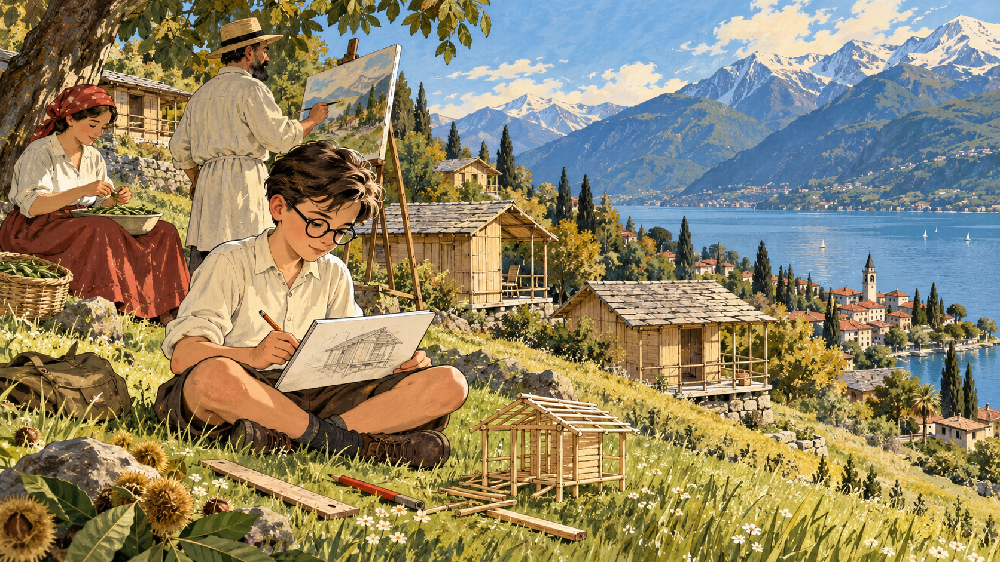
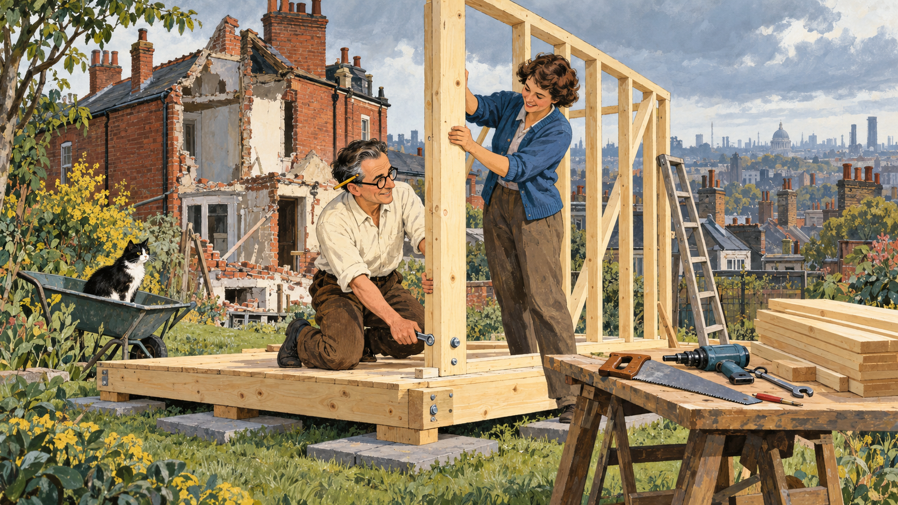
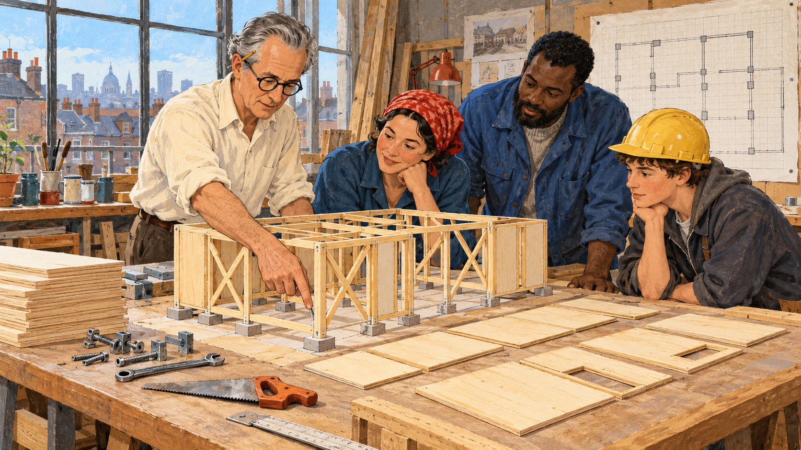
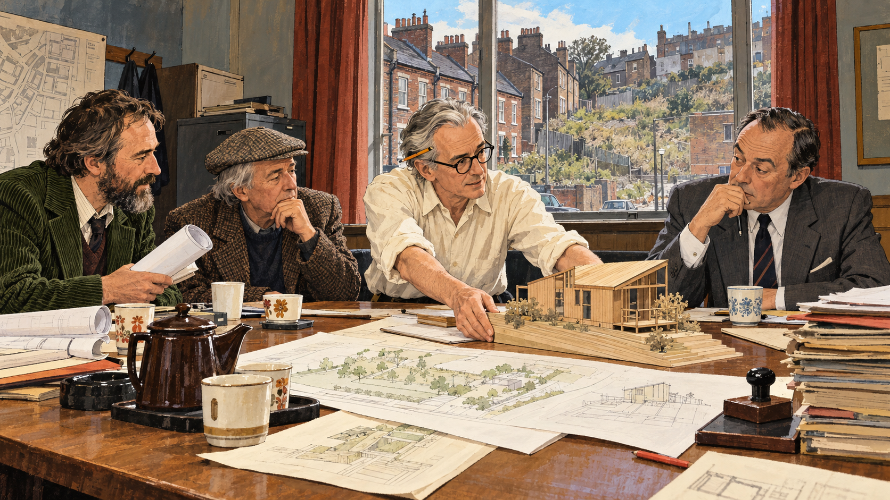
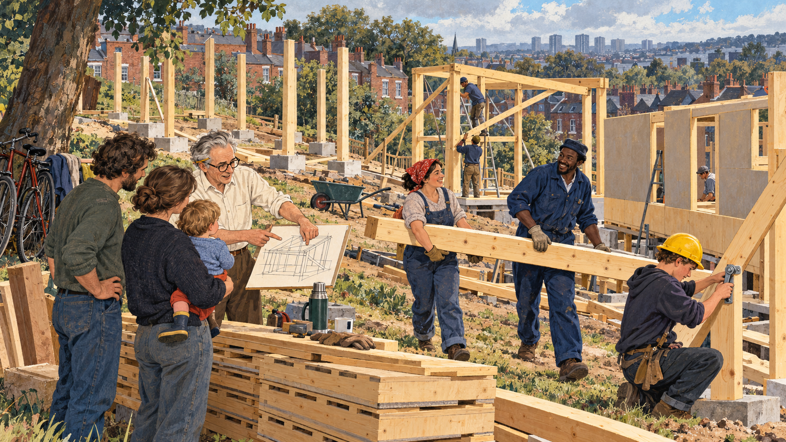
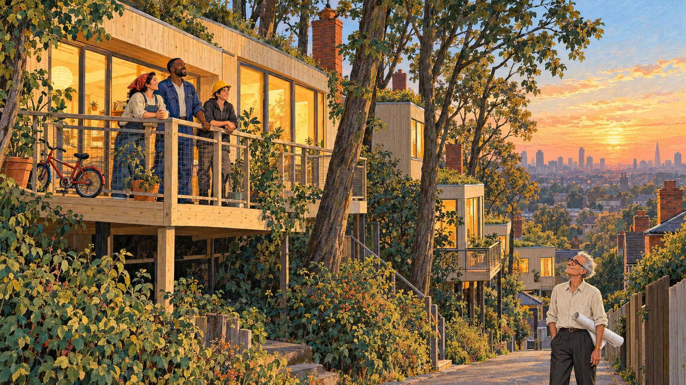

# Houses Anyone Can Build

Cover Image Prompt

(This is the Cover Image. Do not include this label in the image.)
Please generate a wide-landscape 16:9 cover image for a graphic novel in a mid-century British editorial illustration style with gouache texture and confident ink linework. In the center, on a gently sloping, tree-covered London lot in 1981, a slim man of medium height in his seventies with a high forehead, swept-back silver-gray hair, round dark-framed glasses, a cream shirt with rolled sleeves, and a flat carpenter's pencil behind one ear stands beside a freshly raised pale pine timber frame, one hand resting on a post. Around the frame, a young mother in a red headscarf, a tall bus driver in a blue work jacket, and a teenage apprentice in a yellow hard hat lift a large flat panel into place. Square concrete pads sit in the grass under each post, a stack of identical flat panels leans against a tree, and a brick-red terrace of older houses and a gray London sky fill the background with one clear patch of sky blue. A hand-lettered title reads "Houses Anyone Can Build" across the top in a friendly serif typeface, with a smaller subtitle "Walter Segal and the Self-Build Method" along the bottom. Color palette: timber pine, brick red, London gray, sky blue, and cream. Emotional tone: practical, proud, quietly hopeful. Generate the image immediately without asking clarifying questions.

Narrative Prompt

This story follows the architect Walter Segal (1907–1985) from his childhood in Ascona, Switzerland, through his move to London in 1936 and his experiment with a small timber house in his Highgate garden, to the Lewisham self-build housing of the late 1970s and 1980s, where families from a council waiting list built their own homes. The settings are Switzerland, north and south London, and the sloping sites of Segal Close and Walters Way. The art style is mid-century British editorial illustration: gouache texture, ink linework, and a palette of timber pine, brick red, London gray, sky blue, and cream. Walter is drawn as a stylized interpretation rather than a portrait: a slim man of medium height with a high forehead, swept-back hair (dark in his younger panels and silver-gray in later ones), round dark-framed glasses, a cream shirt with rolled sleeves, and a flat carpenter's pencil behind one ear. Keep that look consistent in every panel. Creative liberties: the dates, places, names, and the method itself are drawn from published sources, but the scenes and conversations are imagined. The three self-builders who appear in Panels 5 and 6 (a young mother in a red headscarf, a tall bus driver in a blue work jacket, and a teenage apprentice in a yellow hard hat) are invented composite characters standing in for the many real families, and the council meeting in Panel 4 is a dramatization of how Colin Ward, Brian Richardson, and Councillor Nicholas Taylor are described as working together, not a record of a specific meeting. The house in Panel 2 is drawn from descriptions and may differ from the real one. Show no readable text in any panel image except where a prompt explicitly asks for it.

### Prologue – The Trade Secret

Most people assume that building a house is a job for experts: bricklayers, plasterers, and engineers with years of training. Walter Segal asked a rude question. What if the experts had made it harder than it needed to be? He spent his life designing houses so simple that a bus driver, a mother, or a teenager could put one up with a saw, a drill, and a spanner. This is the story of how a Swiss-raised architect handed the keys to the building site to the people who would live there.

## Panel 1: A Boy Among Wooden Huts

Image Prompt

(This is Panel 01. Do not include the panel number in the image.)
I am about to ask you to generate a series of images for a graphic novel. Please make the images have a consistent style and consistent characters. Do not ask any clarifying questions. Just generate the image immediately when asked.

Please generate a 16:9 image in a mid-century British editorial illustration style with gouache texture and ink linework, depicting panel 1 of 6. The scene shows a boy of about ten with dark hair, round dark-framed glasses, and a cream shirt with rolled sleeves, sitting cross-legged on a grassy hillside above a lake in Ascona, Switzerland, in about 1917, sketching a small wooden hut in a notebook. Behind him a scatter of simple pale pine huts with shingle roofs and open porches climbs the slope among chestnut trees. Far below, a blue lake and snow-dusted mountains glow in the afternoon light. Beside him, a bearded man in a loose linen smock stands at an easel painting, with a woman in a long skirt seated nearby shelling beans into a bowl. A pencil, a wooden ruler, and a half-built toy hut of matchstick-thin sticks lie in the grass. Color palette: timber pine, sky blue, cream, with small touches of brick red. The emotional tone should be quiet curiosity and freedom. Generate the image immediately without asking clarifying questions.

Walter Segal was born in Berlin in 1907, the son of the painter Arthur Segal, and grew up in Ascona, a Swiss lakeside town where his family lived near the artists' colony of Monte Verità. Simple wooden huts were part of that landscape. He later studied architecture in Berlin and Delft, and his first commission, in 1932, was a small wooden holiday cabin in Ascona. A boy who grew up among light timber huts learned early that a house does not need to be heavy to be a home.

## Panel 2: The Little House in the Garden

Image Prompt

(This is Panel 02. Do not include the panel number in the image.)
Please generate a 16:9 image in a mid-century British editorial illustration style with gouache texture and ink linework, depicting panel 2 of 6. Make the characters and style consistent with the prior panel. The scene shows Walter, now in his fifties with dark hair going gray at the temples, round dark-framed glasses, a cream shirt with rolled sleeves, and a flat carpenter's pencil behind one ear, in the sloping back garden of a London house in Highgate in the early 1960s. He and a woman in a blue cardigan are bolting a pale pine wall frame onto a low timber platform that rests on flat gray paving slabs set in the grass. A stack of identical flat boards, a hand saw, a drill, and a spanner lie on a trestle table. Behind them, a brick-red Victorian house stands half-demolished beneath a London gray sky, and beyond it a view of rooftops and chimney pots stretches toward the city. A small ladder leans against the new frame and a black-and-white cat watches from a wheelbarrow. Color palette: timber pine, brick red, London gray, sky blue, and cream. The emotional tone should be cheerful, practical experimentation. Generate the image immediately without asking clarifying questions.

Segal moved to London in 1936 and settled in Highgate. In the early 1960s he and his wife needed somewhere to live while the main family house was rebuilt, so he threw up a small timber house at the bottom of the garden. It sat on paving slabs instead of foundations, took about two weeks to build, and is reported to have cost around £800. Visitors were amazed, and the little house, nicknamed the "Little House in the Garden," brought him new clients. It also taught him something important: a house can be an assembly of ordinary parts, not a monument.

## Panel 3: A House That Behaves Like a Kit

Image Prompt

(This is Panel 03. Do not include the panel number in the image.)
Please generate a 16:9 image in a mid-century British editorial illustration style with gouache texture and ink linework, depicting panel 3 of 6. Make the characters and style consistent with the prior panel. The scene shows Walter, in his sixties with silver-gray hair swept back, round dark-framed glasses, a cream shirt with rolled sleeves, and a flat carpenter's pencil behind one ear, standing in a bright, cluttered workshop in London in the early 1970s beside a waist-high wooden model of a house. The model shows a pale pine skeleton of posts and beams resting on tiny square concrete pads, with diagonal braces forming X shapes in the walls, and flat panels in matching sizes laid out neatly beside it like tiles on a grid. A large sheet of grid paper pinned to the wall carries a floor plan drawn with simple squares. On the worktable lie a handful of bolts, a spanner, a hand saw, and a stack of identical boards. Three adults in ordinary work clothes lean over the model, one tracing a post down to a pad with a finger. Color palette: timber pine, cream, London gray, and sky blue, with a few brick-red accents. The emotional tone should be clear, calm teaching and growing confidence. Generate the image immediately without asking clarifying questions.

Here is the idea at the heart of the Segal method. Sheet materials such as boards and panels come from the factory in standard sizes, about 1200 by 600 millimeters (4 by 2 feet). Segal designed his houses on a grid that matched those sizes, so almost nothing needed to be cut to fit, and almost nothing had to be thrown away. The structure underneath is a timber post-and-beam frame. The weight of the roof and floors travels along the beams into the posts, and down through each post into a small concrete pad that spreads the load across the ground. Diagonal braces in the walls, often in an X shape called a St. Andrew's cross, stop the frame from leaning sideways in the wind. Because the joints are dry, meaning bolted or screwed instead of mortared or plastered, nobody has to wait for wet materials to cure, and no one needs a bricklayer's skills. Segal summed it up in a 1983 talk, saying that buildings built this way become assemblies, not structures in the traditional sense.

## Panel 4: Three Friends and a Council

Image Prompt

(This is Panel 04. Do not include the panel number in the image.)
Please generate a 16:9 image in a mid-century British editorial illustration style with gouache texture and ink linework, depicting panel 4 of 6. Make the characters and style consistent with the prior panel. The scene shows a drab municipal meeting room in south London in about 1976, with a long wooden table covered in site plans, a teapot, and mismatched cups. Walter, in his late sixties with silver-gray hair, round dark-framed glasses, a cream shirt with rolled sleeves, and a flat carpenter's pencil behind one ear, leans forward and slides a small timber house model across the table. Beside him sit a lean bearded council architect in a green corduroy jacket holding rolled drawings and a gray-haired writer in a tweed cap, while a councillor in a gray suit studies the model with raised eyebrows. Through the tall window behind them, a gray London street of red-brick terraces and a gap site with a sloping, overgrown hillside are visible under a patch of sky blue. A tall stack of papers and rubber stamps sits on a side table. Color palette: London gray, brick red, timber pine, cream, and touches of sky blue. The emotional tone should be determined and patient. Generate the image immediately without asking clarifying questions.

In the 1970s three people who believed in the idea came together in the London Borough of Lewisham. Colin Ward, a writer on housing and ordinary people's power over their surroundings, introduced Segal to Brian Richardson, an assistant borough architect. Councillor Nicholas Taylor made sure the Housing Committee asked for a report on alternatives such as a co-operative self-build society. The council had small, awkward sites, steep and tree-covered, that were unsuitable for normal housing. The hard part was paperwork: the houses were not fully designed yet, so it was difficult to show that they met government design standards, cost limits, and the many other construction and planning rules. It took years of persistence before approval to start building arrived in 1979.

## Panel 5: Evening Classes and Saturday Frames

Image Prompt

(This is Panel 05. Do not include the panel number in the image.)
Please generate a 16:9 image in a mid-century British editorial illustration style with gouache texture and ink linework, depicting panel 5 of 6. Make the characters and style consistent with the prior panel. The scene shows a sloping, tree-lined building site in Lewisham, south London, on a bright Saturday in 1980. Several pale pine timber frames stand at different stages: one is just posts on square concrete pads, one has beams and diagonal braces, and one is half covered in flat panels. A young mother in a red headscarf and a tall bus driver in a blue work jacket carry a long beam together, while a teenage apprentice in a yellow hard hat bolts a brace with a spanner. Walter, in his seventies with silver-gray hair, round dark-framed glasses, a cream shirt with rolled sleeves, and a flat carpenter's pencil behind one ear, stands on the grass explaining a diagram to two other builders, one holding a small child. A wheelbarrow, a stack of identical panels, a thermos flask, and bicycles lean against a mature tree. Brick-red terraced houses and a gray sky with a patch of sky blue frame the background. Color palette: timber pine, brick red, London gray, sky blue, and cream. The emotional tone should be energetic, communal, and proud. Generate the image immediately without asking clarifying questions.

The people who built Segal Close came from the council's waiting list, and most had never built anything. They were chosen by ballot, then went to evening classes to learn basic building methods, and working tradespeople came in to teach skills like plumbing that need a professional touch. Work had to fit around jobs and childcare. The council kept the land, and under a shared-ownership arrangement each family could own part of the house, with the labor they put in counting toward the price. Over the following years 27 houses went up across Segal Close and the neighboring Walters Way, and that figure does not count other Segal-method homes across Lewisham.

## Panel 6: Walters Way

Image Prompt

(This is Panel 06. Do not include the panel number in the image.)
Please generate a 16:9 image in a mid-century British editorial illustration style with gouache texture and ink linework, depicting panel 6 of 6. Make the characters and style consistent with the prior panel. The scene shows the steep, wooded Walters Way site in Lewisham in about 1985 at golden hour. In the foreground, a young mother in a red headscarf, a tall bus driver in a blue work jacket, and a teenage apprentice in a yellow hard hat stand proudly on a timber deck outside a finished pale pine house raised on slim posts above the slope, its large windows glowing warm yellow. Mature trees stand around and between the houses, a child's bicycle leans against the rail, and a flat green roof peeks above the trees. At the bottom of the lane, Walter, thin and white-haired in round dark-framed glasses and a cream shirt with rolled sleeves, a flat carpenter's pencil behind one ear, stands with a rolled drawing under his arm, looking up at the houses with a gentle smile. Brick-red chimneys, London gray rooftops in the distance, and a clearing sky blue fill the background. Color palette: timber pine, brick red, London gray, sky blue, and cream. The emotional tone should be quiet fulfillment and legacy. Generate the image immediately without asking clarifying questions.

The second site, Walters Way, climbed a steep slope, so the designers raised the houses on posts and piles instead of digging big foundations. That choice let the builders keep mature trees on the site. Work there began in 1984, and Walter Segal died in London on 27 October 1985, at the age of 78, before the scheme was complete. After his death, supporters set up the Walter Segal Self Build Trust to carry the work forward, and by 2016 there were around 200 Segal-method houses in the United Kingdom.

### Epilogue – What Made Walter Segal Different?

Segal did not try to make building look easy. He made it easy: he removed the steps that required rare skills and kept the steps that anyone could learn. His method rests on real building science, from the way a frame carries load to the way standard sizes cut waste. He also understood that the real obstacle was often not the technology but the rules, the paperwork, and the belief that only experts may build. His houses are still lived in by the people who built them.

| Challenge | How Segal Responded | Lesson for Today |
|-----------|---------------------|------------------|
| Traditional building needs rare trade skills and slow wet materials | He designed dry, bolted timber frames and left out bricklaying and plastering | Simplify the process until more people can take part |
| Cutting and fitting materials wastes time and money | He laid out designs on a grid that matched standard sheet sizes | Design for the material you can actually buy |
| Heavy foundations are costly and damage sloping, wooded sites | He placed posts on small pads and piles so loads reach the ground at points | Match the foundation to the site, and tread lightly on it |
| Authorities doubted that untrained people could build safe housing | He worked with sympathetic officials and spent years winning approval | Good ideas need champions inside the system |
| Housing was something done to people instead of with them | He trained families to build their own homes in shared ownership | People care for what they have a hand in making |

### Call to Action

Next time you pass a house under construction, look for the frame. Follow the load from the roof to the posts to the ground, and ask what the builders would have to do differently if the parts came in standard sizes and bolted together. [Chapter 7](../../chapters/07-wood-steel-framing/index.md) shows how wood frames carry loads, [Chapter 2](../../chapters/02-design-construction-process/index.md) explains how a project moves from design to construction, and [Chapter 17](../../chapters/17-building-codes-permits/index.md) shows why the codes that slowed Segal also keep every home safe. Learn them well, and let's build it right.

---

*"Buildings become assemblies, and no longer, in the traditional sense, structures."*
—Walter Segal, in his 1983 talk "Learning From The Self-Builders"

---

## References

1. [Wikipedia: Walter Segal](https://en.wikipedia.org/wiki/Walter_Segal) - Biography of the architect, his Highgate house, and the Lewisham self-build scheme
2. [Wikipedia: Self-build](https://en.wikipedia.org/wiki/Self-build) - Overview of housing that owners build or organize themselves
3. [Wikipedia: Timber framing](https://en.wikipedia.org/wiki/Timber_framing) - How post-and-beam timber frames carry loads
4. [Designing Buildings: Segal Method](https://www.designingbuildings.co.uk/wiki/Segal_Method) - Technical summary of the grid, pad foundations, and dry-jointed construction
5. [World Habitat: Walter Segal Self-build Housing Project, London](https://world-habitat.org/awards/winners/walter-segal-self-build-housing-project-london/) - Award profile of the Lewisham scheme and its 27 families
